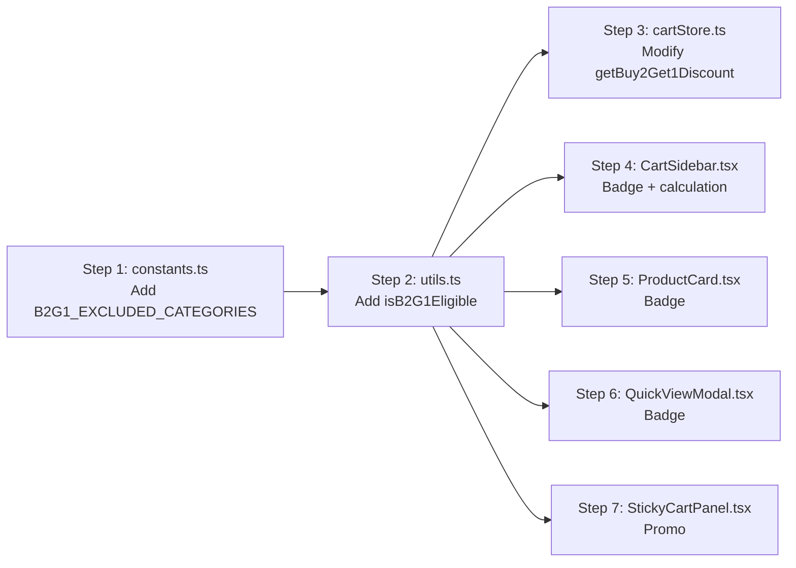

# Plan: Disable B2G1 for Electronics & Gadgets Category

## Goal

Exclude products in the **Electronics & Gadgets** category (`slug: "electronics"`) from the **Buy 2 Get 1 Free** offer — with zero impact on existing code, data, or other categories.

## Products Affected

| Product                                                   | Price   | Source                                                                         |
| --------------------------------------------------------- | ------- | ------------------------------------------------------------------------------ |
| Samsung Galaxy S23 Ultra (`samsung-galaxy-s23-ultra`)     | ₹24,990 | [`src/lib/products-data.ts`](../src/lib/products-data.ts:524)                  |
| Apple iPhone 15 Pro Max 512GB (`iphone-15-pro-max-512gb`) | ₹46,990 | [`src/lib/iphone-15-pro-max-data.ts`](../src/lib/iphone-15-pro-max-data.ts:58) |

## Strategy: Single Source of Truth

The plan introduces a **centralized configuration constant** and a **utility helper function**, then consumes that helper in every B2G1 touch point. This ensures:

- If you ever want to add/remove excluded categories later, you only change **one line** in `constants.ts`
- No duplication of category-checking logic
- Every consumer behaves consistently

## File-by-File Changes

### Step 1: Add configuration constant

**File:** [`src/lib/constants.ts`](../src/lib/constants.ts)

Add after the `CATEGORIES` block (around line 55):

```typescript
/** Categories that should NOT be eligible for Buy 2 Get 1 Free offer */
export const B2G1_EXCLUDED_CATEGORIES = ["electronics"] as const;
```

### Step 2: Add utility helper

**File:** [`src/lib/utils.ts`](../src/lib/utils.ts)

Add a new exported function:

```typescript
import { B2G1_EXCLUDED_CATEGORIES } from "@/lib/constants";

/**
 * Check if a product is eligible for the B2G1 (Buy 2 Get 1 Free) offer.
 * Products in excluded categories (e.g. Electronics) are not eligible.
 */
export function isB2G1Eligible(product: { category: string }): boolean {
  return !(B2G1_EXCLUDED_CATEGORIES as readonly string[]).includes(
    product.category,
  );
}
```

### Step 3: Update cart store discount calculation

**File:** [`src/store/cartStore.ts`](../src/store/cartStore.ts)

**Lines 91-99** — Modify `getBuy2Get1Discount()`:

```typescript
getBuy2Get1Discount: () => {
  return get().items.reduce((discount, item) => {
    if (isB2G1Eligible(item.product) && item.quantity >= 3) {
      const freeItems = Math.floor(item.quantity / 3);
      return discount + item.product.price * freeItems;
    }
    return discount;
  }, 0);
},
```

**Import to add at top:**

```typescript
import { isB2G1Eligible } from "@/lib/utils";
```

> **Why:** This is the core calculation used by the checkout page. When electronics items are in the cart, their quantity won't count toward the B2G1 discount.

### Step 4: Update CartSidebar

**File:** [`src/components/layout/CartSidebar.tsx`](../src/components/layout/CartSidebar.tsx)

**4a — Inline B2G1 calculation (lines 48-54):**
Replace the inline discount calculation to also filter by eligibility:

```typescript
const b2g1Discount = items.reduce((discount, item) => {
  if (isB2G1Eligible(item.product) && item.quantity >= 3) {
    const freeItems = Math.floor(item.quantity / 3);
    return discount + item.product.price * freeItems;
  }
  return discount;
}, 0);
```

**4b — Per-item badge (line 176):**
Wrap the badge in a conditional:

```tsx
{
  isB2G1Eligible(item.product) && (
    <span className="inline-flex items-center gap-1 text-[10px] font-bold ...">
      🎁 Buy 2 Get 1
    </span>
  );
}
```

**Import to add at top:**

```typescript
import { isB2G1Eligible } from "@/lib/utils";
```

> **Why:** The promo banner (lines 227-234) and discount footer (lines 249-261) use `b2g1Discount` variable, so they auto-update. Only the per-item badge needs explicit conditional rendering.

### Step 5: Update ProductCard

**File:** [`src/components/products/ProductCard.tsx`](../src/components/products/ProductCard.tsx)

**Lines 207-209** — Wrap B2G1 badge:

```tsx
{
  isB2G1Eligible(product) && (
    <Badge variant="b2g1" size="sm">
      Buy 2 Get 1 Free
    </Badge>
  );
}
```

**Import to add at top:**

```typescript
import { isB2G1Eligible } from "@/lib/utils";
```

### Step 6: Update QuickViewModal

**File:** [`src/components/products/QuickViewModal.tsx`](../src/components/products/QuickViewModal.tsx)

**Lines 250-252** — Wrap B2G1 badge:

```tsx
{
  isB2G1Eligible(product) && (
    <Badge variant="b2g1" size="sm">
      Buy 2 Get 1 Free
    </Badge>
  );
}
```

**Import to add at top:**

```typescript
import { isB2G1Eligible } from "@/lib/utils";
```

### Step 7: Update StickyCartPanel

**File:** [`src/components/products/StickyCartPanel.tsx`](../src/components/products/StickyCartPanel.tsx)

**Lines 155-161** — Wrap B2G1 promo callout:

```tsx
{
  isB2G1Eligible(product) && (
    <div className="flex items-center gap-2 px-3 py-2.5 bg-gradient-to-r from-amber-50 to-orange-50 border border-amber-200 rounded-apple-sm">
      <span className="text-lg shrink-0">🎁</span>
      <p className="text-xs text-amber-800 font-medium leading-snug">
        Buy 2 Get 1 Free! Add 3 of this item, get 1 <strong>free</strong>.
      </p>
    </div>
  );
}
```

**Import to add at top:**

```typescript
import { isB2G1Eligible } from "@/lib/utils";
```

## Files That Do NOT Need Changes

| File                                                                                  | Reason                                                               |
| ------------------------------------------------------------------------------------- | -------------------------------------------------------------------- |
| [`src/app/checkout/page.tsx`](../src/app/checkout/page.tsx)                           | Uses `getBuy2Get1Discount()` from the store — automatically filtered |
| [`src/components/ui/Badge.tsx`](../src/components/ui/Badge.tsx)                       | Just a UI component, no logic                                        |
| [`src/components/layout/TrustMarquee.tsx`](../src/components/layout/TrustMarquee.tsx) | General site marketing — B2G1 still applies to other categories      |

## Execution Order (Dependency-Aware)



Steps 1 and 2 must be done first (they create the dependencies). Steps 3-7 are independent of each other and can be done in any order after steps 1-2.

## Verification Checklist

After implementation, verify:

- [ ] Add an electronics product (S23 Ultra / iPhone) to cart — no B2G1 discount applied
- [ ] Add 3x of an electronics product to cart — no discount shown
- [ ] No "🎁 Buy 2 Get 1" badge on electronics product cards
- [ ] No "🎁 Buy 2 Get 1" badge in Quick View for electronics products
- [ ] No B2G1 promo in Sticky Cart Panel for electronics products
- [ ] Add a non-electronics product (e.g. Anti-Snoring Chin Strap) — B2G1 **still works** as before
- [ ] Mixed cart (electronics + non-electronics) — only non-electronics items count toward B2G1
- [ ] Checkout page shows correct B2G1 discount (only from eligible items)
- [ ] `npm run build` completes with no errors
