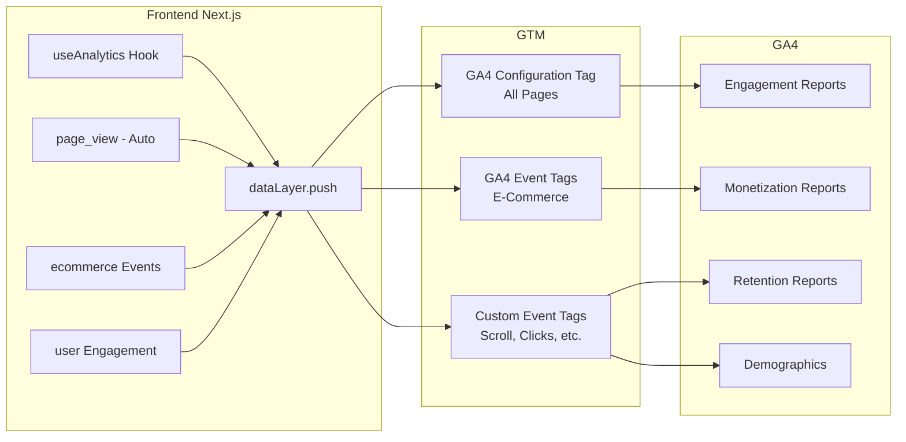
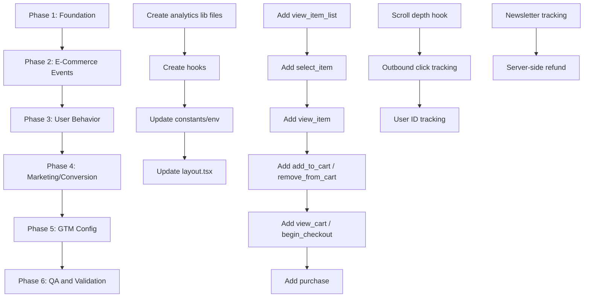

# GA4 + Google Tag Manager — Complete E-Commerce Tracking Implementation Plan

> **Project:** ErgoAura Shop (`ergoaurashop.com`)
> **Measurement ID:** `G-N6JQH432PP` (already configured in `.env.local`)
> **Stream ID:** `14276528471`
> **Date:** 2026-06-13

---

## 1. Current State Assessment

### What Exists Today

| Component                                       | Status           | Details                                         |
| ----------------------------------------------- | ---------------- | ----------------------------------------------- |
| [`NEXT_PUBLIC_GA4_ID`](src/lib/constants.ts:27) | ✅ Configured    | `G-N6JQH432PP` in `.env.local`                  |
| [`layout.tsx`](src/app/layout.tsx:44-63)        | ✅ Basic gtag.js | Script loads, page_path sent with config        |
| `dataLayer` array                               | ✅ Initialized   | But only used for basic page views              |
| Enhanced E-Commerce events                      | ❌ Missing       | No `view_item`, `add_to_cart`, `purchase`, etc. |
| User-ID tracking                                | ❌ Missing       | No `user_id` sent with events                   |
| Conversion tracking                             | ❌ Missing       | No purchase conversions configured              |
| Scroll depth tracking                           | ❌ Missing       | Not instrumented                                |
| Product impressions                             | ❌ Missing       | `view_item_list` not fired                      |
| Search tracking                                 | ❌ Missing       | No search event                                 |
| Outbound click tracking                         | ❌ Missing       | External link clicks not tracked                |

### Current gtag.js Implementation (in `layout.tsx`)

The existing implementation sends automatic page views to GA4. However, it lacks ALL e-commerce events, user interactions, and deeper behavioral tracking.

---

## 2. Recommended Approach: GTM + GA4 Hybrid

### Why GTM over Raw gtag.js?

| Factor              | Raw gtag.js                      | GTM (Recommended)                         |
| ------------------- | -------------------------------- | ----------------------------------------- |
| Marketing autonomy  | ❌ Requires dev for every change | ✅ Marketers can modify tags without code |
| A/B testing tools   | ❌ Manual                        | ✅ Built-in support                       |
| Tag governance      | ❌ Hard to audit                 | ✅ Preview mode, version control          |
| Third-party tags    | ❌ Each requires code            | ✅ One GTM snippet + triggers             |
| Conversion tracking | ❌ Manual setup                  | ✅ Visual tag builder                     |
| Debug/QA            | ❌ Console only                  | ✅ GTM Preview mode                       |

### Architecture Decision

**Use a HYBRID approach:**

1. **Custom React hook** (`useAnalytics`) manages `dataLayer.push()` directly from client components
2. **GTM container** loaded via the standard `<head>` script handles GA4 tag dispatch
3. All e-commerce events pushed to `dataLayer` via the hook
4. GTM listens for these pushes and forwards to GA4

Benefits:

- Frontend control: Events fire deterministically from React lifecycle
- Backend control: GTM handles transformation, tagging, and forwarding
- Marketing flexibility: Non-devs can add remarketing, Facebook Pixel, etc. via GTM
- No extra npm dependencies: Uses native `dataLayer.push()`

### Flow

```mermaid
flowchart TD
    A[User Action in Browser] --> B[React Component / Hook]
    B --> C[dataLayer.push ecommerce: {...}]
    C --> D[GTM Container]
    D --> E[GA4 Tag]
    D --> F[Facebook Pixel Tag - Optional Future]
    D --> G[Google Ads Tag - Optional Future]
    E --> H[GA4 Property G-N6JQH432PP]
    H --> I[GA4 Reports and Explorations]
    H --> J[GA4 Audiences to Google Ads]
```



---

## 3. Files to Create

| File                                                                                           | Purpose                                      |
| ---------------------------------------------------------------------------------------------- | -------------------------------------------- |
| [`src/lib/analytics/gtm.ts`](src/lib/analytics/gtm.ts)                                         | Core GTM dataLayer helpers                   |
| [`src/lib/analytics/events.ts`](src/lib/analytics/events.ts)                                   | All GA4 e-commerce event functions           |
| [`src/lib/analytics/engagement.ts`](src/lib/analytics/engagement.ts)                           | Engagement tracking scroll, clicks, forms    |
| [`src/lib/analytics/measurement-protocol.ts`](src/lib/analytics/measurement-protocol.ts)       | Server-side GA4 events refund                |
| [`src/hooks/useAnalytics.ts`](src/hooks/useAnalytics.ts)                                       | React hook wrapping all analytics methods    |
| [`src/hooks/useScrollDepth.ts`](src/hooks/useScrollDepth.ts)                                   | Scroll depth tracking hook                   |
| [`src/components/analytics/PageViewTracker.tsx`](src/components/analytics/PageViewTracker.tsx) | SPA page view tracker for Next.js App Router |

---

## 4. Files to Modify

| File                                                                                         | Changes                                                        |
| -------------------------------------------------------------------------------------------- | -------------------------------------------------------------- |
| [`src/lib/constants.ts`](src/lib/constants.ts)                                               | Add `GTM_ID` export                                            |
| [`.env.local`](.env.local)                                                                   | Add `NEXT_PUBLIC_GTM_ID` and `GA4_MEASUREMENT_PROTOCOL_SECRET` |
| [`.env.example`](.env.example)                                                               | Add placeholder variables                                      |
| [`src/app/layout.tsx`](src/app/layout.tsx)                                                   | Replace gtag.js with GTM snippet, add PageViewTracker          |
| [`src/app/page.tsx`](src/app/page.tsx)                                                       | Add `view_item_list` tracking on featured products             |
| [`src/app/products/page.tsx`](src/app/products/page.tsx)                                     | Add `view_item_list` tracking on product grid                  |
| [`src/app/products/[slug]/page.tsx`](src/app/products/[slug]/page.tsx)                       | Add `view_item` tracking on product detail                     |
| [`src/components/products/StickyCartPanel.tsx`](src/components/products/StickyCartPanel.tsx) | Add `add_to_cart` tracking                                     |
| [`src/components/products/ProductCard.tsx`](src/components/products/ProductCard.tsx)         | Add `select_item` tracking                                     |
| [`src/components/layout/CartSidebar.tsx`](src/components/layout/CartSidebar.tsx)             | Add `view_cart`, `remove_from_cart` tracking                   |
| [`src/app/checkout/page.tsx`](src/app/checkout/page.tsx)                                     | Add `begin_checkout`, `purchase` tracking                      |
| [`src/app/order/success/page.tsx`](src/app/order/success/page.tsx)                           | Add `purchase` backup tracking                                 |
| [`src/app/signin/page.tsx`](src/app/signin/page.tsx)                                         | Add `login` + `user_id` tracking                               |
| [`src/app/signup/page.tsx`](src/app/signup/page.tsx)                                         | Add `sign_up` + `user_id` tracking                             |
| [`src/components/layout/Footer.tsx`](src/components/layout/Footer.tsx)                       | Add newsletter/form tracking                                   |

---

## 5. Implementation Phases

### Phase 1: Foundation

Create the analytics infrastructure:

1. **Create** [`src/lib/analytics/gtm.ts`](src/lib/analytics/gtm.ts) with `pushToDataLayer()` and `pushEcommerceEvent()` helpers
2. **Create** [`src/lib/analytics/events.ts`](src/lib/analytics/events.ts) with all GA4 e-commerce event functions
3. **Create** [`src/hooks/useAnalytics.ts`](src/hooks/useAnalytics.ts) with `useAnalytics()` hook
4. **Create** [`src/components/analytics/PageViewTracker.tsx`](src/components/analytics/PageViewTracker.tsx) for SPA page view tracking
5. **Update** [`src/lib/constants.ts`](src/lib/constants.ts) to add `GTM_ID`
6. **Update** [`src/app/layout.tsx`](src/app/layout.tsx) to use GTM snippet and include PageViewTracker

### Phase 2: E-Commerce Events

Wire events into every commerce touchpoint:

1. **Homepage** [`page.tsx`](src/app/page.tsx): `view_item_list` on featured products load
2. **Products list** [`products/page.tsx`](src/app/products/page.tsx): `view_item_list` on grid render
3. **Product card** [`ProductCard.tsx`](src/components/products/ProductCard.tsx): `select_item` on click
4. **Product detail** [`products/[slug]/page.tsx`](src/app/products/[slug]/page.tsx): `view_item` on page load
5. **Add to cart** [`StickyCartPanel.tsx`](src/components/products/StickyCartPanel.tsx): `add_to_cart` on add
6. **Cart sidebar** [`CartSidebar.tsx`](src/components/layout/CartSidebar.tsx): `view_cart` on open, `remove_from_cart` on remove
7. **Checkout** [`checkout/page.tsx`](src/app/checkout/page.tsx): `begin_checkout` on load, `purchase` on payment success
8. **Order success** [`order/success/page.tsx`](src/app/order/success/page.tsx): `purchase` backup on page load
9. **Auth** [`signin/page.tsx`](src/app/signin/page.tsx), [`signup/page.tsx`](src/app/signup/page.tsx): `login`, `sign_up`, `user_id`

### Phase 3: User Behavior & Engagement

1. **Create** [`src/hooks/useScrollDepth.ts`](src/hooks/useScrollDepth.ts): fires at 25%, 50%, 75%, 90%, 100%
2. **Create** [`src/lib/analytics/engagement.ts`](src/lib/analytics/engagement.ts): outbound clicks, form interactions
3. **Add scroll tracking** to layout or key pages
4. **Add outbound click** tracking to external links in Footer

### Phase 4: Marketing & Conversion

1. **Newsletter signup** tracking in [`Footer.tsx`](src/components/layout/Footer.tsx): `generate_lead`, form events
2. **Create** [`src/lib/analytics/measurement-protocol.ts`](src/lib/analytics/measurement-protocol.ts) for server-side refund events

### Phase 5: GTM Configuration

After the GTM container ID is obtained:

1. Create GA4 Configuration tag in GTM
2. Create event tags for each e-commerce event
3. Create Data Layer Variables in GTM
4. Set up triggers matching custom events from `dataLayer`

### Phase 6: QA & Validation

1. Use GTM Preview mode
2. Check GA4 DebugView
3. Validate with Google Tag Assistant
4. Test complete purchase flow end-to-end

---

## 6. Key Event Details

### 6.1 GA4 Standard E-Commerce Events

| Event              | Fires When                 | Data Sent                                               |
| ------------------ | -------------------------- | ------------------------------------------------------- |
| `page_view`        | Every page/route change    | page_path, page_title, page_location                    |
| `view_item_list`   | Product grid displayed     | item_list_id, item_list_name, items[]                   |
| `select_item`      | Product card clicked       | item_list_id, items[] with index                        |
| `view_item`        | Product detail page        | currency: INR, value, items[]                           |
| `add_to_cart`      | Add to cart button clicked | currency: INR, value, items[] with quantity             |
| `remove_from_cart` | Remove from cart           | currency: INR, value, items[] with quantity             |
| `view_cart`        | Cart sidebar opens         | currency: INR, value, items[]                           |
| `begin_checkout`   | Checkout page loads        | currency: INR, value, items[]                           |
| `purchase`         | Payment succeeds           | transaction_id, value, currency: INR, shipping, items[] |

### 6.2 GA4 Engagement Events

| Event            | Fires When                   | Data Sent            |
| ---------------- | ---------------------------- | -------------------- |
| `scroll`         | User scrolls past thresholds | scroll_depth_percent |
| `click` outbound | External link clicked        | link_url, link_text  |
| `search`         | Search performed             | search_term          |
| `sign_up`        | Registration complete        | method               |
| `login`          | Login complete               | method               |
| `generate_lead`  | Newsletter signup            | value, currency      |

### 6.3 Product Data Shape (GA4 Enhanced E-Commerce)

```typescript
{
  item_id: string;        // product.id
  item_name: string;      // product.name
  item_category: string;  // product.category
  price: number;          // product.price
  discount: number;       // original_price - price
  currency: "INR";
  item_brand: "ErgoAura";
  quantity?: number;      // for cart/checkout events
  index?: number;         // for list events
}
```

---

## 7. Purchase Event — Critical Detail

The `purchase` event is the **most important** event for ROI tracking. Implementation:

1. **Primary fire**: In the Razorpay payment success handler inside [`checkout/page.tsx`](src/app/checkout/page.tsx:140-196), after the order is saved to Supabase
2. **Backup fire**: On the [`order/success/page.tsx`](src/app/order/success/page.tsx) page, fetch order data from API and fire again
3. **Deduplication**: GA4 deduplicates by `transaction_id` (we use `order.order_id`), so double-firing is safe

The purchase payload:

```typescript
analytics.trackPurchase({
  order_id: order.order_id,
  track_id: order.track_id,
  total: total,
  subtotal: subtotal,
  shipping: shipping,
  discount: b2g1Discount,
  products: items.map((item) => ({
    product_id: item.product.id,
    name: item.product.name,
    price: item.product.price,
    quantity: item.quantity,
    category: item.product.category,
  })),
});
```

---

## 8. GTM Setup Steps

### 8.1 Create GTM Container

1. Go to [tagmanager.google.com](https://tagmanager.google.com)
2. Create container: **ErgoAura Shop**, Web
3. Copy GTM ID: `GTM-XXXXXXX`
4. Add to `.env.local`: `NEXT_PUBLIC_GTM_ID=GTM-XXXXXXX`

### 8.2 GTM Variables to Create

| Variable                     | Type                | Configuration          |
| ---------------------------- | ------------------- | ---------------------- |
| `GA4 Measurement ID`         | Constant            | `G-N6JQH432PP`         |
| `DLV - ecommerce`            | Data Layer Variable | `ecommerce`            |
| `DLV - event`                | Data Layer Variable | `event`                |
| `DLV - scroll_depth_percent` | Data Layer Variable | `scroll_depth_percent` |
| `DLV - search_term`          | Data Layer Variable | `search_term`          |

### 8.3 GTM Tags to Create

| Tag                    | Type       | Trigger                    | Event Name         |
| ---------------------- | ---------- | -------------------------- | ------------------ |
| GA4 Configuration      | GA4 Config | All Pages                  | -                  |
| GA4 - Purchase         | GA4 Event  | Custom: `purchase`         | `purchase`         |
| GA4 - View Item        | GA4 Event  | Custom: `view_item`        | `view_item`        |
| GA4 - Add to Cart      | GA4 Event  | Custom: `add_to_cart`      | `add_to_cart`      |
| GA4 - Remove from Cart | GA4 Event  | Custom: `remove_from_cart` | `remove_from_cart` |
| GA4 - Begin Checkout   | GA4 Event  | Custom: `begin_checkout`   | `begin_checkout`   |
| GA4 - View Cart        | GA4 Event  | Custom: `view_cart`        | `view_cart`        |
| GA4 - View Item List   | GA4 Event  | Custom: `view_item_list`   | `view_item_list`   |
| GA4 - Select Item      | GA4 Event  | Custom: `select_item`      | `select_item`      |
| GA4 - Search           | GA4 Event  | Custom: `search`           | `search`           |
| GA4 - Sign Up          | GA4 Event  | Custom: `sign_up`          | `sign_up`          |
| GA4 - Login            | GA4 Event  | Custom: `login`            | `login`            |
| GA4 - Scroll Depth     | GA4 Event  | Custom: `scroll_depth`     | `scroll`           |
| GA4 - Generate Lead    | GA4 Event  | Custom: `generate_lead`    | `generate_lead`    |

---

## 9. QA Checklist

- [ ] GTM container loads on all pages
- [ ] GA4 configuration tag fires on all page views
- [ ] `page_view` event fires on SPA navigations
- [ ] `view_item_list` fires when product grid loads
- [ ] `select_item` fires when product is clicked
- [ ] `view_item` fires on product detail page
- [ ] `add_to_cart` fires with correct product data including quantity
- [ ] `remove_from_cart` fires with correct product data
- [ ] `view_cart` fires when cart opens
- [ ] `begin_checkout` fires on checkout page
- [ ] `purchase` fires with complete order data including transaction_id
- [ ] Currency is set to `INR` in all events
- [ ] Scroll depth fires at correct thresholds
- [ ] `sign_up` and `login` events fire
- [ ] `search` events fire where applicable
- [ ] No duplicate purchase events in GA4 reports
- [ ] GA4 Real-Time report shows events within 30 seconds
- [ ] Purchase shows in GA4 Monetization reports

---

## 10. Todo List for Implementation



---

## 11. Questions for You

Before implementation can proceed, I need a few decisions:

### Question 1: GTM or Enhanced gtag.js?

- **Option A: Enhanced gtag.js** — Keep the existing gtag.js approach, just add all the e-commerce event calls. Simpler, no GTM setup needed, but less flexible for non-developers.
- **Option B: GTM Container (Recommended)** — Replace with GTM snippet. Requires creating a GTM container at tagmanager.google.com, but gives full flexibility for future marketing tags.

### Question 2: Do you have a GTM container already?

If yes, please share the GTM ID so I can include it in the plan. If not, I recommend creating one — it takes 5 minutes at tagmanager.google.com.

### Question 3: Any additional platforms you plan to integrate?

e.g., Facebook Pixel, Google Ads Conversion Tracking, Microsoft Clarity, Hotjar — these can all be added via GTM later, but good to be aware of.
