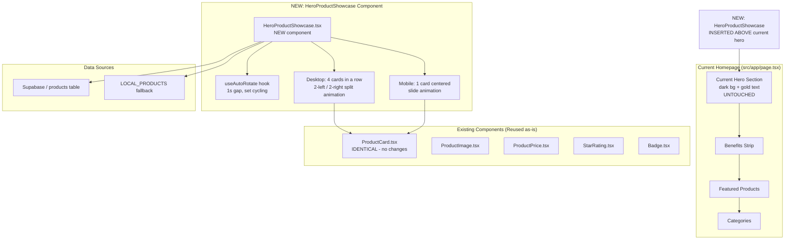

# Hero Product Showcase Banner — Implementation Plan

> **Goal**: Add a product showcase section ABOVE the current hero banner on the homepage, featuring auto-rotating product cards with split-direction animations.

---

## 1. Architecture Overview



---

## 2. Visual Layout

### Desktop (lg+, 1024px+)

```
┌──────────────────────────────────────────────────────────────────┐
│  [HeroProductShowcase]                                            │
│  ┌──────────────────────────────────────────────────────────┐    │
│  │  ┌────────────────┐  ┌────────────────────────────────┐  │    │
│  │  │  Left Panel     │  │  Right Panel (Product Grid)    │  │    │
│  │  │  (35%)          │  │  (65%)                         │  │    │
│  │  │                  │  │  ┌──────┐ ┌──────┐ ┌──────┐  │  │    │
│  │  │  Overline:       │  │  │Card 1│ │Card 2│ │Card 3│  │  │    │
│  │  │  "BEST SELLERS"  │  │  │      │ │      │ │      │  │  │    │
│  │  │                  │  │  └──────┘ └──────┘ └──────┘  │  │    │
│  │  │  Title:          │  │  ● ● ○ ● ●                  │  │    │
│  │  │  "Top-Rated      │  │  (dots + manual nav)         │  │    │
│  │  │  Wellness Picks" │  │                               │  │    │
│  │  │                  │  │                               │  │    │
│  │  │  CTA → Shop Now  │  │                               │  │    │
│  │  └────────────────┘  └────────────────────────────────┘  │    │
│  └──────────────────────────────────────────────────────────┘    │
│                                                                  │
│  [Current Hero Section - UNCHANGED]                              │
│  ┌──────────────────────────────────────────────────────────┐    │
│  │  "Premium Wellness Collection"                            │    │
│  │  "Premium Wellness for Everyday Comfort"                  │    │
│  │  [Shop All Products] [Explore Categories]                  │    │
│  └──────────────────────────────────────────────────────────┘    │
└──────────────────────────────────────────────────────────────────┘
```

### Mobile (<lg)

```
┌─────────────────────┐
│ [HeroProductShowcase]│
│ ┌─────────────────┐ │
│ │ Overline         │ │
│ │ Title            │ │
│ │ ┌─────────────┐ │ │
│ │ │  Product Card│ │ │
│ │ │  (1 card)    │ │ │
│ │ └─────────────┘ │ │
│ │ ● ● ○ ● ● dots  │ │
│ │ [Shop Now CTA]   │ │
│ └─────────────────┘ │
│                      │
│ [Current Hero]      │
│ ┌─────────────────┐ │
│ │ Text centered    │ │
│ └─────────────────┘ │
└─────────────────────┘
```

---

## 3. Animation Design

### Desktop Split Animation

```
Transition: Set N → Set N+1

Time 0ms (current set visible):
┌──────┐ ┌──────┐ ┌──────┐ ┌──────┐
│Card 0│ │Card 1│ │Card 2│ │Card 3│
└──────┘ └──────┘ └──────┘ └──────┘
  ←← exit     ←← exit     →→ exit     →→ exit

Time 0-400ms (exit animation):
┌──────┐ ┌──────┐ ┌──────┐ ┌──────┐
│   →→ │ │   →→ │ │ ←←   │ │ ←←   │
│   out│ │   out│ │  out │ │  out │
└──────┘ └──────┘ └──────┘ └──────┘

Time 400-800ms (enter animation):
┌──────┐ ┌──────┐ ┌──────┐ ┌──────┐
│←← in │ │←← in │ │→→ in │ │→→ in │
│Card 4│ │Card 5│ │Card 6│ │Card 7│
└──────┘ └──────┘ └──────┘ └──────┘

Time 800-1000ms (settle + 1s gap before next)
┌──────┐ ┌──────┐ ┌──────┐ ┌──────┐
│Card 4│ │Card 5│ │Card 6│ │Card 7│
└──────┘ └──────┘ └──────┘ └──────┘
              ↑ 1-second gap ↑
```

**Animation Rules:**

- **Cards at indices [0,1]** (left pair): Exit to LEFT (-100vw), Enter from LEFT
- **Cards at indices [2,3]** (right pair): Exit to RIGHT (+100vw), Enter from RIGHT
- **Exit duration:** 350ms, ease-in
- **Enter duration:** 400ms, ease-out (slightly staggered from exit)
- **Total transition:** ~450ms, then 1-second pause before next cycle

### Mobile Animation

```
Transition: Card N → Card N+1

Time 0ms (current):
┌─────────────┐
│  Card N     │
│  Slide OUT: │  ← direction alternates (L/R)
│  →→→→→→   │
└─────────────┘

Time 400ms (next enters):
┌─────────────┐
│  ←←←←←←    │
│  Card N+1   │
└─────────────┘

Time 800ms: settled, 1s gap
```

**Mobile Rules:**

- Direction alternates: even→odd slides left, odd→even slides right
- Creates a natural back-and-forth flow
- Single card, full-width within container

---

## 4. Component Specification

### 4.1 [`HeroProductShowcase.tsx`](src/components/products/HeroProductShowcase.tsx) — NEW

**Location:** `src/components/products/HeroProductShowcase.tsx`

**Props:** None (self-contained, fetches its own data)

**States:**
| State | Behavior |
|-------|----------|
| Loading | Show ProductCardSkeleton placeholder grid |
| Empty | Render nothing (null) - graceful degradation |
| Loaded | Render product showcase with auto-rotation |
| Error | Render nothing (null) - catch in try/catch |

**Data Flow:**

1. On mount, try fetching from Supabase (limit 12 products)
2. Fall back to `LOCAL_PRODUCTS` (already has 11 products)
3. Store in state: `products: Product[]`
4. Compute sets: group into chunks of 4
5. Track `currentSet` index with auto-incrementing interval

**Auto-rotation Logic:**

```typescript
const [currentSet, setCurrentSet] = useState(0);
const productsPerSet = 4; // desktop
const mobileProductsPerSet = 1;

// Calculate total sets
const totalSets = Math.ceil(products.length / productsPerSet);

// Auto-rotate with 1s gap
useEffect(() => {
  if (products.length === 0) return;
  const interval = setInterval(() => {
    setCurrentSet((prev) => (prev + 1) % totalSets);
  }, 1450); // 450ms transition + 1000ms gap
  return () => clearInterval(interval);
}, [products.length]);
```

**Desktop Layout:**

```tsx
<section>
  <div className="section-container">
    <div className="grid lg:grid-cols-[35%_65%] gap-8 items-center">
      {/* Left: Text Content */}
      <div>
        <span className="type-overline-gold">Best Sellers</span>
        <h2>Top-Rated Wellness Picks</h2>
        <p>Handpicked products our customers love</p>
        <Link href="/products">
          <Button>Shop Now</Button>
        </Link>
      </div>

      {/* Right: Product Cards */}
      <div className="relative overflow-hidden">
        <AnimatePresence mode="popLayout">
          <div key={currentSet} className="grid grid-cols-4 gap-3">
            {currentProducts.map((product, idx) => (
              <motion.div
                key={product.id}
                layout
                initial={{
                  x: idx < 2 ? -300 : 300,
                  opacity: 0,
                }}
                animate={{ x: 0, opacity: 1 }}
                exit={{
                  x: idx < 2 ? -300 : 300,
                  opacity: 0,
                }}
                transition={{ duration: 0.35, ease: "easeInOut" }}
              >
                <ProductCard product={product} />
              </motion.div>
            ))}
          </div>
        </AnimatePresence>
      </div>
    </div>

    {/* Dots indicator */}
    <div className="flex justify-center gap-2 mt-6">
      {Array.from({ length: totalSets }).map((_, i) => (
        <button
          key={i}
          onClick={() => setCurrentSet(i)}
          className={i === currentSet ? "active-dot" : "inactive-dot"}
        />
      ))}
    </div>
  </div>
</section>
```

**Mobile Layout (<lg):**

```tsx
{
  /* Mobile: single card centered */
}
<div className="lg:hidden">
  <div className="text-center mb-6">
    <span className="type-overline-gold">Best Sellers</span>
    <h2 className="type-h2">Top-Rated Wellness Picks</h2>
  </div>

  <div className="relative overflow-hidden max-w-sm mx-auto">
    <AnimatePresence mode="popLayout">
      <motion.div
        key={currentMobileProduct.id}
        initial={{ x: direction > 0 ? 200 : -200, opacity: 0 }}
        animate={{ x: 0, opacity: 1 }}
        exit={{ x: direction > 0 ? -200 : 200, opacity: 0 }}
        transition={{ duration: 0.35 }}
      >
        <ProductCard product={currentMobileProduct} />
      </motion.div>
    </AnimatePresence>
  </div>
</div>;
```

### 4.2 [`page.tsx`](src/app/page.tsx) — Modifications

**Changes required:**

1. **Import** the new component at the top
2. **Insert** `<HeroProductShowcase />` BEFORE the existing hero section (line ~60)

**Before:**

```tsx
export default function HomePage() {
  // ...state, effects...
  return (
    <div>
      {/* Hero Section */}
      <section className="relative min-h-[80vh] ...">
        ...
      </section>
```

**After:**

```tsx
export default function HomePage() {
  // ...state, effects...
  return (
    <div>
      {/* ============================== */}
      {/* NEW: Hero Product Showcase */}
      {/* ============================== */}
      <HeroProductShowcase />

      {/* ============================== */}
      {/* Hero Section (unchanged) */}
      {/* ============================== */}
      <section className="relative min-h-[80vh] ...">
        ...
      </section>
```

> **No other changes to page.tsx** — the current hero, benefits strip, featured products, and categories remain untouched.

---

## 5. Theme & Styling

### Background & Colors

The showcase section uses a **light/warm** backdrop to create visual contrast with the dark hero below:

```css
/* Section container */
bg-gradient-to-b from-[#F5F1EB] to-white
/* OR */
bg-white border-b border-[#EAE3D5]/50
```

### Design Tokens Used

| Token         | Hex       | Usage                                   |
| ------------- | --------- | --------------------------------------- |
| `sand`        | `#F5F1EB` | Section background                      |
| `white`       | `#FFFFFF` | Section background gradient end         |
| `gold`        | `#C9A962` | Overline text, active dot, hover states |
| `gold-dark`   | `#A88A42` | Hover for CTA                           |
| `primary`     | `#1A1614` | Heading text                            |
| `sand-darker` | `#D8CFBF` | Inactive dot, border                    |
| `off-white`   | `#FDFBF8` | Card backgrounds (from ProductCard)     |

### Dots Indicator

```css
.active-dot {
  width: 24px;
  height: 8px;
  border-radius: 4px;
  background: #c9a962;
  transition: all 300ms;
}
.inactive-dot {
  width: 8px;
  height: 8px;
  border-radius: 50%;
  background: #d8cfbf;
  transition: all 300ms;
}
.inactive-dot:hover {
  background: #c9a962;
  opacity: 0.5;
}
```

---

## 6. ProductCard Integration

The `ProductCard` component is used **without any modifications**. It already:

- Links to `products/[slug]` on the title and image
- Shows all badges (Original, ErgoAura's Choice, Super Deal, discount)
- Shows star rating with review count
- Shows price with compare-at strikethrough
- Shows feature badges (B2G1, Easy to use)
- Shows Add to Cart + Buy Now buttons
- Has Quick View functionality
- Has hover effects (lift, image crossfade, quick view overlay)

The showcase simply wraps each product in `ProductCard` — identical rendering.

---

## 7. Mobile Responsiveness Strategy

| Breakpoint        | Layout                         | Cards Visible       | Animation             |
| ----------------- | ------------------------------ | ------------------- | --------------------- |
| `< 640px` (sm)    | Single column, centered        | 1 card              | Alternating L/R slide |
| `640-1023px` (md) | Single column, centered        | 1 card              | Alternating L/R slide |
| `>= 1024px` (lg)  | Two-column: text 35%, grid 65% | 4 cards (2x2 split) | Split exit/enter      |

**Specific responsive rules:**

- `lg:grid-cols-[35%_65%]` → two-column on desktop
- `max-w-sm mx-auto` → centered single card on mobile
- Section padding: `py-12 sm:py-16 lg:py-20`
- Card gap: `gap-3` on desktop, single card on mobile
- Dots always visible for manual navigation

---

## 8. Edge Cases & States

| Scenario                       | Handling                                                                |
| ------------------------------ | ----------------------------------------------------------------------- |
| **< 4 products available**     | Show available count in a row, disable rotation if only 1 set           |
| **0 products (loading/error)** | Render null — section doesn't appear                                    |
| **Odd number of products**     | Last set may have < 4 cards; fill remaining with null or center         |
| **Rapid tab switching**        | Use `clearInterval` on cleanup — no stale timeouts                      |
| **User hovers over section**   | Pause auto-rotation while hovered (improves UX for manual interaction)  |
| **Reduced motion preference**  | Respect `prefers-reduced-motion` — disable animations, show static grid |
| **Very slow network**          | Loading skeleton matches ProductCardSkeleton shape                      |

---

## 9. Dependencies

| Dependency                          | Already Installed? | Used For                                                  |
| ----------------------------------- | ------------------ | --------------------------------------------------------- |
| `framer-motion`                     | ✅ Yes             | `AnimatePresence`, `motion.div` for exit/enter animations |
| `next/link`                         | ✅ Yes             | Link in text CTA                                          |
| `next/image`                        | ✅ Yes             | ProductCard images                                        |
| `@/lib/products-data`               | ✅ Yes             | Fallback product data                                     |
| `@/lib/types`                       | ✅ Yes             | Product type                                              |
| `@/lib/reviews-data`                | ✅ Yes             | `getProductReviewSummary`                                 |
| `@/components/products/ProductCard` | ✅ Yes             | Individual product cards                                  |
| `@/components/ui/Button`            | ✅ Yes             | CTA button                                                |

> **No new npm packages required.**

---

## 10. File Change Summary

| File                                                                                                 | Action     | Description                                                                      |
| ---------------------------------------------------------------------------------------------------- | ---------- | -------------------------------------------------------------------------------- |
| [`src/components/products/HeroProductShowcase.tsx`](src/components/products/HeroProductShowcase.tsx) | **NEW**    | Main showcase component with auto-rotation, split animations, responsive layouts |
| [`src/app/page.tsx`](src/app/page.tsx)                                                               | **Modify** | Import and insert `<HeroProductShowcase />` before the existing hero section     |

> Only **2 files** changed. All existing components remain untouched.

---

## 11. Implementation Steps

### Step 1: Create [`HeroProductShowcase.tsx`](src/components/products/HeroProductShowcase.tsx)

**Key implementation details:**

```typescript
"use client";

import { useState, useEffect, useRef } from "react";
import Link from "next/link";
import { motion, AnimatePresence } from "framer-motion";
import { getSupabaseClient } from "@/lib/supabase/client";
import type { Product } from "@/lib/types";
import { LOCAL_PRODUCTS } from "@/lib/products-data";
import ProductCard from "./ProductCard";
import ProductCardSkeleton from "./ProductCardSkeleton";
import Button from "@/components/ui/Button";

// Configuration
const PRODUCTS_PER_SET_DESKTOP = 4;
const PRODUCTS_PER_SET_MOBILE = 1;
const PRODUCTS_TO_FETCH = 12; // Fetch up to 12, show 3 sets of 4
const TRANSITION_DURATION = 350; // ms
const GAP_DURATION = 1000; // ms - 1 second gap between transitions
const TOTAL_CYCLE = TRANSITION_DURATION + GAP_DURATION; // 1350ms
```

**Animation variants for desktop split:**

```typescript
const cardVariants = (index: number) => ({
  initial: {
    x: index < 2 ? -300 : 300,
    opacity: 0,
  },
  animate: {
    x: 0,
    opacity: 1,
    transition: { duration: 0.35, ease: "easeOut" },
  },
  exit: {
    x: index < 2 ? -300 : 300,
    opacity: 0,
    transition: { duration: 0.35, ease: "easeIn" },
  },
});
```

**Mobile animation variants:**

```typescript
const mobileVariants = (direction: number) => ({
  initial: {
    x: direction > 0 ? 200 : -200,
    opacity: 0,
  },
  animate: {
    x: 0,
    opacity: 1,
    transition: { duration: 0.35, ease: "easeOut" },
  },
  exit: {
    x: direction > 0 ? -200 : 200,
    opacity: 0,
    transition: { duration: 0.35, ease: "easeIn" },
  },
});
```

**Pause on hover:**

```typescript
const [isPaused, setIsPaused] = useState(false);

// In the return:
<section
  onMouseEnter={() => setIsPaused(true)}
  onMouseLeave={() => setIsPaused(false)}
>
```

### Step 2: Modify [`page.tsx`](src/app/page.tsx)

Insert the import and component call as described in section 4.2 above.

---

## 12. Conversion Optimization Notes

The design prioritizes conversion through:

1. **Social proof first** — Products with ratings/reviews visible immediately above the fold
2. **Zero click to product** — Each card is a full `ProductCard` with direct links, Add to Cart, and Quick View
3. **Visual hierarchy** — Light section → dark hero → light content creates natural scroll rhythm
4. **Pause-on-hover** — Users can stop the auto-rotation to examine products at their own pace
5. **Manual dots** — Users can jump to any product set directly
6. **Clear CTA** — "Shop Now" button in the text panel drives to collection page
7. **Mobile-first card** — Single card on mobile ensures legibility and tap targets
