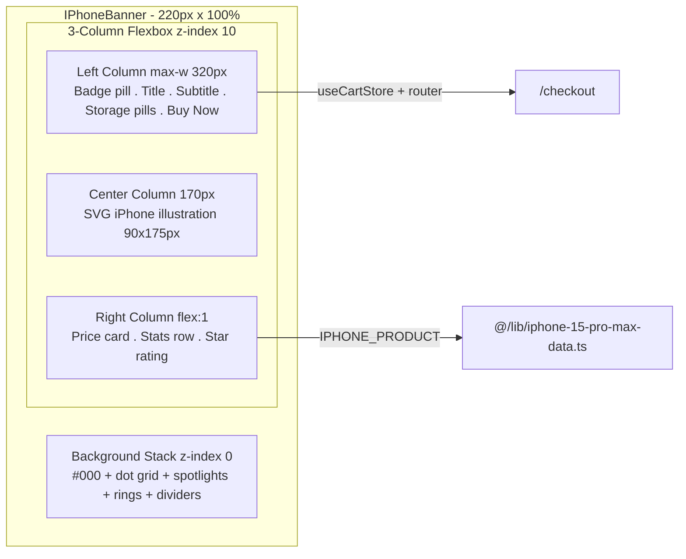

# iPhone 15 Pro Max 512GB — Promotional Banner Component Plan

## Overview

Create a fixed-height (220px) landscape promotional banner component for the iPhone 15 Pro Max 512GB, designed as a teaser section on the homepage. Pure dark theme (#000), white typography, SVG iPhone illustration (no external images), and micro-interactions.

## Architecture

```
src/components/products/iphone-15-pro-max/
  └── IPhoneBanner.tsx          ← NEW component (this task)

src/app/
  └── page.tsx                  ← MODIFY: import & place after HeroProductShowcase
```

- Component name: `IPhoneBanner` (default export)
- File: `src/components/products/iphone-15-pro-max/IPhoneBanner.tsx`
- Data source: `@/lib/iphone-15-pro-max-data.ts` (`IPHONE_PRODUCT`)
- Font: Inter (already loaded in layout.tsx and configured in tailwind.config.ts)
- Framework: Next.js 14, React 18, TypeScript, Tailwind CSS 3
- No new dependencies required

---

## Implementation Plan

### Step 1: Create `src/components/products/iphone-15-pro-max/IPhoneBanner.tsx`

**Component structure:**

```tsx
"use client";

import { useState } from "react";
import { useRouter } from "next/navigation";
import { IPHONE_PRODUCT } from "@/lib/iphone-15-pro-max-data";
import { useCartStore } from "@/store/cartStore";
import { formatPrice } from "@/lib/utils";
```

**State:**

- `activeStorage: "512GB" | "256GB" | "1TB"` — useState, initial `"512GB"`
- `isHovered: boolean` — useState for Buy button hover (can also use CSS :hover)

**Background layers (z-index: 0, stacked via absolute positioning):**

1. Solid `#000` base (`bg-black`)
2. Dot/grid pattern via CSS `background-image`: SVG data URI with `rgba(255,255,255,0.04)` dots at 40×40px spacing
3. Two radial spotlight blobs: `radial-gradient` pseudo-elements or absolute divs with `rgba(255,255,255,0.09)` and `rgba(255,255,255,0.05)`, positioned top-right and bottom-left
4. Two concentric decorative circle rings: absolute positioned, `border` `0.5px solid rgba(255,255,255,0.12)`, `border-radius: 50%`, in top-right quadrant
5. Two vertical hairline dividers: absolute positioned at `left: 30%` and `left: 72%`, `width: 0.5px`, `height: 100%`, `background: rgba(255,255,255,0.06)`

**Layout — 3-column flexbox (`flex`, `items-center`, `relative`, `z-10`):**

**LEFT COLUMN** (`max-width: 320px`, `padding: 0 36px`):

- Badge pill: "Brand New · 2024" — rounded pill, `rgba(255,255,255,0.08)` bg, `rgba(255,255,255,0.18)` border, white dot (`●`), uppercase 11px, `letter-spacing: 0.08em`
- Title: `"iPhone 15 / "` in white 26px/700, `"Pro Max"` in `rgba(255,255,255,0.35)`, `letter-spacing: -0.03em`
- Subtitle: `"512GB · Black Titanium / A17 Pro · Titanium design · ProRes video"` — 12px, `rgba(255,255,255,0.45)`
- Storage pills row: "512 GB" (active), "256 GB", "1 TB" (inactive)
  - Active pill: `rgba(255,255,255,0.15)` bg, white text
  - Inactive pill: `rgba(255,255,255,0.07)` bg, `rgba(255,255,255,0.35)` text
  - `border-radius: 6px`, `font-size: 10px`
  - onClick toggles `activeStorage` state
- BUY NOW button: white bg, black text, 13px/600, `padding: 10px 22px`, `border-radius: 8px`, right arrow `→`
  - Hover: `background: #e5e5e5`, `transform: scale(0.98)`, `transition: 150ms`
  - onClick: `useCartStore.getState().addItem(IPHONE_PRODUCT, 1)` + `router.push("/checkout")`

**CENTER COLUMN** (`width: 170px`, flex-shrink: 0):

- SVG iPhone illustration: `<svg width="90" height="175" viewBox="0 0 90 175">`
  - Outer shell: `<rect rx="18" fill="#111" stroke="rgba(255,255,255,0.18)" stroke-width="0.8" />`
  - Inner layer 1: nested rect, fill `#0a0a0a`
  - Inner layer 2: nested rect, fill `#050505`
  - Inner layer 3: nested rect, fill `#0e0e0e`
  - Dynamic Island: `<rect rx="8" ... fill="#000" />` at top center
  - Screen content: subtle rect with faint content lines
  - Side buttons: small rounded rects at right and left edges, `rgba(255,255,255,0.12)`
  - Screen shimmer: `<linearGradient>` from `rgba(255,255,255,0.05)` to transparent, `x1=0 y1=0 x2=1 y2=1`

**RIGHT COLUMN** (`flex: 1`, `padding: 0 24px 0 12px`):

- Price block card: `rgba(255,255,255,0.05)` bg, `0.5px rgba(255,255,255,0.1)` border, `border-radius: 10px`, `padding: 12px 16px`
  - Strikethrough original: "INR 94,994" in `rgba(255,255,255,0.3)`, `text-decoration: line-through`, 11px
  - Sale price: "INR 46,990" in white, 22px/700, `letter-spacing: -0.04em`
  - Note: "Free delivery · 2-yr warranty" in `rgba(255,255,255,0.4)`, 10px
- Stats row (`flex`, `gap: 16px`, with 1px×40px vertical dividers):
  - "48MP / Camera" — 20px/700 white number, 10px muted uppercase label
  - "A17 / Pro chip" — same pattern
  - "29h / Battery" — same pattern
- Star rating: "★★★★★" white 12px + "4.9 · 158+ reviews" muted 10px

**Micro-details:**

- All borders: `0.5px` (use `border` or outline with hairline width)
- Text opacity tiers: white (primary), `rgba(255,255,255,0.45)` (secondary), `rgba(255,255,255,0.25)` (tertiary)
- Decorative rings positioned absolute at top-right, `pointer-events: none`
- No box shadows, no external images, no gradients on text
- Banner `overflow: hidden`, `border-radius: 16px`, does NOT scroll

**Data references from `@/lib/iphone-15-pro-max-data.ts`:**

- `IPHONE_PRODUCT.price` (46990) for sale price
- `IPHONE_PRODUCT.original_price` (94994) for strikethrough
- `IPHONE_PRODUCT.discount_percentage` (51)
- `IPHONE_PRODUCT.stock` (15)
- `IPHONE_PRODUCT.name` for banner context

### Step 2: Integrate into `src/app/page.tsx`

After the `HeroProductShowcase` component (around line 62), add:

```tsx
import IPhoneBanner from "@/components/products/iphone-15-pro-max/IPhoneBanner";

// Inside the return, after <HeroProductShowcase />:
<IPhoneBanner />;
```

Place it in the section between HeroProductShowcase and the Hero Section.

### Step 3: Verify

- Run `npm run build` — ensure no TypeScript errors
- Run `npm run dev` — visually confirm the banner renders at 220px height with correct styling
- Check all interactive states: storage pills toggle, buy button hover/click

---

## Visual Reference (Mermaid Layout)



---

## Key Implementation Notes

1. **Inline styles for rgba colors**: Tailwind doesn't support rgba directly in utility classes. Use inline `style={{}}` or CSS-in-JS for all `rgba()` values (backgrounds, borders, text opacities, decorative layers).

2. **Inter font**: Already loaded via Google Fonts in `layout.tsx` and set as default `fontFamily.sans` in tailwind config. No font loading changes needed.

3. **Grid pattern**: Use CSS `background-image` with a SVG data URI inline:

   ```tsx
   style={{
     backgroundImage: `url("data:image/svg+xml,...")`,
     backgroundSize: "40px 40px",
   }}
   ```

4. **SVG phone illustration**: All-inline JSX SVG, no external files. Use `<defs>` with `<linearGradient>` for the screen shimmer effect.

5. **Responsive behavior**: The banner has a fixed height (220px) but should gracefully handle smaller viewports. Consider `flex-wrap` or hiding certain elements on very small screens.

6. **Buy Now button**: Must trigger `addItem` via zustand cart store and navigate to checkout — same pattern as `IPhoneHero.tsx`.

7. **All borders are 0.5px**: Cannot use Tailwind's `border` utility directly (minimum is 1px). Use inline style `border: "0.5px solid rgba(255,255,255,0.1)"` or a thin outline approach.
