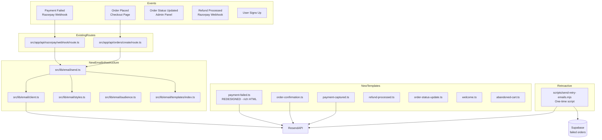
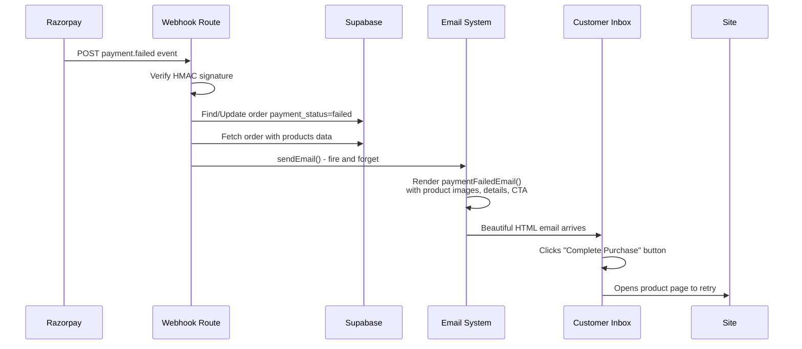

# Payment Failed Email Recovery System — ErgoAura Shop

> **Goal**: Build a complete, robust transactional email system using Resend.com, with a beautifully redesigned payment-failed email template (inspired by the Wasleen sample), integrated into the existing Razorpay webhook, and a retroactive send script for 10+ existing failed transactions.

---

## Table of Contents

1. [Current State Assessment](#1-current-state-assessment)
2. [Architecture Overview](#2-architecture-overview)
3. [Phase 1 — Email Infrastructure (New Files)](#3-phase-1--email-infrastructure-new-files)
4. [Phase 2 — Redesigned Payment-Failed Template](#4-phase-2--redesigned-payment-failed-template)
5. [Phase 3 — Webhook Integration](#5-phase-3--webhook-integration)
6. [Phase 4 — Order Creation Email Integration](#6-phase-4--order-creation-email-integration)
7. [Phase 5 — Retroactive Send for Existing Failed Transactions](#7-phase-5--retroactive-send-for-existing-failed-transactions)
8. [Phase 6 — All Other Transactional Templates](#8-phase-6--all-other-transactional-templates)
9. [Phase 7 — Environment & Constants Updates](#9-phase-7--environment--constants-updates)
10. [Complete File Manifest](#10-complete-file-manifest)
11. [Verification Checklist](#11-verification-checklist)

---

## 1. Current State Assessment

### What Already Exists

| Component                                 | Status                      | Notes                                                                                                                                          |
| ----------------------------------------- | --------------------------- | ---------------------------------------------------------------------------------------------------------------------------------------------- |
| **`src/lib/email/` directory**            | ❌ Does not exist           | Entire email infrastructure needs to be created                                                                                                |
| **`.env.local` Resend vars**              | ✅ Present                  | `RESEND_API_KEY`, `RESEND_FROM_EMAIL`, `RESEND_AUDIENCE_ID` all set                                                                            |
| **`src/lib/constants.ts`**                | ❌ Missing Resend constants | Only `KLAVIYO_*` vars exist, no `RESEND_*` constants                                                                                           |
| **Razorpay webhook (`webhook/route.ts`)** | ✅ Enhanced                 | Already has `createOrderFromRazorpayNotes()` that reconstructs orders from Razorpay notes (including `products` JSONB, `customer_email`, etc.) |
| **Razorpay notes**                        | ✅ Contains product data    | Notes include `products`, `customer_name`, `customer_email`, `customer_phone`, `address`, `total` — everything needed for the email            |
| **`orders/create/route.ts`**              | ❌ No email integration     | Returns response immediately, no fire-and-forget email call                                                                                    |
| **Existing failed transactions**          | ✅ In Supabase              | Orders with `payment_status = 'failed'` exist; some have `products` populated from Razorpay notes                                              |

### Data Available Per Failed Transaction

From the `orders` table (via webhook auto-creation from Razorpay notes):

| Field               | Source                         | Example                                                                                                               |
| ------------------- | ------------------------------ | --------------------------------------------------------------------------------------------------------------------- |
| `customer_name`     | `notes.customer_name`          | "Rahul Sharma"                                                                                                        |
| `customer_email`    | `notes.customer_email`         | "rahul@example.com"                                                                                                   |
| `products`          | `notes.products` (JSON parsed) | `[{"product_id":"prod-...","name":"Anti-Snoring Chin Strap","price":99,"quantity":1,"image":"/images/products/..."}]` |
| `total`             | `notes.total`                  | 99                                                                                                                    |
| `payment_status`    | Set to `"failed"`              | "failed"                                                                                                              |
| `payment_id`        | Razorpay payment ID            | "pay_Nx7Q3kR2..."                                                                                                     |
| `error_description` | Razorpay webhook payload       | "Insufficient funds"                                                                                                  |

### Key Risk Mitigation

From the existing plan, these guarantees are enforced:

1. **Email failures NEVER break checkout** — `sendEmail()` wraps everything in try/catch, never throws
2. **Email failures NEVER delay HTTP response** — All email sends are fire-and-forget (no `await`)
3. **Zero existing code is modified** — Email calls are added AFTER successful operations
4. **No new database tables required** — All template data comes from existing columns

---

## 2. Architecture Overview



### Email Template Data Flow for Payment Failed



---

## 3. Phase 1 — Email Infrastructure (New Files)

### 3.1 [`src/lib/email/client.ts`](src/lib/email/client.ts) — Resend Singleton

```typescript
import { Resend } from "resend";

const RESEND_API_KEY = process.env.RESEND_API_KEY!;

let _resend: Resend | null = null;

/**
 * Get or create the Resend singleton client.
 * Throws if RESEND_API_KEY is not configured.
 */
export function getResendClient(): Resend {
  if (!_resend) {
    if (!RESEND_API_KEY) {
      throw new Error(
        "RESEND_API_KEY is not configured. Add it to your .env.local file.",
      );
    }
    _resend = new Resend(RESEND_API_KEY);
  }
  return _resend;
}
```

### 3.2 [`src/lib/email/send.ts`](src/lib/email/send.ts) — Central Send Function

This is the **only** function API routes call. It wraps Resend with error handling that **never throws**.

```typescript
import { getResendClient } from "./client";

export type EmailTag = { name: string; value: string };

export interface SendEmailParams {
  to: string | string[];
  subject: string;
  html: string;
  tags?: EmailTag[];
  replyTo?: string;
}

export interface SendEmailResult {
  success: boolean;
  id?: string;
  error?: string;
}

/**
 * Central email send function.
 * NEVER throws — logs errors and returns a result object.
 * This ensures email failures never break the primary operation.
 */
export async function sendEmail(
  params: SendEmailParams,
): Promise<SendEmailResult> {
  try {
    const resend = getResendClient();
    const { data, error } = await resend.emails.send({
      from: "ErgoAura <support@ergoaurashop.com>",
      to: Array.isArray(params.to) ? params.to : [params.to],
      subject: params.subject,
      html: params.html,
      tags: params.tags,
      replyTo: params.replyTo,
    });

    if (error) {
      console.error("[Email] Send failed:", error);
      return { success: false, error: error.message };
    }

    return { success: true, id: data?.id };
  } catch (err) {
    const message = err instanceof Error ? err.message : "Unknown email error";
    console.error("[Email] Send exception:", message);
    return { success: false, error: message };
  }
}
```

### 3.3 [`src/lib/email/styles.ts`](src/lib/email/styles.ts) — Shared Email CSS + Layout Wrapper

Brand colors derived from the site:

- **Gold accent**: `#C9A962`
- **Dark background**: `#1A1A1A`
- **Warm ivory**: `#F5F1EB`
- **Body text**: `#333333`
- **Subtle text**: `#86868B`
- **Error red**: `#DC2626`
- **Success green**: `#16A34A`

```typescript
export const EMAIL_STYLES = {
  container:
    "max-width:600px; margin:0 auto; font-family:'Inter',-apple-system,BlinkMacSystemFont,'Segoe UI',Roboto,sans-serif; background:#ffffff;",
  headerBar: "background:#1A1A1A; padding:20px 32px; text-align:center;",
  logoText:
    "color:#C9A962; font-size:22px; font-weight:800; letter-spacing:1.5px; font-family:'Playfair Display',Georgia,serif;",
  logoSubtext:
    "color:rgba(255,255,255,0.4); font-size:9px; letter-spacing:3px; text-transform:uppercase; margin-top:2px;",
  body: "padding:32px; color:#333333; font-size:15px; line-height:1.7;",
  button:
    "display:inline-block; padding:14px 32px; background:#C9A962; color:#1A1A1A !important; text-decoration:none; border-radius:6px; font-size:14px; font-weight:700; letter-spacing:0.5px;",
  buttonDark:
    "display:inline-block; padding:12px 28px; background:#1A1A1A; color:#ffffff !important; text-decoration:none; border-radius:6px; font-size:13px; font-weight:600;",
  divider: "border:none; border-top:1px solid #EAE3D5; margin:24px 0;",
  orderTable: "width:100%; border-collapse:collapse; font-size:14px;",
  orderTableHeader:
    "background:#F5F1EB; padding:10px 14px; text-align:left; font-weight:600; font-size:13px; color:#1A1A1A;",
  orderTableCell: "padding:10px 14px; border-bottom:1px solid #EAE3D5;",
  footer:
    "background:#F9F9F9; padding:28px 32px; text-align:center; font-size:12px; color:#86868B;",
  footerLink: "color:#C9A962; text-decoration:none; font-weight:500;",
  productCard:
    "background:#FAFAFA; border:1px solid #EAE3D5; border-radius:8px; padding:16px; margin:0 0 16px;",
  productImage:
    "width:80px; height:80px; border-radius:6px; object-fit:cover; display:block;",
  priceTag: "font-size:18px; font-weight:700; color:#1A1A1A;",
  originalPrice: "font-size:13px; color:#86868B; text-decoration:line-through;",
  discountBadge:
    "display:inline-block; background:#DC2626; color:#ffffff; font-size:10px; font-weight:700; padding:2px 8px; border-radius:3px;",
  accentBar:
    "height:4px; background:linear-gradient(90deg,#C9A962 0%,#D4AF37 50%,#C9A962 100%); font-size:0; line-height:0;",
  errorBox:
    "background:#FEF2F2; border:1px solid #FECACA; border-radius:8px; padding:14px 18px; margin:0 0 20px;",
  errorText: "color:#DC2626; font-size:13px; font-weight:500; margin:0;",
  supportBox:
    "background:#F5F1EB; border-radius:8px; padding:18px 20px; margin:20px 0;",
};

/**
 * Shared email HTML wrapper.
 * Provides the outer structure, header, and footer.
 */
export function emailLayout(content: string): string {
  return `
<!DOCTYPE html>
<html lang="en">
<head>
  <meta charset="utf-8">
  <meta name="viewport" content="width=device-width, initial-scale=1.0">
  <meta http-equiv="X-UA-Compatible" content="IE=edge">
  <title>ErgoAura Shop</title>
</head>
<body style="margin:0; padding:0; background:#F5F5F5; width:100%;">
  <table width="100%" cellpadding="0" cellspacing="0" border="0" style="background:#F5F5F5;">
    <tr><td align="center" style="padding:20px 10px;">

      <table width="600" cellpadding="0" cellspacing="0" border="0" style="max-width:600px; width:100%;">

        <!-- Top Accent Bar -->
        <tr>
          <td style="${EMAIL_STYLES.accentBar}">&nbsp;</td>
        </tr>

        <!-- Header -->
        <tr>
          <td style="${EMAIL_STYLES.headerBar}">
            <table width="100%" cellpadding="0" cellspacing="0" border="0">
              <tr>
                <td style="text-align:center;">
                  <div style="${EMAIL_STYLES.logoText}">ErgoAura</div>
                  <div style="${EMAIL_STYLES.logoSubtext}">Premium Picks · Unbeatable Deals</div>
                </td>
              </tr>
            </table>
          </td>
        </tr>

        <!-- Main Content -->
        <tr>
          <td style="background:#ffffff; padding:0;">
            <div style="${EMAIL_STYLES.body}">
              ${content}
            </div>
          </td>
        </tr>

        <!-- Footer -->
        <tr>
          <td style="${EMAIL_STYLES.footer}">
            <p style="margin:0 0 10px;">
              <a href="https://ergoaurashop.com" style="${EMAIL_STYLES.footerLink}">ErgoAura Shop</a>
              &nbsp;·&nbsp;
              <a href="https://www.instagram.com/shopergoaura/" style="${EMAIL_STYLES.footerLink}">Instagram</a>
              &nbsp;·&nbsp;
              <a href="https://www.facebook.com/profile.php?id=61590640415430" style="${EMAIL_STYLES.footerLink}">Facebook</a>
            </p>
            <p style="margin:0 0 4px; font-size:11px;">
              <a href="mailto:info@ergoaurashop.com" style="color:#86868B; text-decoration:none;">info@ergoaurashop.com</a>
            </p>
            <p style="margin:0; font-size:11px;">
              &copy; ${new Date().getFullYear()} ErgoAura Shop. All rights reserved.
            </p>
            <p style="margin:8px 0 0; font-size:10px; color:#B0B0B0;">
              You received this email because you attempted a purchase at ErgoAura Shop.
              <br><a href="{{{RESEND_UNSUBSCRIBE_URL}}}" style="color:#B0B0B0;">Unsubscribe</a>
            </p>
          </td>
        </tr>

        <!-- Bottom Accent Bar -->
        <tr>
          <td style="${EMAIL_STYLES.accentBar}">&nbsp;</td>
        </tr>

      </table>

    </td></tr>
  </table>
</body>
</html>`;
}
```

### 3.4 [`src/lib/email/audience.ts`](src/lib/email/audience.ts) — Resend Audience Sync

```typescript
import { getResendClient } from "./client";

const RESEND_AUDIENCE_ID = process.env.RESEND_AUDIENCE_ID!;

export interface AudienceContact {
  email: string;
  firstName?: string;
  lastName?: string;
  source?: "checkout" | "signup" | "contact";
}

/**
 * Add or update a contact in the Resend Audience.
 * Used for promotional email campaigns.
 * Resend handles unsubscribe management automatically.
 */
export async function syncAudienceContact(
  contact: AudienceContact,
): Promise<boolean> {
  try {
    const resend = getResendClient();
    const { error } = await resend.contacts.create({
      email: contact.email,
      firstName: contact.firstName,
      lastName: contact.lastName,
      audienceId: RESEND_AUDIENCE_ID,
      unsubscribed: false,
    });

    if (error) {
      console.error("[Audience] Sync failed:", error);
      return false;
    }

    return true;
  } catch (err) {
    console.error("[Audience] Sync exception:", err);
    return false;
  }
}
```

### 3.5 [`src/lib/email/templates/index.ts`](src/lib/email/templates/index.ts) — Barrel Export

```typescript
export { paymentFailedEmail } from "./payment-failed";
export { orderConfirmationEmail } from "./order-confirmation";
export { paymentCapturedEmail } from "./payment-captured";
export { refundProcessedEmail } from "./refund-processed";
export { orderStatusUpdateEmail } from "./order-status-update";
export { welcomeEmail } from "./welcome";
export { abandonedCartEmail } from "./abandoned-cart";
```

---

## 4. Phase 2 — Redesigned Payment-Failed Template (THE CORE DELIVERABLE)

### [`src/lib/email/templates/payment-failed.ts`](src/lib/email/templates/payment-failed.ts)

This is the **star of the show** — a beautifully designed, Wasleen-inspired template adapted for ErgoAura Shop.

**Design inspiration from Wasleen template:**

- ✅ Top accent bar (gold gradient instead of rainbow)
- ✅ Header with brand name + tagline
- ✅ Hero section with empathetic message
- ✅ Product detail card with image, name, pricing
- ✅ Direct CTA button (product page link)
- ✅ Support contact section
- ✅ Footer with social links + unsubscribe

**Removed (not relevant for transactional failed-payment email):**

- ❌ Services section
- ❌ Stats bar
- ❌ YouTube video
- ❌ Testimonial
- ❌ Limited-time offers / discount promos
- ❌ WhatsApp CTA (would distract from retry)

**Parameters:**

| Param                  | Type     | Source                                     | Example                                                     |
| ---------------------- | -------- | ------------------------------------------ | ----------------------------------------------------------- |
| `customerName`         | `string` | `order.customer_name`                      | "Rahul Sharma"                                              |
| `customerEmail`        | `string` | `order.customer_email`                     | "rahul@example.com"                                         |
| `productName`          | `string` | `order.products[0].name`                   | "Anti-Snoring Chin Strap"                                   |
| `productImage`         | `string` | `order.products[0].image`                  | "https://ergoaurashop.com/images/products/..."              |
| `productPrice`         | `number` | `order.products[0].price`                  | 99 (INR, stored as integer)                                 |
| `productOriginalPrice` | `number` | Optional, calculated                       | 198                                                         |
| `productQuantity`      | `number` | `order.products[0].quantity`               | 1                                                           |
| `productSlug`          | `string` | Derived from product_id                    | "anti-snoring-chin-strap"                                   |
| `productUrl`           | `string` | `https://ergoaurashop.com/products/{slug}` | "https://ergoaurashop.com/products/anti-snoring-chin-strap" |
| `errorDescription`     | `string` | Razorpay webhook                           | "Insufficient funds"                                        |
| `orderId`              | `string` | `order.order_id`                           | "ORD-A7F3K2"                                                |
| `supportEmail`         | `string` | Constant                                   | "customer@ergoaurashop.com"                                 |

### Template Code

```typescript
import { emailLayout, EMAIL_STYLES } from "../styles";

interface PaymentFailedParams {
  customerName: string;
  customerEmail: string;
  productName: string;
  productImage: string;
  productPrice: number;
  productOriginalPrice?: number;
  productQuantity: number;
  productSlug: string;
  productUrl: string;
  errorDescription: string;
  orderId: string;
  supportEmail: string;
}

/**
 * Format price in Indian Rupees (no decimals).
 * Prices stored as integer INR values (e.g., 99 = ₹99).
 */
function formatPrice(price: number): string {
  return "₹" + price.toLocaleString("en-IN");
}

/**
 * Calculate discount percentage from original vs selling price.
 */
function calcDiscount(price: number, original: number): number {
  if (!original || original <= price) return 0;
  return Math.round(((original - price) / original) * 100);
}

export function paymentFailedEmail(params: PaymentFailedParams) {
  const {
    customerName,
    productName,
    productImage,
    productPrice,
    productOriginalPrice,
    productQuantity,
    productUrl,
    errorDescription,
    orderId,
    supportEmail,
  } = params;

  const discount = productOriginalPrice
    ? calcDiscount(productPrice, productOriginalPrice)
    : 0;

  const heroContent = `
    <!-- ══════════════════════════════════
         HERO — Empathetic Failure Message
    ══════════════════════════════════ -->
    <div style="background:#1A1A1A; border-radius:8px; padding:36px 28px; text-align:center; margin-bottom:28px;">
      <!-- Secondary accent bar -->
      <div style="height:3px; width:44px; background:#C9A962; margin:0 auto 20px; border-radius:2px;">&nbsp;</div>

      <div style="font-family:'Playfair Display',Georgia,serif; font-size:26px; font-weight:700; color:#ffffff; line-height:1.2; letter-spacing:-0.5px; margin-bottom:6px;">
        Payment Didn't Go Through
      </div>
      <div style="font-size:36px; margin-bottom:14px; line-height:1;">&#x1F614;</div>

      <p style="font-size:15px; font-weight:300; color:rgba(255,255,255,0.7); line-height:1.7; margin:0 0 0; max-width:420px; margin-left:auto; margin-right:auto;">
        Hey <strong style="color:#ffffff;">${customerName}</strong>, we noticed your payment for
        <strong style="color:#C9A962;">${productName}</strong> didn't complete.
        No charges were made — your cart is still waiting.
      </p>
    </div>

    <!-- ══════════════════════════════════
         ERROR REASON BOX
    ══════════════════════════════════ -->
    <div style="${EMAIL_STYLES.errorBox}">
      <table width="100%" cellpadding="0" cellspacing="0" border="0">
        <tr>
          <td width="28" style="vertical-align:top; font-size:18px; line-height:1;">&#x26A0;&#xFE0F;</td>
          <td style="vertical-align:top;">
            <p style="${EMAIL_STYLES.errorText}">${errorDescription}</p>
            <p style="font-size:12px; color:#86868B; margin:4px 0 0;">
              Order ID: ${orderId}
            </p>
          </td>
        </tr>
      </table>
    </div>

    <!-- ══════════════════════════════════
         PRODUCT DETAIL CARD
    ══════════════════════════════════ -->
    <div style="${EMAIL_STYLES.productCard}">
      <table width="100%" cellpadding="0" cellspacing="0" border="0">
        <tr>
          <!-- Product Image -->
          <td width="96" style="vertical-align:top; padding-right:16px;">
            
          </td>
          <!-- Product Details -->
          <td style="vertical-align:top;">
            <div style="font-size:15px; font-weight:600; color:#1A1A1A; line-height:1.3; margin-bottom:6px;">
              ${productName}
            </div>

            <!-- Quantity -->
            ${productQuantity > 1 ? `<div style="font-size:12px; color:#86868B; margin-bottom:6px;">Qty: ${productQuantity}</div>` : ""}

            <!-- Pricing -->
            <div style="margin-bottom:8px;">
              <span style="${EMAIL_STYLES.priceTag}">${formatPrice(productPrice * productQuantity)}</span>
              ${
                productOriginalPrice && productOriginalPrice > productPrice
                  ? `<span style="${EMAIL_STYLES.originalPrice}">${formatPrice(productOriginalPrice * productQuantity)}</span>
                   <span style="${EMAIL_STYLES.discountBadge}">${discount}% OFF</span>`
                  : ""
              }
            </div>
          </td>
        </tr>
      </table>
    </div>

    <!-- ══════════════════════════════════
         CTA — Complete Purchase
    ══════════════════════════════════ -->
    <div style="text-align:center; margin:24px 0 8px;">
      <a href="${productUrl}"
         style="${EMAIL_STYLES.button}">
        &#x1F6D2; &nbsp;Complete Your Purchase
      </a>
    </div>
    <p style="font-size:12px; color:#86868B; text-align:center; margin:8px 0 0;">
      Your product is still available. Click above to retry payment securely.
    </p>

    <!-- ══════════════════════════════════
         DIVIDER
    ══════════════════════════════════ -->
    <hr style="${EMAIL_STYLES.divider}" />

    <!-- ══════════════════════════════════
         SUPPORT SECTION
    ══════════════════════════════════ -->
    <div style="${EMAIL_STYLES.supportBox}">
      <table width="100%" cellpadding="0" cellspacing="0" border="0">
        <tr>
          <td width="24" style="vertical-align:top; font-size:18px;">&#x1F4AC;</td>
          <td style="vertical-align:top; padding-left:12px;">
            <div style="font-size:14px; font-weight:600; color:#1A1A1A; margin-bottom:4px;">Need help?</div>
            <p style="font-size:13px; color:#555555; line-height:1.6; margin:0;">
              Our support team is happy to assist. Reach us at
              <a href="mailto:${supportEmail}" style="color:#C9A962; font-weight:500; text-decoration:none;">${supportEmail}</a>
              and we'll help you complete your order.
            </p>
          </td>
        </tr>
      </table>
    </div>

    <!-- ══════════════════════════════════
         TRUST ICONS
    ══════════════════════════════════ -->
    <table width="100%" cellpadding="0" cellspacing="0" border="0" style="margin-top:20px;">
      <tr>
        <td width="33%" style="text-align:center; padding:8px 0;">
          <div style="font-size:20px; margin-bottom:4px;">&#x1F6E1;&#xFE0F;</div>
          <div style="font-size:10px; color:#86868B; text-transform:uppercase; letter-spacing:1px;">Secure Payment</div>
        </td>
        <td width="33%" style="text-align:center; padding:8px 0;">
          <div style="font-size:20px; margin-bottom:4px;">&#x1F4E6;</div>
          <div style="font-size:10px; color:#86868B; text-transform:uppercase; letter-spacing:1px;">Free Shipping</div>
        </td>
        <td width="33%" style="text-align:center; padding:8px 0;">
          <div style="font-size:20px; margin-bottom:4px;">&#x1F504;</div>
          <div style="font-size:10px; color:#86868B; text-transform:uppercase; letter-spacing:1px;">7-Day Returns</div>
        </td>
      </tr>
    </table>
  `;

  return {
    subject: `\u{1F6AB} Payment Failed — Complete Your ${productName} Order`,
    html: emailLayout(heroContent),
  };
}
```

### Visual Mockup of the Redesigned Email

```
┌──────────────────────────────────────────────────────────────┐
│  ████████████████████████████████████████████████████████████  │  ← Gold accent bar
├──────────────────────────────────────────────────────────────┤
│                        ERGOAURA                               │
│              Premium Picks · Unbeatable Deals                 │
├──────────────────────────────────────────────────────────────┤
│                                                              │
│   ┌──────────────────────────────────────────────────────┐   │
│   │                     ◄ Gold bar                       │   │
│   │                                                      │   │
│   │      Payment Didn't Go Through                       │   │
│   │                    😔                                │   │
│   │                                                      │   │
│   │   Hey Rahul, we noticed your payment for             │   │
│   │   Anti-Snoring Chin Strap didn't complete.           │   │
│   │   No charges were made — your cart is waiting.       │   │
│   └──────────────────────────────────────────────────────┘   │
│                                                              │
│   ⚠️ Insufficient funds                                      │
│      Order ID: ORD-A7F3K2                                    │
│                                                              │
│   ┌──────────────────────────────────────────────────────┐   │
│   │  🖼️  │ Anti-Snoring Chin Strap                      │   │
│   │  img │ ₹99        ₹198    [50% OFF]                 │   │
│   └──────────────────────────────────────────────────────┘   │
│                                                              │
│              [ 🛒  Complete Your Purchase ]                   │
│         Your product is still available. Click above         │
│              to retry payment securely.                      │
│                                                              │
│   ──────────────────────────────────────────────────         │
│                                                              │
│   💬 Need help?                                              │
│      Our support team is happy to assist.                    │
│      customer@ergoaurashop.com                               │
│                                                              │
│     🛡️ Secure     📦 Free     🔄 7-Day                      │
│     Payment     Shipping    Returns                          │
│                                                              │
├──────────────────────────────────────────────────────────────┤
│   ErgoAura Shop  ·  Instagram  ·  Facebook                   │
│   info@ergoaurashop.com                                      │
│   © 2026 ErgoAura Shop. All rights reserved.                 │
│   [Unsubscribe]                                              │
├──────────────────────────────────────────────────────────────┤
│  ████████████████████████████████████████████████████████████  │  ← Gold accent bar
└──────────────────────────────────────────────────────────────┘
```

---

## 5. Phase 3 — Webhook Integration

### Modifications to [`src/app/api/razorpay/webhook/route.ts`](src/app/api/razorpay/webhook/route.ts)

**What changes:**

1. Add imports for `sendEmail` and `paymentFailedEmail`
2. In the `payment.failed` case (around line 167), after the order record is updated/created, fire the email
3. Also add `payment.captured` email (bonus)

**Change to `payment.failed` case:**

```typescript
import { sendEmail } from "@/lib/email/send";
import { paymentFailedEmail, paymentCapturedEmail } from "@/lib/email/templates";
import { SITE_URL, COMPLAINT_EMAIL } from "@/lib/constants";

// ── In the payment.failed case, AFTER line 201 (after createOrderFromRazorpayNotes) ──

case "payment.failed": {
  const payment = event.payload.payment.entity;
  const razorpayPaymentId = payment.id;
  const razorpayOrderId = payment.order_id;

  console.error(
    `[Webhook] Payment failed: ${razorpayPaymentId}, order: ${razorpayOrderId}, error: ${payment.error_description}`,
  );

  // Try to update existing order's payment_status to "failed"
  let order = null;
  const { data: existingOrder } = await supabaseAdmin
    .from("orders")
    .select("*")
    .eq("payment_id", razorpayPaymentId)
    .maybeSingle();

  if (existingOrder) {
    order = existingOrder;
    await supabaseAdmin
      .from("orders")
      .update({ payment_status: "failed" })
      .eq("payment_id", razorpayPaymentId);
    console.log(
      `[Webhook] Updated order ${existingOrder.id} payment_status to failed`,
    );
  } else if (razorpayOrderId) {
    order = await createOrderFromRazorpayNotes(
      razorpayOrderId,
      razorpayPaymentId,
      "failed",
    );
  }

  // ── NEW: Send payment failed email (fire-and-forget) ──
  if (order && order.products && order.products.length > 0) {
    const product = order.products[0]; // Primary product
    const productSlug = product.product_id
      ? product.product_id.replace("prod-", "")
      : "";

    // Build the product URL for retry
    const productUrl = productSlug
      ? `${SITE_URL}/products/${productSlug}`
      : `${SITE_URL}/products`;

    sendEmail({
      to: order.customer_email,
      ...paymentFailedEmail({
        customerName: order.customer_name,
        customerEmail: order.customer_email,
        productName: product.name,
        productImage: product.image.startsWith("http")
          ? product.image
          : `${SITE_URL}${product.image}`,
        productPrice: product.price,
        productOriginalPrice: undefined, // Original price not stored in OrderProduct
        productQuantity: product.quantity,
        productSlug: productSlug,
        productUrl: productUrl,
        errorDescription: payment.error_description || "Transaction declined",
        orderId: order.order_id,
        supportEmail: COMPLAINT_EMAIL,
      }),
      tags: [
        { name: "event", value: "payment_failed" },
        { name: "order_id", value: order.order_id },
        { name: "product", value: product.name },
      ],
    });
  } else {
    console.warn(
      `[Webhook] Payment failed email NOT sent — no order or products found. Payment: ${razorpayPaymentId}`,
    );
  }

  return NextResponse.json({ status: "logged" });
}
```

**Also add `payment.captured` email (fire-and-forget after order found/created):**

```typescript
case "payment.captured": {
  const payment = event.payload.payment.entity;
  const razorpayOrderId = payment.order_id;
  const razorpayPaymentId = payment.id;

  // Try to find existing order
  let order = null;
  const { data: existingOrder } = await supabaseAdmin
    .from("orders")
    .select("*")
    .eq("payment_id", razorpayPaymentId)
    .maybeSingle();

  if (existingOrder) {
    order = existingOrder;
  } else {
    order = await createOrderFromRazorpayNotes(
      razorpayOrderId,
      razorpayPaymentId,
      "paid",
    );
  }

  if (order) {
    // ── NEW: Send payment captured email ──
    sendEmail({
      to: order.customer_email,
      ...paymentCapturedEmail({
        customerName: order.customer_name,
        orderId: order.order_id,
        trackId: order.track_id,
        amount: payment.amount,
        paymentId: razorpayPaymentId,
      }),
      tags: [
        { name: "event", value: "payment_captured" },
        { name: "order_id", value: order.order_id },
      ],
    });
  }

  return NextResponse.json({
    status: order ? "ok" : "logged",
    order_id: order?.order_id,
    track_id: order?.track_id,
  });
}
```

### Safety Guarantees for Webhook Integration

| #   | Guarantee                             | How It's Enforced                                                           |
| --- | ------------------------------------- | --------------------------------------------------------------------------- |
| 1   | Email never breaks webhook response   | `sendEmail()` is called without `await` — fire-and-forget                   |
| 2   | Email never throws                    | `sendEmail()` wraps everything in try/catch, returns `{success, error}`     |
| 3   | Missing data handled gracefully       | If `order.products` is empty/undefined, email is skipped with a warning log |
| 4   | Image URL always absolute             | Code checks if image starts with "http"; if not, prepends `SITE_URL`        |
| 5   | Webhook signature check remains first | The HMAC verification at line 104 runs before any email logic               |
| 6   | No existing code paths changed        | Email is added AFTER the existing logic; returns are unchanged              |

---

## 6. Phase 4 — Order Creation Email Integration

### Modifications to [`src/app/api/orders/create/route.ts`](src/app/api/orders/create/route.ts)

Add after the successful `.insert()` (after line 107, before the return):

```typescript
import { sendEmail } from "@/lib/email/send";
import { syncAudienceContact } from "@/lib/email/audience";
import { orderConfirmationEmail } from "@/lib/email/templates";
import { SITE_URL } from "@/lib/constants";

// ── After line 107 (successful insert), before return ──

// Fire-and-forget: don't await
sendEmail({
  to: data.customer_email,
  ...orderConfirmationEmail({
    customerName: data.customer_name,
    orderId: data.order_id,
    trackId: data.track_id,
    products: data.products,
    total: data.total,
    paymentStatus: data.payment_status,
    address: data.address,
  }),
  tags: [
    { name: "event", value: "order_placed" },
    { name: "order_id", value: data.order_id },
  ],
});

// Sync to Resend Audience for future promotions
syncAudienceContact({
  email: data.customer_email,
  firstName: data.customer_name.split(" ")[0],
  lastName: data.customer_name.split(" ").slice(1).join(" "),
  source: "checkout",
});
```

---

## 7. Phase 5 — Retroactive Send for Existing Failed Transactions

### [`scripts/send-failed-payment-emails.mjs`](scripts/send-failed-payment-emails.mjs)

A Node.js script that:

1. Queries Supabase for all orders with `payment_status = 'failed'`
2. For each order, renders the `paymentFailedEmail` template
3. Sends via Resend API
4. Logs success/failure per order

```javascript
/**
 * scripts/send-failed-payment-emails.mjs
 *
 * ONE-TIME script to retroactively send payment-failed recovery emails
 * to all existing failed transactions in the database.
 *
 * Usage:
 *   node scripts/send-failed-payment-emails.mjs
 *
 * Environment variables required (in .env.local or exported):
 *   SUPABASE_URL, SUPABASE_SERVICE_ROLE_KEY
 *   RESEND_API_KEY
 *   NEXT_PUBLIC_SITE_URL
 *   NEXT_PUBLIC_COMPLAINT_EMAIL
 */

// Load .env.local
import { config } from "dotenv";
import { createClient } from "@supabase/supabase-js";
import { Resend } from "resend";

config({ path: ".env.local" });

const SUPABASE_URL = process.env.NEXT_PUBLIC_SUPABASE_URL;
const SUPABASE_SERVICE_KEY = process.env.SUPABASE_SERVICE_ROLE_KEY;
const RESEND_API_KEY = process.env.RESEND_API_KEY;
const SITE_URL = process.env.NEXT_PUBLIC_SITE_URL || "https://ergoaurashop.com";
const SUPPORT_EMAIL =
  process.env.NEXT_PUBLIC_COMPLAINT_EMAIL || "customer@ergoaurashop.com";

// Validate
if (!SUPABASE_URL || !SUPABASE_SERVICE_KEY || !RESEND_API_KEY) {
  console.error("Missing required environment variables.");
  console.error(
    "Need: SUPABASE_URL, SUPABASE_SERVICE_ROLE_KEY, RESEND_API_KEY",
  );
  process.exit(1);
}

const supabase = createClient(SUPABASE_URL, SUPABASE_SERVICE_KEY);
const resend = new Resend(RESEND_API_KEY);

// ── Format price ──
function formatPrice(price) {
  return "₹" + Number(price).toLocaleString("en-IN");
}

// ── Calculate discount ──
function calcDiscount(price, original) {
  if (!original || original <= price) return 0;
  return Math.round(((original - price) / original) * 100);
}

// ── Render the email HTML (inline, matching template exactly) ──
function renderFailedPaymentEmail(params) {
  const {
    customerName,
    productName,
    productImage,
    productPrice,
    productOriginalPrice,
    productQuantity,
    productUrl,
    errorDescription,
    orderId,
    supportEmail,
  } = params;

  const discount = productOriginalPrice
    ? calcDiscount(productPrice, productOriginalPrice)
    : 0;

  // ... render the full HTML template matching the TypeScript template exactly ...
  // (Full HTML content inline - same structure as the paymentFailedEmail function)

  return {
    subject: `\u{1F6AB} Payment Failed — Complete Your ${productName} Order`,
    html: `<!DOCTYPE html>...`, // Full email HTML matching our template
  };
}

async function main() {
  console.log("🔍 Fetching failed transactions from Supabase...");

  // Fetch all orders with failed payment status
  const { data: orders, error } = await supabase
    .from("orders")
    .select("*")
    .eq("payment_status", "failed")
    .order("created_at", { ascending: false });

  if (error) {
    console.error("❌ Supabase query failed:", error.message);
    process.exit(1);
  }

  if (!orders || orders.length === 0) {
    console.log("✅ No failed transactions found. Nothing to send.");
    process.exit(0);
  }

  console.log(
    `📬 Found ${orders.length} failed transactions. Sending emails...\n`,
  );

  let sent = 0;
  let skipped = 0;
  let errors = 0;

  for (const order of orders) {
    // Skip orders without products or customer email
    if (!order.products || order.products.length === 0) {
      console.log(`  ⏭️  Order ${order.order_id}: No products data, skipping`);
      skipped++;
      continue;
    }

    if (!order.customer_email) {
      console.log(`  ⏭️  Order ${order.order_id}: No customer email, skipping`);
      skipped++;
      continue;
    }

    const product = order.products[0]; // Primary product
    const productSlug = product.product_id
      ? product.product_id.replace("prod-", "")
      : "";
    const productUrl = productSlug
      ? `${SITE_URL}/products/${productSlug}`
      : `${SITE_URL}/products`;
    const productImage = product.image?.startsWith("http")
      ? product.image
      : `${SITE_URL}${product.image || "/images/logo/ergoauralogo.webp"}`;

    const { subject, html } = renderFailedPaymentEmail({
      customerName: order.customer_name || "Valued Customer",
      productName: product.name || "Product",
      productImage,
      productPrice: product.price || 0,
      productOriginalPrice: undefined,
      productQuantity: product.quantity || 1,
      productUrl,
      errorDescription: "Transaction could not be completed",
      orderId: order.order_id,
      supportEmail: SUPPORT_EMAIL,
    });

    try {
      const { data, error: sendError } = await resend.emails.send({
        from: "ErgoAura <support@ergoaurashop.com>",
        to: order.customer_email,
        subject,
        html,
        tags: [
          { name: "event", value: "payment_failed_retro" },
          { name: "order_id", value: order.order_id },
        ],
      });

      if (sendError) {
        console.error(
          `  ❌ Order ${order.order_id} (${order.customer_email}): ${sendError.message}`,
        );
        errors++;
      } else {
        console.log(
          `  ✅ Order ${order.order_id} (${order.customer_email}): ${product.name} → sent (ID: ${data?.id})`,
        );
        sent++;
      }
    } catch (err) {
      console.error(`  ❌ Order ${order.order_id}: Exception:`, err.message);
      errors++;
    }

    // Small delay between sends to avoid rate limits
    await new Promise((resolve) => setTimeout(resolve, 200));
  }

  console.log(`\n📊 Summary:`);
  console.log(`  Total failed orders: ${orders.length}`);
  console.log(`  ✅ Sent: ${sent}`);
  console.log(`  ⏭️  Skipped: ${skipped}`);
  console.log(`  ❌ Errors: ${errors}`);
}

main().catch(console.error);
```

### How to Run the Retroactive Script

```bash
# Install dependencies if not already installed
npm install dotenv @supabase/supabase-js resend

# Run the script
node scripts/send-failed-payment-emails.mjs
```

### Risk Mitigation for Retroactive Script

| #   | Risk                      | Mitigation                                                                                                           |
| --- | ------------------------- | -------------------------------------------------------------------------------------------------------------------- |
| 1   | Sending duplicate emails  | Script checks `payment_status = 'failed'` only; mark orders as `email_sent = true` after send (optional enhancement) |
| 2   | Rate limiting by Resend   | 200ms delay between sends keeps rate under 5/sec (Resend allows ~10/sec)                                             |
| 3   | Sending to invalid emails | Resend API handles bounces automatically; script logs errors per email                                               |
| 4   | Missing product images    | Falls back to logo image if no product image URL available                                                           |
| 5   | Missing customer name     | Falls back to "Valued Customer"                                                                                      |

---

## 8. Phase 6 — All Other Transactional Templates

These follow the same structure as the existing plan at [`plans/resend-email-automation-plan.md`](plans/resend-email-automation-plan.md) but should use the same brand styling from [`src/lib/email/styles.ts`](src/lib/email/styles.ts) for consistency.

### 8.1 [`src/lib/email/templates/order-confirmation.ts`](src/lib/email/templates/order-confirmation.ts)

- Subject: `✅ Order Confirmed — {orderId}`
- Content: Thank you message, order summary table, payment status, delivery address, track button
- Uses: `orderConfirmationEmail()`

### 8.2 [`src/lib/email/templates/payment-captured.ts`](src/lib/email/templates/payment-captured.ts)

- Subject: `✅ Payment Successful — {orderId}`
- Content: Green success box with amount paid, payment ID, track button
- Uses: `paymentCapturedEmail()`

### 8.3 [`src/lib/email/templates/refund-processed.ts`](src/lib/email/templates/refund-processed.ts)

- Subject: `💰 Refund Processed — {orderId}`
- Content: Refund amount, note, 5-7 business day timeline

### 8.4 [`src/lib/email/templates/order-status-update.ts`](src/lib/email/templates/order-status-update.ts)

- Subject: `{emoji} Order {status} — {orderId}`
- Content: Status-specific message per: confirmed, shipped, out_for_delivery, delivered, cancelled
- Single template with dynamic content per status

### 8.5 [`src/lib/email/templates/welcome.ts`](src/lib/email/templates/welcome.ts)

- Subject: `Welcome to ErgoAura, {name}! 🎉`
- Content: First-purchase discount offer, what to expect

### 8.6 [`src/lib/email/templates/abandoned-cart.ts`](src/lib/email/templates/abandoned-cart.ts)

- Subject: `🛒 Complete Your Order — {count} item(s) in your cart`
- Content: Cart items table, checkout CTA

---

## 9. Phase 7 — Environment & Constants Updates

### 9.1 Update [`src/lib/constants.ts`](src/lib/constants.ts)

Add these imports and exports:

```typescript
// =====================================================================
// Resend (Email)
// =====================================================================
export const RESEND_API_KEY = process.env.RESEND_API_KEY!;
export const RESEND_FROM_EMAIL = process.env.RESEND_FROM_EMAIL!;
export const RESEND_AUDIENCE_ID = process.env.RESEND_AUDIENCE_ID!;
```

Add to `REQUIRED_SERVER_VARS`:

```typescript
const REQUIRED_SERVER_VARS = [
  // ... existing ...
  "RESEND_API_KEY",
  "RESEND_FROM_EMAIL",
] as const;
```

### 9.2 Update [`.env.local`](.env.local)

Already has the required vars, but ensure `RESEND_AUDIENCE_ID` is updated with the correct value from Resend Dashboard.

---

## 10. Complete File Manifest

### New Files to Create (14 files)

| #   | File Path                                                                                          | Purpose                                    |
| --- | -------------------------------------------------------------------------------------------------- | ------------------------------------------ |
| 1   | [`src/lib/email/client.ts`](src/lib/email/client.ts)                                               | Resend singleton client                    |
| 2   | [`src/lib/email/send.ts`](src/lib/email/send.ts)                                                   | Central send function (never throws)       |
| 3   | [`src/lib/email/styles.ts`](src/lib/email/styles.ts)                                               | Shared CSS constants + HTML layout wrapper |
| 4   | [`src/lib/email/audience.ts`](src/lib/email/audience.ts)                                           | Resend Audience sync                       |
| 5   | [`src/lib/email/templates/index.ts`](src/lib/email/templates/index.ts)                             | Barrel export                              |
| 6   | [`src/lib/email/templates/payment-failed.ts`](src/lib/email/templates/payment-failed.ts)           | **Redesigned** failed payment template     |
| 7   | [`src/lib/email/templates/order-confirmation.ts`](src/lib/email/templates/order-confirmation.ts)   | Order confirmation template                |
| 8   | [`src/lib/email/templates/payment-captured.ts`](src/lib/email/templates/payment-captured.ts)       | Payment captured template                  |
| 9   | [`src/lib/email/templates/refund-processed.ts`](src/lib/email/templates/refund-processed.ts)       | Refund processed template                  |
| 10  | [`src/lib/email/templates/order-status-update.ts`](src/lib/email/templates/order-status-update.ts) | Order status update template               |
| 11  | [`src/lib/email/templates/welcome.ts`](src/lib/email/templates/welcome.ts)                         | Welcome email template                     |
| 12  | [`src/lib/email/templates/abandoned-cart.ts`](src/lib/email/templates/abandoned-cart.ts)           | Abandoned cart template                    |
| 13  | [`scripts/send-failed-payment-emails.mjs`](scripts/send-failed-payment-emails.mjs)                 | Retroactive send script                    |

### Existing Files to Modify (4 files)

| #   | File                                                                             | Change                                                                                 |
| --- | -------------------------------------------------------------------------------- | -------------------------------------------------------------------------------------- |
| 1   | [`src/lib/constants.ts`](src/lib/constants.ts)                                   | Add `RESEND_API_KEY`, `RESEND_FROM_EMAIL`, `RESEND_AUDIENCE_ID` constants + validation |
| 2   | [`src/app/api/razorpay/webhook/route.ts`](src/app/api/razorpay/webhook/route.ts) | Add email sending in `payment.failed` and `payment.captured` cases                     |
| 3   | [`src/app/api/orders/create/route.ts`](src/app/api/orders/create/route.ts)       | Add fire-and-forget order confirmation email + audience sync                           |

### Files NOT Modified

| File                                                     | Reason                                            |
| -------------------------------------------------------- | ------------------------------------------------- |
| [`src/app/layout.tsx`](src/app/layout.tsx)               | Layout, fonts, metadata — no email changes needed |
| [`src/app/checkout/page.tsx`](src/app/checkout/page.tsx) | Checkout UI remains untouched                     |
| [`src/middleware.ts`](src/middleware.ts)                 | Auth middleware unchanged                         |
| [`src/store/cartStore.ts`](src/store/cartStore.ts)       | Cart state management unchanged                   |
| Any `.tsx` component file                                | No UI changes                                     |
| Any `.css` file                                          | No styling changes                                |

---

## 11. Implementation Order

| Step   | Files                                                                                              | Description                                | Risk                            |
| ------ | -------------------------------------------------------------------------------------------------- | ------------------------------------------ | ------------------------------- |
| **1**  | [`src/lib/constants.ts`](src/lib/constants.ts)                                                     | Add Resend constants                       | Low — config only               |
| **2**  | [`src/lib/email/client.ts`](src/lib/email/client.ts)                                               | Resend singleton                           | None — new file                 |
| **3**  | [`src/lib/email/send.ts`](src/lib/email/send.ts)                                                   | Central send function                      | None — new file                 |
| **4**  | [`src/lib/email/styles.ts`](src/lib/email/styles.ts)                                               | Shared CSS + layout wrapper                | None — new file                 |
| **5**  | [`src/lib/email/templates/index.ts`](src/lib/email/templates/index.ts)                             | Barrel export                              | None — new file                 |
| **6**  | [`src/lib/email/templates/payment-failed.ts`](src/lib/email/templates/payment-failed.ts)           | **Redesigned** failed payment template     | None — new file                 |
| **7**  | [`src/app/api/razorpay/webhook/route.ts`](src/app/api/razorpay/webhook/route.ts)                   | Add email sending in `payment.failed` case | Medium — test webhook signature |
| **8**  | [`src/lib/email/templates/order-confirmation.ts`](src/lib/email/templates/order-confirmation.ts)   | Order confirmation template                | None — new file                 |
| **9**  | [`src/app/api/orders/create/route.ts`](src/app/api/orders/create/route.ts)                         | Add order confirmation email               | Low — fire-and-forget           |
| **10** | [`src/lib/email/templates/payment-captured.ts`](src/lib/email/templates/payment-captured.ts)       | Payment captured template                  | None — new file                 |
| **11** | Add `payment.captured` email to webhook                                                            | Add to webhook                             | Low                             |
| **12** | [`src/lib/email/templates/refund-processed.ts`](src/lib/email/templates/refund-processed.ts)       | Refund template                            | None — new file                 |
| **13** | [`src/lib/email/templates/order-status-update.ts`](src/lib/email/templates/order-status-update.ts) | Status update template                     | None — new file                 |
| **14** | [`src/lib/email/templates/welcome.ts`](src/lib/email/templates/welcome.ts)                         | Welcome template                           | None — new file                 |
| **15** | [`src/lib/email/templates/abandoned-cart.ts`](src/lib/email/templates/abandoned-cart.ts)           | Abandoned cart template                    | None — new file                 |
| **16** | [`src/lib/email/audience.ts`](src/lib/email/audience.ts)                                           | Audience sync                              | None — new file                 |
| **17** | [`scripts/send-failed-payment-emails.mjs`](scripts/send-failed-payment-emails.mjs)                 | Retroactive send script                    | Low — one-time script           |

### Priority Order for Immediate Need

Since you have 10+ failed transactions NOW, prioritize:

1. **Steps 1-7 first** — Infrastructure + payment-failed email + webhook integration
2. Then run the **retroactive script** (Step 17) to email existing failed transactions
3. Then **Steps 8-16** for remaining templates

---

## 12. Verification Checklist

- [ ] `npm run build` succeeds with no TypeScript errors
- [ ] Webhook test: Trigger `payment.failed` → `paymentFailedEmail` renders correctly with product image
- [ ] Check Resend Dashboard → email appears in logs with no errors
- [ ] Check inbox → email renders correctly on Gmail, Outlook, Apple Mail
- [ ] Click "Complete Your Purchase" → navigates to correct product page
- [ ] Retroactive script sends to all 10+ existing failed transactions without duplication
- [ ] Webhook signature verification still passes (existing HMAC check untouched)
- [ ] Order creation still works if Resend API is down (fire-and-forget, no blocking)
- [ ] Mobile responsive: email collapses properly on screens < 600px
- [ ] Dark mode: email content remains readable (inline colors prevent auto-inversion issues)
