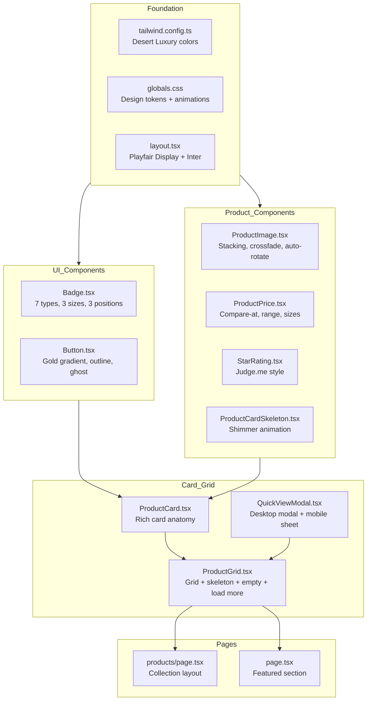
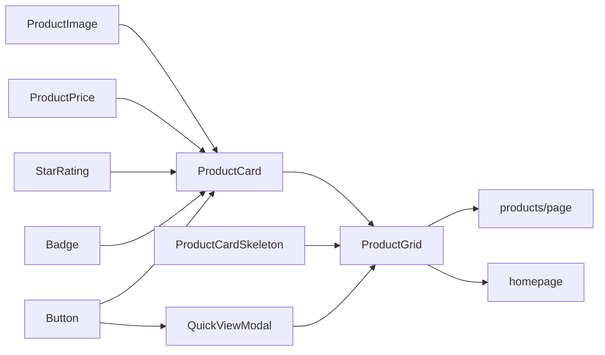

# Product Grid Redesign Plan — Desert Luxury Theme

> Based on [`plans/product-grid-design-style.md`](plans/product-grid-design-style.md) reference design.
> **Goal**: Transform the current Apple-inspired black & white theme to a luxurious "Desert Luxury" aesthetic with rich card interactions, layered badges, image hover effects, and Quick View modal.

---

## Architecture Overview



---

## Phase 1: Design Tokens & Theme Foundation

### 1.1 [`tailwind.config.ts`](tailwind.config.ts) — Color Palette

Replace the Apple color tokens with Desert Luxury palette:

| Token           | Hex         | Usage                                            |
| --------------- | ----------- | ------------------------------------------------ |
| `primary`       | `#1A1614`   | Dark brown/charcoal — main text, dark sections   |
| `primary-light` | `#2E2825`   | Hover states, secondary dark elements            |
| `primary-dark`  | `#0D0B0A`   | Deepest dark                                     |
| `gold`          | `#C9A962`   | Main gold accent — badges, hover states, buttons |
| `gold-light`    | `#DFC48A`   | Lighter gold highlights                          |
| `gold-dark`     | `#A88A42`   | Darker gold, active states                       |
| `gold-muted`    | `#C9A96233` | 20% opacity gold for subtle backgrounds          |
| `sand`          | `#F5F1EB`   | Page background, warm off-white                  |
| `sand-dark`     | `#EAE3D5`   | Footer, low-level sections                       |
| `sand-darker`   | `#D8CFBF`   | Borders, separators                              |
| `white`         | `#FFFFFF`   | Card backgrounds                                 |
| `off-white`     | `#FDFBF8`   | Subtle off-white                                 |
| `error`         | `#EF4444`   | Discount badges, error states                    |
| `success`       | `#059669`   | Emerald — "Made in UAE" badge                    |

Add font family: `playfair: ['Playfair Display', 'serif']`

### 1.2 [`src/app/globals.css`](src/app/globals.css) — Design Tokens & Animations

- Replace `:root` CSS variables with Desert Luxury tokens
- Add `@import` for Playfair Display from Google Fonts
- Replace `.btn-apple`, `.card-apple`, `.badge-discount` classes with:
  - `.btn-primary` — Gold gradient background
  - `.btn-secondary` — Gold outline
  - `.btn-ghost` — Transparent with primary text
  - `.btn-ghost-light` — Transparent with sand text
- Add shimmer animation keyframes
- Add typography utility classes (`.type-body-lg`, `.type-h1`–`.type-h4`, `.type-overline-gold`, `.type-label`)
- Add shadow tokens (base, md, xl, gold, gold-lg)
- Keep existing utility classes (`.section-container`, `.text-balance`)

### 1.3 [`src/app/layout.tsx`](src/app/layout.tsx) — Font Loading

- Add `<link>` for Playfair Display (weights 400, 500, 600, 700) in the `<head>`
- Keep existing Inter font import

---

## Phase 2: Core UI Components

### 2.1 [`src/components/ui/Badge.tsx`](src/components/ui/Badge.tsx) — 7-Type Badge System

**Extend interface:**

```typescript
interface BadgeProps {
  variant:
    | "ded_licensed"
    | "made_in_uae"
    | "wasleen_choice"
    | "super_deal"
    | "discount"
    | "installation_included"
    | "warranty_5year"
    | "dubai_climate"
    | "outline";
  size?: "sm" | "md" | "lg";
  children: React.ReactNode;
  className?: string;
}
```

**Styles per variant:**
| Variant | Styles |
|---|---|
| `ded_licensed` | Gold gradient bg, primary text |
| `made_in_uae` | Emerald (`#059669`) bg, white text |
| `wasleen_choice` | Black bg, gold text + gold border, ⭐ icon |
| `super_deal` | Red gradient (`from-red-600 to-red-500`), white text, `animate-pulse` |
| `discount` | Error red (`#EF4444`) bg, white text |
| `installation_included` | Amber (`#D97706`) bg, white text |
| `warranty_5year` | Blue (`#1E40AF`) bg, white text |
| `dubai_climate` | Sand (`#E4C89E`) bg, primary text |

**Sizes:** `sm` (xs, px-2 py-1, rounded-sm), `md` (sm, px-3 py-1.5, rounded-md), `lg` (base, px-4 py-2, rounded-lg)

**Hover effect:** `transition-transform duration-200 hover:-translate-y-[2px] hover:shadow-md`

### 2.2 [`src/components/ui/Button.tsx`](src/components/ui/Button.tsx) — Updated Variants

**New variant styles:**
| Variant | Background | Text | Border |
|---|---|---|---|
| `primary` | Gold gradient (`linear-gradient(135deg, #C9A962, #DFC48A)`) | `#1A1614` | Transparent |
| `secondary` | Transparent | `#C9A962` | Gold `#C9A962` |
| `ghost` | Transparent | `#1A1614` | Primary `#1A1614` |
| `ghost-light` | Transparent | `#F5F1EB` | Sand/50% |

All buttons: `rounded-full` (pill shape, 9999px)

---

## Phase 3: Product Display Components (NEW)

### 3.1 [`src/components/products/ProductImage.tsx`](src/components/products/ProductImage.tsx)

**Props:**

```typescript
interface ProductImageProps {
  images: string[];
  slug: string;
  productName: string;
  priority?: boolean;
}
```

**Behaviour:**

- Renders up to 5 images stacked with `position: absolute`
- Uses `next/image` with `fill` + `object-cover`
- **Desktop:** On card hover → crossfade from image 1 → image 2 (500ms)
- **Mobile:** Auto-rotates through all images every 3 seconds
- Dots indicator at bottom (hidden on desktop, `md:hidden`)
  - Active dot: `bg-white`
  - Inactive dots: `bg-white/40`
  - Max 5 dots
- Placeholder when no images: SVG camera icon on `bg-sand-dark`
- Sizes attribute: `(max-width: 640px) 100vw, (max-width: 1024px) 50vw, 25vw`
- Priority loading: first 4 cards above the fold only

### 3.2 [`src/components/products/ProductPrice.tsx`](src/components/products/ProductPrice.tsx)

**Props:**

```typescript
interface ProductPriceProps {
  price: number;
  originalPrice?: number;
  size?: "sm" | "md" | "lg";
}
```

**Behaviour:**

- Regular price: Primary colour, no compare-at
- On sale: Error red price + strikethrough compare-at in neutral-400
- Price range: "AED 1,299 – AED 1,899" (note: keep INR for ErgoAura)
- Sizes: `sm` (base bold / sm), `md` (xl bold / base), `lg` (2xl bold / lg)
- Uses `formatPrice()` from utils (already handles INR)

### 3.3 [`src/components/products/StarRating.tsx`](src/components/products/StarRating.tsx)

**Props:**

```typescript
interface StarRatingProps {
  rating: number; // 0-5
  count: number; // review count
  size?: "sm" | "md";
}
```

- Renders filled stars in gold, empty stars in neutral-200
- Shows "({count})" text beside stars
- Only renders when `count > 0`

---

## Phase 4: Product Card Redesign

### 4.1 [`src/components/products/ProductCard.tsx`](src/components/products/ProductCard.tsx) — Complete Rewrite

**New card anatomy (from top to bottom):**

```
┌─────────────────────────────────────────────┐
│  Top-Left Badges     │  Top-Right Badges      │
│  [🏛️ DED Licensed]  │  [⭐ Wasleen's Choice] │
│  [🇦🇪 Made in UAE]   │  [🔥 Super Deal]       │
│                                               │
│  ┌─── Product Image (4:3) ─────────────────┐ │
│  │         [img stacking layer]             │ │
│  │  ╔══ Bottom-Left ╗                      │ │
│  │  ║   -35% OFF    ║  (discount badge)    │ │
│  │  ╚═══════════════╝                      │ │
│  │  ╔══ Mobile Dots ╗                      │ │
│  │  ║  ● ● ○ ● ●   ║  (md:hidden)         │ │
│  │  ╚═══════════════╝                      │ │
│  ├── [👁️ Quick View] (slide-up on hover) ──┤ │
│  └──────────────────────────────────────────┘ │
│                                               │
│  Product Title (2-line clamp)                 │
│  ★★★★☆  (12 reviews)     [StarRating]        │
│  AED 4,500   ~~AED 6,900~~  [ProductPrice]   │
│                                               │
│  [🔧 Free Install] [🛡️ 5-Year] [☀️ Dubai]    │
│  (feature badges below title)                 │
│                                               │
│  [👁️ Quick View]    ← Mobile only (md:hidden) │
└─────────────────────────────────────────────┘
```

**Card container styles:**

```jsx
<article className="group relative flex flex-col rounded-2xl overflow-hidden bg-white
                    shadow-base hover:shadow-xl
                    transition-all duration-300 ease-out
                    hover:-translate-y-1">
```

**Out of stock:** When `stock === 0`, show semi-transparent dark overlay with centered "Out of Stock" pill badge.

---

## Phase 5: Grid, Loading & Empty States

### 5.1 [`src/components/products/ProductCardSkeleton.tsx`](src/components/products/ProductCardSkeleton.tsx) — NEW

**Structure:**

- 4:3 aspect ratio shimmer rect
- 75% width shimmer text line
- 50% width shimmer text line
- 33% width shimmer text line
- 2 shimmer pill badges

**Shimmer animation** (in globals.css):

```css
@keyframes shimmer {
  0% {
    background-position: 200% 0;
  }
  100% {
    background-position: -200% 0;
  }
}

.shimmer {
  background: linear-gradient(90deg, #e4e4e7 25%, #f4f4f5 50%, #e4e4e7 75%);
  background-size: 200% 100%;
  animation: shimmer 1.8s linear infinite;
}
```

### 5.2 [`src/components/products/ProductGrid.tsx`](src/components/products/ProductGrid.tsx) — Update

**Grid layout:**

```jsx
<div className="grid grid-cols-1 sm:grid-cols-2 lg:grid-cols-3 xl:grid-cols-4 gap-5">
```

**Loading state (filter change):**

- Grid becomes `opacity-40 pointer-events-none` with `300ms` transition
- Show 8 skeleton cards
- `aria-busy="true"` + `aria-live="polite"`

**Load More pagination:**

- "Showing {count} products" count text
- "Load More" button → `btn btn-secondary min-w-[180px]`
- Spinner + "Loading…" when loading
- "You've seen all products" when no more pages

**Empty state:**

```jsx
<div className="col-span-full flex flex-col items-center justify-center py-24 text-center gap-5">
  <Package size={48} className="text-neutral-300" />
  <h4 className="type-h4 text-primary">No products found</h4>
  <p className="text-sm text-neutral-500">
    No products match your current filters.
  </p>
  <button className="btn btn-secondary">Clear all filters</button>
</div>
```

---

## Phase 6: Quick View Modal

### 6.1 [`src/components/products/QuickViewModal.tsx`](src/components/products/QuickViewModal.tsx) — NEW

**Desktop:**

- Centered panel `max-w-[800px]` `max-h-[90dvh]`
- Two-column: 45% image / 55% info
- Scales in + fades on open

**Mobile:**

- Bottom sheet `h-[95dvh]` `rounded-t-3xl`
- Stacked (image top, info bottom)
- Drag handle visible at top
- Sticky CTAs at bottom

**Modal features:**

- Focus trap (Tab/Shift+Tab cycles within modal)
- ESC key closes
- Body scroll lock
- Returns focus to trigger on close
- Backdrop: semi-transparent dark overlay with `backdrop-blur-sm`
- "Add to Cart" toast notification (auto-dismiss 2.5s)

**Right column content:**

1. Trust badge strip
2. Product title (`type-h3`) + vendor
3. Star rating
4. Price with compare-at
5. Short description (3-line clamp)
6. Key features (bulleted)
7. Out of stock notice
8. "Add to Cart" (primary) + "Full Details" (ghost link) CTAs

---

## Phase 7: Products Page Update

### 7.1 [`src/app/products/page.tsx`](src/app/products/page.tsx) — Update Layout

**Desktop layout (>1024px):**

- Collection header with title + description
- "12 products" count + sort dropdown
- Product grid (3-4 cols)
- Load More

**Mobile layout (<1024px):**

- Collection header
- Filter pills (horizontal scroll) + sort dropdown
- Active filter chips (removable)
- Product grid (1-2 cols)
- Load More

Keep existing category filter pills and sort dropdown but style them with Desert Luxury tokens.

---

## Phase 8: Homepage Integration

### 8.1 [`src/app/page.tsx`](src/app/page.tsx) — Update Featured Products

- Replace `ProductGrid` usage with the redesigned grid
- Update section heading styles to use `type-h2` + Playfair Display
- Update hero section background to use sand/gold gradient instead of Apple grey

---

## File Change Summary

| File                                              | Action       | Description                                                           |
| ------------------------------------------------- | ------------ | --------------------------------------------------------------------- |
| `tailwind.config.ts`                              | **Modify**   | Replace Apple colors with Desert Luxury palette, add Playfair font    |
| `src/app/globals.css`                             | **Modify**   | New design tokens, shimmer animation, typography classes, btn classes |
| `src/app/layout.tsx`                              | **Modify**   | Add Playfair Display font link                                        |
| `src/components/ui/Badge.tsx`                     | **Modify**   | 7 badge types, 3 sizes, hover effects                                 |
| `src/components/ui/Button.tsx`                    | **Modify**   | Gold gradient primary, gold outline secondary, rounded-full           |
| `src/components/products/ProductImage.tsx`        | **NEW**      | Image stacking, crossfade, auto-rotation, dots                        |
| `src/components/products/ProductPrice.tsx`        | **NEW**      | Price display with compare-at, range, sizes                           |
| `src/components/products/StarRating.tsx`          | **NEW**      | Judge.me-style star rating                                            |
| `src/components/products/ProductCardSkeleton.tsx` | **NEW**      | Skeleton with shimmer                                                 |
| `src/components/products/ProductCard.tsx`         | **Modify**   | Complete rewrite with rich card anatomy                               |
| `src/components/products/ProductGrid.tsx`         | **Modify**   | Grid layout, shimmer loading, empty state, load more                  |
| `src/components/products/QuickViewModal.tsx`      | **NEW**      | Quick View modal with focus trap                                      |
| `src/app/products/page.tsx`                       | **Modify**   | Collection layout with Desert Luxury styling                          |
| `src/app/page.tsx`                                | **Modify**   | Updated featured section with new theme                               |
| `src/lib/types.ts`                                | **Optional** | Add `rating` field to Product type if needed                          |

---

## Dependencies & Notes

- **No new npm packages required** — all animations use CSS/Tailwind, modal focus trap is hand-rolled
- **Framer Motion** is already in `package.json` — can use for stagger animations and modal transitions
- **next/image** is available — use for ProductImage (already in deps)
- **lucide-react** is NOT in deps — `Package` icon for empty state can use inline SVG or add lucide-react
- **Currency**: Reference design uses AED, ErgoAura uses INR — keep `formatPrice()` as-is (INR)

---

## Component Dependency Graph



---

## Edge Cases & States

| Component      | States                                                                                              |
| -------------- | --------------------------------------------------------------------------------------------------- |
| ProductCard    | Default, Hover (lift + gold title), Out of Stock, No images                                         |
| ProductImage   | Loading (sand bg), Loaded, Hover crossfade, Mobile auto-rotate, No images (placeholder)             |
| ProductGrid    | Loading (8 skeletons), Empty (Package icon + message + clear button), Loaded, Load More in progress |
| QuickViewModal | Closed, Opening (animation), Open (desktop/mobile), Closing                                         |
| Badge          | Normal, Hover (lift), Pulse animation (super_deal)                                                  |
| ProductPrice   | Regular, On sale, Price range                                                                       |
