# Fix: Auto-Create Orders in Supabase from Razorpay Webhook

## Problem

When a customer pays via Razorpay but the browser fails to redirect back to the success page (e.g., closes tab, network failure), the payment is **captured by Razorpay** but **no order record is created in Supabase**. The webhook at [`src/app/api/razorpay/webhook/route.ts`](../src/app/api/razorpay/webhook/route.ts) receives the `payment.captured` event but only logs a warning — it does **not** create the missing order.

```
Browser Flow (works, but fragile):
  Razorpay modal → payment success → browser POSTs to /api/orders/create → Supabase order ✅

What happens when browser fails:
  Razorpay modal → payment success → browser fails to POST → Supabase order ❌
  Webhook fires → checks DB → no order found → logs warning → does NOTHING ❌
```

## Solution Overview

3 files need changes:

1. **`src/app/api/razorpay/create-order/route.ts`** — Accept customer + order details and store them as Razorpay order `notes`
2. **`src/app/checkout/page.tsx`** — Send customer + cart data to the create-order API
3. **`src/app/api/razorpay/webhook/route.ts`** — Reconstruct orders from Razorpay order notes when they're missing from Supabase

```mermaid
flowchart TB
    subgraph Browser[Browser Flow - UNCHANGED]
        A[Checkout form] --> B[POST /api/razorpay/create-order<br/>+ customer data]
        B --> C[Razorpay: store data in order.notes]
        C --> D[Razorpay checkout modal]
        D -->|Payment success| E[POST /api/orders/create]
        E --> F[Order saved in Supabase ✅]
    end

    subgraph Webhook[Webhook Safety Net - NEW]
        G[Razorpay Webhook<br/>payment.captured] --> H{Order exists in DB?}
        H -->|Yes| I[Return already_exists ✅]
        H -->|No| J[Fetch Razorpay order via SDK]
        J --> K[Extract notes: customer_name,<br/>email, phone, address, products]
        K --> L[Auto-create order in Supabase ✅]
    end

    subgraph Failed[Failed Payment Handling - NEW]
        M[Razorpay Webhook<br/>payment.failed] --> N{Order exists in DB?}
        N -->|Yes| O[Update payment_status= failed ✅]
        N -->|No| P[Fetch Razorpay order via SDK]
        P --> Q[Extract notes<br/>Create order with payment_status= failed ✅]
    end
```



---

## Implementation Steps

### Step 1: Modify `src/app/api/razorpay/create-order/route.ts`

**What changes:**

- Accept new optional fields in the request body: `customer_name`, `customer_email`, `customer_phone`, `address`, `products`, `subtotal`, `discount`, `shipping`, `total`
- Store these fields as `notes` on the Razorpay order (Razorpay persists notes on the order object)
- All new fields are **optional** — the existing minimal call (just `amount` + `currency`) continues to work

**Code changes:**

```typescript
// In POST handler, after parsing body:
const {
  amount,
  currency,
  customer_name,
  customer_email,
  customer_phone,
  address,
  products,
  subtotal,
  discount,
  shipping,
  total,
} = await request.json();

// Build notes object from available data
const notes: Record<string, string> = {};
if (customer_name) notes.customer_name = customer_name;
if (customer_email) notes.customer_email = customer_email;
if (customer_phone) notes.customer_phone = customer_phone;
if (address) notes.address = JSON.stringify(address);
if (products) notes.products = JSON.stringify(products);
if (subtotal != null) notes.subtotal = String(subtotal);
if (discount != null) notes.discount = String(discount);
if (shipping != null) notes.shipping = String(shipping);
if (total != null) notes.total = String(total);

// Add notes to options
const options = {
  amount: Math.round(amount * 100),
  currency: currency || "INR",
  receipt: `receipt_${Date.now()}`,
  notes, // <-- NEW
};
```

**Why:** Razorpay stores `notes` on the order object. When a payment is captured, the payment entity references `order_id`, which we can use to fetch the order and read its notes — giving us all the data needed to reconstruct the order in Supabase.

---

### Step 2: Modify `src/app/checkout/page.tsx`

**What changes:**

- When calling `POST /api/razorpay/create-order`, include the form data and cart items
- This ensures the data is stored in Razorpay order notes as a backup

**Code changes:**

```typescript
// In handleSubmit, step 1: Create Razorpay order
const orderRes = await fetch("/api/razorpay/create-order", {
  method: "POST",
  headers: { "Content-Type": "application/json" },
  body: JSON.stringify({
    amount: total,
    currency: "INR",
    // NEW: Pass customer + order data for webhook fallback
    customer_name: form.name,
    customer_email: form.email,
    customer_phone: form.phone,
    address: {
      line1: form.addressLine1,
      line2: form.addressLine2 || undefined,
      city: form.city,
      state: form.state,
      pincode: form.pincode,
    },
    products: items.map((item) => ({
      product_id: item.product.id,
      name: item.product.name,
      price: item.product.price,
      quantity: item.quantity,
      image: getProductImageUrl(item.product.slug, item.product.images?.[0]),
    })),
    subtotal,
    discount: b2g1Discount,
    shipping,
    total,
  }),
});
```

**Why:** Same data the browser sends to `/api/orders/create` on success is now also sent when creating the Razorpay order. This data becomes the safety net in Razorpay notes.

---

### Step 3: Modify `src/app/api/razorpay/webhook/route.ts`

**What changes:**

1. **Initialize Razorpay SDK** at module level (same pattern as `create-order/route.ts`)
2. **`payment.captured` handler**: When no existing order found, fetch the Razorpay order via SDK, extract notes, and auto-create the Supabase order
3. **`payment.failed` handler**: When no existing order found, fetch the Razorpay order notes and create a failed order record for visibility
4. Import Razorpay SDK and credentials

**Detailed code changes:**

**a) Add Razorpay import and initialization at top:**

```typescript
import Razorpay from "razorpay";
import { RAZORPAY_KEY_ID, RAZORPAY_KEY_SECRET } from "@/lib/constants";

const razorpay = new Razorpay({
  key_id: RAZORPAY_KEY_ID,
  key_secret: RAZORPAY_KEY_SECRET,
});
```

**b) Create a shared helper function for building an order from Razorpay notes:**

```typescript
async function createOrderFromRazorpayNotes(
  razorpayOrderId: string,
  paymentId: string,
  paymentStatus: DbPaymentStatus,
) {
  // Fetch the Razorpay order to get notes
  const razorpayOrder = await razorpay.orders.fetch(razorpayOrderId);
  const notes = razorpayOrder.notes || {};

  const orderData: Record<string, unknown> = {
    customer_name: notes.customer_name || "Unknown",
    customer_email: notes.customer_email || "unknown@email.com",
    customer_phone: notes.customer_phone || "0000000000",
    address: notes.address
      ? JSON.parse(notes.address)
      : { line1: "N/A", city: "N/A", state: "N/A", pincode: "000000" },
    products: notes.products ? JSON.parse(notes.products) : [],
    subtotal: notes.subtotal ? parseInt(notes.subtotal, 10) : 0,
    discount: notes.discount ? parseInt(notes.discount, 10) : 0,
    shipping: notes.shipping ? parseInt(notes.shipping, 10) : 0,
    total: notes.total
      ? parseInt(notes.total, 10)
      : razorpayOrder.amount_paid || 0,
    payment_id: paymentId,
    payment_status: paymentStatus,
    order_status: "placed" as DbOrderStatus,
  };

  const { data, error } = await supabaseAdmin
    .from("orders")
    .insert(orderData)
    .select()
    .single();

  if (error) {
    console.error(
      `[Webhook] Failed to create order from notes: ${error.message}`,
    );
    return null;
  }
  return data;
}
```

**c) Update `payment.captured` case:**

```typescript
case "payment.captured": {
  const payment = event.payload.payment.entity;
  const razorpayOrderId = payment.order_id;
  const razorpayPaymentId = payment.id;

  // Check if order exists
  const { data: existingOrder } = await supabaseAdmin
    .from("orders")
    .select("id, order_status")
    .eq("payment_id", razorpayPaymentId)
    .maybeSingle();

  if (existingOrder) {
    console.log(`[Webhook] Order exists for payment ${razorpayPaymentId}`);
    return NextResponse.json({ status: "already_exists" });
  }

  // Order doesn't exist — try to create from Razorpay order notes
  try {
    const newOrder = await createOrderFromRazorpayNotes(
      razorpayOrderId,
      razorpayPaymentId,
      "paid",
    );
    if (newOrder) {
      console.log(`[Webhook] ✅ Auto-created order ${newOrder.order_id} from captured payment ${razorpayPaymentId}`);
      return NextResponse.json({ status: "created", order_id: newOrder.order_id });
    }
  } catch (fetchError) {
    console.error(`[Webhook] Failed to fetch/create from Razorpay order ${razorpayOrderId}:`, fetchError);
  }

  console.warn(`[Webhook] ⚠️ Cannot auto-create order for payment ${razorpayPaymentId}`);
  return NextResponse.json({ status: "logged" });
}
```

**d) Update `payment.failed` case:**

```typescript
case "payment.failed": {
  const payment = event.payload.payment.entity;
  const razorpayPaymentId = payment.id;
  const razorpayOrderId = payment.order_id;

  // Try to update existing order
  const { data: existingOrder } = await supabaseAdmin
    .from("orders")
    .select("id")
    .eq("payment_id", razorpayPaymentId)
    .maybeSingle();

  if (existingOrder) {
    await supabaseAdmin
      .from("orders")
      .update({ payment_status: "failed" })
      .eq("payment_id", razorpayPaymentId);
    console.log(`[Webhook] Updated order ${existingOrder.id} payment_status to failed`);
    return NextResponse.json({ status: "updated" });
  }

  // No existing order — try to create a failed order record from notes
  try {
    const failedOrder = await createOrderFromRazorpayNotes(
      razorpayOrderId,
      razorpayPaymentId,
      "failed",
    );
    if (failedOrder) {
      console.log(`[Webhook] ✅ Created failed order record ${failedOrder.order_id} for payment ${razorpayPaymentId}`);
      return NextResponse.json({ status: "created_failed", order_id: failedOrder.order_id });
    }
  } catch (fetchError) {
    console.error(`[Webhook] Failed to create failed order record:`, fetchError);
  }

  return NextResponse.json({ status: "logged" });
}
```

---

## Risk Assessment & Safety

| Risk                       | Mitigation                                                                                                                                                                                                          |
| -------------------------- | ------------------------------------------------------------------------------------------------------------------------------------------------------------------------------------------------------------------- |
| **Duplicate orders**       | The webhook first checks `SELECT ... eq('payment_id', ...)`. If the browser already created the order, webhook returns `already_exists` immediately.                                                                |
| **Missing notes**          | If customer uses an old checkout page that doesn't send notes, the `createOrderFromRazorpayNotes` will get empty notes and create a minimal "Unknown" order. This is still better than losing the payment entirely. |
| **Razorpay SDK failure**   | The fetch-and-create is wrapped in try/catch. If the Razorpay API is unreachable, the webhook gracefully degrades to the current behavior (log warning only).                                                       |
| **Order ID uniqueness**    | The `order_id` and `track_id` are auto-generated by the `set_order_ids()` DB trigger, so auto-created orders get valid unique IDs.                                                                                  |
| **Backward compatibility** | All new fields in the create-order API are optional. Existing checkout pages will continue to work without changes — they just won't have the safety net until updated.                                             |

## Testing

1. **Test normal flow**: Place a real order end-to-end. Verify:
   - Order appears in Supabase (from browser, as before)
   - Webhook fires but returns `already_exists` (no duplicate)

2. **Test webhook auto-creation** (simulate browser failure):
   - Manually trigger a Razorpay payment
   - Do NOT rely on browser redirect
   - Check webhook logs for `✅ Auto-created order`
   - Verify order appears in Supabase with correct customer data

3. **Test failed payment**: Initiate a failed payment in Razorpay test mode:
   - Verify webhook creates a failed order record
   - Verify `payment_status = 'failed'` in Supabase

## Files Modified

| File                                                                                          | Change Type                                                          |
| --------------------------------------------------------------------------------------------- | -------------------------------------------------------------------- |
| [`src/app/api/razorpay/create-order/route.ts`](../src/app/api/razorpay/create-order/route.ts) | **Modified** — Accept optional customer+order fields, store as notes |
| [`src/app/checkout/page.tsx`](../src/app/checkout/page.tsx)                                   | **Modified** — Pass form data and cart to create-order API           |
| [`src/app/api/razorpay/webhook/route.ts`](../src/app/api/razorpay/webhook/route.ts)           | **Modified** — Auto-create orders from Razorpay notes when missing   |
