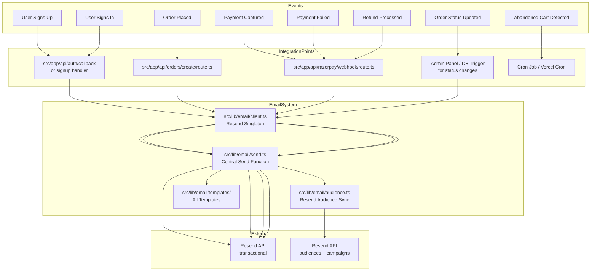
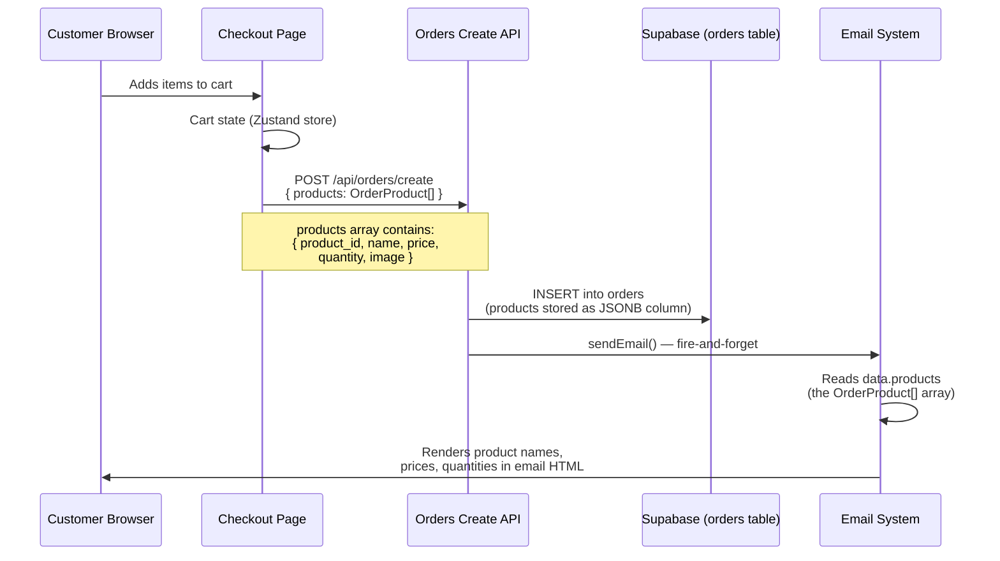

# Resend Email Automation System for ErgoAura Shop

> **Goal**: Set up a complete, robust transactional + promotional email system using Resend.com for all customer-touch events without breaking any existing code, structure, or functionality.

---

## Table of Contents

1. [Architecture Overview](#1-architecture-overview)
2. [Installation & Setup](#2-installation--setup)
3. [Email Client & Shared Infrastructure](#3-email-client--shared-infrastructure)
4. [Email Template System](#4-email-template-system)
5. [Event Integration Points](#5-event-integration-points)
6. [Promotional Email & Audience Management](#6-promotional-email--audience-management)
7. [Bonus Ideas & Revenue Opportunities](#7-bonus-ideas--revenue-opportunities)
8. [Implementation Order](#8-implementation-order)
9. [Complete File Manifest](#9-complete-file-manifest)

---

## 1. Architecture Overview



### 1.1 Product Data Flow — How Products Reach Email Templates

This explains the complete data pipeline from checkout → database → email template.



**The critical data structure** — [`OrderProduct`](src/lib/types.ts:100):

```typescript
export interface OrderProduct {
  product_id: string; // Unique product ID
  name: string; // Product name (e.g., "Posture Corrector Belt")
  price: number; // Price in paise (e.g., 149900 = ₹1,499)
  quantity: number; // Quantity ordered
  image: string; // Product image URL
}
```

**How it flows:**

1. Customer adds products to cart → [`cartStore.ts`](src/store/cartStore.ts) stores `CartItem[]` (each with full `Product` object)
2. Checkout page maps cart items to `OrderProduct[]` format at [line 184](src/app/checkout/page.tsx:184):
   ```typescript
   products: items.map((item) => ({
     product_id: item.product.id,
     name: item.product.name,
     price: item.product.price,
     quantity: item.quantity,
     image: getProductImageUrl(item.product.slug, item.product.images?.[0]),
   })),
   ```
3. This `OrderProduct[]` is sent in the POST body to [`/api/orders/create`](src/app/api/orders/create/route.ts)
4. The API stores it as-is in the `orders.products` JSONB column ([line 88](src/app/api/orders/create/route.ts:88)):
   ```typescript
   products: products as OrderProduct[],
   ```
5. When the email sends (fire-and-forget after successful insert), the template reads `data.products` — the same `OrderProduct[]` array
6. The template iterates over products to render each row with name, quantity, and price

**Result**: You NEVER need a separate query to get product details for emails. Everything is stored at purchase time.

### 1.2 Safety Guarantees — The "Once and Forget" Promise

This table documents every guarantee that makes the system safe to deploy and forget.

| #   | Guarantee                                     | How It's Enforced                                                                                                                               | File Reference                                                 |
| --- | --------------------------------------------- | ----------------------------------------------------------------------------------------------------------------------------------------------- | -------------------------------------------------------------- |
| 1   | **Email failures NEVER break checkout**       | `sendEmail()` wraps all Resend calls in try/catch and returns `{ success, error }` — never throws                                               | [`send.ts`](src/lib/email/send.ts)                             |
| 2   | **Email failures NEVER delay HTTP response**  | All email sends are fire-and-forget (no `await`). The API route returns before the email resolves                                               | All integration points                                         |
| 3   | **Zero existing code is modified**            | Email calls are added AFTER successful operations. No existing logic branches, returns, or error handling is changed                            | See Section 5                                                  |
| 4   | **No new database tables required**           | All template data comes from existing columns: `orders.products` (JSONB), `orders.customer_email`, `profiles.email`, etc.                       | See Data Source table                                          |
| 5   | **No new API routes required for core flow**  | Email hooks into existing routes (`/api/orders/create`, `/api/razorpay/webhook`). New routes are only for admin status updates and cron         | See Section 5                                                  |
| 6   | **Supabase RLS bypass is preserved**          | All DB reads for email data use `supabaseAdmin` (service role) — same as existing code                                                          | Integration points use existing `supabaseAdmin`                |
| 7   | **Webhook signature verification unchanged**  | The Razorpay HMAC verification at [line 32](src/app/api/razorpay/webhook/route.ts:32) remains the first check — email is an additive step after | [`webhook/route.ts`](src/app/api/razorpay/webhook/route.ts)    |
| 8   | **Payment signature verification for orders** | The HMAC check at [line 65](src/app/api/orders/create/route.ts:65) prevents fake orders — email is an additive step after                       | [`orders/create/route.ts`](src/app/api/orders/create/route.ts) |
| 9   | **Resend API key is server-only**             | `RESEND_API_KEY` is never exposed to the browser. It's only used in server API routes and `supabaseAdmin`-only contexts                         | [`constants.ts`](src/lib/constants.ts)                         |
| 10  | **Unsubscribe is automatic**                  | Resend appends `{{{RESEND_UNSUBSCRIBE_URL}}}` to all audience emails. No custom unsubscribe logic needed                                        | [`styles.ts`](src/lib/email/styles.ts)                         |

### Design Principles

1. **Zero breakage** — All existing code remains untouched; we only _add_ email calls after successful operations.
2. **Graceful failure** — If email sending fails, the primary operation (order creation, payment handling) is NOT rolled back. Errors are logged only.
3. **Separation of concerns** — Email logic lives entirely in [`src/lib/email/`](src/lib/email). No email HTML or sending logic leaks into API routes.
4. **Type safety** — All email templates are typed functions with clear params.

---

## 2. Installation & Setup

### 2.1 Install Resend SDK

```bash
npm install resend
```

No other dependencies needed. Resend works out of the box with Next.js server components and API routes.

### 2.2 Environment Variables

Add to [`.env.local`](.env.local):

```env
# Resend (Transactional Email)
RESEND_API_KEY=
RESEND_SIGN_IN_SECRET=
RESEND_FROM_EMAIL=ErgoAura <support@ergoaurashop.com>
RESEND_AUDIENCE_ID=your-audience-id-from-resend-dashboard
```

Also update [`.env.example`](.env.example) so future developers know what's needed.

### 2.3 Resend Dashboard Setup

1. Go to [resend.com](https://resend.com) → Sign up / Log in
2. **Domains** → Add `ergoaurashop.com` and verify DNS records (TXT + DKIM)
3. **API Keys** → Create a key with "Sending" permission → copy to `.env.local`
4. **Audiences** → Create an audience named "ErgoAura Customers" → copy the Audience ID to `.env.local`
5. **Webhooks** → Set up webhook URL `https://ergoaurashop.com/api/resend/webhook` to track opens/clicks/bounces

### 2.4 Update [`src/lib/constants.ts`](src/lib/constants.ts)

Add these imports and exports:

```typescript
// =====================================================================
// Resend (Email)
// =====================================================================
export const RESEND_API_KEY = process.env.RESEND_API_KEY!;
export const RESEND_FROM_EMAIL = process.env.RESEND_FROM_EMAIL!;
export const RESEND_AUDIENCE_ID = process.env.RESEND_AUDIENCE_ID!;
```

Also add to `REQUIRED_SERVER_VARS` array (around line 90):

```typescript
const REQUIRED_SERVER_VARS = [
  // ... existing vars ...
  "RESEND_API_KEY",
  "RESEND_FROM_EMAIL",
] as const;
```

---

## 3. Email Client & Shared Infrastructure

All new files go under [`src/lib/email/`](src/lib/email). These are the **only** files to be created — nothing existing is modified except [`src/lib/constants.ts`](src/lib/constants.ts) and [`.env.local`](.env.local).

### 3.1 [`src/lib/email/client.ts`](src/lib/email/client.ts) — Resend Singleton

```typescript
import { Resend } from "resend";
import { RESEND_API_KEY } from "@/lib/constants";

let _resend: Resend | null = null;

/**
 * Get or create the Resend singleton client.
 * Throws if RESEND_API_KEY is not configured.
 */
export function getResendClient(): Resend {
  if (!_resend) {
    if (!RESEND_API_KEY) {
      throw new Error(
        "RESEND_API_KEY is not configured. Add it to your .env.local file.",
      );
    }
    _resend = new Resend(RESEND_API_KEY);
  }
  return _resend;
}
```

### 3.2 [`src/lib/email/send.ts`](src/lib/email/send.ts) — Central Send Function

This is the **only** function API routes call. It wraps the Resend API with error handling that never throws — so your primary business logic never fails due to an email issue.

```typescript
import { getResendClient } from "./client";
import { RESEND_FROM_EMAIL } from "@/lib/constants";

export type EmailTag = { name: string; value: string };

export interface SendEmailParams {
  to: string | string[];
  subject: string;
  html: string;
  tags?: EmailTag[];
  /** Optional: reply-to address */
  replyTo?: string;
}

export interface SendEmailResult {
  success: boolean;
  id?: string;
  error?: string;
}

/**
 * Central email send function.
 * NEVER throws — logs errors and returns a result object.
 * This ensures email failures never break the primary operation
 * (order creation, payment processing, etc.).
 */
export async function sendEmail(
  params: SendEmailParams,
): Promise<SendEmailResult> {
  try {
    const resend = getResendClient();
    const { data, error } = await resend.emails.send({
      from: RESEND_FROM_EMAIL,
      to: Array.isArray(params.to) ? params.to : [params.to],
      subject: params.subject,
      html: params.html,
      tags: params.tags,
      replyTo: params.replyTo,
    });

    if (error) {
      console.error("[Email] Send failed:", error);
      return { success: false, error: error.message };
    }

    return { success: true, id: data?.id };
  } catch (err) {
    const message = err instanceof Error ? err.message : "Unknown email error";
    console.error("[Email] Send exception:", message);
    return { success: false, error: message };
  }
}
```

### 3.3 [`src/lib/email/audience.ts`](src/lib/email/audience.ts) — Resend Audience Sync

For promotional email campaigns. Syncs customers to a Resend Audience with proper unsubscribe handling.

```typescript
import { getResendClient } from "./client";
import { RESEND_AUDIENCE_ID } from "@/lib/constants";

export interface AudienceContact {
  email: string;
  firstName?: string;
  lastName?: string;
  source?: "checkout" | "signup" | "contact";
}

/**
 * Add or update a contact in the Resend Audience.
 * Used for promotional email campaigns.
 * Resend handles unsubscribe management automatically.
 */
export async function syncAudienceContact(
  contact: AudienceContact,
): Promise<boolean> {
  try {
    const resend = getResendClient();
    const { error } = await resend.contacts.create({
      email: contact.email,
      firstName: contact.firstName,
      lastName: contact.lastName,
      audienceId: RESEND_AUDIENCE_ID,
      unsubscribed: false,
    });

    if (error) {
      console.error("[Audience] Sync failed:", error);
      return false;
    }

    return true;
  } catch (err) {
    console.error("[Audience] Sync exception:", err);
    return false;
  }
}
```

### 3.4 [`src/lib/email/styles.ts`](src/lib/email/styles.ts) — Shared Email CSS

A shared stylesheet used by all templates to ensure consistent brand styling.

```typescript
/**
 * Shared inline CSS for all email templates.
 * Uses inline styles for maximum email client compatibility.
 */
export const EMAIL_STYLES = {
  container:
    "max-width:600px; margin:0 auto; font-family:-apple-system,BlinkMacSystemFont,'Segoe UI',Roboto,sans-serif; background:#ffffff;",
  headerBar: "background:#1A1614; padding:24px 32px; text-align:center;",
  logoText:
    "color:#C9A962; font-size:24px; font-weight:700; letter-spacing:2px;",
  body: "padding:32px; color:#333333; font-size:15px; line-height:1.6;",
  button:
    "display:inline-block; padding:12px 28px; background:#C9A962; color:#ffffff !important; text-decoration:none; border-radius:8px; font-size:15px; font-weight:600;",
  buttonSecondary:
    "display:inline-block; padding:10px 24px; background:#1A1614; color:#ffffff !important; text-decoration:none; border-radius:8px; font-size:14px; font-weight:500;",
  divider: "border:none; border-top:1px solid #EAE3D5; margin:24px 0;",
  orderTable: "width:100%; border-collapse:collapse; font-size:14px;",
  orderTableHeader:
    "background:#F5F1EB; padding:10px 12px; text-align:left; font-weight:600; font-size:13px;",
  orderTableCell: "padding:10px 12px; border-bottom:1px solid #EAE3D5;",
  footer:
    "background:#F9F9F9; padding:24px 32px; text-align:center; font-size:12px; color:#86868B;",
  footerLink: "color:#C9A962; text-decoration:none;",
} as const;

/**
 * Shared email HTML wrapper.
 * Every template calls this to wrap content in consistent layout.
 */
export function emailLayout(content: string): string {
  return `
<!DOCTYPE html>
<html>
<head>
  <meta charset="utf-8">
  <meta name="viewport" content="width=device-width, initial-scale=1.0">
</head>
<body style="margin:0; padding:0; background:#F5F5F5;">
  <div style="${EMAIL_STYLES.container}">
    <!-- Header -->
    <div style="${EMAIL_STYLES.headerBar}">
      <p style="${EMAIL_STYLES.logoText}">ERGOAURA</p>
    </div>

    <!-- Main Content -->
    <div style="${EMAIL_STYLES.body}">
      ${content}
    </div>

    <!-- Footer -->
    <div style="${EMAIL_STYLES.footer}">
      <p style="margin:0 0 8px;">
        <a href="{{{RESEND_UNSUBSCRIBE_URL}}}" style="${EMAIL_STYLES.footerLink}">Unsubscribe</a>
        &nbsp;·&nbsp;
        <a href="https://ergoaurashop.com" style="${EMAIL_STYLES.footerLink}">ErgoAura Shop</a>
      </p>
      <p style="margin:0;">
        ErgoAura Shop<br/>
        Your premium online store
      </p>
    </div>
  </div>
</body>
</html>`;
}
```

### 3.5 Per-Template Data Source Reference

Every template parameter mapped to its exact database column and code source.

#### [`welcome.ts`](src/lib/email/templates/welcome.ts)

| Template Param | DB Column / Source | TypeScript Type | Example Value    |
| -------------- | ------------------ | --------------- | ---------------- |
| `name`         | `profiles.name`    | `string`        | `"Rajesh Kumar"` |

**Trigger location**: After `supabase.auth.signUp()` succeeds and profile is inserted.

#### [`order-confirmation.ts`](src/lib/email/templates/order-confirmation.ts)

| Template Param    | DB Column / Source        | TypeScript Type  | Example Value                                    |
| ----------------- | ------------------------- | ---------------- | ------------------------------------------------ |
| `customerName`    | `orders.customer_name`    | `string`         | `"Rajesh Kumar"`                                 |
| `orderId`         | `orders.order_id`         | `string`         | `"ORD-A7F3K2"`                                   |
| `trackId`         | `orders.track_id`         | `string`         | `"TRK-M9N2X7"`                                   |
| `products`        | `orders.products` (JSONB) | `OrderProduct[]` | `[{ product_id, name, price, quantity, image }]` |
| `total`           | `orders.total`            | `number` (paise) | `149900`                                         |
| `paymentStatus`   | `orders.payment_status`   | `string`         | `"paid"`                                         |
| `address.line1`   | `orders.address.line1`    | `string`         | `"42, MG Road"`                                  |
| `address.city`    | `orders.address.city`     | `string`         | `"Mumbai"`                                       |
| `address.state`   | `orders.address.state`    | `string`         | `"Maharashtra"`                                  |
| `address.pincode` | `orders.address.pincode`  | `string`         | `"400001"`                                       |

**Trigger location**: [`/api/orders/create`](src/app/api/orders/create/route.ts) — immediately after successful `.insert()` at [line 107](src/app/api/orders/create/route.ts:107).

#### [`payment-captured.ts`](src/lib/email/templates/payment-captured.ts)

| Template Param | DB Column / Source                               | TypeScript Type  | Example Value       |
| -------------- | ------------------------------------------------ | ---------------- | ------------------- |
| `customerName` | `orders.customer_name` (fetched by payment_id)   | `string`         | `"Rajesh Kumar"`    |
| `orderId`      | `orders.order_id`                                | `string`         | `"ORD-A7F3K2"`      |
| `trackId`      | `orders.track_id`                                | `string`         | `"TRK-M9N2X7"`      |
| `amount`       | `payment.amount` (from Razorpay webhook payload) | `number` (paise) | `149900`            |
| `paymentId`    | `payment.id` (from Razorpay webhook payload)     | `string`         | `"pay_Nx7Q3kR2..."` |

**Trigger location**: Razorpay webhook `payment.captured` event — [`/api/razorpay/webhook`](src/app/api/razorpay/webhook/route.ts).

#### [`payment-failed.ts`](src/lib/email/templates/payment-failed.ts)

| Template Param     | DB Column / Source                                                          | TypeScript Type | Example Value                                                |
| ------------------ | --------------------------------------------------------------------------- | --------------- | ------------------------------------------------------------ |
| `customerName`     | `orders.customer_name`                                                      | `string`        | `"Rajesh Kumar"`                                             |
| `orderId`          | `orders.order_id`                                                           | `string`        | `"ORD-A7F3K2"`                                               |
| `errorDescription` | `payment.error_description` (Razorpay webhook)                              | `string`        | `"Insufficient funds"`                                       |
| `retryLink`        | Constructed URL: `https://ergoaurashop.com/checkout?retry_order={order_id}` | `string`        | `"https://ergoaurashop.com/checkout?retry_order=ORD-A7F3K2"` |

**Trigger location**: Razorpay webhook `payment.failed` event.

#### [`refund-processed.ts`](src/lib/email/templates/refund-processed.ts)

| Template Param | DB Column / Source                                 | TypeScript Type       | Example Value                       |
| -------------- | -------------------------------------------------- | --------------------- | ----------------------------------- |
| `customerName` | `orders.customer_name`                             | `string`              | `"Rajesh Kumar"`                    |
| `orderId`      | `orders.order_id`                                  | `string`              | `"ORD-A7F3K2"`                      |
| `refundAmount` | `refund.amount` (Razorpay webhook)                 | `number` (paise)      | `149900`                            |
| `refundNote`   | `refund.notes.reason` (Razorpay webhook, optional) | `string \| undefined` | `"Customer requested cancellation"` |

**Trigger location**: Razorpay webhook `refund.processed` event — must be activated in Razorpay Dashboard.

#### [`order-status-update.ts`](src/lib/email/templates/order-status-update.ts)

| Template Param | DB Column / Source                    | TypeScript Type | Example Value    |
| -------------- | ------------------------------------- | --------------- | ---------------- |
| `customerName` | `orders.customer_name`                | `string`        | `"Rajesh Kumar"` |
| `orderId`      | `orders.order_id`                     | `string`        | `"ORD-A7F3K2"`   |
| `trackId`      | `orders.track_id`                     | `string`        | `"TRK-M9N2X7"`   |
| `newStatus`    | `orders.order_status` (updated value) | `OrderStatus`   | `"shipped"`      |

**Trigger location**: [`/api/orders/update-status`](src/app/api/orders/update-status/route.ts) — called by admin panel.

#### [`signin-alert.ts`](src/lib/email/templates/signin-alert.ts)

| Template Param | DB Column / Source                                     | TypeScript Type       | Example Value              |
| -------------- | ------------------------------------------------------ | --------------------- | -------------------------- |
| `name`         | `profiles.name`                                        | `string`              | `"Rajesh Kumar"`           |
| `time`         | `new Date().toLocaleString()` (generated at send time) | `string`              | `"6/22/2026, 10:30:00 AM"` |
| `ip`           | Request header `x-forwarded-for` (optional)            | `string \| undefined` | `"203.0.113.42"`           |

**Trigger location**: After successful sign-in — [`middleware.ts`](src/middleware.ts) or auth callback.

#### [`abandoned-cart.ts`](src/lib/email/templates/abandoned-cart.ts)

| Template Param | DB Column / Source                           | TypeScript Type               | Example Value                                        |
| -------------- | -------------------------------------------- | ----------------------------- | ---------------------------------------------------- |
| `customerName` | From cart tracking (localStorage + API)      | `string`                      | `"Rajesh Kumar"`                                     |
| `items`        | From cart state — must be stored server-side | `Array<{name, price, image}>` | See OrderProduct                                     |
| `cartTotal`    | Calculated from items                        | `number` (paise)              | `149900`                                             |
| `checkoutLink` | Constructed URL with cart restore token      | `string`                      | `"https://ergoaurashop.com/checkout?restore=abc123"` |

**Trigger location**: Vercel Cron job — [`/api/cron/abandoned-cart`](src/app/api/cron/abandoned-cart/route.ts).

---

## 4. Email Template System

All templates are placed in [`src/lib/email/templates/`](src/lib/email/templates) with a barrel export.

### 4.1 Template Index — [`src/lib/email/templates/index.ts`](src/lib/email/templates/index.ts)

```typescript
export { welcomeEmail } from "./welcome";
export { orderConfirmationEmail } from "./order-confirmation";
export { paymentCapturedEmail } from "./payment-captured";
export { paymentFailedEmail } from "./payment-failed";
export { refundProcessedEmail } from "./refund-processed";
export { orderStatusUpdateEmail } from "./order-status-update";
export { signInAlertEmail } from "./signin-alert";
export { abandonedCartEmail } from "./abandoned-cart";
```

### 4.2 [`src/lib/email/templates/welcome.ts`](src/lib/email/templates/welcome.ts)

**Trigger**: After user signs up and profile is created.
**Purpose**: Welcome the user, offer first-purchase discount.

```typescript
import { emailLayout } from "../styles";

interface WelcomeParams {
  name: string;
}

export function welcomeEmail(params: WelcomeParams): {
  subject: string;
  html: string;
} {
  const { name } = params;

  const content = `
    <h1 style="font-size:24px; margin:0 0 8px;">Welcome to ErgoAura, ${name}! 🎉</h1>
    <p style="margin:0 0 20px;">We're thrilled to have you on board. Get ready to discover amazing deals on hand-picked premium products.</p>

    <div style="background:#F5F1EB; border-radius:12px; padding:20px; margin:0 0 24px;">
      <p style="font-size:13px; margin:0 0 4px; color:#86868B;">YOUR FIRST-ORDER OFFER</p>
      <p style="font-size:18px; font-weight:700; margin:0 0 12px; color:#1A1614;">Get 10% OFF your first purchase</p>
      <a href="https://ergoaurashop.com/products" style="${EMAIL_STYLES.button}">Shop Now</a>
    </div>

    <h2 style="font-size:16px; margin:0 0 12px;">What to expect next:</h2>
    <table style="width:100%; font-size:14px; line-height:1.6;">
      <tr><td style="padding:6px 0; vertical-align:top; width:24px;">✅</td><td style="padding:6px 0;">Order confirmations & shipping updates</td></tr>
      <tr><td style="padding:6px 0; vertical-align:top;">💰</td><td style="padding:6px 0;">Exclusive deals & flash sale alerts</td></tr>
      <tr><td style="padding:6px 0; vertical-align:top;">🎁</td><td style="padding:6px 0;">Personalized product recommendations</td></tr>
    </table>

    <hr style="${EMAIL_STYLES.divider}" />

    <p style="margin:0; font-size:13px; color:#86868B;">Need help? Reply to this email or visit our <a href="https://ergoaurashop.com/contact-us" style="color:#C9A962;">Contact Us</a> page.</p>
  `;

  return {
    subject: `Welcome to ErgoAura, ${name}! 🎉`,
    html: emailLayout(content),
  };
}
```

### 4.3 [`src/lib/email/templates/order-confirmation.ts`](src/lib/email/templates/order-confirmation.ts)

**Trigger**: After order is successfully created in [`/api/orders/create`](src/app/api/orders/create/route.ts).

```typescript
import { emailLayout, EMAIL_STYLES } from "../styles";

interface OrderConfirmationParams {
  customerName: string;
  orderId: string;
  trackId: string;
  products: Array<{ name: string; quantity: number; price: number }>;
  total: number;
  paymentStatus: string;
  address: {
    line1: string;
    line2?: string;
    city: string;
    state: string;
    pincode: string;
  };
}

function formatPrice(paise: number): string {
  return "₹" + (paise / 100).toLocaleString("en-IN");
}

export function orderConfirmationEmail(params: OrderConfirmationParams) {
  const {
    customerName,
    orderId,
    trackId,
    products,
    total,
    paymentStatus,
    address,
  } = params;

  const productRows = products
    .map(
      (p) => `
      <tr>
        <td style="${EMAIL_STYLES.orderTableCell}">${p.name} × ${p.quantity}</td>
        <td style="${EMAIL_STYLES.orderTableCell}; text-align:right;">${formatPrice(p.price * p.quantity)}</td>
      </tr>`,
    )
    .join("");

  const paymentLabel = paymentStatus === "paid" ? "✅ Paid" : "⏳ Pending";

  const content = `
    <h1 style="font-size:22px; margin:0 0 4px;">Thank you, ${customerName}! 🎉</h1>
    <p style="margin:0 0 24px; color:#86868B;">Your order has been placed successfully.</p>

    <div style="background:#F5F1EB; border-radius:12px; padding:16px 20px; margin:0 0 24px;">
      <p style="margin:0 0 4px; font-size:13px; color:#86868B;">Order ID: <strong style="color:#1A1614;">${orderId}</strong></p>
      <p style="margin:0; font-size:13px; color:#86868B;">
        Track ID: <strong style="color:#1A1614;">${trackId}</strong>
        <a href="https://ergoaurashop.com/track-order/${trackId}" style="color:#C9A962; margin-left:8px;">Track Order →</a>
      </p>
    </div>

    <h2 style="font-size:16px; margin:0 0 12px;">Order Summary</h2>
    <table style="${EMAIL_STYLES.orderTable}">
      <thead>
        <tr>
          <th style="${EMAIL_STYLES.orderTableHeader}">Item</th>
          <th style="${EMAIL_STYLES.orderTableHeader}; text-align:right;">Amount</th>
        </tr>
      </thead>
      <tbody>
        ${productRows}
      </tbody>
      <tfoot>
        <tr>
          <td style="padding:10px 12px; font-weight:600;">Total</td>
          <td style="padding:10px 12px; text-align:right; font-weight:600;">${formatPrice(total)}</td>
        </tr>
      </tfoot>
    </table>

    <p style="margin:12px 0 24px; font-size:13px;">Payment: ${paymentLabel}</p>

    <h2 style="font-size:16px; margin:0 0 8px;">Delivery Address</h2>
    <p style="margin:0 0 24px; font-size:14px; color:#555;">
      ${address.line1}${address.line2 ? ", " + address.line2 : ""}<br/>
      ${address.city}, ${address.state} — ${address.pincode}
    </p>

    <a href="https://ergoaurashop.com/track-order/${trackId}" style="${EMAIL_STYLES.button}">Track Your Order</a>
  `;

  return {
    subject: `✅ Order Confirmed — ${orderId}`,
    html: emailLayout(content),
  };
}
```

### 4.4 [`src/lib/email/templates/payment-captured.ts`](src/lib/email/templates/payment-captured.ts)

**Trigger**: Razorpay webhook `payment.captured`.

```typescript
import { emailLayout, EMAIL_STYLES } from "../styles";

interface PaymentCapturedParams {
  customerName: string;
  orderId: string;
  trackId: string;
  amount: number;
  paymentId: string;
}

export function paymentCapturedEmail(params: PaymentCapturedParams) {
  const { customerName, orderId, trackId, amount, paymentId } = params;

  const content = `
    <h1 style="font-size:22px; margin:0 0 4px;">Payment Received ✅</h1>
    <p style="margin:0 0 20px;">Hi ${customerName}, we've successfully received your payment.</p>

    <div style="background:#F0FAF0; border-radius:12px; padding:16px 20px; margin:0 0 20px;">
      <p style="margin:0 0 4px; font-size:14px;">Amount Paid: <strong>₹${(amount / 100).toLocaleString("en-IN")}</strong></p>
      <p style="margin:0 0 4px; font-size:13px; color:#86868B;">Order: ${orderId}</p>
      <p style="margin:0; font-size:13px; color:#86868B;">Payment ID: ${paymentId}</p>
    </div>

    <p style="margin:0 0 8px;">Your order is now being processed. We'll notify you when it ships.</p>
    <a href="https://ergoaurashop.com/track-order/${trackId}" style="${EMAIL_STYLES.button}">Track Order</a>
  `;

  return {
    subject: `✅ Payment Successful — ${orderId}`,
    html: emailLayout(content),
  };
}
```

### 4.5 [`src/lib/email/templates/payment-failed.ts`](src/lib/email/templates/payment-failed.ts)

**Trigger**: Razorpay webhook `payment.failed`.

```typescript
import { emailLayout, EMAIL_STYLES } from "../styles";

interface PaymentFailedParams {
  customerName: string;
  orderId: string;
  errorDescription: string;
  retryLink: string;
}

export function paymentFailedEmail(params: PaymentFailedParams) {
  const { customerName, orderId, errorDescription, retryLink } = params;

  const content = `
    <h1 style="font-size:22px; margin:0 0 4px;">Payment Failed ❌</h1>
    <p style="margin:0 0 20px;">Hi ${customerName}, unfortunately your payment for order ${orderId} did not go through.</p>

    <div style="background:#FFF0F0; border:1px solid #FFD0D0; border-radius:12px; padding:16px 20px; margin:0 0 20px;">
      <p style="margin:0 0 4px; font-size:13px; color:#86868B;">Reason:</p>
      <p style="margin:0; font-weight:600; color:#CC0000;">${errorDescription}</p>
    </div>

    <p style="margin:0 0 4px;">Don't worry — nothing has been charged. You can try again:</p>
    <a href="${retryLink}" style="${EMAIL_STYLES.button}">Retry Payment</a>

    <hr style="${EMAIL_STYLES.divider}" />
    <p style="margin:0; font-size:13px; color:#86868B;">Need help? Contact us at <a href="mailto:customer@ergoaurashop.com" style="color:#C9A962;">customer@ergoaurashop.com</a></p>
  `;

  return {
    subject: `❌ Payment Failed — ${orderId}`,
    html: emailLayout(content),
  };
}
```

### 4.6 [`src/lib/email/templates/refund-processed.ts`](src/lib/email/templates/refund-processed.ts)

**Trigger**: Razorpay webhook `refund.processed`.

```typescript
import { emailLayout, EMAIL_STYLES } from "../styles";

interface RefundProcessedParams {
  customerName: string;
  orderId: string;
  refundAmount: number;
  refundNote?: string;
}

export function refundProcessedEmail(params: RefundProcessedParams) {
  const { customerName, orderId, refundAmount, refundNote } = params;

  const content = `
    <h1 style="font-size:22px; margin:0 0 4px;">Refund Processed 💰</h1>
    <p style="margin:0 0 20px;">Hi ${customerName}, your refund for order ${orderId} has been processed.</p>

    <div style="background:#F0FAF0; border-radius:12px; padding:16px 20px; margin:0 0 20px;">
      <p style="margin:0 0 4px; font-size:14px;">Refund Amount: <strong>₹${(refundAmount / 100).toLocaleString("en-IN")}</strong></p>
      ${refundNote ? `<p style="margin:0; font-size:13px; color:#86868B;">Note: ${refundNote}</p>` : ""}
    </div>

    <p style="margin:0 0 4px;">The amount will be credited to your original payment method within 5-7 business days.</p>

    <hr style="${EMAIL_STYLES.divider}" />
    <p style="margin:0; font-size:13px; color:#86868B;">Questions? Contact us at <a href="mailto:customer@ergoaurashop.com" style="color:#C9A962;">customer@ergoaurashop.com</a></p>
  `;

  return {
    subject: `💰 Refund Processed — ${orderId}`,
    html: emailLayout(content),
  };
}
```

### 4.7 [`src/lib/email/templates/order-status-update.ts`](src/lib/email/templates/order-status-update.ts)

**Trigger**: When order_status changes in DB.
**Single template handles all 6 statuses** (confirmed, shipped, out_for_delivery, delivered, cancelled).

```typescript
import { emailLayout, EMAIL_STYLES } from "../styles";

type OrderStatus =
  | "confirmed"
  | "shipped"
  | "out_for_delivery"
  | "delivered"
  | "cancelled";

interface OrderStatusUpdateParams {
  customerName: string;
  orderId: string;
  trackId: string;
  newStatus: OrderStatus;
}

const STATUS_MESSAGES: Record<
  OrderStatus,
  { emoji: string; title: string; message: string }
> = {
  confirmed: {
    emoji: "✅",
    title: "Order Confirmed",
    message:
      "Your order has been confirmed and we're preparing it for shipping.",
  },
  shipped: {
    emoji: "📦",
    title: "Order Shipped",
    message: "Your order has been shipped and is on its way to you!",
  },
  out_for_delivery: {
    emoji: "🚚",
    title: "Out for Delivery",
    message: "Your order is out for delivery and will arrive today!",
  },
  delivered: {
    emoji: "🎉",
    title: "Order Delivered",
    message: "Your order has been delivered. We hope you love your purchase!",
  },
  cancelled: {
    emoji: "❌",
    title: "Order Cancelled",
    message: "Your order has been cancelled as requested.",
  },
};

export function orderStatusUpdateEmail(params: OrderStatusUpdateParams) {
  const { customerName, orderId, trackId, newStatus } = params;
  const statusInfo = STATUS_MESSAGES[newStatus];

  const content = `
    <h1 style="font-size:22px; margin:0 0 4px;">${statusInfo.emoji} ${statusInfo.title}</h1>
    <p style="margin:0 0 20px;">Hi ${customerName},</p>
    <p style="margin:0 0 20px;">${statusInfo.message}</p>

    <div style="background:#F5F1EB; border-radius:12px; padding:16px 20px; margin:0 0 24px;">
      <p style="margin:0 0 4px; font-size:13px; color:#86868B;">Order ID: <strong style="color:#1A1614;">${orderId}</strong></p>
      <p style="margin:0; font-size:13px; color:#86868B;">Track ID: <strong style="color:#1A1614;">${trackId}</strong></p>
    </div>

    <a href="https://ergoaurashop.com/track-order/${trackId}" style="${EMAIL_STYLES.button}">View Order Status</a>
  `;

  return {
    subject: `${statusInfo.emoji} Order ${statusInfo.title} — ${orderId}`,
    html: emailLayout(content),
  };
}
```

### 4.8 [`src/lib/email/templates/signin-alert.ts`](src/lib/email/templates/signin-alert.ts)

**Trigger**: When a user signs in from a new device/location (optional — for security).

```typescript
import { emailLayout, EMAIL_STYLES } from "../styles";

interface SignInAlertParams {
  name: string;
  time: string;
  ip?: string;
}

export function signInAlertEmail(params: SignInAlertParams) {
  const { name, time, ip } = params;

  const content = `
    <h1 style="font-size:22px; margin:0 0 4px;">New Sign-In to Your Account 🔐</h1>
    <p style="margin:0 0 20px;">Hi ${name}, we noticed a new sign-in to your ErgoAura account.</p>

    <div style="background:#F5F1EB; border-radius:12px; padding:16px 20px; margin:0 0 20px;">
      <p style="margin:0 0 4px; font-size:13px; color:#86868B;">Time: <strong>${time}</strong></p>
      ${ip ? `<p style="margin:0; font-size:13px; color:#86868B;">IP: <strong>${ip}</strong></p>` : ""}
    </div>

    <p style="margin:0 0 4px; font-size:14px;">If this was you, no action needed. If not, please secure your account immediately.</p>
    <a href="https://ergoaurashop.com/account" style="${EMAIL_STYLES.buttonSecondary}">Manage Account</a>
  `;

  return {
    subject: "🔐 New Sign-In to Your ErgoAura Account",
    html: emailLayout(content),
  };
}
```

### 4.9 [`src/lib/email/templates/abandoned-cart.ts`](src/lib/email/templates/abandoned-cart.ts)

**Trigger**: Cron job detecting abandoned carts.

```typescript
import { emailLayout, EMAIL_STYLES } from "../styles";

interface AbandonedCartParams {
  customerName: string;
  customerEmail: string;
  items: Array<{ name: string; price: number; image?: string }>;
  cartTotal: number;
  checkoutLink: string;
}

export function abandonedCartEmail(params: AbandonedCartParams) {
  const { customerName, items, cartTotal, checkoutLink } = params;

  const itemRows = items
    .map(
      (item) => `
      <tr>
        <td style="padding:8px 0; border-bottom:1px solid #EAE3D5; font-size:14px;">${item.name}</td>
        <td style="padding:8px 0; border-bottom:1px solid #EAE3D5; font-size:14px; text-align:right;">₹${(item.price / 100).toLocaleString("en-IN")}</td>
      </tr>`,
    )
    .join("");

  const content = `
    <h1 style="font-size:22px; margin:0 0 4px;">You left something behind! 🛒</h1>
    <p style="margin:0 0 20px;">Hi ${customerName}, your cart is waiting for you.</p>

    <table style="${EMAIL_STYLES.orderTable}">
      <thead>
        <tr>
          <th style="${EMAIL_STYLES.orderTableHeader}">Item</th>
          <th style="${EMAIL_STYLES.orderTableHeader}; text-align:right;">Price</th>
        </tr>
      </thead>
      <tbody>${itemRows}</tbody>
      <tfoot>
        <tr>
          <td style="padding:10px 0; font-weight:600;">Total</td>
          <td style="padding:10px 0; text-align:right; font-weight:600;">₹${(cartTotal / 100).toLocaleString("en-IN")}</td>
        </tr>
      </tfoot>
    </table>

    <div style="text-align:center; margin:24px 0;">
      <a href="${checkoutLink}" style="${EMAIL_STYLES.button}">Complete Your Order</a>
    </div>

    <p style="font-size:13px; color:#86868B; text-align:center;">Your cart items are reserved for a limited time only!</p>
  `;

  return {
    subject: `🛒 Complete Your Order — ${items.length} item${items.length > 1 ? "s" : ""} in your cart`,
    html: emailLayout(content),
  };
}
```

### 4.10 Visual Email Mockups — What Customers See

Below are ASCII-rendered mockups of every email template as it appears in the customer's inbox.

#### Welcome Email — [`welcome.ts`](src/lib/email/templates/welcome.ts)

```
┌──────────────────────────────────────────────────────────────┐
│                        ERGOAURA                              │
├──────────────────────────────────────────────────────────────┤
│                                                              │
│   Welcome to ErgoAura, Rajesh! 🎉                            │
│                                                              │
│   We're thrilled to have you on board. Get ready to          │
│   discover amazing deals on hand-picked premium products.    │
│                                                              │
│   ┌──────────────────────────────────────────────────────┐   │
│   │ YOUR FIRST-ORDER OFFER                               │   │
│   │ Get 10% OFF your first purchase                      │   │
│   │                                                      │   │
│   │ [ 🛒 Shop Now ]                                      │   │
│   └──────────────────────────────────────────────────────┘   │
│                                                              │
│   What to expect next:                                       │
│   ✅ Order confirmations & shipping updates                   │
│   💰 Exclusive deals & flash sale alerts                      │
│   🎁 Personalized product recommendations                     │
│                                                              │
│   ──────────────────────────────────────────────────         │
│                                                              │
│   Need help? Reply or visit Contact Us page.                 │
│                                                              │
├──────────────────────────────────────────────────────────────┤
│   [Unsubscribe] · ErgoAura Shop                              │
└──────────────────────────────────────────────────────────────┘
```

#### Order Confirmation — [`order-confirmation.ts`](src/lib/email/templates/order-confirmation.ts)

```
┌──────────────────────────────────────────────────────────────┐
│                        ERGOAURA                              │
├──────────────────────────────────────────────────────────────┤
│                                                              │
│   Thank you, Rajesh! 🎉                                      │
│   Your order has been placed successfully.                   │
│                                                              │
│   ┌──────────────────────────────────────────────────────┐   │
│   │ Order ID: ORD-A7F3K2                                 │   │
│   │ Track ID: TRK-M9N2X7  [Track Order →]                │   │
│   └──────────────────────────────────────────────────────┘   │
│                                                              │
│   Order Summary                                              │
│   ┌─────────────────────────────────────────────────────┐    │
│   │ Item                           Amount               │    │
│   ├─────────────────────────────────────────────────────┤    │
│   │ Posture Corrector Belt × 1           ₹1,499         │    │
│   │ Anti-snoring Chin Strap × 2           ₹1,598         │    │
│   ├─────────────────────────────────────────────────────┤    │
│   │ Total                               ₹3,097          │    │
│   └─────────────────────────────────────────────────────┘    │
│                                                              │
│   Payment: ✅ Paid                                           │
│                                                              │
│   Delivery Address:                                          │
│   42, MG Road, Mumbai, Maharashtra — 400001                  │
│                                                              │
│   [ 📦 Track Your Order ]                                    │
│                                                              │
├──────────────────────────────────────────────────────────────┤
│   [Unsubscribe] · ErgoAura Shop                              │
└──────────────────────────────────────────────────────────────┘
```

#### Payment Captured — [`payment-captured.ts`](src/lib/email/templates/payment-captured.ts)

```
┌──────────────────────────────────────────────────────────────┐
│                        ERGOAURA                              │
├──────────────────────────────────────────────────────────────┤
│                                                              │
│   Payment Received ✅                                         │
│                                                              │
│   Hi Rajesh, we've successfully received your payment.       │
│                                                              │
│   ┌──────────────────────────────────────────────────────┐   │
│   │ Amount Paid: ₹1,499                                  │   │
│   │ Order: ORD-A7F3K2                                    │   │
│   │ Payment ID: pay_Nx7Q3kR2...                          │   │
│   └──────────────────────────────────────────────────────┘   │
│                                                              │
│   Your order is now being processed. We'll notify you        │
│   when it ships.                                             │
│                                                              │
│   [ 📍 Track Order ]                                         │
│                                                              │
├──────────────────────────────────────────────────────────────┤
│   [Unsubscribe] · ErgoAura Shop                              │
└──────────────────────────────────────────────────────────────┘
```

#### Payment Failed — [`payment-failed.ts`](src/lib/email/templates/payment-failed.ts)

```
┌──────────────────────────────────────────────────────────────┐
│                        ERGOAURA                              │
├──────────────────────────────────────────────────────────────┤
│                                                              │
│   Payment Failed ❌                                           │
│                                                              │
│   Hi Rajesh, unfortunately your payment for order            │
│   ORD-A7F3K2 did not go through.                             │
│                                                              │
│   ┌──────────────────────────────────────────────────────┐   │
│   │ Reason:                                              │   │
│   │ Insufficient funds                                   │   │
│   └──────────────────────────────────────────────────────┘   │
│                                                              │
│   Don't worry — nothing has been charged.                    │
│   You can try again:                                         │
│                                                              │
│   [ 🔄 Retry Payment ]                                       │
│                                                              │
│   ──────────────────────────────────────────────────         │
│   Need help? customer@ergoaurashop.com                        │
│                                                              │
├──────────────────────────────────────────────────────────────┤
│   [Unsubscribe] · ErgoAura Shop                              │
└──────────────────────────────────────────────────────────────┘
```

#### Refund Processed — [`refund-processed.ts`](src/lib/email/templates/refund-processed.ts)

```
┌──────────────────────────────────────────────────────────────┐
│                        ERGOAURA                              │
├──────────────────────────────────────────────────────────────┤
│                                                              │
│   Refund Processed 💰                                         │
│                                                              │
│   Hi Rajesh, your refund for order ORD-A7F3K2 has been       │
│   processed.                                                 │
│                                                              │
│   ┌──────────────────────────────────────────────────────┐   │
│   │ Refund Amount: ₹1,499                                │   │
│   │ Note: Customer requested cancellation                 │   │
│   └──────────────────────────────────────────────────────┘   │
│                                                              │
│   The amount will be credited to your original payment       │
│   method within 5-7 business days.                           │
│                                                              │
│   ──────────────────────────────────────────────────         │
│   Questions? customer@ergoaurashop.com                        │
│                                                              │
├──────────────────────────────────────────────────────────────┤
│   [Unsubscribe] · ErgoAura Shop                              │
└──────────────────────────────────────────────────────────────┘
```

#### Order Status Update — [`order-status-update.ts`](src/lib/email/templates/order-status-update.ts)

```
┌──────────────────────────────────────────────────────────────┐
│                        ERGOAURA                              │
├──────────────────────────────────────────────────────────────┤
│                                                              │
│   📦 Order Shipped                                           │
│                                                              │
│   Hi Rajesh,                                                │
│                                                              │
│   Your order has been shipped and is on its way to you!      │
│                                                              │
│   ┌──────────────────────────────────────────────────────┐   │
│   │ Order ID: ORD-A7F3K2                                 │   │
│   │ Track ID: TRK-M9N2X7                                 │   │
│   └──────────────────────────────────────────────────────┘   │
│                                                              │
│   [ 📍 View Order Status ]                                   │
│                                                              │
├──────────────────────────────────────────────────────────────┤
│   [Unsubscribe] · ErgoAura Shop                              │
└──────────────────────────────────────────────────────────────┘
```

_Email appearance changes per status:_
| Status | Emoji | Title |
|--------|-------|-------|
| confirmed | ✅ | Order Confirmed |
| shipped | 📦 | Order Shipped |
| out_for_delivery | 🚚 | Out for Delivery |
| delivered | 🎉 | Order Delivered |
| cancelled | ❌ | Order Cancelled |

---

## 5. Event Integration Points

This section describes **exactly where** to add email sending calls in existing files. Each change is minimal and non-invasive.

### 5.1 Order Confirmation — Modify [`src/app/api/orders/create/route.ts`](src/app/api/orders/create/route.ts)

**Change**: After the order is successfully inserted (around line 108), send confirmation email.

**Add this code** right after line 108 (`return NextResponse.json({ order: data }, { status: 201 });`):

Wait — the email should be sent BEFORE returning the response, or fire-and-forget. Since our `sendEmail` never throws, the safest place is:

```typescript
// Inside the try block, after successful insert (around line 107):
const { data, error } = await supabaseAdmin.from("orders").insert({...}).select().single();

if (error) {
  console.error("Order insert error:", error);
  return NextResponse.json({ error: "Failed to create order" }, { status: 500 });
}

// ── NEW: Send order confirmation email ──────────────────────
// This runs asynchronously — if it fails, the order is still created.
import { orderConfirmationEmail } from "@/lib/email/templates";
import { sendEmail } from "@/lib/email/send";
import { syncAudienceContact } from "@/lib/email/audience";

// Fire-and-forget: don't await, don't block the response
sendEmail({
  to: data.customer_email,
  ...orderConfirmationEmail({
    customerName: data.customer_name,
    orderId: data.order_id,
    trackId: data.track_id,
    products: data.products,
    total: data.total,
    paymentStatus: data.payment_status,
    address: data.address,
  }),
  tags: [{ name: "event", value: "order_placed" }],
});

// Also sync to Resend Audience for future promotions
syncAudienceContact({
  email: data.customer_email,
  firstName: data.customer_name.split(" ")[0],
  lastName: data.customer_name.split(" ").slice(1).join(" "),
  source: "checkout",
});

return NextResponse.json({ order: data }, { status: 201 });
```

> ⚠️ **Important**: Do NOT `await` the email send. Fire-and-forget ensures the HTTP response is never delayed by email infrastructure.

### 5.2 Razorpay Webhook Emails — Modify [`src/app/api/razorpay/webhook/route.ts`](src/app/api/razorpay/webhook/route.ts)

**Change**: Add email sending inside each `case` block.

#### 5.2.1 `payment.captured` case (around line 50)

After the existing logic that fetches the order:

```typescript
case "payment.captured": {
  const payment = event.payload.payment.entity;
  const razorpayOrderId = payment.order_id;
  const razorpayPaymentId = payment.id;

  // Try to find the order by payment_id or razorpay_order_id
  let { data: order } = await supabaseAdmin
    .from("orders")
    .select("*")
    .eq("payment_id", razorpayPaymentId)
    .maybeSingle();

  if (!order) {
    // Try finding by razorpay_order_id stored in notes or receipt
    order = await findOrderByRazorpayOrderId(razorpayOrderId);
  }

  if (order) {
    // ── NEW: Send payment captured email ──
    sendEmail({
      to: order.customer_email,
      ...paymentCapturedEmail({
        customerName: order.customer_name,
        orderId: order.order_id,
        trackId: order.track_id,
        amount: payment.amount,
        paymentId: razorpayPaymentId,
      }),
      tags: [{ name: "event", value: "payment_captured" }],
    });

    // Update order payment status
    await supabaseAdmin
      .from("orders")
      .update({ payment_status: "paid", payment_id: razorpayPaymentId })
      .eq("id", order.id);
  } else {
    console.warn(
      `[Webhook] Payment captured but no order found. Payment: ${razorpayPaymentId}`,
    );
  }

  return NextResponse.json({ status: "ok" });
}
```

#### 5.2.2 `payment.failed` case (around line 80)

```typescript
case "payment.failed": {
  const payment = event.payload.payment.entity;
  console.error(
    `[Webhook] Payment failed: ${payment.id}, error: ${payment.error_description}`,
  );

  // Find the order
  const { data: order } = await supabaseAdmin
    .from("orders")
    .select("*")
    .eq("payment_id", payment.id)
    .maybeSingle();

  if (order) {
    await supabaseAdmin
      .from("orders")
      .update({ payment_status: "failed" })
      .eq("id", order.id);

    // ── NEW: Send payment failed email ──
    sendEmail({
      to: order.customer_email,
      ...paymentFailedEmail({
        customerName: order.customer_name,
        orderId: order.order_id,
        errorDescription: payment.error_description || "Transaction declined",
        retryLink: `https://ergoaurashop.com/checkout?retry_order=${order.order_id}`,
      }),
      tags: [{ name: "event", value: "payment_failed" }],
    });
  }

  return NextResponse.json({ status: "logged" });
}
```

#### 5.2.3 Payment Failure Retry — Three Mechanisms

When a payment fails, the customer receives an email with a retry link. There are three options for where that link goes — choose the one that fits your business needs.

**Option A — `retry_order` param (Simple, Recommended Start)**

The retry link includes the order ID as a URL parameter: `https://ergoaurashop.com/checkout?retry_order=ORD-A7F3K2`

On the checkout page, detect this param and restore the cart:

```typescript
// In checkout/page.tsx, add to the existing useEffect:
const retryOrderId = searchParams.get("retry_order");

if (retryOrderId) {
  // Fetch order details from API
  fetch(`/api/orders/${retryOrderId}`)
    .then((res) => res.json())
    .then((order) => {
      // Restore cart items from order.products
      order.products.forEach((p: OrderProduct) => {
        // Find the Product object and add to cart
        const product = allProducts.find((prod) => prod.id === p.product_id);
        if (product) addItem(product, p.quantity);
      });
    });
}
```

**Option B — Direct product page link (Simplest)**

The retry link goes to the products page: `https://ergoaurashop.com/products`

Simple and always works — but the customer has to re-find their products and re-add them to cart.

**Option C — Dedicated `/resume-checkout` page (Recommended for Production)**

Create a new page that accepts a restore token and fully restores the checkout state:

```
src/app/resume-checkout/[token]/page.tsx  →  Restores full cart
```

The retry link would be: `https://ergoaurashop.com/resume-checkout/abc123token`

**Recommendation**: Start with Option A (simple, low code, works well). Upgrade to Option C after core system is stable.

#### 5.2.4 NEW: `refund.processed` case

Razorpay sends this event when a refund is processed. You must **add this event** in your Razorpay Dashboard webhook configuration.

```typescript
case "refund.processed": {
  const payload = event.payload;
  const payment = payload.payment.entity;
  const refund = payload.refund.entity;

  // Find the order by payment_id
  const { data: order } = await supabaseAdmin
    .from("orders")
    .select("*")
    .eq("payment_id", payment.id)
    .maybeSingle();

  if (order) {
    await supabaseAdmin
      .from("orders")
      .update({ payment_status: "refunded" })
      .eq("id", order.id);

    // ── NEW: Send refund processed email ──
    sendEmail({
      to: order.customer_email,
      ...refundProcessedEmail({
        customerName: order.customer_name,
        orderId: order.order_id,
        refundAmount: refund.amount,
        refundNote: refund.notes?.reason || undefined,
      }),
      tags: [{ name: "event", value: "refund_processed" }],
    });
  }

  return NextResponse.json({ status: "ok" });
}
```

### 5.3 Welcome Email — Hook into Auth Signup

Create a new API route that Supabase Auth calls after signup, OR add to your existing signup handler.

#### Option A: Direct hook in signup page

If you have a [`src/app/signup/page.tsx`](src/app/signup/page.tsx), after the user signs up and profile is created:

```typescript
// Inside the signup handler, after successful profile creation:
const {
  data: { user },
} = await supabase.auth.signUp({ email, password });

if (user) {
  // Insert profile into profiles table
  await supabaseAdmin.from("profiles").insert({
    id: user.id,
    name,
    email: user.email,
  });

  // ── NEW: Send welcome email ──
  sendEmail({
    to: user.email!,
    ...welcomeEmail({ name }),
    tags: [{ name: "event", value: "signup" }],
  });

  // Sync to Resend Audience
  syncAudienceContact({
    email: user.email!,
    firstName: name.split(" ")[0],
    lastName: name.split(" ").slice(1).join(" "),
    source: "signup",
  });
}
```

#### Option B: Custom API route for signup

If you prefer to keep the signup page clean, create [`src/app/api/auth/signup/route.ts`](src/app/api/auth/signup):

```typescript
import { NextResponse } from "next/server";
import { supabaseAdmin } from "@/lib/supabase/admin";
import { sendEmail } from "@/lib/email/send";
import { syncAudienceContact } from "@/lib/email/audience";
import { welcomeEmail } from "@/lib/email/templates";

export async function POST(request: Request) {
  const { email, password, name } = await request.json();

  // 1. Create user via Supabase Auth
  const { data: authData, error: authError } =
    await supabaseAdmin.auth.admin.createUser({
      email,
      password,
      email_confirm: true,
    });

  if (authError || !authData.user) {
    return NextResponse.json({ error: authError?.message }, { status: 400 });
  }

  // 2. Create profile
  const { error: profileError } = await supabaseAdmin.from("profiles").insert({
    id: authData.user.id,
    name,
    email,
  });

  if (profileError) {
    console.error("[Signup] Profile creation failed:", profileError);
  }

  // 3. Send welcome email (fire-and-forget)
  sendEmail({
    to: email,
    ...welcomeEmail({ name }),
    tags: [{ name: "event", value: "signup" }],
  });

  syncAudienceContact({
    email,
    firstName: name.split(" ")[0],
    lastName: name.split(" ").slice(1).join(" "),
    source: "signup",
  });

  return NextResponse.json({ user: authData.user }, { status: 201 });
}
```

### 5.4 Order Status Update Emails — Admin Panel Integration

When the admin updates an order's status from the dashboard (at [`src/app/masteradminmyo/page.tsx`](src/app/masteradminmyo)), add email sending.

If the admin panel updates orders directly via Supabase, create a **separate API route** for status updates:

#### New file: [`src/app/api/orders/update-status/route.ts`](src/app/api/orders/update-status)

```typescript
import { NextResponse } from "next/server";
import { supabaseAdmin } from "@/lib/supabase/admin";
import { sendEmail } from "@/lib/email/send";
import { orderStatusUpdateEmail } from "@/lib/email/templates";

export async function POST(request: Request) {
  const { orderId, newStatus } = await request.json();

  // Validate status
  const validStatuses = [
    "confirmed",
    "shipped",
    "out_for_delivery",
    "delivered",
    "cancelled",
  ];
  if (!validStatuses.includes(newStatus)) {
    return NextResponse.json({ error: "Invalid status" }, { status: 400 });
  }

  // Update order status in DB
  const { data: order, error } = await supabaseAdmin
    .from("orders")
    .update({ order_status: newStatus })
    .eq("id", orderId)
    .select()
    .single();

  if (error || !order) {
    return NextResponse.json({ error: "Order not found" }, { status: 404 });
  }

  // Send status update email (fire-and-forget)
  sendEmail({
    to: order.customer_email,
    ...orderStatusUpdateEmail({
      customerName: order.customer_name,
      orderId: order.order_id,
      trackId: order.track_id,
      newStatus: newStatus,
    }),
    tags: [{ name: "event", value: `order_${newStatus}` }],
  });

  return NextResponse.json({ order });
}
```

> **How the admin panel would call this:**
>
> ```typescript
> await fetch("/api/orders/update-status", {
>   method: "POST",
>   headers: { "Content-Type": "application/json" },
>   body: JSON.stringify({ orderId: "uuid-here", newStatus: "shipped" }),
> });
> ```

### 5.5 Sign-In Alert — Optional

If you want sign-in notifications, hook into the existing [`src/middleware.ts`](src/middleware.ts) or create a Supabase Auth hook callback. This is **low priority** and recommended only after all transaction emails are working.

### 5.6 Abandoned Cart — Cron Job

#### New file: [`src/app/api/cron/abandoned-cart/route.ts`](src/app/api/cron/abandoned-cart)

For Vercel Cron Jobs (defined in `vercel.json` or `next.config.mjs`):

```typescript
import { NextResponse } from "next/server";
import { supabaseAdmin } from "@/lib/supabase/admin";
import { sendEmail } from "@/lib/email/send";
import { abandonedCartEmail } from "@/lib/email/templates";

export const runtime = "nodejs";

/**
 * GET /api/cron/abandoned-cart
 *
 * Runs every hour via Vercel Cron.
 * Finds checkouts that were started but not completed in the last 1-2 hours.
 *
 * How this works:
 * 1. We check for Razorpay orders created > 1 hour ago with no corresponding payment
 * 2. We need a "carts" table or a session-based approach to track abandoned carts
 *
 * For simplicity, this is a placeholder.
 * Full abandoned cart requires frontend tracking of cart state.
 */
export async function GET() {
  // This would check a "carts" table (not yet created) for carts older than 1 hour
  // that don't have a corresponding order.

  // For now, log that the cron ran
  console.log("[Cron] Abandoned cart check — " + new Date().toISOString());

  return NextResponse.json({ status: "ok" });
}
```

> **Note**: Full abandoned cart recovery requires either:
>
> 1. A `carts` table in Supabase that stores cart state server-side
> 2. Or tracking via localStorage + an API that receives cart data
>    This is an advanced feature — implement after core transactional emails.

---

## 6. Promotional Email & Audience Management

### 6.1 How to Send Promotional Campaigns

**Using Resend Audiences + Broadcasts** (no code needed for sending):

1. Go to **Resend Dashboard → Audiences** → Your audience accumulates contacts via the `syncAudienceContact()` calls above.
2. Click **Create Broadcast** → Select your audience → Design email (HTML or use Resend's editor).
3. Schedule or send immediately.
4. Resend handles unsubscribe links automatically.

### 6.2 Segmentation Ideas

| Segment                      | Filter Logic                        | Campaign Type           |
| ---------------------------- | ----------------------------------- | ----------------------- |
| New subscribers ( < 7 days ) | Source: signup, created_at > 7d ago | Welcome series          |
| One-time buyers              | Orders count = 1                    | Product recommendations |
| Repeat buyers                | Orders count >= 2                   | Loyalty rewards         |
| Inactive (90 days)           | Last order > 90 days                | Win-back with discount  |
| High spenders                | Total spend > ₹2000                 | Exclusive previews      |

### 6.3 Email Unsubscribe Management

Resend automatically appends `{{{RESEND_UNSUBSCRIBE_URL}}}` to all emails sent to audience contacts. This is compliant with CAN-SPAM laws.

For transactional emails (order confirmations, payment notifications), you can include an unsubscribe link but it's not legally required in most jurisdictions for service/transactional messages.

### 6.4 Optional: [`src/lib/email/preferences.ts`](src/lib/email/preferences)

If you want a preference center page at `/email-preferences`:

```typescript
// src/lib/email/preferences.ts
import { supabaseAdmin } from "@/lib/supabase/admin";

export interface EmailPreferences {
  email: string;
  transactional: boolean; // order updates, payment receipts
  promotional: boolean; // deals, newsletters
  frequency: "instant" | "daily" | "weekly";
}

export async function getPreferences(
  email: string,
): Promise<EmailPreferences | null> {
  const { data } = await supabaseAdmin
    .from("email_subscribers")
    .select("*")
    .eq("email", email)
    .single();
  return data;
}

export async function updatePreferences(
  email: string,
  prefs: Partial<EmailPreferences>,
) {
  return supabaseAdmin
    .from("email_subscribers")
    .upsert({ email, ...prefs }, { onConflict: "email" });
}
```

---

## 7. Bonus Ideas & Revenue Opportunities

### 7.1 Post-Purchase Review Request (7 days after delivery)

Automated email asking for a product review. Drives social proof.

**How**: After `order_status` becomes `delivered`, schedule an email 7 days later.

```typescript
// In the order-status-update handler, when status = "delivered":
// Schedule a delayed email via a queue, or check daily via cron.
```

### 7.2 WhatsApp Order Updates (via Twilio)

Complement email with WhatsApp notifications for higher open rates.

### 7.3 Resend Webhooks for Analytics

Set up a Resend webhook at [`src/app/api/resend/webhook/route.ts`](src/app/api/resend/webhook) to track:

- `email.delivered` — Log delivery confirmation
- `email.opened` — Track open rates per campaign
- `email.clicked` — Track CTA click rates
- `email.bounced` — Auto-unsubscribe bounced emails
- `email.complained` — Remove spam complainers

### 7.4 Dynamic Product Recommendations in Emails

Include "You might also like" product suggestions based on purchased category.

### 7.5 Complete Environment Variables Reference

| Variable                | Required      | Purpose                                                                   | Set In       |
| ----------------------- | ------------- | ------------------------------------------------------------------------- | ------------ |
| `RESEND_API_KEY`        | ✅ Yes        | Authenticate with Resend API (sending permission)                         | `.env.local` |
| `RESEND_FROM_EMAIL`     | ✅ Yes        | Sender address displayed in inbox (`ErgoAura <support@ergoaurashop.com>`) | `.env.local` |
| `RESEND_AUDIENCE_ID`    | ⬜ Optional\* | Resend Audience ID for promotional campaign contact sync                  | `.env.local` |
| `RESEND_SIGN_IN_SECRET` | ⬜ Optional   | Used for Resend webhook signing (if you set up Resend webhooks)           | `.env.local` |

_`RESEND_AUDIENCE_ID` is optional — without it, promotional campaigns won't have an audience,
but transactional emails (order confirmations, payment receipts) work perfectly._

**Where to get each value:**

1. `RESEND_API_KEY` → Resend Dashboard → API Keys → Create Key (Sending permission)
2. `RESEND_FROM_EMAIL` → You choose; domain must be verified in Resend Dashboard → Domains
3. `RESEND_AUDIENCE_ID` → Resend Dashboard → Audiences → Create Audience → Copy ID from URL

### 7.6 Birthday / Anniversary Emails

If you collect DOB during profile setup, send a birthday discount code.

---

## 8. Implementation Order

This is the recommended order to implement, from **highest impact / lowest risk** first.

| Step | File(s) to Create/Modify                                                                           | Description                                  | Risk                                    |
| ---- | -------------------------------------------------------------------------------------------------- | -------------------------------------------- | --------------------------------------- |
| 1    | [`.env.local`](.env.local) + [`src/lib/constants.ts`](src/lib/constants.ts)                        | Add Resend env vars + constants              | Low — just config                       |
| 2    | [`src/lib/email/client.ts`](src/lib/email/client.ts)                                               | Resend singleton client                      | None — new file                         |
| 3    | [`src/lib/email/styles.ts`](src/lib/email/styles.ts)                                               | Shared CSS + layout wrapper                  | None — new file                         |
| 4    | [`src/lib/email/send.ts`](src/lib/email/send.ts)                                                   | Central send function (fire-and-forget)      | None — new file                         |
| 5    | [`src/lib/email/templates/order-confirmation.ts`](src/lib/email/templates/order-confirmation.ts)   | Order confirmation template                  | None — new file                         |
| 6    | [`src/app/api/orders/create/route.ts`](src/app/api/orders/create/route.ts)                         | Add fire-and-forget email call after success | Low — email failure doesn't break order |
| 7    | [`src/lib/email/templates/payment-captured.ts`](src/lib/email/templates/payment-captured.ts)       | Payment success template                     | None — new file                         |
| 8    | [`src/lib/email/templates/payment-failed.ts`](src/lib/email/templates/payment-failed.ts)           | Payment failure template                     | None — new file                         |
| 9    | [`src/app/api/razorpay/webhook/route.ts`](src/app/api/razorpay/webhook/route.ts)                   | Add email calls + refund.processed handler   | Medium — test webhook signature         |
| 10   | [`src/lib/email/templates/order-status-update.ts`](src/lib/email/templates/order-status-update.ts) | Status update template                       | None — new file                         |
| 11   | [`src/app/api/orders/update-status/route.ts`](src/app/api/orders/update-status/route.ts)           | Admin status update API with email           | Medium — integrate with admin panel     |
| 12   | [`src/lib/email/templates/welcome.ts`](src/lib/email/templates/welcome.ts)                         | Welcome email template                       | None — new file                         |
| 13   | [`src/app/api/auth/signup/route.ts`](src/app/api/auth/signup/route.ts) OR signup page              | Add welcome email after signup               | Low                                     |
| 14   | [`src/lib/email/audience.ts`](src/lib/email/audience.ts)                                           | Resend Audience sync                         | None — new file                         |
| 15   | [`src/lib/email/templates/refund-processed.ts`](src/lib/email/templates/refund-processed.ts)       | Refund template                              | None — new file                         |
| 16   | [`src/lib/email/templates/abandoned-cart.ts`](src/lib/email/templates/abandoned-cart.ts)           | Abandoned cart template                      | None — new file                         |
| 17   | [`src/app/api/cron/abandoned-cart/route.ts`](src/app/api/cron/abandoned-cart/route.ts)             | Cron for abandoned cart recovery             | Low                                     |

---

## 9. Complete File Manifest

### New Files to Create (13 files)

| #   | File Path                                                                                          | Purpose                      |
| --- | -------------------------------------------------------------------------------------------------- | ---------------------------- |
| 1   | [`src/lib/email/client.ts`](src/lib/email/client.ts)                                               | Resend singleton             |
| 2   | [`src/lib/email/send.ts`](src/lib/email/send.ts)                                                   | Central send function        |
| 3   | [`src/lib/email/styles.ts`](src/lib/email/styles.ts)                                               | Shared CSS + layout          |
| 4   | [`src/lib/email/audience.ts`](src/lib/email/audience.ts)                                           | Audience sync                |
| 5   | [`src/lib/email/preferences.ts`](src/lib/email/preferences.ts)                                     | Preference center (optional) |
| 6   | [`src/lib/email/templates/index.ts`](src/lib/email/templates/index.ts)                             | Barrel export                |
| 7   | [`src/lib/email/templates/welcome.ts`](src/lib/email/templates/welcome.ts)                         | Welcome template             |
| 8   | [`src/lib/email/templates/order-confirmation.ts`](src/lib/email/templates/order-confirmation.ts)   | Order confirmation template  |
| 9   | [`src/lib/email/templates/payment-captured.ts`](src/lib/email/templates/payment-captured.ts)       | Payment captured template    |
| 10  | [`src/lib/email/templates/payment-failed.ts`](src/lib/email/templates/payment-failed.ts)           | Payment failed template      |
| 11  | [`src/lib/email/templates/refund-processed.ts`](src/lib/email/templates/refund-processed.ts)       | Refund processed template    |
| 12  | [`src/lib/email/templates/order-status-update.ts`](src/lib/email/templates/order-status-update.ts) | Order status update template |
| 13  | [`src/lib/email/templates/abandoned-cart.ts`](src/lib/email/templates/abandoned-cart.ts)           | Abandoned cart template      |
| 14  | [`src/app/api/orders/update-status/route.ts`](src/app/api/orders/update-status/route.ts)           | Admin status update API      |
| 15  | [`src/app/api/cron/abandoned-cart/route.ts`](src/app/api/cron/abandoned-cart/route.ts)             | Abandoned cart cron          |

### Existing Files to Modify (4 files)

| #   | File                                                                             | Change                                                          |
| --- | -------------------------------------------------------------------------------- | --------------------------------------------------------------- |
| 1   | [`.env.local`](.env.local)                                                       | Add `RESEND_API_KEY`, `RESEND_FROM_EMAIL`, `RESEND_AUDIENCE_ID` |
| 2   | [`.env.example`](.env.example)                                                   | Add Resend vars                                                 |
| 3   | [`src/lib/constants.ts`](src/lib/constants.ts)                                   | Add Resend constants + validation                               |
| 4   | [`src/app/api/orders/create/route.ts`](src/app/api/orders/create/route.ts)       | Add `sendEmail` + `syncAudienceContact` calls after insert      |
| 5   | [`src/app/api/razorpay/webhook/route.ts`](src/app/api/razorpay/webhook/route.ts) | Add email sending inside each event case                        |

### Files NOT Modified (Promise)

To keep your site safe, these files are **never touched**:

| File                                                     | Reason                                            |
| -------------------------------------------------------- | ------------------------------------------------- |
| [`src/app/layout.tsx`](src/app/layout.tsx)               | Layout, fonts, metadata — no email changes needed |
| [`src/app/checkout/page.tsx`](src/app/checkout/page.tsx) | Checkout UI remains untouched                     |
| [`src/middleware.ts`](src/middleware.ts)                 | Auth middleware unchanged                         |
| [`src/store/cartStore.ts`](src/store/cartStore.ts)       | Cart state management unchanged                   |
| Any `.tsx` component file                                | No UI changes anywhere                            |
| Any `.css` file                                          | No styling changes                                |

---

## Verification Checklist

Before marking the implementation complete, verify:

- [ ] `npm run build` succeeds with no TypeScript errors
- [ ] Test signup → welcome email received in inbox
- [ ] Test checkout flow → order confirmation email received
- [ ] Test Razorpay webhook → payment captured email sends
- [ ] Trigger payment failure → failure email received
- [ ] Process a refund → refund email received
- [ ] Update order status via admin → status update email received
- [ ] Check Resend Dashboard → contacts appearing in Audience
- [ ] Check spam folder → emails not marked as spam (due to DKIM/DMARC)
- [ ] Verify unsubscribe link works in promotional emails
