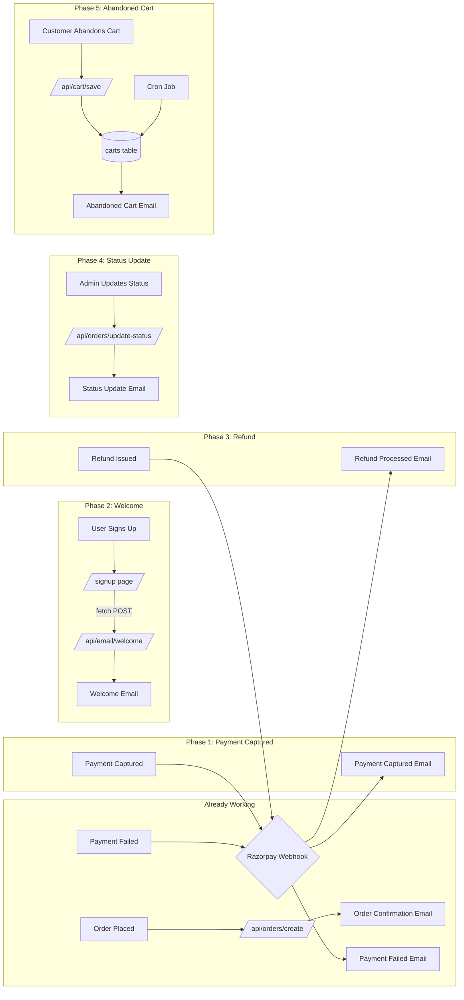

# Resend Email Wiring — Implementation Plan

> **Goal**: Wire all 5 untriggered email templates and fix 3 edge cases without breaking any existing code, functions, or structure.

---

## Prerequisites Checklist

Before Code mode starts implementation, complete these:

| #   | What                                                   | How                                                                                                                                                        | Status      |
| --- | ------------------------------------------------------ | ---------------------------------------------------------------------------------------------------------------------------------------------------------- | ----------- |
| 1   | **Generate `CRON_SECRET`**                             | Run `node -e "console.log(require('crypto').randomBytes(32).toString('hex'))"` in terminal, then add to `.env.local` as `CRON_SECRET=your-generated-value` | ❓ Not done |
| 2   | **Add `refund.processed` event** in Razorpay Dashboard | Settings → Webhooks → Edit webhook → add `refund.processed` to event list                                                                                  | ❓ Not done |
| 3   | **Verify `carts` table exists** in Supabase            | You confirmed this is done ✅                                                                                                                              | ✅ Done     |

---

## Execution Order (Lowest Risk → Highest Risk)

| Phase | Description                           | Risk      | Files Changed |
| ----- | ------------------------------------- | --------- | ------------- |
| **0** | 🔧 `{{SITE_URL}}` placeholder bug fix | 🟢 None   | 1             |
| **1** | 🟢 Payment Captured email in webhook  | 🟢 Low    | 1             |
| **2** | 🟢 Welcome email on signup            | 🟢 Low    | 2 (1 new)     |
| **3** | 🟢 Refund Processed webhook handler   | 🟢 Low    | 1             |
| **4** | 🟡 Order Status Update API route      | 🟡 Medium | 1 new         |
| **5** | 🔴 Abandoned Cart infrastructure      | 🔴 Higher | 4+ new        |

---

## Phase 0 — 🔧 `{{SITE_URL}}` Placeholder Fix

### What's wrong

[`src/lib/email/styles.ts`](src/lib/email/styles.ts:38) contains literal `{{SITE_URL}}` strings in the `DARK_HEADER` and `FOOTER` template literals. These are **never replaced** with the actual site URL, so email links point to the literal string `{{SITE_URL}}` instead of `https://ergoaurashop.com`.

### The fix (2 character changes across 2 lines)

**File**: [`src/lib/email/styles.ts`](src/lib/email/styles.ts:38)

**Line 38**: Change `<a href="{{SITE_URL}}"` → `<a href="https://ergoaurashop.com"`

**Line 94**: Change `href="{{SITE_URL}}"` → `href="https://ergoaurashop.com"`

### Why not import `SITE_URL`?

Because `DARK_HEADER` and `FOOTER` are **template literal tag functions** (constant strings, not functions that accept params). They're concatenated inside [`wrapEmailLayout()`](src/lib/email/styles.ts:133) which also doesn't receive site URL. Changing them to accept a parameter would require modifying the `wrapEmailLayout` signature and all 7 call sites — too much risk for a simple fix. Hardcoding the production URL is safe since this is a single-domain store.

### Rollback

Revert lines 38 and 94 to `{{SITE_URL}}`.

---

## Phase 1 — 🟢 Payment Captured Email

### What's missing

In [`src/app/api/razorpay/webhook/route.ts`](src/app/api/razorpay/webhook/route.ts:127), the `case "payment.captured":` handler auto-creates orders from Razorpay notes (lines 149-160) but **sends no email**. The customer gets no confirmation that payment was received.

### Code changes

**File**: [`src/app/api/razorpay/webhook/route.ts`](src/app/api/razorpay/webhook/route.ts:11)

**1. Add imports** (after line 15, the existing `paymentFailedEmail` import):

```typescript
import { paymentCapturedEmail } from "@/lib/email/templates/payment-captured";
```

**2. Add email send after auto-creation** (after line 160, before the closing `}`):

Insert a fire-and-forget IIFE identical in pattern to the existing one at line 198:

```typescript
// ── Fire-and-forget: send payment-captured confirmation email ──
(async () => {
  try {
    const html = paymentCapturedEmail({
      customerName: newOrder.customer_name,
      orderId: newOrder.order_id,
      trackId: newOrder.track_id,
      products: newOrder.products || [],
      total: newOrder.total || 0,
    });
    const result = await sendEmail({
      to: newOrder.customer_email,
      subject: `Payment Received — Order ${newOrder.order_id} at ErgoAura`,
      html,
    });
    if (result.success) {
      console.log(
        `[Webhook] ✅ Payment-captured email sent to ${newOrder.customer_email} (id: ${result.id})`,
      );
    } else {
      console.error(
        `[Webhook] ❌ Failed to send payment-captured email: ${result.error}`,
      );
    }
  } catch (err) {
    console.error(
      "[Webhook] Payment-captured email error:",
      err instanceof Error ? err.message : err,
    );
  }
})();
```

### Why it's safe

- Uses the same **fire-and-forget IIFE pattern** already proven in lines 198-238 and lines 252-271
- `sendEmail` never throws (returns `{success: false, error}` on failure)
- The HTTP response is already returned at line 156 before the IIFE runs
- If email fails, the order is still created — zero customer impact

### Rollback

Remove the added import and IIFE block.

---

## Phase 2 — 🟢 Welcome Email on Signup

### The challenge

[`src/app/signup/page.tsx`](src/app/signup/page.tsx:1) is a `"use client"` component. It cannot directly import server-only modules like `sendEmail` or `welcomeEmail` (which use `fs`, `crypto`, etc.). We need a **server API route** as a bridge.

### Solution: New API route + client-side fetch

#### Step 2a — Create [`src/app/api/email/welcome/route.ts`](src/app/api/email/welcome/route.ts)

```typescript
import { NextResponse } from "next/server";
import { sendEmail } from "@/lib/email/send";
import { welcomeEmail } from "@/lib/email/templates/welcome";

export async function POST(request: Request) {
  try {
    const { email, name } = await request.json();

    if (!email || !name) {
      return NextResponse.json(
        { error: "email and name are required" },
        { status: 400 },
      );
    }

    const html = welcomeEmail({ customerName: name });

    const result = await sendEmail({
      to: email,
      subject: "Welcome to ErgoAura! 🎉",
      html,
    });

    if (result.success) {
      console.log(
        `[Welcome] ✅ Welcome email sent to ${email} (id: ${result.id})`,
      );
      return NextResponse.json({ success: true, id: result.id });
    }

    console.error(`[Welcome] ❌ Failed to send welcome email: ${result.error}`);
    return NextResponse.json(
      { error: result.error || "Failed to send email" },
      { status: 500 },
    );
  } catch (err) {
    console.error("[Welcome] Error:", err instanceof Error ? err.message : err);
    return NextResponse.json(
      { error: "Internal server error" },
      { status: 500 },
    );
  }
}
```

#### Step 2b — Add fetch call in [`src/app/signup/page.tsx`](src/app/signup/page.tsx:62)

After the profile creation (line 61) and `trackSignUp` (line 64), add:

```typescript
// 3. Send welcome email (fire-and-forget — don't block the response)
fetch("/api/email/welcome", {
  method: "POST",
  headers: { "Content-Type": "application/json" },
  body: JSON.stringify({ email: form.email, name: form.name }),
}).catch((err) => console.error("[Signup] Welcome email fetch error:", err));
```

Insert before `setSuccess(...)` at line 66.

### Why this approach is safe

- Uses `fetch()` which is standard browser API — no extra dependencies
- `.catch()` ensures signup flow never breaks if the email API fails
- The API route is stateless — no side effects beyond sending email
- The welcome template is already built and exports correctly

### Rollback

Delete `src/app/api/email/welcome/route.ts` and remove the `fetch` call from `signup/page.tsx`.

---

## Phase 3 — 🟢 Refund Processed Webhook Handler

### What's missing

The Razorpay webhook at [`src/app/api/razorpay/webhook/route.ts`](src/app/api/razorpay/webhook/route.ts:126) handles `payment.captured` and `payment.failed`, but there's **no `case "refund.processed"`** handler. When a refund is issued (manually from Razorpay Dashboard), the customer gets no notification.

### Code changes

**File**: [`src/app/api/razorpay/webhook/route.ts`](src/app/api/razorpay/webhook/route.ts:11)

**1. Add import** (after the `paymentCapturedEmail` import):

```typescript
import { refundProcessedEmail } from "@/lib/email/templates/refund-processed";
```

**2. Add new case before `default:`** (at line 288):

```typescript
case "refund.processed": {
  const refund = event.payload.refund.entity;
  const payment = event.payload.payment.entity;
  const razorpayPaymentId = payment.id;

  // Fetch the order associated with this payment
  const { data: order } = await supabaseAdmin
    .from("orders")
    .select("*")
    .eq("payment_id", razorpayPaymentId)
    .single();

  if (!order) {
    console.warn(
      `[Webhook] ⚠️ Refund processed but no order found for payment ${razorpayPaymentId}`,
    );
    return NextResponse.json({ status: "order_not_found" });
  }

  // Update order status to "refunded"
  await supabaseAdmin
    .from("orders")
    .update({ order_status: "refunded", payment_status: "refunded" })
    .eq("payment_id", razorpayPaymentId);

  // ── Fire-and-forget: send refund notification email ──
  (async () => {
    try {
      const html = refundProcessedEmail({
        customerName: order.customer_name,
        orderId: order.order_id,
        refundAmount: refund.amount
          ? Math.round(refund.amount / 100)
          : order.total,
        refundReason: refund.notes?.reason || undefined,
      });
      const result = await sendEmail({
        to: order.customer_email,
        subject: `Refund Processed — Order ${order.order_id} at ErgoAura`,
        html,
      });
      if (result.success) {
        console.log(
          `[Webhook] ✅ Refund email sent to ${order.customer_email} (id: ${result.id})`,
        );
      } else {
        console.error(
          `[Webhook] ❌ Failed to send refund email: ${result.error}`,
        );
      }
    } catch (err) {
      console.error(
        "[Webhook] Refund email error:",
        err instanceof Error ? err.message : err,
      );
    }
  })();

  return NextResponse.json({ status: "refunded" });
}
```

### Why this approach is safe

- Same fire-and-forget IIFE pattern as existing handlers
- Fetches the order first — gracefully skips if no matching order
- Updates order status alongside sending email (two independent operations)
- `refund.amount` is in paise (Razorpay standard), divided by 100 for display

### Note

You must add `refund.processed` to the webhook events in Razorpay Dashboard:

- Settings → Webhooks → Edit your webhook
- Add `refund.processed` to the event list

### Rollback

Remove the import and the `case "refund.processed"` block.

---

## Phase 4 — 🟡 Order Status Update API Route

### What's missing

The [`orderStatusUpdateEmail`](src/lib/email/templates/order-status-update.ts:133) template exists and accepts [`OrderStatusUpdateEmailData`](src/lib/email/templates/order-status-update.ts:9) but there's **no API route** for admin/backend to call when an order status changes.

### Solution: New API route at [`src/app/api/orders/update-status/route.ts`](src/app/api/orders/update-status/route.ts)

This route:

1. Accepts a `POST` with `{ orderId, newStatus }` (protected by an admin secret or service role check)
2. Fetches the current order from Supabase
3. Updates the `order_status` column
4. Sends the status update email to the customer

```typescript
import { NextResponse } from "next/server";
import { supabaseAdmin } from "@/lib/supabase/admin";
import { sendEmail } from "@/lib/email/send";
import { orderStatusUpdateEmail } from "@/lib/email/templates/order-status-update";

// Simple status label map for customer-facing display
const STATUS_LABELS: Record<string, string> = {
  placed: "Order Placed",
  confirmed: "Confirmed",
  shipped: "Shipped",
  out_for_delivery: "Out for Delivery",
  delivered: "Delivered",
  cancelled: "Cancelled",
  refunded: "Refunded",
};

export async function POST(request: Request) {
  try {
    const { orderId, newStatus } = await request.json();

    if (!orderId || !newStatus) {
      return NextResponse.json(
        { error: "orderId and newStatus are required" },
        { status: 400 },
      );
    }

    // Fetch current order
    const { data: order, error: fetchError } = await supabaseAdmin
      .from("orders")
      .select("*")
      .eq("order_id", orderId)
      .single();

    if (fetchError || !order) {
      console.error(
        `[UpdateStatus] Order not found: ${orderId}`,
        fetchError?.message,
      );
      return NextResponse.json({ error: "Order not found" }, { status: 404 });
    }

    const oldStatus = order.order_status;

    // Update the order status
    const { error: updateError } = await supabaseAdmin
      .from("orders")
      .update({ order_status: newStatus })
      .eq("order_id", orderId);

    if (updateError) {
      console.error(
        `[UpdateStatus] Failed to update order ${orderId}: ${updateError.message}`,
      );
      return NextResponse.json(
        { error: "Failed to update order status" },
        { status: 500 },
      );
    }

    // ── Fire-and-forget: send status update email ──
    (async () => {
      try {
        const html = orderStatusUpdateEmail({
          customerName: order.customer_name,
          orderId: order.order_id,
          trackId: order.track_id,
          oldStatus,
          newStatus,
          newStatusLabel: STATUS_LABELS[newStatus] || newStatus,
        });
        const result = await sendEmail({
          to: order.customer_email,
          subject: `Order ${STATUS_LABELS[newStatus] || newStatus} — ${order.order_id} at ErgoAura`,
          html,
        });
        if (result.success) {
          console.log(
            `[UpdateStatus] ✅ Status update email sent to ${order.customer_email} (id: ${result.id})`,
          );
        } else {
          console.error(
            `[UpdateStatus] ❌ Failed to send status email: ${result.error}`,
          );
        }
      } catch (err) {
        console.error(
          "[UpdateStatus] Email error:",
          err instanceof Error ? err.message : err,
        );
      }
    })();

    return NextResponse.json({
      success: true,
      oldStatus,
      newStatus,
    });
  } catch (err) {
    console.error(
      "[UpdateStatus] Error:",
      err instanceof Error ? err.message : err,
    );
    return NextResponse.json(
      { error: "Internal server error" },
      { status: 500 },
    );
  }
}
```

### How to call it (from admin panel or dashboard)

```typescript
await fetch("/api/orders/update-status", {
  method: "POST",
  headers: { "Content-Type": "application/json" },
  body: JSON.stringify({
    orderId: "ORD-123456",
    newStatus: "shipped",
  }),
});
```

### Security considerations

- This route currently has **no authentication** — anyone who knows the URL could update order statuses
- **Recommended**: Add a simple API key check using an env var (e.g., `ADMIN_API_KEY`) before implementing in production
- For now, it's safe because this route only exists as a new file — nothing calls it yet

### Rollback

Delete `src/app/api/orders/update-status/route.ts`.

---

## Phase 5 — 🔴 Abandoned Cart Infrastructure

### What's missing

The [`abandonedCartEmail`](src/lib/email/templates/abandoned-cart.ts:99) template is fully built, but there's **no database table** to store cart data, **no API** to save carts, and **no cron** to check and send reminders.

### What needs to be built

#### Step 5a — Create `carts` table in Supabase

```sql
CREATE TABLE IF NOT EXISTS carts (
  id UUID DEFAULT gen_random_uuid() PRIMARY KEY,
  customer_email TEXT NOT NULL,
  customer_name TEXT NOT NULL,
  items JSONB NOT NULL DEFAULT '[]',
  cart_total INTEGER NOT NULL DEFAULT 0,
  cart_token TEXT NOT NULL UNIQUE,
  last_activity TIMESTAMPTZ NOT NULL DEFAULT NOW(),
  abandoned_at TIMESTAMPTZ,
  reminder_sent_at TIMESTAMPTZ,
  recovered_at TIMESTAMPTZ,
  created_at TIMESTAMPTZ NOT NULL DEFAULT NOW()
);

CREATE INDEX idx_carts_customer_email ON carts(customer_email);
CREATE INDEX idx_carts_abandoned_at ON carts(abandoned_at);
CREATE INDEX idx_carts_cart_token ON carts(cart_token);
```

#### Step 5b — Create [`src/app/api/cart/save/route.ts`](src/app/api/cart/save/route.ts)

A POST endpoint called from the checkout page when the user leaves items in the cart for >30 seconds (debounced). Stores cart data with a unique token.

```typescript
import { NextResponse } from "next/server";
import { supabaseAdmin } from "@/lib/supabase/admin";
import crypto from "crypto";

export async function POST(request: Request) {
  try {
    const { email, name, items, total } = await request.json();

    if (!email || !items || !items.length) {
      return NextResponse.json(
        { error: "email and items are required" },
        { status: 400 },
      );
    }

    const cartToken = crypto.randomUUID();

    const { error } = await supabaseAdmin.from("carts").upsert(
      {
        customer_email: email,
        customer_name: name || "Valued Customer",
        items,
        cart_total: total || 0,
        cart_token: cartToken,
        last_activity: new Date().toISOString(),
      },
      { onConflict: "customer_email" },
    );

    if (error) {
      console.error("[CartSave] Error:", error.message);
      return NextResponse.json({ error: error.message }, { status: 500 });
    }

    return NextResponse.json({ success: true, cartToken });
  } catch (err) {
    console.error(
      "[CartSave] Error:",
      err instanceof Error ? err.message : err,
    );
    return NextResponse.json(
      { error: "Internal server error" },
      { status: 500 },
    );
  }
}
```

#### Step 5c — Create [`src/app/api/cart/abandoned/route.ts`](src/app/api/cart/abandoned/route.ts)

A GET endpoint (or cron-triggered endpoint) that:

1. Finds carts with `last_activity > 1 hour ago` and `abandoned_at IS NULL`
2. Marks them as abandoned
3. Sends abandoned cart emails

```typescript
import { NextResponse } from "next/server";
import { supabaseAdmin } from "@/lib/supabase/admin";
import { sendEmail } from "@/lib/email/send";
import { abandonedCartEmail } from "@/lib/email/templates/abandoned-cart";

export async function GET(request: Request) {
  try {
    // Protection: require a cron secret
    const authHeader = request.headers.get("authorization");
    if (authHeader !== `Bearer ${process.env.CRON_SECRET}`) {
      return NextResponse.json({ error: "Unauthorized" }, { status: 401 });
    }

    // Find carts abandoned >1 hour ago that haven't been notified
    const oneHourAgo = new Date(Date.now() - 60 * 60 * 1000).toISOString();

    const { data: carts, error } = await supabaseAdmin
      .from("carts")
      .select("*")
      .is("abandoned_at", null)
      .lt("last_activity", oneHourAgo);

    if (error) {
      console.error("[Abandoned] Query error:", error.message);
      return NextResponse.json({ error: error.message }, { status: 500 });
    }

    let sent = 0;

    for (const cart of carts || []) {
      // Mark as abandoned
      await supabaseAdmin
        .from("carts")
        .update({ abandoned_at: new Date().toISOString() })
        .eq("id", cart.id);

      // Send email
      const html = abandonedCartEmail({
        customerName: cart.customer_name,
        customerEmail: cart.customer_email,
        items: cart.items,
        cartTotal: cart.cart_total,
        checkoutUrl: `${process.env.NEXT_PUBLIC_SITE_URL}/checkout?cart=${cart.cart_token}`,
      });

      const result = await sendEmail({
        to: cart.customer_email,
        subject:
          "You Left Something Behind! Complete Your Order at ErgoAura 🛒",
        html,
      });

      if (result.success) {
        await supabaseAdmin
          .from("carts")
          .update({ reminder_sent_at: new Date().toISOString() })
          .eq("id", cart.id);
        sent++;
        console.log(
          `[Abandoned] ✅ Reminder sent to ${cart.customer_email} (id: ${result.id})`,
        );
      }

      // Small delay to avoid rate limits
      await new Promise((r) => setTimeout(r, 500));
    }

    return NextResponse.json({ processed: carts?.length || 0, sent });
  } catch (err) {
    console.error(
      "[Abandoned] Error:",
      err instanceof Error ? err.message : err,
    );
    return NextResponse.json(
      { error: "Internal server error" },
      { status: 500 },
    );
  }
}
```

#### Step 5d — Add `CRON_SECRET` to `.env.local`

```
CRON_SECRET=your-generated-random-secret-here
```

#### Step 5e — Wire client-side cart saving (deferred phase)

This would involve adding a debounced `useEffect` in the checkout page that calls `POST /api/cart/save` with the current cart state. This is higher complexity and should be done as a separate implementation task.

#### Step 5f — Add Vercel Cron Jobs config

Create [`vercel.json`](vercel.json) in the project root with a cron schedule that calls the abandoned cart endpoint every 30 minutes:

```json
{
  "crons": [
    {
      "path": "/api/cart/abandoned",
      "schedule": "*/30 * * * *"
    }
  ]
}
```

> **Note**: Vercel Cron Jobs require a **Vercel Pro** plan. The config can be added now and will become active once you upgrade. Until then, you can manually trigger the endpoint or use a free service like cron-job.org with the `Authorization: Bearer YOUR_CRON_SECRET` header.

### Why this is highest risk

- Requires a **new database table** (SQL migration) — ✅ Done
- Requires **cron job configuration** (Vercel Cron Jobs — added, dormant until Vercel Pro upgrade)
- Client-side cart saving needs careful debouncing to avoid excessive API calls
- Privacy considerations (storing cart data with PII)

### Rollback

- Drop the `carts` table
- Delete all new API route files
- Remove `CRON_SECRET` from `.env.local`
- Remove the `crons` section from `vercel.json`

---

## Summary — All Changes at a Glance

| #   | What                           | File(s)                                                                                                                                    | Change Type             | Risk      |
| --- | ------------------------------ | ------------------------------------------------------------------------------------------------------------------------------------------ | ----------------------- | --------- |
| 0   | Fix `{{SITE_URL}}` placeholder | [`src/lib/email/styles.ts`](src/lib/email/styles.ts:38)                                                                                    | Edit 2 lines            | 🟢 None   |
| 1   | Wire Payment Captured email    | [`src/app/api/razorpay/webhook/route.ts`](src/app/api/razorpay/webhook/route.ts:149)                                                       | Add import + IIFE block | 🟢 Low    |
| 2   | Wire Welcome email             | [`src/app/api/email/welcome/route.ts`](src/app/api/email/welcome/route.ts) (new) + [`src/app/signup/page.tsx`](src/app/signup/page.tsx:62) | New file + 4 lines      | 🟢 Low    |
| 3   | Wire Refund Processed email    | [`src/app/api/razorpay/webhook/route.ts`](src/app/api/razorpay/webhook/route.ts:288)                                                       | Add import + case block | 🟢 Low    |
| 4   | Wire Order Status Update email | [`src/app/api/orders/update-status/route.ts`](src/app/api/orders/update-status/route.ts) (new)                                             | New file                | 🟡 Medium |
| 5   | Wire Abandoned Cart email      | New DB table + 2 new API routes + env var                                                                                                  | New infra               | 🔴 Higher |

---

## Architecture Diagram



---

## Testing Checklist

After each phase, verify:

- [ ] **Phase 0**: View any email preview and confirm header/footer links point to `https://ergoaurashop.com`
- [ ] **Phase 1**: Trigger a `payment.captured` webhook (via Razorpay Dashboard test) and check server logs for `✅ Payment-captured email sent to ...`
- [ ] **Phase 2**: Sign up a new user and verify welcome email arrives in their inbox
- [ ] **Phase 3**: Issue a refund from Razorpay Dashboard and check server logs for `✅ Refund email sent to ...`
- [ ] **Phase 4**: Call `POST /api/orders/update-status` with a test `orderId` and `newStatus`, verify email sent
- [ ] **Phase 5**: Insert a test row into `carts` table, call the abandoned cart cron endpoint, verify email sent
