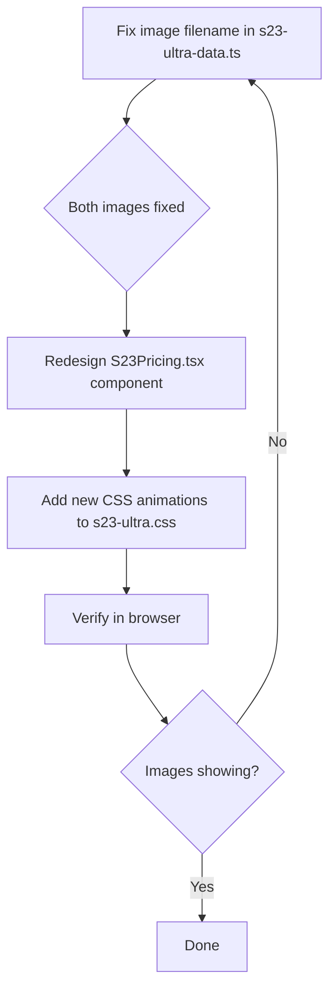

# S23 Ultra — Limited Time Offer Redesign & Image Fix Plan

## 1. Root Cause Analysis: Broken Images

### Problem Statement

Two full-width break images are broken on the S23 Ultra product page:

1. Below the **"S Pen Included"** feature row (in [`S23Features.tsx`](src/components/products/s23/S23Features.tsx:213))
2. Below the **"10MP Periscope"** camera highlight (in [`S23CameraSection.tsx`](src/components/products/s23/S23CameraSection.tsx:167))

### Root Cause Identified

**Filename mismatch between code and actual file on disk:**

| Source                                                                          | Filename                                    |
| ------------------------------------------------------------------------------- | ------------------------------------------- |
| [`S23_PRODUCT_IMAGES[10]`](src/lib/s23-ultra-data.ts:38) (what code references) | `galaxy-s23-ultra-detail-press.jpg`         |
| Actual file on disk (in `public/images/products/Part-2/...`)                    | `samsung-galaxy-s23-ultra-detail-press.jpg` |

The code references `"galaxy-s23-ultra-detail-press.jpg"` in the [`S23_PRODUCT_IMAGES`](src/lib/s23-ultra-data.ts:27) array (line 38), but the actual image file on disk is named **`samsung-galaxy-s23-ultra-detail-press.jpg`** (with the `samsung-` prefix).

Both [`S23Features.tsx`](src/components/products/s23/S23Features.tsx:142) and [`S23CameraSection.tsx`](src/components/products/s23/S23CameraSection.tsx:102) use:

```typescript
const breakImage =
  S23_PRODUCT_IMAGES.find((img) => img.includes("detail-press")) ||
  S23_PRODUCT_IMAGES[10];
```

This resolves to `"galaxy-s23-ultra-detail-press.jpg"` (index 10), which doesn't exist on disk → **404 / broken image**.

### Fix

**One-line fix** in [`src/lib/s23-ultra-data.ts`](src/lib/s23-ultra-data.ts:38):

- Change line 38 from: `"galaxy-s23-ultra-detail-press.jpg"`
- To: `"samsung-galaxy-s23-ultra-detail-press.jpg"`

This single fix will resolve **both** broken images simultaneously since both components reference the same array.

---

## 2. Limited Time Offer Section — Complete Redesign

### Current State

The "Limited Time Offer" section is located in [`src/components/products/s23/S23Pricing.tsx`](src/components/products/s23/S23Pricing.tsx:46). Currently it's a dark-themed section with:

- A simple label "Limited Time Offer" (line 55)
- Plain title text (line 56)
- Basic price display (lines 63-73)
- A countdown timer (lines 78-99)
- A green gradient CTA button (lines 102-124)
- Stock indicator bar (lines 127-139)
- Trust badges (lines 142-195)

### Target Design — "Eye-Catching Premium Deal Section"

#### 2.1 Background: Animated Gradient

Replace the current solid dark background (`var(--s23-bg-secondary)`) with a rich animated gradient that shifts between deep premium colors.

```css
/* New animated gradient background for the Limited Time Offer section */
.s23-pricing-section {
  background: linear-gradient(
    135deg,
    #0a0a0a 0%,
    #1a0a2e 25%,
    #2d1b4e 50%,
    #1a0a2e 75%,
    #0a0a0a 100%
  );
  background-size: 400% 400%;
  animation: s23-pricing-bg-shift 8s ease infinite;
  position: relative;
  overflow: hidden;
}

@keyframes s23-pricing-bg-shift {
  0% {
    background-position: 0% 50%;
  }
  50% {
    background-position: 100% 50%;
  }
  100% {
    background-position: 0% 50%;
  }
}
```

Add subtle floating particle/orb overlays using CSS pseudo-elements:

- Semi-transparent glowing circles that float upward slowly
- Creates a "premium night sky" ambiance

#### 2.2 "Limited Time Offer" Label — Glowing Text Effect

Replace the plain `.s23-section-label` with a custom animated label:

- **Gradient text** with gold/amber colors
- **Text glow/shadow animation** — pulsing neon effect
- **Decorative borders** on left and right sides (thin gold lines with diamond endpoints)
- **Shimmer animation** scanning across the text

```css
.s23-pricing-label {
  display: inline-flex;
  align-items: center;
  gap: 1rem;
  font-size: 0.85rem;
  font-weight: 800;
  text-transform: uppercase;
  letter-spacing: 0.15em;
  background: linear-gradient(90deg, #ffd700, #ff8c00, #ffd700);
  background-size: 200% 100%;
  -webkit-background-clip: text;
  -webkit-text-fill-color: transparent;
  background-clip: text;
  animation: s23-label-shimmer 2s ease infinite;
  position: relative;
}

.s23-pricing-label::before,
.s23-pricing-label::after {
  content: "◇";
  color: #ffd700;
  -webkit-text-fill-color: initial;
  font-size: 0.6rem;
}

@keyframes s23-label-shimmer {
  0% {
    background-position: -200% center;
  }
  100% {
    background-position: 200% center;
  }
}
```

#### 2.3 Section Title — Animated Word-by-Word

The title "Grab Yours Before It's Gone" gets visual treatment:

- Each word fades in sequentially using framer-motion
- Key words ("Yours", "Gone") get highlighted with gradient text
- Subtle floating animation (drift up and down slowly) on the entire title
- Text shadow glow that pulses

#### 2.4 Price Display — Enhanced with Effects

Current price block becomes visually dynamic:

- **Original price** (`₹1,24,999`): Larger strikethrough with red tint, subtle shake animation
- **Current price** (`₹14,990`): Ultra-bold, large font (3rem+), with a golden gradient text, pulsing neon text-shadow
- **88% OFF badge**: Larger, animated with expanding/contracting ring effect, golden glow
- **"You save ₹1,10,009!"**: Green highlight with a counting-up animation on scroll-into-view

#### 2.5 Countdown Timer — More Dramatic

Enhanced urgency timer:

- Each time unit (hours, minutes, seconds) in individual styled boxes/cards
- Flip-card style animation when digits change
- Glowing amber/red border pulse when under 1 hour
- Subtle "tick" scale animation on each digit change
- Label "OFFER ENDS IN:" with animated underline

#### 2.6 CTA Button — "Buy Now" with Ripple Effect

Enhanced button:

- Background: Animated gradient (deep purple → gold → deep purple)
- Larger size with rounded corners
- Ripple effect on hover/click (framer-motion `whileHover` scale + CSS ripple)
- Pulsing shadow glow (golden)
- Shopping cart icon with subtle bounce animation
- Text: "Buy Now — ₹14,990" with the price in a slightly different shade

#### 2.7 Stock Indicator — Progress Bar with Pulse

- The stock bar gets an animated gradient fill
- Pulsing glow on the fill
- "Only 15 left in stock" with emphasis on the number (bouncy animation on mount)
- "Selling fast" text with animated dots (...)

#### 2.8 Confetti / Sparkle Effect on Section Entry

When the section scrolls into view, trigger a subtle confetti or sparkle burst:

- Use framer-motion to animate small golden dots rising from the bottom
- Creates a "celebration/deal" atmosphere
- Keep it subtle — not distracting

#### 2.9 Trust Badges — Enhanced with Icons

The existing trust badges at the bottom get animated treatment:

- Each badge fades in with a stagger delay
- SVG icons with subtle color animation
- "Secure Checkout" with shield icon that has a subtle glow

---

## 3. Modification Scope

### Files to Modify

| File                                                                                       | Action              | Description                                                                                          |
| ------------------------------------------------------------------------------------------ | ------------------- | ---------------------------------------------------------------------------------------------------- |
| [`src/lib/s23-ultra-data.ts`](src/lib/s23-ultra-data.ts:38)                                | **MODIFY (1 line)** | Fix filename from `galaxy-s23-ultra-detail-press.jpg` to `samsung-galaxy-s23-ultra-detail-press.jpg` |
| [`src/components/products/s23/S23Pricing.tsx`](src/components/products/s23/S23Pricing.tsx) | **MODIFY**          | Complete visual redesign of the Limited Time Offer section                                           |
| [`src/styles/s23-ultra.css`](src/styles/s23-ultra.css)                                     | **MODIFY**          | Add new CSS classes for pricing section animations, gradients, effects                               |

### Files NOT Modified (as requested)

- No changes to any other section components (`S23Hero`, `S23Features`, `S23CameraSection`, `S23Story`, `S23Reviews`, `S23FAQ`, `S23Specs`, `S23DealBanner`, `S23FullWidthImage`, `S23VideoSection`, `S23StickyCTA`)
- No changes to `globals.css`, `layout.tsx`, or any page-level files
- No changes to the overall page structure or other product pages

---

## 4. Implementation Order



### Step 1: Fix Broken Images

1. Open [`src/lib/s23-ultra-data.ts`](src/lib/s23-ultra-data.ts:38)
2. Change `"galaxy-s23-ultra-detail-press.jpg"` → `"samsung-galaxy-s23-ultra-detail-press.jpg"`
3. Verify both images render correctly in the browser

### Step 2: Add CSS Animations

1. Open [`src/styles/s23-ultra.css`](src/styles/s23-ultra.css)
2. Add new animation keyframes and classes for:
   - `s23-pricing-bg-shift` — background gradient animation
   - `s23-pricing-label` — shimmer label with decorative elements
   - `s23-pricing-title-word` — per-word highlight
   - `s23-price-flash` — price glow pulse
   - `s23-timer-flip` — timer digit animation
   - `s23-stock-pulse` — stock bar glow
   - `s23-sparkle` — confetti particles
   - Orb/pseudo-element overlays

### Step 3: Redesign S23Pricing Component

1. Open [`src/components/products/s23/S23Pricing.tsx`](src/components/products/s23/S23Pricing.tsx)
2. Replace the entire section wrapper with animated gradient
3. Add motion effects to each sub-element using framer-motion
4. Enhance the label, title, price, timer, button, and stock indicator

---

## 5. Detailed Component Changes — S23Pricing.tsx

### Current Structure (lines 46-199)

```
section.s23-section.s23-section-dark#s23-pricing
  div.s23-section-container
    motion.div (fade-in wrapper)
      span.s23-section-label "Limited Time Offer"
      h2.s23-section-title "Grab Yours Before It's Gone"
      p.s23-section-subtitle (stock remaining text)

      div.price-display
        span.s23-price-original (original price)
        span.s23-price-current (current price)
        span.s23-price-badge (88% OFF)

      p.s23-savings "You save..."

      div.s23-urgency-timer (countdown)

      button.s23-btn-primary "Buy Now"

      div.stock-indicator
        div.s23-stock-bar > div.s23-stock-fill

      div.trust-badges
```

### New Structure Design

```
section.s23-pricing-section#s23-pricing (new animated gradient bg + orbs)
  div.s23-section-container
    motion.div (stagger children)

      // Animated "Limited Time Offer" label with decorative diamonds
      span.s23-pricing-label "◇ Limited Time Offer ◇"

      // Word-by-word animated title
      h2.s23-pricing-title
        motion.span "Grab"
        motion.span "Yours" (highlighted)
        motion.span "Before"
        motion.span "It's"
        motion.span "Gone" (highlighted)

      // Enhanced price display
      div.s23-pricing-prices
        span.s23-price-original ₹1,24,999 (shake animation)
        span.s23-price-current ₹14,990 (gradient text + glow)
        span.s23-price-badge "88% OFF" (expanding ring animation)

      // Savings with count-up effect
      p.s23-pricing-savings "You save ₹1,10,009!"

      // Enhanced countdown
      div.s23-pricing-timer
        span "⏰ OFFER ENDS IN:"
        div.s23-timer-units
          div.s23-timer-unit > span (hours) > label "Hours"
          div.s23-timer-unit > span (minutes) > label "Minutes"
          div.s23-timer-unit > span (seconds) > label "Seconds"

      // CTA Button with ripple
      motion.button.s23-pricing-cta
        svg (cart icon, bouncing)
        "Buy Now — ₹14,990"

      // Stock indicator
      div.s23-pricing-stock
        div.stock-text "Only 15 left in stock" (number animated)
        div.s23-stock-bar > div.s23-stock-fill (animated)
        span "Selling fast..."

      // Trust badges (staggered fade-in)
      div.s23-pricing-trust
        span > svg + "Secure Checkout"
        span > svg + "EMI Available"
        span > svg + "Fast Delivery"

      // Sparkle particles (CSS pseudo-elements or framer-motion absolute divs)
      div.s23-pricing-sparkles
        (multiple small golden dots with rise animation)
```

---

## 6. CSS Animation Details for s23-ultra.css

### New animations to add (all scoped under `.s23-page`):

| Animation Name         | Type         | Description                               |
| ---------------------- | ------------ | ----------------------------------------- |
| `s23-pricing-bg-shift` | `@keyframes` | 8s background position cycle for gradient |
| `s23-orb-float`        | `@keyframes` | Slow rising/floating for background orbs  |
| `s23-label-shimmer`    | `@keyframes` | 2s shimmer scan across label text         |
| `s23-price-glow`       | `@keyframes` | Pulsing text-shadow on current price      |
| `s23-timer-flip`       | `@keyframes` | Scale Y flip animation on digit change    |
| `s23-cta-pulse`        | `@keyframes` | Box-shadow pulse on button                |
| `s23-stock-glow`       | `@keyframes` | Width/opacity pulse on stock bar fill     |
| `s23-sparkle-rise`     | `@keyframes` | Small golden dots rising from bottom      |
| `s23-ring-expand`      | `@keyframes` | Expanding ring around discount badge      |

### New CSS classes to add:

| Class                           | Purpose                                        |
| ------------------------------- | ---------------------------------------------- |
| `.s23-pricing-section`          | Animated gradient background container         |
| `.s23-pricing-section::before`  | Orb 1 (large, slow)                            |
| `.s23-pricing-section::after`   | Orb 2 (small, faster)                          |
| `.s23-pricing-label`            | Shimmering gradient label with diamond borders |
| `.s23-pricing-title`            | Title with highlight spans                     |
| `.s23-pricing-title .highlight` | Gradient text on key words                     |
| `.s23-pricing-prices`           | Price flex container                           |
| `.s23-price-current .glow`      | Pulsing glow on current price                  |
| `.s23-price-badge .ring`        | Expanding ring pseudo-element                  |
| `.s23-pricing-timer`            | Timer container                                |
| `.s23-timer-unit`               | Individual digit card                          |
| `.s23-timer-unit span`          | Digit with flip animation                      |
| `.s23-pricing-cta`              | Animated gradient button                       |
| `.s23-pricing-stock .count`     | Animated stock number                          |
| `.s23-pricing-sparkles`         | Sparkle particle container                     |

---

## 7. Verification Checklist

- [ ] **Fix applied**: Both images below "S Pen Included" and "10MP Periscope" render correctly
- [ ] **No other images broken**: Verify all other S23 images still display
- [ ] **Pricing section**: Background gradient animates smoothly
- [ ] **Label**: "Limited Time Offer" has shimmer/glow effect
- [ ] **Title**: Words animate in, highlight words are styled
- [ ] **Price**: Current price has gradient text + pulsing glow
- [ ] **88% badge**: Has expanding ring animation
- [ ] **Timer**: Digits animate on change, styled in cards
- [ ] **CTA Button**: Animated gradient, pulse glow, hover scale
- [ ] **Stock bar**: Animated fill with pulse glow
- [ ] **No regressions**: All other sections on the page remain unchanged
- [ ] **Mobile responsive**: Design works on all screen sizes
- [ ] **Performance**: CSS animations use compositor-friendly properties (transform, opacity)
