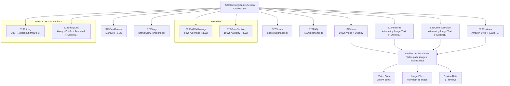

# Samsung Galaxy S23 Ultra Page — Redesign Execution Plan

> **Scope:** Strictly modify ONLY the S23 product page (`/products/samsung-galaxy-s23-ultra`). No changes to any other pages or components outside `src/components/products/s23/` and `src/styles/s23-ultra.css`.

## Requirements Summary (from `plans/updations needed. make a great design.txt`)

| #   | Requirement                                                                                                                   | Current State                                                   | Action                                                     |
| --- | ----------------------------------------------------------------------------------------------------------------------------- | --------------------------------------------------------------- | ---------------------------------------------------------- |
| 1   | Page bg: black-to-green gradient (`hsla(0,0%,0%,1)` → `hsla(158,84%,23%,1)`); DO NOT apply to hero banner                     | Current: `--s23-bg-primary: #0a0a0a`                            | Update CSS custom properties; hero retains its own styling |
| 2   | Hero: 100vh, bg video (MP4), Mega Deal badge, heading, price display, Buy button. Keep marquee. Hero images not showing — fix | Current: 75vh, image slider, no video                           | Full rewrite of hero — video background, 100vh             |
| 3   | After hero: 50vh full-width product image + ad sentence                                                                       | Not present                                                     | Create new section                                         |
| 4   | Key Features: alternating image-left/text-right + text-left/image-right + full-width image                                    | Current: card grid layout                                       | Complete redesign                                          |
| 5   | All "Buy Now" → redirect to `/checkout` immediately                                                                           | Current: scrolls to pricing                                     | Change all CTAs to use `useRouter` → `/checkout`           |
| 6   | Sticky bar: always visible on page load, fixed bottom, animated gradient bg, product image left of price                      | Current: appears only after scroll, static bg, no product image | Rewrite sticky CTA                                         |
| 7   | Camera section: same alternating pattern as Key Features                                                                      | Current: card grid layout                                       | Redesign                                                   |
| 8   | Reviews: Amazon-style design                                                                                                  | Current: custom card design                                     | Redesign                                                   |
| 9   | Scroll/parallax effects throughout                                                                                            | Minimal                                                         | Add scroll-triggered animations + parallax                 |
| 10  | After Key Features: full 100vh autoplay video (no controls)                                                                   | Not present                                                     | Create new video section                                   |

---

## Architecture Overview

```
S23SamsungGalaxySection (orchestrator)
├── S23Hero                — 100vh video hero [REWRITE]
├── S23DealBanner          — marquee [MINOR: remove emojis]
├── S23FullWidthImage      — 50vh product image [NEW]
├── S23Story               — brand story [KEEP]
├── S23Features            — Alternating image/text [REWRITE]
├── S23VideoSection        — 100vh autoplay video [NEW]
├── S23CameraSection       — Alternating image/text [REWRITE]
├── S23Pricing             — pricing + Buy → checkout [MODIFY]
├── S23Specs               — specs [KEEP]
├── S23Reviews             — Amazon-style [REWRITE]
├── S23FAQ                 — FAQ [KEEP]
└── S23StickyCTA           — Always-visible, animated bg, product image [REWRITE]
```

### Files to Modify (S23 page ONLY — strictly)

| File                                                      | Change Type | Description                                                                                                                            |
| --------------------------------------------------------- | ----------- | -------------------------------------------------------------------------------------------------------------------------------------- |
| `src/styles/s23-ultra.css`                                | **MODIFY**  | New bg gradient CSS vars, animated gradient keyframes, Amazon review styles, parallax effects, video section styles, hero 100vh styles |
| `src/components/products/s23/S23Hero.tsx`                 | **REWRITE** | 100vh video background, badge "Mega Deal- Hurry", heading, price display, Buy Now → checkout                                           |
| `src/components/products/s23/S23Features.tsx`             | **REWRITE** | Alternating image-left/feature-right + feature-left/image-right + full-width image between                                             |
| `src/components/products/s23/S23CameraSection.tsx`        | **REWRITE** | Same alternating pattern as features                                                                                                   |
| `src/components/products/s23/S23Reviews.tsx`              | **REWRITE** | Amazon-style: star filter bars, sort, verified badge, avatar, helpful count                                                            |
| `src/components/products/s23/S23StickyCTA.tsx`            | **REWRITE** | Always visible (visible by default), animated gradient bg, product thumbnail on left                                                   |
| `src/components/products/s23/S23Pricing.tsx`              | **MODIFY**  | Buy button → `router.push('/checkout')`                                                                                                |
| `src/components/products/s23/S23DealBanner.tsx`           | **MODIFY**  | Replace emojis with SVG elements                                                                                                       |
| `src/components/products/s23/S23SamsungGalaxySection.tsx` | **MODIFY**  | Add new sections: FullWidthImage, VideoSection; reorder layout; add parallax wrapper                                                   |

### New Files to Create

| File                                                    | Description                                                                 |
| ------------------------------------------------------- | --------------------------------------------------------------------------- |
| `src/components/products/s23/S23FullWidthImage.tsx`     | 50vh section with full-length product image + ad sentence + parallax effect |
| `src/components/products/s23/S23VideoSection.tsx`       | Full 100vh autoplay muted video without controls                            |
| `src/components/products/s23/S23ParallaxBackground.tsx` | Reusable parallax scroll effect wrapper                                     |

---

## Step-by-Step Execution Plan

### Step 1: Update CSS Foundation (`src/styles/s23-ultra.css`)

**Changes:**

1. **New background gradient for `.s23-page`** — replace the existing `--s23-bg-primary` approach with the new gradient:

   ```css
   .s23-page {
     background: hsla(0, 0%, 0%, 1);
     background: linear-gradient(
       90deg,
       hsla(0, 0%, 0%, 1) 13%,
       hsla(158, 84%, 23%, 1) 88%
     );
     background-attachment: fixed;
   }
   ```

   > **IMPORTANT:** Do NOT apply this gradient to `.s23-hero` — hero keeps its own background

2. **Animated gradient keyframes** for sticky CTA:

   ```css
   @keyframes s23-gradient-shift {
     0% {
       background-position: 0% 50%;
     }
     50% {
       background-position: 100% 50%;
     }
     100% {
       background-position: 0% 50%;
     }
   }
   ```

3. **Hero 100vh styles** — update `.s23-hero` from `75vh` to `100vh`, add video background styles

4. **Amazon-style review styles** — new classes for:
   - Rating bar chart (clickable star filters)
   - Review card with avatar, star row, title, text, verified badge, helpful count
   - Sort controls

5. **Feature/Camera alternating layout styles** — new grid/flex classes for image-text alternating pattern

6. **Parallax/scroll effect styles** — perspective, translateZ, opacity fade classes

7. **Full-width image section styles** — 50vh height, overlay text

8. **Video section styles** — 100vh, object-cover video, no controls

9. **Remove emoji-based icons** — replace with SVG equivalents in feature cards, buttons, etc.

### Step 2: Rewrite Hero (`src/components/products/s23/S23Hero.tsx`)

**New requirements:**

- 100vh full-screen
- Background video (MP4) — path: `\images\products\Part-2\Samsung Galaxy S23 Ultra Dual SIM Smartphone 12GB RAM 512GB Storage - Internationa Version\WhatsApp Video 2026-06-14 at 1.59.31 PM.mp4`
- Video muted, autoplay, loop, playsinline
- Overlay gradient for text readability
- Badge: "Mega Deal- Hurry" (SVG icon, not emoji)
- Heading: "Samsung Galaxy S23 Ultra"
- Price display: ₹1,24,999 → ₹14,990, 88% OFF, "You save ₹1,10,009!"
- Buy Button → `router.push('/checkout')`
- Keep the marquee (`S23DealBanner`) below with gradient theme
- Fix "hero banner not showing images" issue (ensure video plays correctly)
- No emojis — use SVGs

**Note:** The existing image-based slider is replaced entirely. The video will be the hero background. If the video fails to load, add a static image fallback.

### Step 3: Create Full-Width Image Section (NEW — `S23FullWidthImage.tsx`)

**Requirements:**

- After hero banner and deal banner
- 50vh display (half viewport height)
- Full-length image from: `D:\ergoaurashop.com\ergoaura-shop\images\products\Part-2\Samsung Galaxy S23 Ultra Dual SIM Smartphone 12GB RAM 512GB Storage - Internationa Version\LFfcQbsfMYnTWFzPZy7sND-750-80.jpg.webp`
- Eye-catching classic ad sentence overlaid on the image
- Subtle parallax scroll effect

### Step 4: Rewrite Key Features (`src/components/products/s23/S23Features.tsx`)

**New layout pattern:**

```
Feature 1: [IMAGE left] [TEXT right]    → image on left, feature text on right
Feature 2: [TEXT left] [IMAGE right]    → feature text on left, image on right
         [FULL-WIDTH IMAGE]             → full width product image between
Feature 3: [IMAGE left] [TEXT right]    → continue alternating
Feature 4: [TEXT left] [IMAGE right]    → continue alternating
```

- Each feature gets an SVG illustration/icon (no emojis)
- Features sourced from `S23_KEY_FEATURES` data
- Smooth scroll-triggered fade-in animations
- Full-width image between features from product images

### Step 5: Create Video Section (NEW — `S23VideoSection.tsx`)

**Requirements:**

- Added **after** the Key Features container (before Camera section)
- Full 100vh height
- Autoplay video without navigation or control buttons
- Video path: `\ergoaura-shop\images\products\Part-2\Samsung Galaxy S23 Ultra Dual SIM Smartphone 12GB RAM 512GB Storage - Internationa Version\WhatsApp Video 2026-06-14 at 1.59.29 PM.mp4`
- Muted, loop, playsinline
- Dark overlay for smooth visual transition
- Optional: subtle text overlay if needed

### Step 6: Rewrite Camera Section (`src/components/products/s23/S23CameraSection.tsx`)

**Same alternating approach as Key Features (Step 4):**

```
Camera Feature 1: [IMAGE left] [TEXT right]
Camera Feature 2: [TEXT left] [IMAGE right]
         [FULL-WIDTH IMAGE / VIDEO]
Camera Feature 3: [IMAGE left] [TEXT right]
```

- Camera highlights data from `S23_CAMERA_CONTENT`
- SVG icons replacing emoji camera icons
- Scroll-triggered animations

### Step 7: Modify Pricing Section — Direct Checkout Redirect (`src/components/products/s23/S23Pricing.tsx`)

**Changes:**

- Import `useRouter` from `next/navigation`
- Replace all `scrollToPricing` / `onClick` with `router.push('/checkout')`
- The Buy button should immediately navigate to `/checkout`
- Keep the pricing display, countdown timer, stock indicator same
- Remove emoji usage — use SVGs

### Step 8: Modify Deal Banner — No Emojis (`src/components/products/s23/S23DealBanner.tsx`)

**Changes:**

- Replace emoji fire icons (🔥) with animated SVG flame/gradient elements
- Keep the marquee scrolling text and gradient background
- Text: "ULTRA MEGA DEAL — 88% OFF — LIMITED STOCK — SAVE ₹1,10,009 — INTERNATIONAL VERSION"

### Step 9: Rewrite Sticky CTA (`src/components/products/s23/S23StickyCTA.tsx`)

**Requirements:**

- **Always visible** from page load — remove the IntersectionObserver that shows/hides it
- Position: `fixed` at bottom (always)
- Animated gradient background — use the same black-to-green gradient with `background-size: 200% 200%` and `animation: s23-gradient-shift 8s ease infinite`
- Product image thumbnail on the **left** of the price (like cart display) — use a small 40x40 image
- Price display: current price + original strikethrough
- "Buy Now" button → `router.push('/checkout')`
- No emojis

### Step 10: Rewrite Reviews — Amazon Style (`src/components/products/s23/S23Reviews.tsx`)

**Amazon-style layout:**

```
┌──────────────────────────────────────────────────┐
│  4.8 out of 5  [clickable star distribution bars] │
│  17 global ratings                                │
├──────────────────────────────────────────────────┤
│ Sort by: [Most Recent ▼]                        │
├──────────────────────────────────────────────────┤
│ ┌──────────────────────────────────────────────┐ │
│ │ [Avatar]  Name       ★★★★★                  │ │
│ │           City · Verified Purchase           │ │
│ │                                              │ │
│ │ Review Title (bold)                         │ │
│ │ "Review text..."                             │ │
│ │                                              │ │
│ │ [👍] Helpful (47)                            │ │
│ └──────────────────────────────────────────────┘ │
│ ... more reviews ...                             │
└──────────────────────────────────────────────────┘
```

**Design specifications (user-requested):**

- **Theme:** White background (`bg-white`) review cards with Black fonts (`text-black` or `#000000`)
- **Stars:** Green color (`#22c55e` or `text-green-500`) instead of yellow — using the site's green accent
- **"Verified Purchase" badge:** Green color, styled as **italic + bold** font
- **Profile/Avatar:** Green themed initials circle (green bg `bg-green-600`, white text `text-white`)
- **Thumbs up icon:** SVG thumbs-up icon next to "X people found this helpful" text
- **Helpful button interaction:** On click, toggle the thumbs-up icon to filled/highlighted state visually. No actual counter increment — just a visual toggle for UI feedback

**Changes:**

- Keep all existing fields: name, city, star rating, title, text, isVerified, helpfulCount
- Redesign layout to match Amazon's review card style exactly
- Review card: White background, black text, subtle border + shadow
- Star rating distribution as clickable filter bars (clickable star numbers)
- Sort by dropdown (Most Recent, Top Rated, Lowest Rated)
- Individual review cards with: green avatar initials, name, city, green star row, bold title, review text, green italic+bold "Verified Purchase" badge, thumbs-up helpful button
- Thumbs up: SVG icon next to helpful count, click toggles highlighted filled state
- Keep the "Show all X reviews" toggle

### Step 11: Add Scroll Effects & Parallax (`S23ParallaxBackground.tsx` + updates to sections)

**New wrapper component:** `S23ParallaxBackground.tsx`

- Uses Framer Motion `useScroll` + `useTransform` for parallax
- Wraps sections that need parallax effect

**Apply to:**

- Hero section (subtle parallax on video)
- Full-width image section
- Key Features section
- Video section
- Camera section

### Step 12: Update Main Orchestrator (`src/components/products/s23/S23SamsungGalaxySection.tsx`)

**New section order:**

```
1. S23Hero (100vh video hero)
2. S23DealBanner (marquee)
3. S23FullWidthImage (50vh ad image — NEW)
4. S23Story (brand story — existing)
5. S23Features (alternating layout — rewritten)
6. S23VideoSection (100vh autoplay video — NEW)
7. S23CameraSection (alternating layout — rewritten)
8. S23Pricing (direct checkout — modified)
9. S23Specs (existing)
10. S23Reviews (Amazon style — rewritten)
11. S23FAQ (existing)
12. S23StickyCTA (always visible — rewritten)
```

- Wrap relevant sections with parallax effect component
- Import new components

### Step 13: Update Data File if Needed (`src/lib/s23-ultra-data.ts`)

- Add any new data constants needed for features/camera sections new images
- Add the full-width image path constant
- Add video paths constants

---

## Mermaid Diagram — New Component Tree & Data Flow



---

## Page Layout Diagram (Vertical Flow)

```
┌──────────────────────────────────────────┐
│  S23STICKYCTA (ALWAYS VISIBLE — FIXED)    │  ← Fixed bottom bar
└──────────────────────────────────────────┘

┌──────────────────────────────────────────┐
│                                          │
│         S23HERO — 100vh Video            │  ← Video background
│                                          │     Badge: "Mega Deal- Hurry"
│     "Samsung Galaxy S23 Ultra"          │     Price: ₹14,990
│                                          │     Buy → /checkout
└──────────────────────────────────────────┘

┌──────────────────────────────────────────┐
│    S23DEALBANNER — Marquee               │  ← Gradient bg, no emojis
└──────────────────────────────────────────┘

┌──────────────────────────────────────────┐
│                                          │
│                                          │  ← 50vh full-length product image
│      S23FULLWIDTHIMAGE                    │     + ad sentence
│                                          │     + parallax effect
│                                          │
└──────────────────────────────────────────┘

┌──────────────────────────────────────────┐
│     S23STORY — Brand Story               │  ← Unchanged
└──────────────────────────────────────────┘

┌──────────────────────────────────────────┐
│  S23FEATURES - Alternating Pattern       │
│  ┌──────┐ ┌──────────────────────────┐  │
│  │ IMG  │ │ Feature 1 Text          │  │  ← Image left, text right
│  └──────┘ └──────────────────────────┘  │
│  ┌──────────────────────────┐ ┌──────┐  │
│  │ Feature 2 Text          │ │ IMG  │  │  ← Text left, image right
│  └──────────────────────────┘ └──────┘  │
│  ┌────────────────────────────────────┐  │
│  │       FULL-WIDTH IMAGE             │  │  ← Full-width break
│  └────────────────────────────────────┘  │
│  ┌──────┐ ┌──────────────────────────┐  │
│  │ IMG  │ │ Feature 3 Text          │  │  ← Alternating continues
│  └──────┘ └──────────────────────────┘  │
└──────────────────────────────────────────┘

┌──────────────────────────────────────────┐
│                                          │
│      S23VIDEOSECTION — 100vh             │  ← Autoplay, no controls
│           Full Screen Video              │     After Key Features
│                                          │
└──────────────────────────────────────────┘

┌──────────────────────────────────────────┐
│  S23CAMERASECTION - Alternating Pattern  │  ← Same as Features
│  [Same alternating layout as features]   │
└──────────────────────────────────────────┘

┌──────────────────────────────────────────┐
│     S23PRICING — Buy → /checkout         │  ← Modified redirect
└──────────────────────────────────────────┘

┌──────────────────────────────────────────┐
│     S23SPECS — Specs Table               │  ← Unchanged
└──────────────────────────────────────────┘

┌──────────────────────────────────────────┐
│     S23REVIEWS — Amazon Style            │
│  ⭐ 4.8 (17)  [||| distribution bars]    │  ← Redesigned
│  Sort: [Most Recent ▼]                  │
│  ┌─ Review Card ──────────────────────┐  │
│  │ [A] Arjun M. · Mumbai · Verified   │  │
│  │ ★★★★★ "Legit product..."           │  │
│  │ Helpful (47)                        │  │
│  └────────────────────────────────────┘  │
└──────────────────────────────────────────┘

┌──────────────────────────────────────────┐
│     S23FAQ — Accordion                   │  ← Unchanged
└──────────────────────────────────────────┘
```

---

## Key Design Decisions

### 1. Background Gradient Strategy

The `hsla(0,0%,0%,1)` → `hsla(158,84%,23%,1)` gradient replaces the existing `--s23-bg-primary: #0a0a0a` solid background. This gradient is applied to `.s23-page` wrapper with `background-attachment: fixed` so it's consistent across the page. The hero section explicitly overrides with its own background to keep the video clean.

### 2. Checkout Redirect Approach

All Buy Now buttons use `useRouter` from `next/navigation` to push to `/checkout`. This is the simplest and most reliable approach. The checkout page already handles product selection from URL params or cart state (verify this). If needed, pass product ID as a query parameter: `/checkout?product=samsung-galaxy-s23-ultra&quantity=1`.

### 3. Sticky Bar Always Visible

Remove the `IntersectionObserver` that currently shows/hides the sticky bar. Set `visible` state to `true` by default. The bar becomes truly `position: fixed` at bottom with `z-index: 1000` so it overlays all content.

### 4. Video Hero Loading Strategy

Use Next.js `<video>` element (not Image) with:

- `muted`, `autoPlay`, `loop`, `playsInline` attributes
- A poster image fallback (first hero image) for when video fails
- `preload="auto"` for fast loading
- The video path is relative from the `public` directory

### 5. Amazon Reviews — Dark Theme Adaptation

Amazon uses a white/light theme. We adapt it to dark theme:

- Card bg: `var(--s23-bg-card)` (#1a1a1a) instead of white
- Border: `var(--s23-border)` instead of light gray
- Text: `var(--s23-text-primary/secondary)` instead of black/gray
- Stars: amber (#f59e0b) — same as Amazon
- Verified badge: green (#22c55e) — same as Amazon

### 6. No Emoji Policy

All emojis in components (🔥, ⚡, ✏️, 📸, 🛒, ✅, ❌, etc.) replaced with inline SVG elements. The feature icon data in `s23-ultra-data.ts` will need SVG strings or we'll render SVGs in the component based on the feature type.

---

## Files Inventory — Strict Scope

### Modified Files (S23 page only)

| File                                                      | Lines Changed                 | Complexity |
| --------------------------------------------------------- | ----------------------------- | ---------- |
| `src/styles/s23-ultra.css`                                | ~150-200 lines added/modified | High       |
| `src/components/products/s23/S23Hero.tsx`                 | Full rewrite (~120 lines)     | High       |
| `src/components/products/s23/S23Features.tsx`             | Full rewrite (~150 lines)     | High       |
| `src/components/products/s23/S23CameraSection.tsx`        | Full rewrite (~120 lines)     | High       |
| `src/components/products/s23/S23Reviews.tsx`              | Full rewrite (~200 lines)     | High       |
| `src/components/products/s23/S23StickyCTA.tsx`            | Full rewrite (~80 lines)      | Medium     |
| `src/components/products/s23/S23Pricing.tsx`              | ~10 lines modified            | Low        |
| `src/components/products/s23/S23DealBanner.tsx`           | ~5 lines modified             | Low        |
| `src/components/products/s23/S23SamsungGalaxySection.tsx` | ~20 lines modified            | Medium     |

### New Files

| File                                                    | Lines     | Complexity |
| ------------------------------------------------------- | --------- | ---------- |
| `src/components/products/s23/S23FullWidthImage.tsx`     | ~60 lines | Low        |
| `src/components/products/s23/S23VideoSection.tsx`       | ~50 lines | Low        |
| `src/components/products/s23/S23ParallaxBackground.tsx` | ~40 lines | Medium     |

### NOT Modified (Preserved as-is)

| File                                                                           | Reason                           |
| ------------------------------------------------------------------------------ | -------------------------------- |
| `src/app/products/[slug]/page.tsx`                                             | Not part of S23 scope            |
| `src/app/products/[slug]/ProductDetailClient.tsx`                              | Not part of S23 scope            |
| `src/lib/s23-ultra-data.ts`                                                    | Only add new constants if needed |
| `src/lib/products-data.ts`                                                     | Not part of S23 scope            |
| `src/lib/reviews-data.ts`                                                      | Not part of S23 scope            |
| `src/lib/utils.ts`                                                             | Not part of S23 scope            |
| `src/components/products/s23/S23Story.tsx`                                     | Kept as-is                       |
| `src/components/products/s23/S23Specs.tsx`                                     | Kept as-is                       |
| `src/components/products/s23/S23FAQ.tsx`                                       | Kept as-is                       |
| Any file outside `src/components/products/s23/` and `src/styles/s23-ultra.css` | Strict scope                     |

---

## Potential Risks & Mitigations

| Risk                                                       | Impact | Mitigation                                                               |
| ---------------------------------------------------------- | ------ | ------------------------------------------------------------------------ |
| Video files might not exist at the specified paths         | High   | Verify file paths before coding; add fallback poster images              |
| Sticky bar always-visible might overlap content            | Medium | Add `padding-bottom` to the page wrapper equal to sticky bar height      |
| Animated gradient might cause performance issues on mobile | Low    | Use `transform: translateZ(0)` for GPU acceleration; test on mobile      |
| Checkout redirect without adding to cart first             | Medium | Ensure checkout page handles `?product=` query param for direct purchase |
| Removing emojis might reduce visual appeal                 | Low    | Replace with well-designed SVGs that match the dark green theme          |
| Video autoplay might not work on some mobile browsers      | Low    | Add `playsInline` + `muted` attributes; this is standard for mobile      |

---

## Execution Order (Recommended)

1. **CSS** — `src/styles/s23-ultra.css` — Update all styles first (foundation)
2. **Data** — `src/lib/s23-ultra-data.ts` — Add any new constants
3. **New: Parallax Wrapper** — `S23ParallaxBackground.tsx`
4. **New: Full Width Image** — `S23FullWidthImage.tsx`
5. **New: Video Section** — `S23VideoSection.tsx`
6. **Rewrite: Hero** — `S23Hero.tsx`
7. **Rewrite: Features** — `S23Features.tsx`
8. **Rewrite: Camera** — `S23CameraSection.tsx`
9. **Rewrite: Reviews** — `S23Reviews.tsx`
10. **Rewrite: Sticky CTA** — `S23StickyCTA.tsx`
11. **Modify: Pricing** — `S23Pricing.tsx`
12. **Modify: Deal Banner** — `S23DealBanner.tsx`
13. **Update: Orchestrator** — `S23SamsungGalaxySection.tsx`
