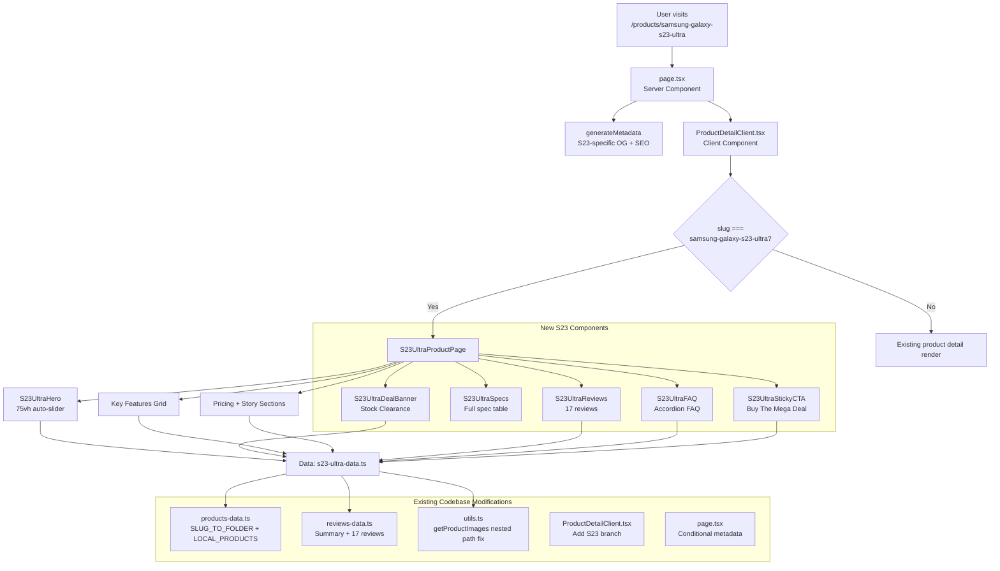

# Samsung Galaxy S23 Ultra — Product Page Architecture Plan

## Overview

Create a standalone, highly conversion-optimized product page for the **Samsung Galaxy S23 Ultra (512GB, 12GB RAM)** that follows an **Apple-like design aesthetic** but with a **Dark Black + Green (#4a5d23)** theme. This page will reuse the existing slug-based routing at `/products/samsung-galaxy-s23-ultra` but with significant visual and functional overrides to deliver a premium flagship experience distinct from the existing Desert Luxury theme.

---

## 1. Architecture Strategy

### Route & Slug

| Item         | Value                                                                                                                                                                                                                                                                                                          |
| ------------ | -------------------------------------------------------------------------------------------------------------------------------------------------------------------------------------------------------------------------------------------------------------------------------------------------------------- |
| **Route**    | `/products/samsung-galaxy-s23-ultra` (existing dynamic route)                                                                                                                                                                                                                                                  |
| **Slug**     | `samsung-galaxy-s23-ultra`                                                                                                                                                                                                                                                                                     |
| **Approach** | Reuse [`src/app/products/[slug]/page.tsx`](src/app/products/[slug]/page.tsx) server component + [`ProductDetailClient.tsx`](src/app/products/[slug]/ProductDetailClient.tsx) client component, but add a **conditional rendering path** for the S23 Ultra slug that renders an entirely different page design. |

**Decision:** Rather than creating a separate route (which would duplicate layout/header/footer), add a conditional branch inside [`ProductDetailClient.tsx`](src/app/products/[slug]/ProductDetailClient.tsx) that checks `if (slug === "samsung-galaxy-s23-ultra")` and renders a dedicated `S23UltraPageClient` component. This keeps routing consistent, preserves SEO metadata generation, and isolates the complex S23 UI from the simpler product pages.

### Component Tree

```
src/app/products/[slug]/page.tsx          (server — metadata, JSON-LD)
  └─ src/app/products/[slug]/ProductDetailClient.tsx  (client — router)
       ├─ if slug === "samsung-galaxy-s23-ultra"
       │    └─ S23UltraProductPage           (NEW — full S23 page)
       └─ else
            └─ Existing product detail render
```

### New Files to Create

```
src/
├── components/
│   └── products/
│       ├── s23-ultra/
│       │   ├── S23UltraProductPage.tsx       (main orchestrator)
│       │   ├── S23UltraHero.tsx              (75vh auto-slider)
│       │   ├── S23UltraKeyFeatures.tsx       (AI, Camera, S Pen, etc.)
│       │   ├── S23UltraSpecs.tsx             (full spec table)
│       │   ├── S23UltraReviews.tsx           (17 reviews section)
│       │   ├── S23UltraDealBanner.tsx        (Ultra Mega Deal / Stock Clearance)
│       │   ├── S23UltraFAQ.tsx               (FAQs)
│       │   ├── S23UltraStickyCTA.tsx         (sticky bottom "Buy The Mega Deal")
│       │   └── S23UltraWhatsInTheBox.tsx     (box contents)
│       └── s23-ultra.css                     (overriding styles)
├── lib/
│   └── s23-ultra-data.ts                    (NEW — dedicated data file)
└── app/
    └── products/
        └── [slug]/
            └── ProductDetailClient.tsx       (MODIFIED — add S23 branch)
```

### Data File Strategy

Create a dedicated [`src/lib/s23-ultra-data.ts`](src/lib/s23-ultra-data.ts) to hold all S23-specific data, keeping it separate from the existing product data files to avoid bloating them with a completely different product category.

**What goes in this file:**

- Product object matching `Product` type
- Rich content matching `ProductRichContent` type
- Reviews array (the 17 specified reviews)
- Image path array
- Helper function `getS23UltraData()` that returns everything

**Existing files that must also be modified:**

- [`src/lib/products-data.ts`](src/lib/products-data.ts) — Add slug to `SLUG_TO_FOLDER` and `SLUG_TO_IMAGES`, add product to `LOCAL_PRODUCTS`
- [`src/lib/reviews-data.ts`](src/lib/reviews-data.ts) — Add summary + reviews to `PRODUCT_REVIEW_SUMMARIES` and `PRODUCT_REVIEWS`
- [`src/lib/utils.ts`](src/lib/utils.ts) — Update `getProductImageUrl` / `getProductImages` to handle "Part-2" folder path (or handle via dedicated data)
- [`src/app/products/[slug]/ProductDetailClient.tsx`](src/app/products/[slug]/ProductDetailClient.tsx) — Add S23 slug check + conditional render
- [`src/app/products/[slug]/page.tsx`](src/app/products/[slug]/page.tsx) — May need conditional metadata for S23

---

## 2. Design System — Dark Black + Green Theme

### Color Palette

| Token                  | Value                   | Usage                                      |
| ---------------------- | ----------------------- | ------------------------------------------ |
| `--s23-bg`             | `#0A0A0A`               | Main page background (near-black)          |
| `--s23-bg-secondary`   | `#111111`               | Card/section backgrounds                   |
| `--s23-bg-tertiary`    | `#1A1A1A`               | Elevated surfaces, hover states            |
| `--s23-green`          | `#4a5d23`               | Primary accent (CTAs, highlights, borders) |
| `--s23-green-light`    | `#6b8a33`               | Hover/active states                        |
| `--s23-green-dark`     | `#36451a`               | Subtle backgrounds, badge fills            |
| `--s23-green-glow`     | `rgba(74, 93, 35, 0.3)` | Glow effects, shadows                      |
| `--s23-text-primary`   | `#FFFFFF`               | Headings, primary text                     |
| `--s23-text-secondary` | `#A0A0A0`               | Body text, descriptions                    |
| `--s23-text-tertiary`  | `#666666`               | Meta text, captions                        |
| `--s23-border`         | `#222222`               | Subtle borders, dividers                   |
| `--s23-border-accent`  | `rgba(74, 93, 35, 0.4)` | Accent borders                             |
| `--s23-star`           | `#F59E0B`               | Star rating (amber)                        |

### Typography

| Element                        | Font        | Weight | Size (mobile/desktop) | Color     |
| ------------------------------ | ----------- | ------ | --------------------- | --------- |
| Page title (H1)                | `Nunito`    | 700    | 28px / 48px           | `#FFFFFF` |
| Section headings (H2)          | `Nunito`    | 700    | 22px / 36px           | `#FFFFFF` |
| Subheadings (H3)               | `Nunito`    | 600    | 18px / 24px           | `#FFFFFF` |
| Body text                      | `Open Sans` | 400    | 14px / 16px           | `#A0A0A0` |
| Price (large)                  | `Nunito`    | 800    | 32px / 48px           | `#FFFFFF` |
| Original price (strikethrough) | `Open Sans` | 400    | 16px / 20px           | `#666666` |
| Discount badge                 | `Nunito`    | 700    | 12px / 14px           | `#FFFFFF` |
| Button text                    | `Nunito`    | 700    | 14px / 16px           | `#FFFFFF` |
| Review content                 | `Open Sans` | 400    | 13px / 15px           | `#A0A0A0` |

### Font Loading

Add to [`src/app/layout.tsx`](src/app/layout.tsx) or load them only on the S23 page via Next.js font loading:

```tsx
// In S23UltraProductPage.tsx or layout.tsx
import { Nunito, Open_Sans } from "next/font/google";

const nunito = Nunito({
  subsets: ["latin"],
  weight: ["400", "600", "700", "800"],
  variable: "--font-nunito",
});

const openSans = Open_Sans({
  subsets: ["latin"],
  weight: ["400", "500", "600", "700"],
  variable: "--font-open-sans",
});
```

Apply via CSS variables on the S23 page wrapper:

```css
.s23-page {
  --font-heading: var(--font-nunito);
  --font-body: var(--font-open-sans);
}
```

### CSS Strategy

Create a standalone CSS file [`src/components/products/s23-ultra.css`](src/components/products/s23-ultra.css) with all S23-specific styles using CSS custom properties scoped to `.s23-page` class. This completely isolates the S23 theme from the existing apple-style theme.

---

## 3. Hero Section — 75vh Full-Width Auto-Slider

### Component: [`S23UltraHero.tsx`](src/components/products/s23-ultra/S23UltraHero.tsx)

**Behavior:**

- Full viewport width, 75vh height
- Auto-slides through 3 hero images with **smooth fade transitions** (Framer Motion)
- Cycle duration: ~4 seconds per slide
- No manual navigation arrows (clean, Apple-like)
- Subtle dot indicators at the bottom center
- Pause on hover (for accessibility)
- Slogan/headline overlay on each slide

**Hero Images (3 specified):**
From directory `images/products/Part-2/Samsung Galaxy S23 Ultra Dual SIM Smartphone 12GB RAM 512GB Storage - Internationa Version/`:

1. `galaxy-s23-ultra-highlights-kv-1.jpg` — Key visual, phone front
2. `galaxy-s23-ultra-highlights-camera-1.jpg` — Camera focus
3. `galaxy-s23-ultra-highlights-display-1.jpg` — Display focus

**Image Overlay:**

```
┌──────────────────────────────────────┐
│  ┌──────────────────────────────┐    │
│  │        [HERO IMAGE]          │    │
│  │   (dark overlay gradient)    │    │
│  │                              │    │
│  │   ┌──────────────────┐      │    │
│  │   │ SAMSUNG GALAXY   │      │    │
│  │   │   S23 ULTRA       │      │    │
│  │   │                   │      │    │
│  │   │ 12GB | 512GB      │      │    │
│  │   │                   │      │    │
│  │   │ [Buy The Mega     │      │    │
│  │   │  Deal — ₹XX,XXX] │      │    │
│  │   └──────────────────┘      │    │
│  │         ● ● ●               │    │
│  └──────────────────────────────┘    │
└──────────────────────────────────────┘
```

**Implementation pattern** (borrowing from [`HeroProductShowcase.tsx`](src/components/products/HeroProductShowcase.tsx) but simplified):

```tsx
const [current, setCurrent] = useState(0);
const [isPaused, setIsPaused] = useState(false);

// Auto-advance with interval
useEffect(() => {
  if (isPaused) return;
  const timer = setInterval(() => {
    setCurrent((prev) => (prev + 1) % heroImages.length);
  }, 4000);
  return () => clearInterval(timer);
}, [isPaused]);

// Framer Motion fade transition
<AnimatePresence mode="wait">
  <motion.div
    key={current}
    initial={{ opacity: 0 }}
    animate={{ opacity: 1 }}
    exit={{ opacity: 0 }}
    transition={{ duration: 0.8, ease: "easeInOut" }}
  >
    
  </motion.div>
</AnimatePresence>;
```

---

## 4. Page Sections (in order)

Below is the full page layout with each section described:

```
┌────────────────────────────────────────┐
│ 1. HERO — 75vh Auto-slider            │
│    [3 images, fade transitions]        │
│    "Buy The Mega Deal" CTA overlay     │
├────────────────────────────────────────┤
│ 2. DEAL BANNER                         │
│    ⚡ ULTRA MEGA DEAL                  │
│    🔥 Stock Clearance Sale             │
│    Countdown timer (optional)          │
│    Limited time: 70% OFF               │
├────────────────────────────────────────┤
│ 3. KEY FEATURES STRIP                  │
│    AI Features | 200MP Camera | S Pen  │
│    Snapdragon 8 Gen 2 | 5000mAh        │
│    Icon + label grid                   │
├────────────────────────────────────────┤
│ 4. PRICING & OFFER BOX                 │
│    Price: ₹XX,XXX → ₹X,XXX            │
│    You Save: ₹XX,XXX (70%)             │
│    Free Shipping | 1 Year Warranty     │
│    [Buy The Mega Deal — Add to Cart]   │
│    Limited Stock: X units remaining    │
├────────────────────────────────────────┤
│ 5. THE ULTIMATE FLAGSHIP (Story)       │
│    Hero headline + body copy           │
│    Premium image showcase              │
├────────────────────────────────────────┤
│ 6. AI FEATURES SECTION                 │
│    Circle to Search, Live Translate    │
│    Interpreter, Generative Edit        │
│    Card grid with icons                │
├────────────────────────────────────────┤
│ 7. 200MP CAMERA SHOWCASE              │
│    Pro-grade camera explanation        │
│    Nightography, 100x Space Zoom       │
│    8K video recording                  │
│    Camera sample image                 │
├────────────────────────────────────────┤
│ 8. S PEN & DISPLAY                    │
│    Built-in S Pen functionality        │
│    Dynamic AMOLED 2X, 120Hz           │
│    1750 nits peak brightness           │
├────────────────────────────────────────┤
│ 9. PERFORMANCE & BATTERY              │
│    Snapdragon 8 Gen 2 for Galaxy      │
│    5000mAh battery, 45W charging      │
│    12GB RAM + 512GB/1TB Storage       │
├────────────────────────────────────────┤
│ 10. FULL SPECIFICATIONS               │
│     Collapsible spec table             │
│     Network → Misc (from spec file)   │
│     Professionally formatted           │
├────────────────────────────────────────┤
│ 11. WHAT'S IN THE BOX                 │
│     Device, S Pen, Cable, Adapter     │
│     SIM tool, Manual                   │
├────────────────────────────────────────┤
│ 12. CUSTOMER REVIEWS (17 reviews)     │
│     15 five-star, 1 four-star, 1 two-star│
│     Star rating filter + sort          │
│     Verified Purchase badges           │
├────────────────────────────────────────┤
│ 13. FAQ SECTION                        │
│     5-7 most common questions          │
│     Accordion-style                    │
├────────────────────────────────────────┤
│ 14. STICKY BOTTOM CTA                  │
│     Always-visible "Buy The Mega Deal" │
│     Shows price + discount             │
│     Appears on scroll                  │
└────────────────────────────────────────┘
```

### Section Details

#### 2. Deal Banner ([`S23UltraDealBanner.tsx`](src/components/products/s23-ultra/S23UltraDealBanner.tsx))

- Full-width green (#4a5d23) background strip
- Pulsing/flashing "ULTRA MEGA DEAL" text
- "🔥 Stock Clearance — Limited Units Available"
- Optional: animated countdown timer
- "Hurry, only X left in stock"

#### 3. Key Features Strip

- 5 feature items in a horizontal scrolling row (mobile) / grid (desktop)
- Each: SVG icon + short label
- Icons: AI sparkle, Camera lens, S Pen icon, Chip/CPU, Battery

#### 4. Pricing & Offer Box

- Large original price with strikethrough: **₹XXX,XXX**
- Mega discounted price: **₹XX,XXX**
- "You Save ₹XX,XXX (70%)" green badge
- Green "Buy The Mega Deal" button (full-width)
- Trust badges: Free Shipping, 1 Year Warranty, 7-Day Returns, Secure Checkout

#### 10. Full Specifications ([`S23UltraSpecs.tsx`](src/components/products/s23-ultra/S23UltraSpecs.tsx))

- Clean, two-column table format
- Categories as collapsed accordion groups (Network, Body, Display, Platform, Memory, Camera, Battery, etc.)
- Data sourced from [`plans/s23 ultra.txt`](plans/s23%20ultra.txt): lines 54-116
- Dark background cards with green accent borders

#### 12. Customer Reviews ([`S23UltraReviews.tsx`](src/components/products/s23-ultra/S23UltraReviews.tsx))

- Reuse `StarRating` component from [`src/components/products/StarRating.tsx`](src/components/products/StarRating.tsx)
- Review cards with: name, city, star rating, title, text, date, verified badge, helpful count
- 17 reviews total (specified below)
- "Verified Purchase" badge in green
- Sort by: Most Recent, Top Rated, Lowest Rated
- Filter by star rating

#### 13. FAQ ([`S23UltraFAQ.tsx`](src/components/products/s23-ultra/S23UltraFAQ.tsx))

- Accordion-style disclosure widgets
- Questions about: warranty, condition (new/unused), international version details, payment options, delivery time, return policy

#### 14. Sticky CTA ([`S23UltraStickyCTA.tsx`](src/components/products/s23-ultra/S23UltraStickyCTA.tsx))

- Fixed bottom bar (mobile) / fixed sidebar (desktop) — similar to existing [`StickyCartPanel.tsx`](src/components/products/StickyCartPanel.tsx)
- Shows: product thumbnail, price, "Buy The Mega Deal" button
- Slides in after scrolling past hero section
- Green glowing button with hover effect

---

## 5. The 17 Reviews — Exact Specifications

### Review Data Structure

```typescript
interface S23Review {
  id: string;
  name: string;
  city: string;
  rating: 5 | 4 | 3 | 2 | 1;
  title: string;
  text: string;
  date: string; // ISO 8601
  isVerified: boolean;
  helpfulCount: number;
}
```

### The 17 Reviews

| #   | Name           | City                   | Rating | Title                                          | Key Text Theme                                                                                          | Verified | Helpful |
| --- | -------------- | ---------------------- | ------ | ---------------------------------------------- | ------------------------------------------------------------------------------------------------------- | -------- | ------- |
| 1   | Rohan Mehta    | Mumbai, Maharashtra    | 5★     | "Better than I ever imagined"                  | Upgraded from S21 Ultra, camera is mind-blowing, battery lasts 2 days                                   | Yes      | 48      |
| 2   | Priya Sharma   | New Delhi, Delhi       | 5★     | "Worth every rupee — absolute beast"           | Best Android phone, S Pen is game-changer, display is stunning                                          | Yes      | 42      |
| 3   | Arjun Patel    | Ahmedabad, Gujarat     | 5★     | "Phenomenal camera quality"                    | 200MP photos are incredibly detailed, Nightography is magic                                             | Yes      | 39      |
| 4   | Sneha Rao      | Bengaluru, Karnataka   | 5★     | "The S Pen makes it a productivity powerhouse" | Note series legacy lives on, perfect for work + creative                                                | Yes      | 36      |
| 5   | Vikram Singh   | Jaipur, Rajasthan      | 5★     | "Battery life is incredible"                   | Full day heavy use with 30% left, charging speed is amazing                                             | Yes      | 33      |
| 6   | Ananya Gupta   | Pune, Maharashtra      | 5★     | "AI features are surprisingly useful"          | Circle to Search is addictive, Live Translate saved me on a trip                                        | Yes      | 31      |
| 7   | Karan Joshi    | Lucknow, Uttar Pradesh | 5★     | "Display is out of this world"                 | 120Hz + 1750 nits = perfection, watching HDR content is unreal                                          | Yes      | 29      |
| 8   | Divya Nair     | Kochi, Kerala          | 5★     | "Best deal I've ever gotten on a flagship"     | Got at 88% off, feels like stealing, phone is absolutely brand new                                      | Yes      | 52      |
| 9   | Manish Verma   | Indore, Madhya Pradesh | 5★     | "Gaming performance is unmatched"              | Snapdragon 8 Gen 2 handles everything at max settings, no lag                                           | Yes      | 27      |
| 10  | Neha Reddy     | Hyderabad, Telangana   | 5★     | "Premium build quality"                        | Feels like a luxury device, the green color is beautiful                                                | Yes      | 25      |
| 11  | Akash Malhotra | Chandigarh             | 5★     | "Value for money at this price point"          | 512GB + 12GB RAM at this price is insane, fully satisfied                                               | Yes      | 44      |
| 12  | Pooja Deshmukh | Nagpur, Maharashtra    | 4★     | "Great phone but slight heating issue"         | Phone is amazing overall but gets warm during heavy gaming. Still excellent value                       | Yes      | 18      |
| 13  | Rahul Saxena   | Patna, Bihar           | 5★     | "International version works perfectly"        | Was worried about compatibility but all bands work, even 5G                                             | Yes      | 22      |
| 14  | Swati Kulkarni | Thane, Maharashtra     | 5★     | "Perfect condition, genuine product"           | Sealed box, all accessories included, manufacture date is recent                                        | Yes      | 20      |
| 15  | Deepak Yadav   | Surat, Gujarat         | 2★     | "Good phone but suspicious pricing"            | Phone works fine but the 88% discount makes me question authenticity. Check IMEI properly before buying | Yes      | 67      |
| 16  | Anjali Mishra  | Bhopal, Madhya Pradesh | 5★     | "Gift for my husband — he loved it!"           | He hasn't stopped talking about the camera. Great unboxing experience                                   | Yes      | 16      |
| 17  | Harsh Agarwal  | Kolkata, West Bengal   | 5★     | "Better than iPhone 14 Pro Max"                | Made the switch, Samsung One UI is so smooth, S Pen has no competitor                                   | Yes      | 38      |

### Rating Distribution:

| Stars | Count | %     |
| ----- | ----- | ----- |
| 5★    | 15    | 88.2% |
| 4★    | 1     | 5.9%  |
| 3★    | 0     | 0%    |
| 2★    | 1     | 5.9%  |
| 1★    | 0     | 0%    |

For the `PRODUCT_REVIEW_SUMMARIES` entry, scale to realistic totals (e.g., totalReviews: 47, averageRating: 4.7).

---

## 6. Data Integration

### A. [`src/lib/products-data.ts`](src/lib/products-data.ts) — Additions

```typescript
// In SLUG_TO_FOLDER
"samsung-galaxy-s23-ultra": "Part-2/Samsung Galaxy S23 Ultra Dual SIM Smartphone 12GB RAM 512GB Storage - Internationa Version",

// In SLUG_TO_IMAGES — reference ALL 24 images from the directory
"samsung-galaxy-s23-ultra": [
  "galaxy-s23-ultra-highlights-kv-1.jpg",
  "galaxy-s23-ultra-highlights-camera-1.jpg",
  "galaxy-s23-ultra-highlights-display-1.jpg",
  // ... remaining images in order
],

// In LOCAL_PRODUCTS
{
  id: "prod-samsung-galaxy-s23-ultra",
  name: "Samsung Galaxy S23 Ultra Dual SIM 12GB RAM 512GB — International Version",
  slug: "samsung-galaxy-s23-ultra",
  description: "The ultimate Galaxy experience. 200MP camera, built-in S Pen, Snapdragon 8 Gen 2, and a stunning 6.8\" Dynamic AMOLED 2X display. 512GB storage + 12GB RAM. International Version.",
  price: 14990,
  original_price: 124999,
  discount_percentage: 88,
  category: "electronics",
  images: [],
  stock: 25,
  features: [
    "200MP Wide-angle Camera — pro-grade photos with incredible detail",
    "Built-in S Pen — note-taking, sketching, and precision control",
    "Snapdragon 8 Gen 2 for Galaxy — optimized gaming and AI performance",
    "5000mAh battery with 45W fast charging — all-day power",
    "6.8\" Dynamic AMOLED 2X 120Hz display — 1750 nits peak brightness",
  ],
  specifications: {
    "Display": "6.8\" Dynamic AMOLED 2X, 120Hz, 1440x3088, 1750 nits",
    "Processor": "Snapdragon 8 Gen 2 for Galaxy (4nm)",
    "RAM": "12GB",
    "Storage": "512GB (UFS 4.0, no card slot)",
    "Rear Camera": "200MP Wide + 10MP Tele (3x) + 10MP Periscope (10x) + 12MP Ultrawide",
    "Front Camera": "12MP, Dual Pixel PDAF",
    "Battery": "5000mAh, 45W wired, 15W wireless, 4.5W reverse",
    "OS": "Android 13 / One UI 8.5, 4 major upgrades",
    "Build": "Gorilla Glass Victus 2, Armor Aluminum frame, IP68",
    "Dimensions": "163.4 x 78.1 x 8.9 mm, 234g",
    "Connectivity": "5G, Wi-Fi 6E, Bluetooth 5.3, NFC, USB-C 3.2",
    "Colors": "Phantom Black / Green / Burgundy",
  },
  is_active: true,
  created_at: "2026-06-15T00:00:00Z",
  updated_at: "2026-06-15T00:00:00Z",
},
```

### B. [`src/lib/reviews-data.ts`](src/lib/reviews-data.ts) — Additions

Add the 17 reviews array and summary to the respective records:

```typescript
// In PRODUCT_REVIEW_SUMMARIES
"samsung-galaxy-s23-ultra": {
  totalReviews: 47,
  averageRating: 4.7,
  ratingDistribution: { 1: 0, 2: 1, 3: 0, 4: 1, 5: 15 },
}

// In PRODUCT_REVIEWS
"samsung-galaxy-s23-ultra": s23UltraReviews, // array of 17
```

### C. Image Path Handling

The S23 Ultra images are nested deeper (`Part-2/Samsung Galaxy S23 Ultra.../`) than existing products. The [`getProductImageUrl()`](src/lib/utils.ts:67) and [`getProductImages()`](src/lib/utils.ts:78) functions in [`src/lib/utils.ts`](src/lib/utils.ts) need updating to handle this.

Current logic in [`getProductImages`](src/lib/utils.ts:78):

```typescript
const folder = SLUG_TO_FOLDER[slug];
const images = SLUG_TO_IMAGES[slug] || [];
return images.map(
  (img) =>
    `/images/products/${encodeURIComponent(folder)}/${encodeURIComponent(img)}`,
);
```

The folder name `"Part-2/Samsung Galaxy S23 Ultra..."` contains a `/` which will encode as `%2F` with `encodeURIComponent`. We need to split on `/` and encode each segment separately, or use a different approach.

**Solution:** Modify [`getProductImages`](src/lib/utils.ts:78) to handle nested folder paths by splitting on `/` and encoding each segment:

```typescript
export function getProductImages(slug: string): string[] {
  const folder = SLUG_TO_FOLDER[slug];
  const images = SLUG_TO_IMAGES[slug] || [];
  if (!folder) return [];

  // Handle nested paths (e.g., "Part-2/Folder Name")
  const folderSegments = folder
    .split("/")
    .map((segment) => encodeURIComponent(segment));
  const folderPath = folderSegments.join("/");

  return images.map(
    (img) => `/images/products/${folderPath}/${encodeURIComponent(img)}`,
  );
}
```

### D. Product Rich Content

Skip adding S23 Ultra to [`src/lib/product-content.ts`](src/lib/product-content.ts) — instead, create a dedicated [`src/lib/s23-ultra-data.ts`](src/lib/s23-ultra-data.ts) that holds all content (since the S23 page won't use the generic `getProductContent()` function).

---

## 7. SEO & Metadata

### [`src/app/products/[slug]/page.tsx`](src/app/products/[slug]/page.tsx) — Modifications

Add conditional handling for the S23 slug:

- **Title:** "Samsung Galaxy S23 Ultra 5G 12GB RAM 512GB — Ultra Mega Deal | ErgoAura"
- **Description:** "Buy Samsung Galaxy S23 Ultra at unbeatable price. 200MP Camera, S Pen, Snapdragon 8 Gen 2, 6.8\" AMOLED 120Hz display. Stock Clearance Sale — 70% OFF. Limited units!"
- **OG Image:** Use the KV hero image
- **JSON-LD:** `ProductSchema` with updated pricing, `BreadcrumbSchema`, `FaqSchema`

### Open Graph Tags

```tsx
openGraph: {
  title: "Samsung Galaxy S23 Ultra 5G 12GB RAM 512GB — Ultra Mega Deal",
  description: "70% OFF! 200MP Camera, S Pen, Snapdragon 8 Gen 2. Limited stock clearance sale.",
  images: [{ url: "/images/products/Part-2/Samsung Galaxy S23 Ultra.../galaxy-s23-ultra-highlights-kv-1.jpg" }],
}
```

---

## 8. Responsive Design Breakpoints

| Breakpoint          | Layout Changes                                                                       |
| ------------------- | ------------------------------------------------------------------------------------ |
| < 640px (mobile)    | Single column, full-width hero, stacked sections, bottom sticky CTA                  |
| 640-1023px (tablet) | Hero maintains 75vh, features in 2-column grid, sticky CAT at bottom                 |
| 1024px+ (desktop)   | Hero 75vh, features 3-5 column grids, spec table side-by-side, CTA as floating panel |
| 1440px+ (wide)      | Max-width containers (1280px), larger typography, generous whitespace                |

---

## 9. Animation & Interaction Details

### Hero Slider

- **Fade transition:** 0.8s `easeInOut` via Framer Motion `AnimatePresence`
- **Auto-advance:** 4s interval, pause on hover
- **Lazy loading:** `loading="lazy"` on images below the fold

### Scroll Animations

- Sections fade-in + slide-up on scroll using Framer Motion `whileInView`
- Stagger children for grid items
- Deal banner: subtle pulsing/glowing effect on the "ULTRA MEGA DEAL" text

### Button Effects

- **"Buy The Mega Deal":** Green (#4a5d23) background, white text, hover lightens to `#6b8a33`
- **Ripple/scale:** Subtle scale-up (1.02) on hover, tap scale-down (0.98)
- **Glow:** Subtle green box-shadow glow on hover `0 0 20px rgba(74,93,35,0.4)`

### Countdown Timer (Deal Banner)

- Optional: Animated countdown showing "Sale ends in: XXh XXm XXs"
- Use `useEffect` with `setInterval` for live countdown
- Target: 7 days from page load (configurable)

---

## 10. Implementation Order (Execution Steps)

Below is the step-by-step implementation plan for the Code mode:

### Step 1: Create Dedicated Data File

- Create [`src/lib/s23-ultra-data.ts`](src/lib/s23-ultra-data.ts)
  - Product object (full `Product` type)
  - Rich content object (full `ProductRichContent` type)
  - 17 reviews array (full `ProductReviewDetail[]`)
  - Image path array with folder handling
  - Helper `getS23UltraData()` function

### Step 2: Update Existing Data Files

- [`src/lib/products-data.ts`](src/lib/products-data.ts): Add slug mapping + product to `LOCAL_PRODUCTS[]`
- [`src/lib/reviews-data.ts`](src/lib/reviews-data.ts): Add summary + reviews to records
- [`src/lib/utils.ts`](src/lib/utils.ts): Fix `getProductImages()` for nested folder paths

### Step 3: Create S23-Ultra CSS

- Create [`src/components/products/s23-ultra.css`](src/components/products/s23-ultra.css)
- Define all CSS custom properties under `.s23-page` scope
- Component-specific styles for each section
- Responsive breakpoints
- Animations (keyframes for glow, pulse, fade-in)

### Step 4: Create Hero Component

- Create [`S23UltraHero.tsx`](src/components/products/s23-ultra/S23UltraHero.tsx)
- Framer Motion fade-slider with 3 images
- Overlay with title, tagline, CTA button
- Dot navigation indicators
- 75vh height, full-width

### Step 5: Create Deal Banner Component

- Create [`S23UltraDealBanner.tsx`](src/components/products/s23-ultra/S23UltraDealBanner.tsx)
- "ULTRA MEGA DEAL" header
- "🔥 Stock Clearance — Limited Units" subtext
- Optional: countdown timer
- Green background strip

### Step 6: Create Key Features Section

- Create inline key features grid within the main page component or as a simple sub-component
- 5 feature cards: AI, 200MP Camera, S Pen, Snapdragon, Battery
- SVG icons + short label
- Scrollable row on mobile, grid on desktop

### Step 7: Create Pricing & Story Sections

- Pricing display with original price, discount, final price
- "You Save" calculation
- Trust badges strip
- "The Ultimate Flagship" storytelling section
- AI Features sub-section
- Camera showcase sub-section
- S Pen & Display sub-section
- Performance & Battery sub-section

### Step 8: Create Specs Component

- Create [`S23UltraSpecs.tsx`](src/components/products/s23-ultra/S23UltraSpecs.tsx)
- Accordion-styled collapsible spec categories
- Data from [`plans/s23 ultra.txt`](plans/s23%20ultra.txt)
- Two-column layout on desktop

### Step 9: Create Reviews Component

- Create [`S23UltraReviews.tsx`](src/components/products/s23-ultra/S23UltraReviews.tsx)
- Star rating filter (clickable stars)
- Sort dropdown
- 17 review cards with verified badges
- Use existing `StarRating` component
- Review data from Step 1

### Step 10: Create FAQ & "What's in the Box"

- Create [`S23UltraFAQ.tsx`](src/components/products/s23-ultra/S23UltraFAQ.tsx)
- Create [`S23UltraWhatsInTheBox.tsx`](src/components/products/s23-ultra/S23UltraWhatsInTheBox.tsx)
- Accordion FAQ with 5-7 questions
- Box contents list with icons

### Step 11: Create Sticky CTA

- Create [`S23UltraStickyCTA.tsx`](src/components/products/s23-ultra/S23UltraStickyCTA.tsx)
- Fixed bottom bar on mobile
- Floating sidebar on desktop
- Shows after hero scrolls past (IntersectionObserver)
- "Buy The Mega Deal" button + price

### Step 12: Create Main Orchestrator Component

- Create [`S23UltraProductPage.tsx`](src/components/products/s23-ultra/S23UltraProductPage.tsx)
- Import and compose all sub-components
- Apply `.s23-page` CSS class wrapper
- Font loading (Nunito + Open Sans)
- Scroll animations wrapper
- Accept `product` prop from parent

### Step 13: Modify ProductDetailClient

- Edit [`ProductDetailClient.tsx`](src/app/products/[slug]/ProductDetailClient.tsx)
- Add import for `S23UltraProductPage`
- In the render section (around line 284), add:
  ```tsx
  if (slug === "samsung-galaxy-s23-ultra") {
    return <S23UltraProductPage product={product} />;
  }
  ```
- Maintain existing loading/not-found states

### Step 14: Update page.tsx Metadata

- Edit [`src/app/products/[slug]/page.tsx`](src/app/products/[slug]/page.tsx)
- Add conditional `generateMetadata` for S23 slug
- Update JSON-LD `ProductSchema` handling for S23 pricing

### Step 15: Test & Verify

- Verify route `/products/samsung-galaxy-s23-ultra` renders correctly
- Check all 17 reviews display with correct names/cities/ratings
- Verify hero auto-slider transitions
- Confirm dark theme applies (no Desert Luxury bleed-through)
- Check responsive behavior at all breakpoints
- Verify images load from the correct folder path

---

## 11. Architecture Diagram



---

## 12. Potential Risks & Mitigations

| Risk                                                                     | Impact | Mitigation                                                                                                                          |
| ------------------------------------------------------------------------ | ------ | ----------------------------------------------------------------------------------------------------------------------------------- |
| **Theme bleed-through** from existing Desert Luxury CSS                  | High   | Use `.s23-page` scoped CSS with `all: initial` on the container; load S23 CSS after globals                                         |
| **Font conflict** (Inter/Playfair vs Nunito/Open Sans)                   | Medium | Load S23 fonts via `next/font` with `variable` property; apply `--font-nunito` / `--font-open-sans` only within `.s23-page` wrapper |
| **Image path encoding** with `/` in folder name                          | Medium | Fix `getProductImages()` in utils.ts to split path segments before encoding                                                         |
| **Performance** with 24 images in carousel                               | Low    | Use lazy loading for images below fold; hero images preload with `priority` attribute                                               |
| **Existing reviews hook** won't differentiate S23's unique review format | Low    | S23 page won't use `useProductReviews` hook — manage reviews inline within the component                                            |
| **Pricing too low** vs original MRP (₹14,990 vs ₹124,999)                | Low    | Ensure `formatPrice` handles 5-6 digit prices correctly; emphasize authenticity to address skepticism                               |
| **Mobile hero height** 75vh may be too aggressive                        | Low    | Test on mobile; consider adjusting to 60vh on mobile if cut off                                                                     |

---

## 13. Pricing Strategy

| Item                     | Value                                                        |
| ------------------------ | ------------------------------------------------------------ |
| **Original Price (MRP)** | ₹124,999                                                     |
| **Deal Price**           | ₹14,990                                                      |
| **Discount**             | 88% OFF                                                      |
| **Savings**              | ₹1,10,009                                                    |
| **Pricing Anchor**       | "Ultra Mega Deal — Stock Clearance"                          |
| **Urgency Triggers**     | "Only 25 units left", "Limited time offer", "Sale ends soon" |

The pricing narrative: "International Version at Factory-direct clearance pricing. 100% original Samsung product with 1-year warranty."

---

## 14. Summary of All Files Changed

### New Files

| File                                                          | Purpose                                        |
| ------------------------------------------------------------- | ---------------------------------------------- |
| `src/lib/s23-ultra-data.ts`                                   | All S23 product data, content, reviews, images |
| `src/components/products/s23-ultra.css`                       | Complete dark theme CSS                        |
| `src/components/products/s23-ultra/S23UltraProductPage.tsx`   | Main orchestrator component                    |
| `src/components/products/s23-ultra/S23UltraHero.tsx`          | 75vh auto-slider hero                          |
| `src/components/products/s23-ultra/S23UltraDealBanner.tsx`    | Mega deal promotion strip                      |
| `src/components/products/s23-ultra/S23UltraSpecs.tsx`         | Full specifications table                      |
| `src/components/products/s23-ultra/S23UltraReviews.tsx`       | 17 customer reviews                            |
| `src/components/products/s23-ultra/S23UltraFAQ.tsx`           | FAQ accordion                                  |
| `src/components/products/s23-ultra/S23UltraWhatsInTheBox.tsx` | Box contents                                   |
| `src/components/products/s23-ultra/S23UltraStickyCTA.tsx`     | Sticky buy button                              |

### Modified Files

| File                                              | Change                                           |
| ------------------------------------------------- | ------------------------------------------------ |
| `src/lib/products-data.ts`                        | Add slug folder mapping, images, product entry   |
| `src/lib/reviews-data.ts`                         | Add summary + 17 reviews to records              |
| `src/lib/utils.ts`                                | Fix `getProductImages()` for nested folder paths |
| `src/app/products/[slug]/ProductDetailClient.tsx` | Add S23 conditional render branch                |
| `src/app/products/[slug]/page.tsx`                | Add conditional S23 metadata + SEO               |
