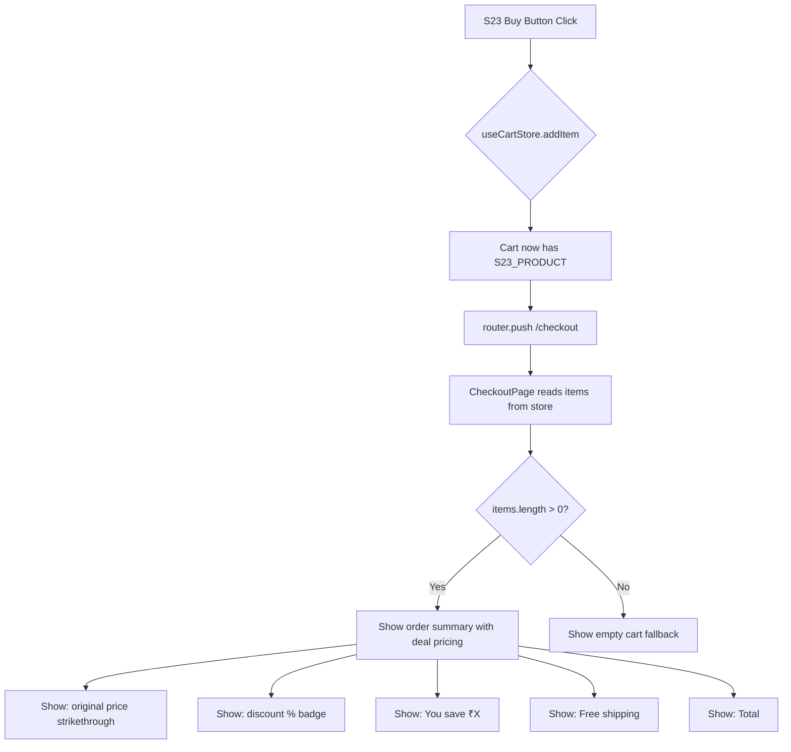
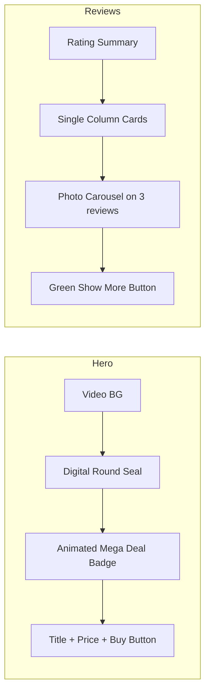

# Samsung S23 Ultra — V2 Grand Updates Plan

## 1. Root Cause Analysis: Images/Videos Not Showing

**Problem:** All S23 image/video URLs resolve to `/images/products/Part-2/...` which is NOT in Next.js's `public/` directory. The actual files are in `images/` (project root), but Next.js only serves static assets from `public/`. Every `getImagePath()` call produces URLs that 404.

**Fix:** Copy the S23 image folder to `public/images/products/` before the build runs, OR create a script to do so. The simplest approach: use Node.js `fs` to copy the images folder.

**Implementation:**

- Add a Node.js script `scripts/copy-s23-assets.mjs` that copies from `images/products/Part-2/...` to `public/images/products/Part-2/...`
- Add a `prebuild` script in `package.json` to run it before `next build`

**Alternatively:** Use Next.js rewrites in `next.config.mjs` to map `/images/products/*` to the local `images/` directory via a custom middleware or config.

**Simplest fix:** Simply copy the images using CLI or Node.js script.

---

## 2. Comprehensive Task Breakdown

### Task A: Fix Image/Video Asset Paths (Critical — Blocks All Visuals)

**Files affected:** `S23Hero.tsx`, `S23Features.tsx`, `S23CameraSection.tsx`, `S23FullWidthImage.tsx`, `S23StickyCTA.tsx`, `S23VideoSection.tsx`

**Action:**

1. Create `scripts/copy-s23-assets.mjs` — copies S23 assets from `images/` to `public/images/`
2. Add `"prebuild": "node scripts/copy-s23-assets.mjs"` to `package.json`
3. Run the script immediately to make assets available now
4. Verify hero video, full-width image, feature images, camera images, sticky thumbnail all render

**Alternative (simpler):** Add Next.js config to serve from an additional directory, or use a custom server. But a copy script is the standard approach.

### Task B: Hero Banner — Mega Deal Urgency Badge (Highest Conversion Design)

**File:** `S23Hero.tsx` (lines 62-83)

**Current:** Simple `.s23-hero-badge` with `var(--s23-accent-bg)` background, 1px border, small text. Underwhelming.

**Required:** Make "Mega Deal — Hurry! Only 15 Units Left" colorful, eye-catching, high-conversion.

**Design spec:**

- Animated gradient background (gold → orange → red shift) for the badge
- Pulsing glow effect with `@keyframes` and `box-shadow` animation
- Larger, bolder font with text shadow for depth
- The stock count "15" should be highlighted in a different color (bright yellow/white)
- Subtle shimmer/scan line effect passing over the badge
- Frame the badge with fire/flame SVG icons on both sides
- Add a subtle "SELLING FAST" sub-badge nearby
- Use CSS animations: `pulse`, `shimmer`, and `gradient-shift`

**CSS additions to `s23-ultra.css`:**

```css
@keyframes s23-badge-pulse {
  0%,
  100% {
    box-shadow: 0 0 5px rgba(255, 200, 0, 0.3);
  }
  50% {
    box-shadow: 0 0 25px rgba(255, 100, 0, 0.6);
  }
}

@keyframes s23-badge-shimmer {
  0% {
    background-position: -200% center;
  }
  100% {
    background-position: 200% center;
  }
}

.s23-hero-badge {
  background: linear-gradient(
    90deg,
    #ff4500,
    #ff8c00,
    #ffd700,
    #ff8c00,
    #ff4500
  );
  background-size: 300% 100%;
  animation:
    s23-badge-shimmer 3s ease infinite,
    s23-badge-pulse 2s ease infinite;
  color: #ffffff;
  font-size: 1rem;
  padding: 0.6rem 1.5rem;
  border: none;
  text-shadow: 0 1px 4px rgba(0, 0, 0, 0.3);
  font-weight: 800;
}
```

### Task C: Digital Round Seal — "Stock Clearance Sale - Mega Deals" with Pulse Effect

**File:** `S23Hero.tsx` (new element, positioned in hero content area)

**Design spec:**

- Circular seal/medal design, roughly 80-90px diameter
- Positioned top-right of hero content (absolutely positioned)
- Two concentric circles: outer thick border, inner filled area
- Text "STOCK CLEARANCE SALE" circling the top, "MEGA DEALS" circling the bottom
- Center text: "88% OFF" in bold
- Pulse animation: slow glow/pulse effect on the seal
- Color scheme: gold/dark green with white text
- SVG-based for crisp rendering

**Implementation:**

- Create a new component or inline SVG in `S23Hero.tsx`
- CSS `@keyframes s23-seal-pulse` for the glowing effect
- Position with `position: absolute; top: 20px; right: 20px;` on the hero content

### Task D: Buy Button → Add to Cart + Checkout Display

**Files affected:** `S23Hero.tsx`, `S23Pricing.tsx`, `S23StickyCTA.tsx`, `src/app/checkout/page.tsx`

**Problem:** All Buy buttons do `router.push('/checkout')` without adding the S23 product to the cart store. Checkout shows "Your cart is empty" because `items.length === 0`.

**Fix — S23 components (3 files):**

```tsx
import { useCartStore } from "@/store/cartStore";

const handleBuyNow = () => {
  useCartStore.getState().addItem(S23_PRODUCT, 1);
  router.push("/checkout");
};
```

**Fix — Checkout page** — Need to enhance the Order Summary to show S23-specific deal info:

- Original price vs current price
- Discount percentage badge
- "You save ₹X" line
- Mega Deal discount line
- Free shipping indicator
- Final total

**Checkout page modifications:**
The checkout currently shows `subtotal`, `b2g1Discount`, `discountedSubtotal`, `shipping`, `total`. For the S23 product specifically, we need to add special deal pricing display.

Since the `items` in the cart are generic `CartItem[]`, we need to detect if the item has an `original_price` field (the S23 product has it). We should add these display fields to the order summary:

For each item, if `item.product.original_price > item.product.price`:

- Show original price with strikethrough
- Show discount percentage badge
- Calculate and show "You save: formatPrice(item.product.original_price - item.product.price)"

**Implementation approach:**

- In the checkout page, for each cart item, check if `item.product.original_price` exists and is greater than `item.product.price`
- Display enhanced deal pricing in the order summary section (lines 441-506)

### Task E: Review Layout — One Per Row, Green "Show More", Green "Verified Purchase"

**File:** `S23Reviews.tsx` (line 292) and `s23-ultra.css` (lines 882-901)

**Changes:**

1. **One review per row:** Change `grid grid-cols-1 md:grid-cols-2 gap-4` to `grid grid-cols-1 gap-4` (remove `md:grid-cols-2`)
2. **"Show More Reviews" button:** Change its current white bg to green bg (`#1a7a3a` or `#22c55e`) with white text
3. **"Verified Purchase":** Already green in CSS (`.s23-review-verified` uses `color: #1a7a3a`). Verify it renders correctly.

**CSS changes:**

```css
.s23-reviews-load-more {
  background: #1a7a3a; /* Green background */
  border: 1px solid #1a7a3a;
  color: #ffffff; /* White text */
  /* Remove: background: #ffffff; color: #111111; border: 1px solid #d0d0d0; */
}

.s23-reviews-load-more:hover {
  background: #15803d; /* Darker green on hover */
  border-color: #15803d;
}
```

### Task F: Review Photos — Add Image Carousel to 3 Reviews

**Files:** `S23Reviews.tsx`, `s23-ultra-data.ts` (data), `s23-ultra.css` (styles)

**Review image data:**

- Folder `review-images/1/` — 4 images → Review 1 (Arjun M. — s23-r1)
- Folder `review-images/2/` — 2 images → Review 2 (Priya K. — s23-r2)
- Folder `review-images/3/` — 3 images → Review 3 (Rahul V. — s23-r3)

**Implementation:**

1. **Add review images data to `s23-ultra-data.ts`:**

```ts
export const S23_REVIEW_IMAGES: Record<string, string[]> = {
  "s23-r1": [
    "review-images/1/IMG-20260614-WA0015.jpg",
    "review-images/1/IMG-20260614-WA0016.jpg",
    "review-images/1/IMG-20260614-WA0017.jpg",
    "review-images/1/IMG-20260614-WA0018.jpg",
  ],
  "s23-r2": [
    "review-images/2/IMG-20260614-WA0012.jpg",
    "review-images/2/IMG-20260614-WA0013.jpg",
  ],
  "s23-r3": [
    "review-images/3/IMG-20260614-WA0008.jpg",
    "review-images/3/IMG-20260614-WA0009.jpg",
    "review-images/3/IMG-20260614-WA0010.jpg",
  ],
};
```

2. **Update `ReviewCard` component** to accept optional `images` prop and render a photo carousel.

3. **Image carousel component:**

- Horizontal sliding strip with `overflow-x: auto` and `scroll-snap-type: x mandatory`
- Left/right arrow navigation buttons
- Click any image → opens a lightbox/modal with the full-size image
- Dot indicators showing current position
- Styling: rounded corners, consistent 100% width, ~200px height for the strip

4. **Add a lightbox modal** for clicked images:

- Full-screen overlay with dark backdrop
- Centered full-size image
- Close button (X) and click-outside-to-close

5. **CSS for carousel:**

```css
.s23-review-images {
  display: flex;
  gap: 0.5rem;
  overflow-x: auto;
  scroll-snap-type: x mandatory;
  margin-top: 0.75rem;
  padding-bottom: 0.5rem;
}

.s23-review-image {
  scroll-snap-align: start;
  border-radius: 6px;
  cursor: pointer;
  width: auto;
  height: 120px;
  object-fit: cover;
  transition: opacity 0.2s;
  border: 1px solid #e0e0e0;
}

.s23-review-image:hover {
  opacity: 0.85;
}
```

---

## 3. File Change Matrix

| File                                           | Action     | Description                                                                                                            |
| ---------------------------------------------- | ---------- | ---------------------------------------------------------------------------------------------------------------------- |
| `scripts/copy-s23-assets.mjs`                  | **CREATE** | Copies S23 images/videos from `images/` to `public/images/`                                                            |
| `package.json`                                 | **MODIFY** | Add `prebuild` script                                                                                                  |
| `src/styles/s23-ultra.css`                     | **MODIFY** | Add hero badge animations, digital seal styles, review carousel styles, green load-more button, single-col review grid |
| `src/components/products/s23/S23Hero.tsx`      | **MODIFY** | Enhanced animated badge, add digital round seal, add `useCartStore.addItem()` to Buy handler                           |
| `src/components/products/s23/S23Pricing.tsx`   | **MODIFY** | Add `useCartStore.addItem()` to Buy handler                                                                            |
| `src/components/products/s23/S23StickyCTA.tsx` | **MODIFY** | Add `useCartStore.addItem()` to Buy handler                                                                            |
| `src/components/products/s23/S23Reviews.tsx`   | **MODIFY** | Single column grid, green load-more, add photo carousel with lightbox, accept review images                            |
| `src/lib/s23-ultra-data.ts`                    | **MODIFY** | Add `S23_REVIEW_IMAGES` data constant                                                                                  |
| `src/app/checkout/page.tsx`                    | **MODIFY** | Enhanced order summary showing original price, discount %, "You save", mega deal pricing                               |

## 4. Task Execution Order

1. **Task A** (Fix assets) — Must be first, everything depends on visuals working
2. **Task D** (Buy → Cart) — Must be done before checkout testing
3. **Task C** (Digital seal) + **Task B** (Badge) — Hero visual enhancements, can be in parallel
4. **Task E** (Review layout) + **Task F** (Review photos) — Review section improvements, can be in parallel
5. **Checkout page enhancement** — Deal pricing display in order summary
6. **Final build verification** — Run `npx tsc --noEmit` and `npm run build`, verify page renders

## 5. Mermaid Diagram — Data Flow



## 6. Mermaid Diagram — Section Architecture



---

**Updated plan saved to `plans/s23-v2-updates-plan.md`**
