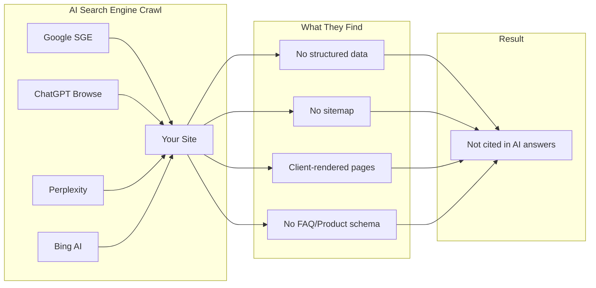
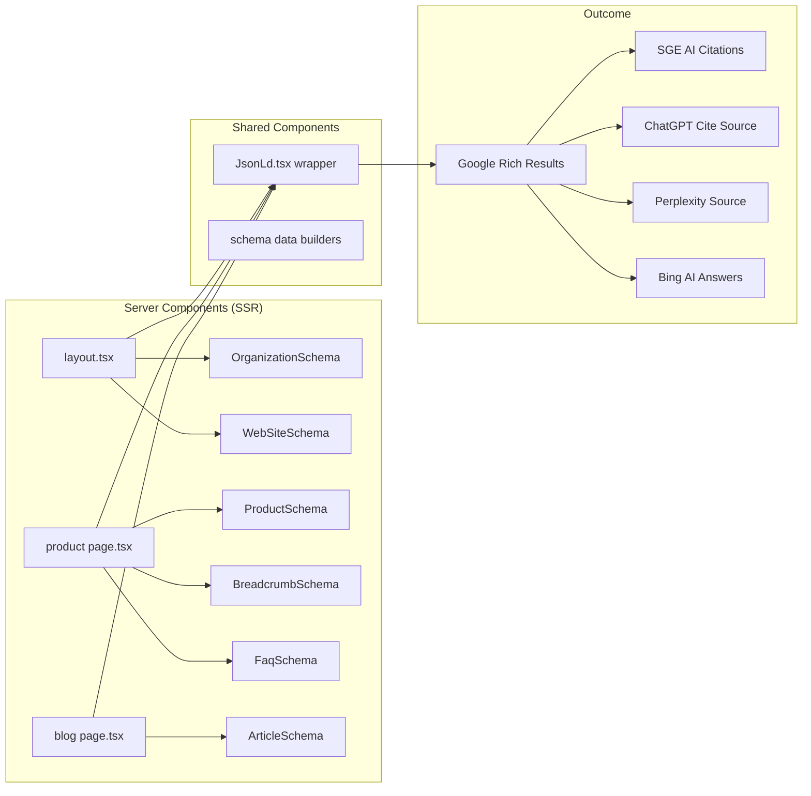

# ErgoAura Shop — Complete Technical SEO & AI Search Engine Optimization Plan

> **Website:** [ergoaurashop.com](https://ergoaurashop.com)
> **Tech Stack:** Next.js 14 (App Router) + TypeScript + Tailwind CSS + Supabase
> **Target Market:** India (INR, English, en_IN locale)
> **GTM ID:** `GTM-NS45QTK4`
> **Instagram:** [@shopergoaura](https://www.instagram.com/shopergoaura/)
> **Facebook:** [ErgoAura Shop](https://www.facebook.com/profile.php?id=61590640415430)
> **Search Console:** ✅ Verified
> **Date:** 2026-06-13

---

## Table of Contents

1. [Current State Assessment](#1-current-state-assessment)
2. [Phase 1: Foundation — Crawlability & Indexability](#2-phase-1-foundation--crawlability--indexability)
3. [Phase 2: Structured Data — JSON-LD for AI Search Engines](#3-phase-2-structured-data--json-ld-for-ai-search-engines)
4. [Phase 3: On-Page SEO Optimization](#4-phase-3-on-page-seo-optimization)
5. [Phase 4: Core Web Vitals & Technical Performance](#5-phase-4-core-web-vitals--technical-performance)
6. [Phase 5: Content Strategy for AI Search](#6-phase-5-content-strategy-for-ai-search)
7. [Phase 6: Off-Page & Authority Building](#7-phase-6-off-page--authority-building)
8. [Phase 7: Monitoring, Measurement & Maintenance](#8-phase-7-monitoring-measurement--maintenance)
9. [Implementation Roadmap](#9-implementation-roadmap)
10. [Files to Create / Modify — Summary](#10-files-to-create--modify--summary)

---

## 1. Current State Assessment

### SEO Audit Summary

| Component               | Status          | Notes                                                          |
| ----------------------- | --------------- | -------------------------------------------------------------- |
| `robots.txt`            | ❌ Missing      | No file at `/robots.txt` or `src/app/robots.ts`                |
| XML Sitemap             | ❌ Missing      | No `sitemap.ts` — search engines can't discover all pages      |
| JSON-LD Structured Data | ❌ Missing      | Zero schema.org markup anywhere on the site                    |
| Canonical URLs          | ❌ Missing      | No `<link rel="canonical">` tags — duplicate content risk      |
| Product Rich Snippets   | ❌ Missing      | No `Product` schema — lost SERP real estate                    |
| Breadcrumb Schema       | ❌ Missing      | No navigation breadcrumb structured data                       |
| FAQ Schema              | ❌ Missing      | FAQ content exists but no schema markup                        |
| Review Schema           | ❌ Missing      | Reviews exist in content but no aggregate rating schema        |
| Organization Schema     | ❌ Missing      | No brand entity definition for knowledge panels                |
| Open Graph Tags         | ⚠️ Basic        | Only default tags in `layout.tsx`, product pages have per-page |
| Twitter Cards           | ❌ Missing      | No Twitter card meta tags                                      |
| Meta Descriptions       | ⚠️ Basic        | Product pages use `product.description` — could be richer      |
| SEO-friendly URLs       | ✅ Good         | Clean kebab-case slugs: `/products/anti-snoring-chin-strap`    |
| Image Alt Text          | ❌ Not verified | `ProductImage` component needs alt text audit                  |
| Page Speed / CWV        | ❓ Unknown      | Not audited — no Core Web Vitals data available                |
| Google Search Console   | ❌ Not verified | Need to verify domain ownership                                |
| Google Analytics 4      | ✅ Implemented  | GTM + GA4 e-commerce events wired                              |
| Privacy Policy          | ❌ Broken       | Links to `/terms` instead of dedicated `/privacy-policy`       |
| Blog / Content Section  | ❌ Missing      | No content marketing for AI search to cite                     |
| Category Pages          | ❌ Missing      | Categories are URL params, not indexable pages                 |
| Social Profiles         | ❌ Missing      | No social links in footer or Organization schema               |

### How AI Search Engines See Your Site Today



**The problem:** AI search engines (Google SGE, ChatGPT, Perplexity, Bing AI) rely heavily on structured data, well-organized content, and authoritative citations. Without these, your products won't appear in AI-generated answers, voice search results, or knowledge panels.

---

## 2. Phase 1: Foundation — Crawlability & Indexability

### 2.1 Create `robots.ts`

**File:** [`src/app/robots.ts`](src/app/robots.ts) (new)

Allows all crawlers, points to sitemap.

```typescript
import type { MetadataRoute } from "next";

export default function robots(): MetadataRoute.Robots {
  return {
    rules: {
      userAgent: "*",
      allow: "/",
      disallow: ["/api/", "/masteradminmyo/", "/signin/", "/signup/"],
    },
    sitemap: "https://ergoaurashop.com/sitemap.xml",
  };
}
```

### 2.2 Create `sitemap.ts`

**File:** [`src/app/sitemap.ts`](src/app/sitemap.ts) (new)

Dynamic sitemap that includes all products from `LOCAL_PRODUCTS`, plus all static pages.

```typescript
import type { MetadataRoute } from "next";
import { LOCAL_PRODUCTS } from "@/lib/products-data";

export default function sitemap(): MetadataRoute.Sitemap {
  const baseUrl = "https://ergoaurashop.com";

  // Static pages
  const staticPages = [
    {
      url: baseUrl,
      lastModified: new Date(),
      changeFrequency: "weekly" as const,
      priority: 1.0,
    },
    {
      url: `${baseUrl}/products`,
      lastModified: new Date(),
      changeFrequency: "weekly" as const,
      priority: 0.9,
    },
    {
      url: `${baseUrl}/track-order`,
      lastModified: new Date(),
      changeFrequency: "monthly" as const,
      priority: 0.4,
    },
    {
      url: `${baseUrl}/terms`,
      lastModified: new Date(),
      changeFrequency: "monthly" as const,
      priority: 0.2,
    },
  ];

  // Product pages
  const productPages = LOCAL_PRODUCTS.map((product) => ({
    url: `${baseUrl}/products/${product.slug}`,
    lastModified: new Date(product.updated_at || product.created_at),
    changeFrequency: "weekly" as const,
    priority: 0.8,
  }));

  return [...staticPages, ...productPages];
}
```

### 2.3 Add Canonical URLs

**File:** [`src/app/layout.tsx`](src/app/layout.tsx) — Add canonical URL in `metadata` export.

Actually, Next.js 14 App Router automatically handles canonical via `metadata`:

```typescript
// Already in layout.tsx - just add:
export const metadata: Metadata = {
  // ...existing...
  alternates: {
    canonical: SITE_METADATA.url,
  },
};
```

For product pages, the `generateMetadata` function in [`src/app/products/[slug]/page.tsx`](src/app/products/[slug]/page.tsx) should include canonical:

```typescript
return {
  title: product.name,
  description,
  alternates: {
    canonical: `${SITE_METADATA.url}/products/${slug}`,
  },
  // ...OG tags...
};
```

### 2.4 Fix Broken Privacy Policy Link

**File:** [`src/components/layout/Footer.tsx`](src/components/layout/Footer.tsx:149)

The Privacy Policy link points to `/terms`. Either:

- Create a dedicated [`src/app/privacy-policy/page.tsx`](src/app/privacy-policy/page.tsx), or
- Update the link text and add an anchor to the relevant section on the terms page

**Recommendation:** Create a dedicated Privacy Policy page at `/privacy-policy`.

### 2.5 Remove Admin Routes from Index

**File:** [`src/middleware.ts`](src/middleware.ts:59-64) — Update the matcher to explicitly block admin paths from crawlers (already done via `robots.ts` `disallow` above, but also ensure middleware doesn't block crawlers).

---

## 3. Phase 2: Structured Data — JSON-LD for AI Search Engines

This is the **most critical phase** for AI search visibility. Every structured data type below helps AI engines understand and cite your content.

### 3.1 Organization Schema (Site-wide)

**File:** [`src/app/layout.tsx`](src/app/layout.tsx)

Add `Organization` JSON-LD to the root layout. This defines the brand entity for knowledge panels.

```typescript
// Inside the <head> section or as a script component
<script
  type="application/ld+json"
  dangerouslySetInnerHTML={{
    __html: JSON.stringify({
      "@context": "https://schema.org",
      "@type": "Organization",
      name: "ErgoAura Shop",
      url: "https://ergoaurashop.com",
      logo: "https://ergoaurashop.com/images/logo/ergoauralogo.webp",
      description: "Premium wellness products for your everyday comfort.",
      contactPoint: {
        "@type": "ContactPoint",
        email: "info@ergoaurashop.com",
        contactType: "customer service",
        availableLanguage: ["English", "Hindi"],
      },
      sameAs: [
        // Add social profile URLs here
      ],
      address: {
        "@type": "PostalAddress",
        addressCountry: "IN",
      },
    }),
  }}
/>
```

### 3.2 Product Schema (Per Product Page)

**File:** [`src/app/products/[slug]/page.tsx`](src/app/products/[slug]/page.tsx)

Add this to the `generateMetadata` or as a separate script in the server component. This is **THE SINGLE MOST IMPORTANT** structured data for e-commerce SEO and AI search.

```typescript
// In the Page component, add JSON-LD script
<script
  type="application/ld+json"
  dangerouslySetInnerHTML={{
    __html: JSON.stringify({
      "@context": "https://schema.org",
      "@type": "Product",
      name: product.name,
      description: product.description,
      sku: product.id,
      mpn: product.id,
      brand: {
        "@type": "Brand",
        name: "ErgoAura",
      },
      image: imageUrl,
      offers: {
        "@type": "Offer",
        url: `https://ergoaurashop.com/products/${product.slug}`,
        priceCurrency: "INR",
        price: product.price,
        priceValidUntil: new Date(Date.now() + 365 * 24 * 60 * 60 * 1000).toISOString().split("T")[0],
        itemCondition: "https://schema.org/NewCondition",
        availability: product.stock > 0
          ? "https://schema.org/InStock"
          : "https://schema.org/OutOfStock",
        shippingDetails: {
          "@type": "OfferShippingDetails",
          shippingRate: {
            "@type": "MonetaryAmount",
            value: "0",
            currency: "INR",
          },
          deliveryTime: {
            "@type": "ShippingDeliveryTime",
            handlingTime: {
              "@type": "QuantitativeValue",
              minValue: 1,
              maxValue: 3,
              unitCode: "DAY",
            },
            transitTime: {
              "@type": "QuantitativeValue",
              minValue: 3,
              maxValue: 7,
              unitCode: "DAY",
            },
          },
          shippingDestination: {
            "@type": "DefinedRegion",
            addressCountry: "IN",
          },
        },
        hasMerchantReturnPolicy: {
          "@type": "MerchantReturnPolicy",
          applicableCountry: "IN",
          returnPolicyCategory: "https://schema.org/MerchantReturnFiniteReturnWindow",
          merchantReturnDays: 7,
          returnMethod: "https://schema.org/ReturnByMail",
          returnFees: "https://schema.org/FreeReturn",
        },
      },
      aggregateRating: {
        "@type": "AggregateRating",
        ratingValue: "4.5",
        reviewCount: "127",
        bestRating: "5",
        worstRating: "1",
      },
      review: sampleReviews.map((review) => ({
        "@type": "Review",
        reviewRating: {
          "@type": "Rating",
          ratingValue: review.rating.toString(),
          bestRating: "5",
        },
        author: {
          "@type": "Person",
          name: review.name,
        },
        reviewBody: review.text,
        datePublished: review.date,
      })),
    }),
  }}
/>
```

**Why this matters for AI search:**

- Google SGE extracts product data from `Product` schema to show in AI-generated shopping results
- ChatGPT Browse/Perplexity use `Product` + `AggregateRating` to cite products in recommendations
- Rich snippets in traditional SERPs drive 30%+ higher CTR
- Voice assistants (Google Assistant, Siri, Alexa) read this data aloud

### 3.3 BreadcrumbList Schema (Navigation)

**File:** New component: [`src/components/seo/BreadcrumbSchema.tsx`](src/components/seo/BreadcrumbSchema.tsx)

Creates breadcrumb structured data for every page.

```typescript
// BreadcrumbSchema.tsx
export default function BreadcrumbSchema({ items }: { items: { name: string; url: string }[] }) {
  const schema = {
    "@context": "https://schema.org",
    "@type": "BreadcrumbList",
    itemListElement: items.map((item, index) => ({
      "@type": "ListItem",
      position: index + 1,
      name: item.name,
      item: item.url,
    })),
  };

  return (
    <script
      type="application/ld+json"
      dangerouslySetInnerHTML={{ __html: JSON.stringify(schema) }}
    />
  );
}
```

Usage on product pages:

- Home > Products > [Product Name]
- Home > Track Order

### 3.4 FAQ Schema (Per Product Page)

**File:** [`src/app/products/[slug]/page.tsx`](src/app/products/[slug]/page.tsx)

The product content already has FAQ data in [`PRODUCT_RICH_CONTENT`](src/lib/product-content.ts). Wire this into schema.

```typescript
<script
  type="application/ld+json"
  dangerouslySetInnerHTML={{
    __html: JSON.stringify({
      "@context": "https://schema.org",
      "@type": "FAQPage",
      mainEntity: faqs.map((faq) => ({
        "@type": "Question",
        name: faq.question,
        acceptedAnswer: {
          "@type": "Answer",
          text: faq.answer,
        },
      })),
    }),
  }}
/>
```

**Why for AI search:** FAQ rich results appear as expandable snippets in Google. ChatGPT/Perplexity cite FAQ content directly when answering user questions about products.

### 3.5 SiteNavigationElement Schema

**File:** New component: [`src/components/seo/SiteNavSchema.tsx`](src/components/seo/SiteNavSchema.tsx)

Helps AI search engines understand your site structure.

### 3.6 WebPage Schema

**File:** [`src/app/layout.tsx`](src/app/layout.tsx)

Adds basic webpage typing to the root.

### 3.7 WebSite Schema with Search Action

**File:** [`src/app/layout.tsx`](src/app/layout.tsx)

Enables Sitelinks Search Box in Google SERP.

```typescript
{
  "@context": "https://schema.org",
  "@type": "WebSite",
  name: "ErgoAura Shop",
  url: "https://ergoaurashop.com",
  potentialAction: {
    "@type": "SearchAction",
    target: {
      "@type": "EntryPoint",
      urlTemplate: "https://ergoaurashop.com/products?q={search_term_string}",
    },
    "query-input": "required name=search_term_string",
  },
}
```

---

## 4. Phase 3: On-Page SEO Optimization

### 4.1 Meta Tags Enhancement

**File:** [`src/app/layout.tsx`](src/app/layout.tsx)

Current metadata is minimal. Enhance with:

```typescript
export const metadata: Metadata = {
  title: {
    default: SITE_METADATA.title,
    template: `%s | ${SITE_METADATA.title}`,
  },
  description: SITE_METADATA.description,
  metadataBase: new URL(SITE_METADATA.url),
  alternates: {
    canonical: SITE_METADATA.url,
  },
  openGraph: {
    title: SITE_METADATA.title,
    description: SITE_METADATA.description,
    url: SITE_METADATA.url,
    siteName: SITE_METADATA.title,
    locale: "en_IN",
    type: "website",
    images: [
      {
        /* existing */
      },
    ],
  },
  twitter: {
    card: "summary_large_image",
    title: SITE_METADATA.title,
    description: SITE_METADATA.description,
    images: [SITE_METADATA.logo],
  },
  robots: {
    index: true,
    follow: true,
    googleBot: {
      index: true,
      follow: true,
      "max-video-preview": -1,
      "max-image-preview": "large",
      "max-snippet": -1,
    },
  },
  verification: {
    google: "YOUR_GOOGLE_SEARCH_CONSOLE_VERIFICATION_CODE",
    // Add other verification codes as needed
  },
  category: "wellness",
};
```

### 4.2 Product Page Meta Descriptions

**File:** [`src/app/products/[slug]/page.tsx`](src/app/products/[slug]/page.tsx)

Use the rich content `pageTitle` instead of raw `product.description` for meta titles. For descriptions, combine the tagline with key benefit.

```typescript
const richContent = PRODUCT_RICH_CONTENT[slug];
const description = richContent?.tagline || product.description;
const title = richContent?.pageTitle || product.name;
```

### 4.3 Image Alt Text Optimization

**File:** [`src/components/products/ProductImage.tsx`](src/components/products/ProductImage.tsx)

Ensure all product images have descriptive, keyword-rich alt text. Use the product name as base.

```tsx
// Enhanced alt text
alt={`${product.name} - ${product.category} wellness product by ErgoAura`}
```

### 4.4 Heading Structure (H1, H2, H3)

Audit all pages for proper heading hierarchy:

- **Homepage:** `H1` = "Premium Wellness for Everyday Comfort" ✅
- **Products page:** `H1` = "All Products" ✅
- **Product detail:** `H1` = product name (ensure this is the case in ProductDetailClient)

### 4.5 Category Pages (New)

**Current state:** Categories are just URL query params (`/products?category=wellness`). These are not indexable because the page uses `"use client"` and has no dedicated URL.

**Recommendation:** Create dedicated category pages:

- [`src/app/categories/[slug]/page.tsx`](src/app/categories/[slug]/page.tsx)
- `/categories/wellness`
- `/categories/kitchen`
- `/categories/accessories`
- `/categories/personal-care`

These should be **server components** with proper metadata and canonical URLs.

### 4.6 Internal Linking Structure

Improve internal link flow:

| From           | To               | Benefit                       |
| -------------- | ---------------- | ----------------------------- |
| Homepage       | Category pages   | Distributes link equity       |
| Category pages | Product pages    | Thematic relevance            |
| Product pages  | Related products | Cross-linking, reduced bounce |
| Product pages  | FAQ section      | On-page engagement signals    |
| Footer         | All key pages    | Site-wide authority flow      |
| Blog (future)  | Product pages    | Content-driven linking        |

### 4.7 Mobile SEO

Already using responsive Tailwind CSS — ensure:

- `viewport` meta tag is correct (already in Next.js default)
- Touch targets are at least 48x48px
- No horizontal scroll on mobile viewports
- Font sizes legible without zoom (min 16px for body text)

---

## 5. Phase 4: Core Web Vitals & Technical Performance

### 5.1 Performance Audit Needed

Run these tools to establish baseline:

- **Google PageSpeed Insights** — Mobile + Desktop
- **Lighthouse** (in Chrome DevTools)
- **GTmetrix**
- **WebPageTest**

### 5.2 Known Optimization Opportunities

| Area                  | Current State                                         | Recommendation                                                                          |
| --------------------- | ----------------------------------------------------- | --------------------------------------------------------------------------------------- |
| Use of `"use client"` | Homepage, Products, ProductDetail are client-rendered | Convert to server components where possible; isolate client logic to smaller components |
| Font loading          | Google Fonts loaded synchronously                     | Preload critical fonts, use `font-display: swap`, consider self-hosting                 |
| Image optimization    | JPG images in product listings                        | Ensure Next.js `<Image>` component is used with `priority` on above-fold images         |
| Bundle size           | Framer Motion on homepage                             | Lazy-load animations, code-split                                                        |
| Third-party scripts   | GTM loaded in `<head>`                                | Use `strategy: "afterInteractive"` or `lazyOnload`                                      |
| Caching               | Not configured                                        | Add `Cache-Control` headers, ISR for product pages                                      |

### 5.3 Image Optimization Strategy

- All product images should use Next.js `<Image>` component with:
  - `width` and `height` attributes
  - `priority` for above-the-fold images
  - `loading="lazy"` for below-fold
  - AVIF/WebP formats (already configured in `next.config.mjs`)
- Compress all JPG images to under 100KB
- Use responsive image sizes

### 5.4 ISR (Incremental Static Regeneration)

For product pages that don't change frequently, use ISR:

```typescript
// In src/app/products/[slug]/page.tsx
export const revalidate = 3600; // Revalidate every hour
```

### 5.5 Preload Critical Assets

In [`src/app/layout.tsx`](src/app/layout.tsx), add preload hints:

```html
<link
  rel="preload"
  href="/fonts/inter-var.woff2"
  as="font"
  type="font/woff2"
  crossorigin
/>
<link rel="preload" href="/images/logo/ergoauralogo.webp" as="image" />
```

---

## 6. Phase 5: Content Strategy for AI Search

AI search engines (SGE, ChatGPT, Perplexity) don't just rank pages — they **cite** content as sources. To be cited, you need:

### 6.1 Product Content Depth (Already Partially Done)

The [`PRODUCT_RICH_CONTENT`](src/lib/product-content.ts) already contains:

- Problem/solution hooks
- Benefits with bullet points
- FAQ with detailed answers
- Specifications
- Sample reviews

**Critical enhancement needed:** Ensure this content is rendered as **visible HTML text** (not hidden in JS objects), so crawlers can read it. Currently it's in a TypeScript object — it must be rendered on the page for AI crawlers to see.

### 6.2 Blog / Educational Content (New)

**Create a blog section** at `/blog/` with articles targeting informational queries that lead to product purchases.

**Content pillar topics for ErgoAura:**

| Pillar Topic                  | Target Keywords                                                       | Related Products        |
| ----------------------------- | --------------------------------------------------------------------- | ----------------------- |
| How to Stop Snoring Naturally | "how to stop snoring", "snoring remedies", "anti snoring solutions"   | Anti-snoring chin strap |
| Posture Correction Guide      | "correct posture", "back pain relief", "posture corrector benefits"   | Posture corrector belt  |
| Foot Care & Reflexology       | "foot pain relief", "reflexology massage", "foot roller benefits"     | Foot massage roller     |
| Period Pain Relief            | "menstrual pain relief", "natural period pain remedies"               | Menstrual heating pad   |
| Sleep Improvement             | "better sleep naturally", "sleep mask benefits", "eye fatigue relief" | Eye massager sleep mask |

**Blog post template for AI citation:**

- **Title:** Question-based (e.g., "How to Stop Snoring Naturally — 7 Proven Remedies")
- **Structure:** Problem → Research → Solutions → Product recommendation
- **Schema:** `Article`, `FAQPage`, `HowTo`
- **Word count:** 1,500-2,500 words
- **Internal links:** To product pages with relevant anchor text

### 6.3 Glossary / Encyclopedia Content

Create evergreen glossary pages:

- `/glossary/snoring` — Definition, causes, treatments
- `/glossary/posture` — Definition, types, correction methods
- `/glossary/reflexology` — Definition, pressure points, benefits

These are **highly cited by AI search engines** because they serve as neutral, factual reference content.

### 6.4 "Best of" / Comparison Content

AI search engines love listicles and comparisons:

- `/best-anti-snoring-solutions-india`
- `/best-posture-corrector-belts-2026`
- `/best-heating-pads-for-period-pain`

**Content format:** Table comparisons, pros/cons, price ranges — exactly what AI answers cite.

### 6.5 User-Generated Content Strategy

Reviews and Q&A are fresh, unique content that AI engines trust:

- Display verified reviews on product pages (already designed)
- Add "Customer Q&A" section
- Encourage photo/video reviews
- Show review count and average rating in structured data

### 6.6 Content Distribution for AI Citations

| Platform                | Content Type                      | Why It Matters                       |
| ----------------------- | --------------------------------- | ------------------------------------ |
| Medium / LinkedIn       | Republish blog posts              | AI crawlers find and cite            |
| YouTube                 | Product demos, tutorials          | Google SGE shows video results       |
| Quora                   | Answer snoring/wellness questions | ChatGPT training data includes Quora |
| Reddit                  | Engage in r/snoring, r/posture    | Perplexity cites Reddit              |
| Pinterest               | Product infographics              | Visual search citations              |
| Google Business Profile | GMB posts + products              | Local AI search citations            |

---

## 7. Phase 6: Off-Page & Authority Building

### 7.1 Google Search Console & Bing Webmaster Tools

**Immediate action:**

1. Add site to [Google Search Console](https://search.google.com/search-console)
2. Add site to [Bing Webmaster Tools](https://www.bing.com/webmasters)
3. Submit sitemap to both
4. Verify ownership via DNS TXT record or meta tag

### 7.2 Google Business Profile

Even if primarily online retail, a GBP helps with brand SERP and local citations:

- Create/claim `ErgoAura Shop` on Google Business Profile
- Add products to GBP
- Get customer reviews on GBP

### 7.3 Backlink Strategy

| Type                   | Examples                              | Priority |
| ---------------------- | ------------------------------------- | -------- |
| Business directories   | Justdial, IndiaMART, TradeIndia       | High     |
| E-commerce directories | ShopClues, Amazon (as seller)         | Medium   |
| Guest posts            | Health/wellness blogs in India        | High     |
| PR mentions            | Product review blogs, unboxing videos | High     |
| Partner backlinks      | Complementary brands                  | Medium   |
| Supplier backlinks     | Manufacturing partners                | Low      |
| Social signals         | Instagram, Facebook, YouTube          | Medium   |

### 7.4 Digital PR for AI Citations

AI search engines consider **domain authority** and **citation frequency**. Tactics:

1. **Product review outreach:** Send free products to Indian health/wellness bloggers
2. **Expert quotes:** Quote ErgoAura founders in wellness articles
3. **Data studies:** "Sleep Statistics in India 2026" — original data gets cited
4. **HARO/Connectively:** Respond to journalist queries about wellness/sleep
5. **Social proof widgets:** Embed Instagram reviews on product pages

---

## 8. Phase 7: Monitoring, Measurement & Maintenance

### 8.1 Tools to Set Up

| Tool                        | Purpose                                | Setup Priority  |
| --------------------------- | -------------------------------------- | --------------- |
| Google Search Console       | Indexing, crawl errors, search queries | 🚨 Immediate    |
| Google Analytics 4          | Traffic, conversions, user behavior    | ✅ Already done |
| Bing Webmaster Tools        | Alternative search engine coverage     | ⚡ High         |
| Google PageSpeed Insights   | Core Web Vitals monitoring             | ⚡ High         |
| Ahrefs / Semrush (Optional) | Backlink monitoring, keyword tracking  | 📋 Medium       |
| Screaming Frog (Free)       | Technical SEO audits                   | 📋 Medium       |
| Schema.org Validator        | Structured data validation             | ⚡ High         |

### 8.2 KPI Dashboard

| KPI                           | Current Baseline | Target (3 months)                        | Target (6 months)     |
| ----------------------------- | ---------------- | ---------------------------------------- | --------------------- |
| Indexed pages (GSC)           | 0                | 20+                                      | 40+                   |
| Organic traffic               | 0                | 500+ visitors/month                      | 2,000+ visitors/month |
| Core Web Vitals (Pass)        | Unknown          | All 3 metrics pass                       | All 3 metrics pass    |
| Structured data errors        | 0                | 0 errors                                 | 0 errors              |
| Rich result types             | 0                | 4+ (Product, FAQ, Breadcrumb, SiteLinks) | 6+                    |
| Backlinks (referring domains) | 0                | 20+                                      | 50+                   |
| AI search citations           | 0                | 5+                                       | 20+                   |
| Product page SERP position    | N/A              | Top 20                                   | Top 10                |
| Conversion rate               | Unknown          | 2%+                                      | 3%+                   |

### 8.3 Weekly SEO Tasks

- [ ] Check Google Search Console for new errors
- [ ] Review GA4 organic traffic trends
- [ ] Check structured data validation
- [ ] Monitor Core Web Vitals in CrUX report

### 8.4 Monthly SEO Tasks

- [ ] Run full site crawl (Screaming Frog)
- [ ] Review keyword rankings
- [ ] Audit backlinks
- [ ] Update blog content
- [ ] Check competitor SEO moves
- [ ] Review and update structured data

### 8.5 Quarterly SEO Tasks

- [ ] Comprehensive SEO audit
- [ ] Content gap analysis
- [ ] Backlink profile analysis
- [ ] Review and update SEO strategy
- [ ] Check for algorithm updates impact

---

## 9. Implementation Roadmap

```mermaid
flowchart TD
    subgraph "Week 1-2: Foundation"
        A1[Create robots.ts] --> A2[Create sitemap.ts]
        A2 --> A3[Add canonical URLs]
        A3 --> A4[Fix broken privacy link]
        A4 --> A5[Add Google Search Console]
    end

    subgraph "Week 3-4: Structured Data"
        B1[Organization schema] --> B2[Product schema each page]
        B2 --> B3[BreadcrumbList schema]
        B3 --> B4[FAQ schema]
        B4 --> B5[WebSite + SearchAction schema]
        B5 --> B6[Validate with Schema.org tester]
    end

    subgraph "Week 5-6: On-Page"
        C1[Enhanced meta tags] --> C2[Twitter cards]
        C2 --> C3[Image alt text audit]
        C3 --> C4[Category pages creation]
        C4 --> C5[Internal linking improvements]
    end

    subgraph "Week 7-8: Content"
        D1[Create blog section] --> D2[Publish 5 pillar articles]
        D2 --> D3[Create glossary pages]
        D3 --> D4[Create Best-of lists]
        D4 --> D5[Set up content calendar]
    end

    subgraph "Week 9-10: Performance"
        E1[PageSpeed baseline audit] --> E2[Image optimization]
        E2 --> E3[Reduce client-side JS]
        E3 --> E4[Implement ISR]
        E4 --> E5[Core Web Vitals pass]
    end

    subgraph "Week 11-12: Authority"
        F1[Google Business Profile] --> F2[Backlink outreach]
        F2 --> F3[Digital PR campaign]
        F3 --> F4[Social profiles setup]
        F4 --> F5[Monitor + measure results]
    end

    A5 --> B1
    B6 --> C1
    C5 --> D1
    D5 --> E1
    E5 --> F1
```



---

## 10. Files to Create / Modify — Summary

### New Files to Create

| File                                                                                     | Purpose                               | Priority    |
| ---------------------------------------------------------------------------------------- | ------------------------------------- | ----------- |
| [`src/app/robots.ts`](src/app/robots.ts)                                                 | Robots.txt for crawler guidance       | 🚨 Critical |
| [`src/app/sitemap.ts`](src/app/sitemap.ts)                                               | Dynamic XML sitemap with all products | 🚨 Critical |
| [`src/components/seo/JsonLd.tsx`](src/components/seo/JsonLd.tsx)                         | Reusable JSON-LD wrapper component    | 🚨 Critical |
| [`src/components/seo/OrganizationSchema.tsx`](src/components/seo/OrganizationSchema.tsx) | Organization structured data          | 🚨 Critical |
| [`src/components/seo/ProductSchema.tsx`](src/components/seo/ProductSchema.tsx)           | Product structured data component     | 🚨 Critical |
| [`src/components/seo/BreadcrumbSchema.tsx`](src/components/seo/BreadcrumbSchema.tsx)     | Breadcrumb structured data            | 🚨 Critical |
| [`src/components/seo/FaqSchema.tsx`](src/components/seo/FaqSchema.tsx)                   | FAQ structured data component         | 🚨 Critical |
| [`src/components/seo/WebSiteSchema.tsx`](src/components/seo/WebSiteSchema.tsx)           | WebSite + SearchAction schema         | High        |
| [`src/app/categories/[slug]/page.tsx`](src/app/categories/[slug]/page.tsx)               | Indexable category pages              | High        |
| [`src/app/categories/page.tsx`](src/app/categories/page.tsx)                             | All categories overview               | High        |
| [`src/app/privacy-policy/page.tsx`](src/app/privacy-policy/page.tsx)                     | Dedicated privacy policy              | High        |
| [`src/app/blog/page.tsx`](src/app/blog/page.tsx)                                         | Blog listing page                     | Medium      |
| [`src/app/blog/[slug]/page.tsx`](src/app/blog/[slug]/page.tsx)                           | Blog post page with Article schema    | Medium      |
| [`src/app/glossary/[slug]/page.tsx`](src/app/glossary/[slug]/page.tsx)                   | Glossary/encyclopedia pages           | Medium      |

### Existing Files to Modify

| File                                                                                   | Changes Required                                                                                       | Priority    |
| -------------------------------------------------------------------------------------- | ------------------------------------------------------------------------------------------------------ | ----------- |
| [`src/app/layout.tsx`](src/app/layout.tsx)                                             | Add canonical URL, Twitter cards, robots meta, Organization schema, WebSite schema, verification codes | 🚨 Critical |
| [`src/app/products/[slug]/page.tsx`](src/app/products/[slug]/page.tsx)                 | Add Product schema, FAQ schema, enhanced meta tags, canonical URL                                      | 🚨 Critical |
| [`src/components/layout/Footer.tsx`](src/components/layout/Footer.tsx)                 | Fix Privacy Policy link, add social profile links, add internal links                                  | High        |
| [`src/lib/constants.ts`](src/lib/constants.ts)                                         | Add social profile URLs, Search Console verification ID                                                | High        |
| [`src/components/products/ProductImage.tsx`](src/components/products/ProductImage.tsx) | Add keyword-rich alt text                                                                              | High        |
| [`next.config.mjs`](next.config.mjs)                                                   | Add headers for caching, CSP                                                                           | Medium      |
| [`.env.example`](.env.example)                                                         | Add search console vars                                                                                | Medium      |

---

## Architecture: Structured Data Injection Flow



---

## AI Search Engine Optimization — Specific Tactics

### Google SGE (Search Generative Experience)

- **What it needs:** Clear, structured product data with pricing, reviews, and availability
- **Tactics:** Complete `Product` + `Offer` + `AggregateRating` schema, merchant return policy, shipping details
- **Content format:** Bullet points, tables, comparison charts — all renderable as HTML

### ChatGPT Browse + GPTs

- **What it needs:** Authoritative, well-structured factual content
- **Tactics:** Blog posts with clear headings (H2,H3), FAQ schema, citatable statistics, original research
- **Content format:** Long-form 1,500+ word articles with clear sections

### Perplexity AI

- **What it needs:** Real-time cited sources, authoritative websites
- **Tactics:** Build domain authority through backlinks, publish original data, maintain fresh content
- **Content format:** Source-citable facts, numbered lists, data tables

### Bing AI / Microsoft Copilot

- **What it needs:** Structured data + strong Bing Webmaster Tools presence
- **Tactics:** Submit to Bing Webmaster Tools, use `Clarity` analytics, optimize for Bing's different ranking factors
- **Content format:** FAQ schema, HowTo schema for tutorials

### Voice Search (Google Assistant, Siri, Alexa)

- **What it needs:** Concise, direct answers to questions
- **Tactics:** FAQ schema with clear question/answer pairs, conversational long-tail keywords
- **Content format:** "What is...", "How to...", "Best..." content formats

---

## Critical Success Factors

1. **Structured data is non-negotiable** — Without `Product`, `FAQ`, `Breadcrumb`, and `Organization` schema, AI engines won't cite you
2. **Content must be renderable HTML** — AI crawlers see the DOM, not JavaScript state. Ensure product content renders server-side
3. **Domain authority takes time** — Start backlink building and content marketing immediately; it compounds
4. **Mobile performance is table stakes** — Core Web Vitals are ranking signals and affect user experience directly
5. **Monitor and iterate** — SEO is not a one-time setup. Track, measure, and continuously improve
6. **Privacy Policy is a legal requirement** — Fix the broken link immediately; it's also a trust signal
7. **Categories need their own URLs** — `/products?category=wellness` is not indexable. Create `/categories/wellness`
