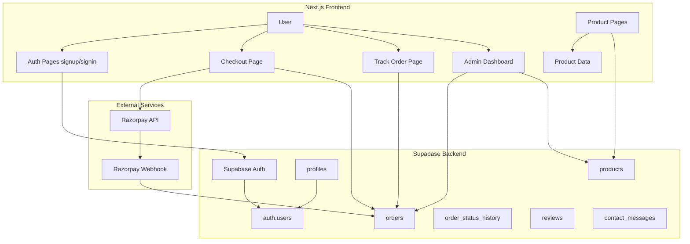

# Supabase Production Database Plan — ErgoAura Shop

## Overview

This plan covers the complete Supabase production-grade setup for ErgoAura Shop, including:

- Database schema (all tables, fields, constraints, indexes, RLS policies)
- Supabase Auth integration (signup/signin)
- Order system with Razorpay payment flow
- Real order tracking (admin-driven status updates)
- Admin dashboard with search (by mobile, track ID, order ID)

---

## Architecture Diagram



---

## Step 1: Create Supabase Project & Get Credentials

1. Go to [supabase.com](https://supabase.com) and create a new project
2. Choose region closest to your target audience (e.g., Singapore for India)
3. Copy these credentials into `.env.local`:
   - `NEXT_PUBLIC_SUPABASE_URL` — Project URL
   - `NEXT_PUBLIC_SUPABASE_ANON_KEY` — Anon/public key
   - `SUPABASE_SERVICE_ROLE_KEY` — Service role key (admin bypass)

---

## Step 2: Database Schema — All Tables

### 2.1 Table: `profiles`

Linked to Supabase Auth. Stores extended user data beyond email/password.

| Column       | Type          | Constraints                         | Notes                      |
| ------------ | ------------- | ----------------------------------- | -------------------------- |
| `id`         | `UUID`        | `PRIMARY KEY REFERENCES auth.users` | One-to-one with auth.users |
| `name`       | `TEXT`        | `NOT NULL`                          | Full name                  |
| `email`      | `TEXT`        | `NOT NULL UNIQUE`                   | Mirror from auth.users     |
| `phone`      | `TEXT`        |                                     | +91xxxxxxxxxx format       |
| `created_at` | `TIMESTAMPTZ` | `DEFAULT NOW()`                     |                            |
| `updated_at` | `TIMESTAMPTZ` | `DEFAULT NOW()`                     |                            |

**Indexes**: `idx_profiles_email` on `email`, `idx_profiles_phone` on `phone`

### 2.2 Table: `products`

| Column                | Type          | Constraints                             | Notes                              |
| --------------------- | ------------- | --------------------------------------- | ---------------------------------- |
| `id`                  | `UUID`        | `PRIMARY KEY DEFAULT gen_random_uuid()` |                                    |
| `name`                | `TEXT`        | `NOT NULL`                              | Product display name               |
| `slug`                | `TEXT`        | `NOT NULL UNIQUE`                       | URL-friendly identifier            |
| `description`         | `TEXT`        |                                         | Short product description          |
| `price`               | `INTEGER`     | `NOT NULL`                              | Current selling price in INR       |
| `original_price`      | `INTEGER`     | `NOT NULL`                              | MRP / original price               |
| `discount_percentage` | `INTEGER`     | `NOT NULL`                              | 0-99                               |
| `category`            | `TEXT`        |                                         | wellness / personal-care / kitchen |
| `images`              | `TEXT[]`      |                                         | Array of image filenames           |
| `stock`               | `INTEGER`     | `DEFAULT 0`                             | Available inventory count          |
| `features`            | `TEXT[]`      |                                         | Array of feature strings           |
| `specifications`      | `JSONB`       |                                         | Key-value pairs                    |
| `is_active`           | `BOOLEAN`     | `DEFAULT true`                          | Soft delete / hide product         |
| `created_at`          | `TIMESTAMPTZ` | `DEFAULT NOW()`                         |                                    |
| `updated_at`          | `TIMESTAMPTZ` | `DEFAULT NOW()`                         |                                    |

**Indexes**: `idx_products_slug` on `slug`, `idx_products_category` on `category`, `idx_products_active` on `is_active`

### 2.3 Table: `orders`

| Column                | Type          | Constraints                             | Notes                                                                   |
| --------------------- | ------------- | --------------------------------------- | ----------------------------------------------------------------------- |
| `id`                  | `UUID`        | `PRIMARY KEY DEFAULT gen_random_uuid()` |                                                                         |
| `order_id`            | `TEXT`        | `NOT NULL UNIQUE`                       | Readable format: ORD-XXXXXXXX                                           |
| `track_id`            | `TEXT`        | `NOT NULL UNIQUE`                       | 12-char alphanumeric                                                    |
| `user_id`             | `UUID`        | `REFERENCES profiles(id)`               | NULL for guest checkout                                                 |
| `customer_name`       | `TEXT`        | `NOT NULL`                              |                                                                         |
| `customer_email`      | `TEXT`        | `NOT NULL`                              |                                                                         |
| `customer_phone`      | `TEXT`        | `NOT NULL`                              | +91xxxxxxxxxx                                                           |
| `address`             | `JSONB`       | `NOT NULL`                              | `{line1, line2, city, state, pincode}`                                  |
| `products`            | `JSONB`       | `NOT NULL`                              | `[{product_id, name, price, quantity, image}]`                          |
| `subtotal`            | `INTEGER`     | `NOT NULL`                              | Sum of all items before discount                                        |
| `discount`            | `INTEGER`     | `DEFAULT 0`                             | B2G1 or coupon discount                                                 |
| `shipping`            | `INTEGER`     | `DEFAULT 0`                             | Shipping charge (0 or 49)                                               |
| `total`               | `INTEGER`     | `NOT NULL`                              | Final payable amount                                                    |
| `payment_id`          | `TEXT`        |                                         | Razorpay payment ID                                                     |
| `payment_status`      | `TEXT`        | `DEFAULT 'pending'`                     | pending / paid / failed / refunded                                      |
| `order_status`        | `TEXT`        | `DEFAULT 'placed'`                      | placed / confirmed / shipped / out_for_delivery / delivered / cancelled |
| `notes`               | `TEXT`        |                                         | Admin notes / special instructions                                      |
| `placed_at`           | `TIMESTAMPTZ` | `DEFAULT NOW()`                         |                                                                         |
| `confirmed_at`        | `TIMESTAMPTZ` |                                         | When admin confirms order                                               |
| `shipped_at`          | `TIMESTAMPTZ` |                                         |                                                                         |
| `out_for_delivery_at` | `TIMESTAMPTZ` |                                         |                                                                         |
| `delivered_at`        | `TIMESTAMPTZ` |                                         |                                                                         |
| `cancelled_at`        | `TIMESTAMPTZ` |                                         |                                                                         |
| `created_at`          | `TIMESTAMPTZ` | `DEFAULT NOW()`                         |                                                                         |
| `updated_at`          | `TIMESTAMPTZ` | `DEFAULT NOW()`                         |                                                                         |

**Indexes**:

- `idx_orders_track_id` on `track_id` — **critical for track-order lookup**
- `idx_orders_order_id` on `order_id`
- `idx_orders_customer_phone` on `customer_phone` — **critical for admin search by phone**
- `idx_orders_user_id` on `user_id`
- `idx_orders_payment_status` on `payment_status`
- `idx_orders_order_status` on `order_status`
- `idx_orders_created_at` on `created_at`

### 2.4 Table: `order_status_history`

Audit log for every status change on an order.

| Column        | Type          | Constraints                                        | Notes                   |
| ------------- | ------------- | -------------------------------------------------- | ----------------------- |
| `id`          | `UUID`        | `PRIMARY KEY DEFAULT gen_random_uuid()`            |                         |
| `order_id`    | `UUID`        | `NOT NULL REFERENCES orders(id) ON DELETE CASCADE` |                         |
| `from_status` | `TEXT`        |                                                    | NULL for initial status |
| `to_status`   | `TEXT`        | `NOT NULL`                                         |                         |
| `changed_by`  | `TEXT`        | `DEFAULT 'system'`                                 | system / admin / user   |
| `notes`       | `TEXT`        |                                                    | Optional change reason  |
| `created_at`  | `TIMESTAMPTZ` | `DEFAULT NOW()`                                    |                         |

**Index**: `idx_status_history_order` on `order_id`

### 2.5 Table: `reviews`

| Column          | Type          | Constraints                                          | Notes                   |
| --------------- | ------------- | ---------------------------------------------------- | ----------------------- |
| `id`            | `UUID`        | `PRIMARY KEY DEFAULT gen_random_uuid()`              |                         |
| `product_id`    | `UUID`        | `NOT NULL REFERENCES products(id) ON DELETE CASCADE` |                         |
| `user_id`       | `UUID`        | `REFERENCES profiles(id)`                            | NULL for anonymous      |
| `user_name`     | `TEXT`        | `NOT NULL`                                           |                         |
| `rating`        | `INTEGER`     | `NOT NULL CHECK(rating >= 1 AND rating <= 5)`        | 1-5 stars               |
| `title`         | `TEXT`        |                                                      | Review headline         |
| `comment`       | `TEXT`        |                                                      | Full review text        |
| `images`        | `TEXT[]`      |                                                      | Optional photo URLs     |
| `is_verified`   | `BOOLEAN`     | `DEFAULT false`                                      | Verified purchase badge |
| `helpful_count` | `INTEGER`     | `DEFAULT 0`                                          | Upvote count            |
| `is_approved`   | `BOOLEAN`     | `DEFAULT false`                                      | Admin moderation        |
| `created_at`    | `TIMESTAMPTZ` | `DEFAULT NOW()`                                      |                         |

**Indexes**: `idx_reviews_product` on `product_id`, `idx_reviews_approved` on `is_approved`

### 2.6 Table: `contact_messages`

Customer enquiries from contact form / footer.

| Column       | Type          | Constraints                             | Notes             |
| ------------ | ------------- | --------------------------------------- | ----------------- |
| `id`         | `UUID`        | `PRIMARY KEY DEFAULT gen_random_uuid()` |                   |
| `name`       | `TEXT`        | `NOT NULL`                              |                   |
| `email`      | `TEXT`        | `NOT NULL`                              |                   |
| `phone`      | `TEXT`        |                                         |                   |
| `subject`    | `TEXT`        |                                         |                   |
| `message`    | `TEXT`        | `NOT NULL`                              |                   |
| `is_read`    | `BOOLEAN`     | `DEFAULT false`                         | Admin read status |
| `created_at` | `TIMESTAMPTZ` | `DEFAULT NOW()`                         |                   |

---

## Step 3: Database Functions & Triggers

### 3.1 Auto-generate `track_id`

```sql
CREATE OR REPLACE FUNCTION generate_track_id()
RETURNS TEXT AS $$
DECLARE
  chars TEXT := 'ABCDEFGHIJKLMNOPQRSTUVWXYZ0123456789';
  result TEXT := '';
  i INT;
BEGIN
  FOR i IN 1..12 LOOP
    result := result || substr(chars, floor(random() * 36 + 1)::INT, 1);
  END LOOP;
  RETURN result;
END;
$$ LANGUAGE plpgsql;
```

### 3.2 Auto-generate `order_id`

```sql
CREATE OR REPLACE FUNCTION generate_order_id()
RETURNS TEXT AS $$
DECLARE
  ts TEXT := to_hex(floor(extract(epoch from now()) * 1000)::BIGINT);
  rand TEXT := upper(substr(md5(random()::TEXT), 1, 4));
BEGIN
  RETURN 'ORD-' || upper(ts) || rand;
END;
$$ LANGUAGE plpgsql;
```

### 3.3 Trigger: Auto-set `order_id` and `track_id` before insert

```sql
CREATE OR REPLACE FUNCTION set_order_ids()
RETURNS TRIGGER AS $$
BEGIN
  NEW.order_id := generate_order_id();
  NEW.track_id := generate_track_id();
  RETURN NEW;
END;
$$ LANGUAGE plpgsql;

CREATE TRIGGER trg_set_order_ids
  BEFORE INSERT ON orders
  FOR EACH ROW EXECUTE FUNCTION set_order_ids();
```

### 3.4 Trigger: Log status changes to `order_status_history`

```sql
CREATE OR REPLACE FUNCTION log_order_status_change()
RETURNS TRIGGER AS $$
BEGIN
  IF OLD.order_status IS DISTINCT FROM NEW.order_status THEN
    INSERT INTO order_status_history (order_id, from_status, to_status, changed_by)
    VALUES (NEW.id, OLD.order_status, NEW.order_status, 'admin');
  END IF;
  RETURN NEW;
END;
$$ LANGUAGE plpgsql;

CREATE TRIGGER trg_log_order_status
  AFTER UPDATE OF order_status ON orders
  FOR EACH ROW EXECUTE FUNCTION log_order_status_change();
```

### 3.5 Trigger: Set timestamp when order status changes

```sql
CREATE OR REPLACE FUNCTION set_order_status_timestamp()
RETURNS TRIGGER AS $$
BEGIN
  IF NEW.order_status = 'confirmed' AND (OLD.order_status IS DISTINCT FROM 'confirmed') THEN
    NEW.confirmed_at := NOW();
  ELSIF NEW.order_status = 'shipped' THEN
    NEW.shipped_at := NOW();
  ELSIF NEW.order_status = 'out_for_delivery' THEN
    NEW.out_for_delivery_at := NOW();
  ELSIF NEW.order_status = 'delivered' THEN
    NEW.delivered_at := NOW();
  ELSIF NEW.order_status = 'cancelled' THEN
    NEW.cancelled_at := NOW();
  END IF;
  RETURN NEW;
END;
$$ LANGUAGE plpgsql;

CREATE TRIGGER trg_set_order_timestamps
  BEFORE UPDATE OF order_status ON orders
  FOR EACH ROW EXECUTE FUNCTION set_order_status_timestamp();
```

---

## Step 4: Row Level Security (RLS) Policies

### 4.1 Enable RLS on all tables

```sql
ALTER TABLE profiles ENABLE ROW LEVEL SECURITY;
ALTER TABLE products ENABLE ROW LEVEL SECURITY;
ALTER TABLE orders ENABLE ROW LEVEL SECURITY;
ALTER TABLE order_status_history ENABLE ROW LEVEL SECURITY;
ALTER TABLE reviews ENABLE ROW LEVEL SECURITY;
ALTER TABLE contact_messages ENABLE ROW LEVEL SECURITY;
```

### 4.2 Profiles RLS

```sql
-- Users can read their own profile
CREATE POLICY "Users can view own profile"
  ON profiles FOR SELECT
  USING (auth.uid() = id);

-- Users can update their own profile
CREATE POLICY "Users can update own profile"
  ON profiles FOR UPDATE
  USING (auth.uid() = id);

-- Admin can read all profiles
CREATE POLICY "Admin can read all profiles"
  ON profiles FOR SELECT
  USING (is_admin());
```

### 4.3 Products RLS

```sql
-- Anyone can read active products
CREATE POLICY "Anyone can view active products"
  ON products FOR SELECT
  USING (is_active = true);

-- Admin can manage products
CREATE POLICY "Admin can manage products"
  ON products FOR ALL
  USING (is_admin());
```

### 4.4 Orders RLS

```sql
-- Users can view their own orders
CREATE POLICY "Users can view own orders"
  ON orders FOR SELECT
  USING (user_id = auth.uid() OR customer_email = auth.email());

-- Anyone can look up order by track_id (public track-order)
CREATE POLICY "Anyone can lookup order by track_id"
  ON orders FOR SELECT
  USING (true);  -- Rate-limited at application level

-- Admin can manage all orders
CREATE POLICY "Admin can manage orders"
  ON orders FOR ALL
  USING (is_admin());

-- Service role can insert orders (from checkout)
CREATE POLICY "Service role can insert orders"
  ON orders FOR INSERT
  WITH CHECK (true);  -- Protected by service_role key
```

### 4.5 Reviews RLS

```sql
-- Anyone can read approved reviews
CREATE POLICY "Anyone can read approved reviews"
  ON reviews FOR SELECT
  USING (is_approved = true);

-- Authenticated users can create reviews
CREATE POLICY "Authenticated users can create reviews"
  ON reviews FOR INSERT
  WITH CHECK (auth.role() = 'authenticated');

-- Admin can manage all reviews
CREATE POLICY "Admin can manage reviews"
  ON reviews FOR ALL
  USING (is_admin());
```

### 4.6 Helper function for admin check

```sql
CREATE OR REPLACE FUNCTION is_admin()
RETURNS BOOLEAN AS $$
BEGIN
  RETURN EXISTS (
    SELECT 1 FROM profiles
    WHERE id = auth.uid() AND is_admin = true
  );
END;
$$ LANGUAGE plpgsql SECURITY DEFINER;
```

> **Note**: Add `is_admin BOOLEAN DEFAULT false` column to `profiles` table.

---

## Step 5: Seed Data — Products

Write a seed SQL file or use Supabase Dashboard to insert all 11 products from [`src/lib/products-data.ts`](src/lib/products-data.ts:138) into the `products` table.

Each product's `id` should use a deterministic UUID (e.g., derived from slug) so that references remain stable. Alternatively, let Supabase generate UUIDs and update the local code to fetch by slug.

---

## Step 6: Auth Integration — Signup & Signin

### 6.1 Signup Flow [`src/app/signup/page.tsx`](src/app/signup/page.tsx:1)

Replace the TODO stub with:

1. Call `supabase.auth.signUp()` with email + password
2. On success, create a profile row in `profiles` table:
   - `id` = user.id from auth response
   - `name`, `email`, `phone` from form
3. Handle email confirmation flow (Supabase sends confirmation email)
4. Redirect to `/account` on success
5. Show error messages for: email already registered, weak password, network error

### 6.2 Signin Flow [`src/app/signin/page.tsx`](src/app/signin/page.tsx:1)

Replace the TODO stub with:

1. Call `supabase.auth.signInWithPassword()` with email + password
2. Store session (Supabase handles this automatically)
3. Redirect to `/account` on success
4. Show error for invalid credentials

### 6.3 Auth Context

Create a reusable auth context/hook (e.g., [`src/lib/supabase/auth.ts`](src/lib/supabase/auth.ts)):

```typescript
export function useAuth() {
  const [user, setUser] = useState<User | null>(null);
  const [profile, setProfile] = useState<Profile | null>(null);
  const [loading, setLoading] = useState(true);

  // Listen to auth state changes
  useEffect(() => {
    const { data: listener } = supabase.auth.onAuthStateChange(
      async (event, session) => {
        setUser(session?.user ?? null);
        if (session?.user) {
          const { data } = await supabase
            .from("profiles")
            .select("*")
            .eq("id", session.user.id)
            .single();
          setProfile(data);
        }
        setLoading(false);
      },
    );
    return () => listener?.subscription.unsubscribe();
  }, []);

  return { user, profile, loading, signIn, signUp, signOut };
}
```

### 6.4 Update Header [`src/components/layout/Header.tsx`](src/components/layout/Header.tsx:1)

- Replace static "Sign In" link with dynamic auth-aware link
- Show user name when logged in, "Sign In" when not
- Add dropdown menu with: Account, Track Orders, Sign Out

---

## Step 7: Checkout & Order Creation

### 7.1 Current State

Checkout page at [`src/app/checkout/page.tsx`](src/app/checkout/page.tsx:69) has a placeholder `handleSubmit` that simulates order creation.

### 7.2 New Flow

1. **Create Razorpay order**: Call backend API `/api/razorpay/create-order` that creates an order via Razorpay API
2. **Open Razorpay checkout modal**: Use Razorpay JS SDK with order ID
3. **On payment success**:
   - Insert order into Supabase `orders` table (use `supabaseAdmin` with service role key)
   - Clear cart
   - Redirect to `/order/success?track_id=XXX&order_id=YYY`
4. **On payment failure**: Show error, allow retry

### 7.3 Backend API Routes

**`src/app/api/razorpay/create-order/route.ts`**:

- Receives: `{ amount, currency, receipt }`
- Calls Razorpay API to create order
- Returns: `{ order_id, amount, currency }`

**`src/app/api/razorpay/webhook/route.ts`**:

- Verifies webhook signature
- Updates `orders` table with `payment_id` and `payment_status`
- Handles events: `payment.captured`, `payment.failed`

### 7.4 Order Insertion Logic

```typescript
// Generate track_id and order_id via DB triggers
const { data, error } = await supabaseAdmin
  .from("orders")
  .insert({
    customer_name: form.name,
    customer_email: form.email,
    customer_phone: form.phone,
    address: {
      line1: form.addressLine1,
      line2: form.addressLine2,
      city: form.city,
      state: form.state,
      pincode: form.pincode,
    },
    products: items.map((item) => ({
      product_id: item.product.id,
      name: item.product.name,
      price: item.product.price,
      quantity: item.quantity,
      image: getProductImageUrl(item.product.slug, item.product.images?.[0]),
    })),
    subtotal,
    discount: b2g1Discount,
    shipping,
    total,
    payment_id: razorpayPaymentId,
    payment_status: "paid",
    order_status: "placed",
  })
  .select()
  .single();
```

---

## Step 8: Order Tracking — Real Status-Driven

### 8.1 Current Issue

The current implementation at [`src/lib/utils.ts`](src/lib/utils.ts:45) uses `getOrderStatusByDays()` which **calculates status based on time elapsed**, not actual admin-driven updates. This is inaccurate.

### 8.2 New Approach

1. Remove `getOrderStatusByDays()` function (or keep as fallback)
2. Order status is stored in the `orders.order_status` column
3. Track order page fetches the actual status from DB
4. Admin updates status in the dashboard
5. `order_status_history` table logs every change

### 8.3 Track Order Page Updates

Modify [`src/app/track-order/[trackId]/page.tsx`](src/app/track-order/[trackId]/page.tsx:27):

- Remove dependency on `getOrderStatusByDays()`
- Use `order.order_status` directly from DB
- Display actual timestamps (`shipped_at`, `delivered_at`, etc.) instead of calculated days

---

## Step 9: Admin Dashboard — Full Upgrade

### 9.1 Current State

[`src/app/masteradminmyo/page.tsx`](src/app/masteradminmyo/page.tsx:1) has:

- Hardcoded credentials (`MyonMee` / `MyonMee@2029`)
- Basic order listing from Supabase
- No search functionality
- No order management (status updates)

### 9.2 New Admin Authentication

Replace hardcoded login with:

1. Supabase Auth-based admin login
2. Check `profiles.is_admin` flag after authentication
3. Create admin user manually in Supabase dashboard

Alternatively, keep the simple login but route through Supabase:

- Store admin credentials in the `admin_admins` table or use a Supabase custom claim
- Or simply: admin logs in via regular signin, then route checks `profile.is_admin`

### 9.3 Admin Dashboard Features

**Stats Cards:**

- Total Orders (all time)
- Total Revenue (paid orders)
- Pending Orders (placed status)
- Orders Today
- Average Order Value

**Search Bar** — Unified search that queries across:

- `customer_phone` (LIKE '%search%') — search by mobile number
- `track_id` (LIKE '%search%') — search by track ID
- `order_id` (LIKE '%search%') — search by order ID
- `customer_name` (LIKE '%search%') — search by customer name
- `customer_email` (LIKE '%search%') — search by email

**Search SQL example:**

```sql
SELECT * FROM orders
WHERE
  customer_phone ILIKE '%search%'
  OR track_id ILIKE '%search%'
  OR order_id ILIKE '%search%'
  OR customer_name ILIKE '%search%'
  OR customer_email ILIKE '%search%'
ORDER BY created_at DESC
LIMIT 50;
```

**Orders Table:**

- Columns: Order ID, Track ID, Customer, Phone, Items, Total, Payment Status, Order Status, Placed At
- Click row to expand and see full order details
- Inline status update dropdown
- Color-coded status badges

**Order Detail Modal/Section:**

- Full customer info (name, email, phone, address)
- Product list with images
- Payment info (payment ID, status)
- Status timeline with timestamps
- Update status dropdown (admin action)
- Add notes field

**Filters & Sorting:**

- Filter by order status (placed, shipped, delivered, cancelled)
- Filter by payment status (pending, paid, failed)
- Sort by date (newest/oldest)
- Date range filter

**Export (Future):**

- Export orders to CSV

---

## Step 10: Frontend Code Changes Summary

| File                                         | Action      | Purpose                                                                                         |
| -------------------------------------------- | ----------- | ----------------------------------------------------------------------------------------------- |
| `src/lib/types.ts`                           | **MODIFY**  | Add `is_admin` to Profile, add `order_status: 'cancelled' \| 'confirmed'`, add `notes` to Order |
| `src/lib/supabase/client.ts`                 | Keep as-is  | Already correct                                                                                 |
| `src/lib/supabase/admin.ts`                  | Keep as-is  | Already correct                                                                                 |
| `src/lib/supabase/auth.ts`                   | **NEW**     | Auth context hook with profile fetch                                                            |
| `src/lib/constants.ts`                       | Keep as-is  | Already has Supabase env vars                                                                   |
| `src/lib/utils.ts`                           | **MODIFY**  | Deprecate `getOrderStatusByDays()` or keep as fallback                                          |
| `src/app/signup/page.tsx`                    | **MODIFY**  | Wire to `supabase.auth.signUp()` + create profile                                               |
| `src/app/signin/page.tsx`                    | **MODIFY**  | Wire to `supabase.auth.signInWithPassword()`                                                    |
| `src/app/account/page.tsx`                   | **MODIFY**  | Add auth check, redirect if not authenticated                                                   |
| `src/components/layout/Header.tsx`           | **MODIFY**  | Auth-aware links, user dropdown                                                                 |
| `src/app/checkout/page.tsx`                  | **MODIFY**  | Razorpay integration, order creation in Supabase                                                |
| `src/app/order/success/page.tsx`             | **MODIFY**  | Read order details from URL params (already done)                                               |
| `src/app/track-order/[trackId]/page.tsx`     | **MODIFY**  | Use actual `order_status` from DB, show real timestamps                                         |
| `src/app/masteradminmyo/page.tsx`            | **REWRITE** | Full admin dashboard with Supabase auth, search, order management                               |
| `src/app/api/razorpay/create-order/route.ts` | **NEW**     | Backend API to create Razorpay order                                                            |
| `src/app/api/razorpay/webhook/route.ts`      | **NEW**     | Backend webhook to handle payment callbacks                                                     |
| `src/app/api/orders/route.ts`                | **NEW**     | Backend API to insert order (with service role)                                                 |

---

## Execution Order

```mermaid
flowchart LR
    A["Step 1: Create Supabase Project"] --> B["Step 2: Run SQL Schema"]
    B --> C["Step 3: Add Functions & Triggers"]
    C --> D["Step 4: Configure RLS Policies"]
    D --> E["Step 5: Seed Product Data"]
    E --> F["Step 6: Auth Integration"]
    F --> G["Step 7: Checkout & Order Creation"]
    G --> H["Step 8: Order Tracking Update"]
    H --> I["Step 9: Admin Dashboard"]
    I --> J["Step 10: Seed Sample Orders"]
```



### Detailed Sequence of Work

| Order  | Task                     | Description                                              | Files Involved                           |
| ------ | ------------------------ | -------------------------------------------------------- | ---------------------------------------- |
| **1**  | Create Supabase Project  | Sign up, create project, copy credentials                | `.env.local`                             |
| **2**  | Run SQL Schema           | Create all 6 tables with full schema                     | `supabase/schema.sql` (new)              |
| **3**  | Add Functions & Triggers | Track ID gen, Order ID gen, status timestamps, audit log | `supabase/schema.sql`                    |
| **4**  | Configure RLS            | All policies for profiles, products, orders, reviews     | `supabase/schema.sql`                    |
| **5**  | Seed Products            | Insert all 11 products into `products` table             | SQL script or Dashboard                  |
| **6**  | Auth Hook                | Create `src/lib/supabase/auth.ts`                        | `src/lib/supabase/auth.ts`               |
| **7**  | Signup Page              | Wire to Supabase Auth                                    | `src/app/signup/page.tsx`                |
| **8**  | Signin Page              | Wire to Supabase Auth                                    | `src/app/signin/page.tsx`                |
| **9**  | Account Page             | Auth guard + profile display                             | `src/app/account/page.tsx`               |
| **10** | Header Update            | Auth-aware navigation                                    | `src/components/layout/Header.tsx`       |
| **11** | Razorpay Backend         | Create-order API + webhook                               | `src/app/api/razorpay/*/route.ts`        |
| **12** | Checkout Integration     | Razorpay modal + order insert                            | `src/app/checkout/page.tsx`              |
| **13** | Track Order Update       | Use real DB status                                       | `src/app/track-order/[trackId]/page.tsx` |
| **14** | Admin Dashboard          | Auth, search, manage orders                              | `src/app/masteradminmyo/page.tsx`        |
| **15** | Types Update             | Add new fields to TypeScript types                       | `src/lib/types.ts`                       |
| **16** | Seed Test Orders         | Create sample orders for testing                         | SQL script                               |

---

## Error Handling & Edge Cases

| Scenario                               | Handling                                                          |
| -------------------------------------- | ----------------------------------------------------------------- |
| Supabase is down                       | Show "Service temporarily unavailable" with retry button          |
| Duplicate email signup                 | Catch `user_already_exists` error, show friendly message          |
| Razorpay payment fails                 | Show error, keep cart intact, allow retry                         |
| Invalid Track ID                       | Show "Order not found" page with link to re-enter                 |
| Admin enters invalid status transition | Validate on backend: cannot go from "delivered" back to "shipped" |
| Guest checkout without auth            | Allow guest checkout; `user_id` remains NULL                      |
| Order insertion fails after payment    | Webhook + retry logic; show success page with tracking ID anyway  |
| Phone number format                    | Store standardized `+91XXXXXXXXXX` format in DB                   |
| Search with no results                 | Show "No orders found" with illustration                          |

---

## Security Considerations

1. **Service Role Key**: NEVER expose `SUPABASE_SERVICE_ROLE_KEY` to client; use only in API routes
2. **RLS**: Ensure every table has appropriate RLS policies; test with anonymous and authenticated roles
3. **Rate Limiting**: Add rate limiting to track-order lookup endpoint to prevent abuse
4. **Admin Access**: Use `profiles.is_admin` flag; never hardcode credentials
5. **Webhook Verification**: Verify Razorpay webhook signatures using `RAZORPAY_WEBHOOK_SECRET`
6. **Input Validation**: Validate all inputs client-side AND server-side
7. **SQL Injection**: Use Supabase JS SDK (parameterized queries) — no raw SQL from client

---

## Files to Create

| File                                         | Description                                                                   |
| -------------------------------------------- | ----------------------------------------------------------------------------- |
| `supabase/schema.sql`                        | Complete SQL schema with tables, indexes, functions, triggers, RLS, seed data |
| `src/lib/supabase/auth.ts`                   | Auth context hook                                                             |
| `src/app/api/razorpay/create-order/route.ts` | Razorpay order creation API                                                   |
| `src/app/api/razorpay/webhook/route.ts`      | Razorpay webhook handler                                                      |
| `src/app/api/orders/route.ts`                | Order creation API (service role)                                             |

## Files to Modify

| File                                     | Changes                                                                            |
| ---------------------------------------- | ---------------------------------------------------------------------------------- |
| `src/lib/types.ts`                       | Add `is_admin`, `notes`, `confirmed`, `cancelled` status, `contact_messages` types |
| `src/lib/utils.ts`                       | Deprecate `getOrderStatusByDays()`                                                 |
| `src/app/signup/page.tsx`                | Wire to Supabase Auth                                                              |
| `src/app/signin/page.tsx`                | Wire to Supabase Auth                                                              |
| `src/app/account/page.tsx`               | Auth guard                                                                         |
| `src/app/checkout/page.tsx`              | Razorpay + order creation                                                          |
| `src/app/track-order/[trackId]/page.tsx` | Real status from DB                                                                |
| `src/app/masteradminmyo/page.tsx`        | Complete rewrite                                                                   |
| `src/components/layout/Header.tsx`       | Auth-aware nav                                                                     |
| `.env.local`                             | Add real Supabase credentials                                                      |
