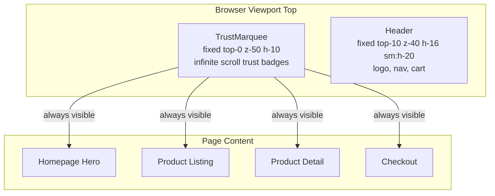

# Trust Marquee — Infinite Scrolling Trust Badges

## Objective

Add an infinite marquee animation **above the header** showcasing high-conversion trust badges and social proof signals that appear on **every page** (homepage, product pages, listing pages, checkout, etc.) to build immediate customer trust and convey ErgoAura as a premium, reliable e-commerce destination.

---

## Design Concept

A thin, fixed strip (~40px) at the very top of the viewport with a dark background and gold accents, containing trust signals scrolling infinitely from right to left. Uses pure CSS animation for performance, with hover-pause for accessibility.

### Color Palette

- Background: [`#1A1614`] (brand dark) with subtle gold top-border [`#C9A962`]
- Text/Icon: [`#DFC48A`] (gold-light) for the main message, [`#D8CFBF`] for secondary
- Pause indicator: subtle opacity change on hover

### Trust Badge Items (10 rotating signals)

| #   | Icon | Text                     | Category      |
| --- | ---- | ------------------------ | ------------- |
| 1   | 🏆   | 10,000+ Happy Customers  | Social Proof  |
| 2   | 🚚   | Free Delivery All Orders | Shipping      |
| 3   | 🔒   | 100% Secure Checkout     | Security      |
| 4   | 🔄   | 7-Day Easy Returns       | Returns       |
| 5   | ⭐   | Premium Quality Products | Quality       |
| 6   | 💰   | Best Price Guarantee     | Pricing Trust |
| 7   | 📞   | 24/7 Customer Support    | Support       |
| 8   | ⚡   | Same Day Dispatch        | Speed         |
| 9   | 🛡️   | 100% Original Guaranteed | Authenticity  |
| 10  | 🇮🇳   | Made with Love in India  | Origin        |

**Why these 10?** Each addresses a specific purchase hesitation: quality concerns, delivery speed, payment security, return fear, support availability, and authenticity — covering the full trust spectrum.

---

## Technical Architecture

### Files to Create / Modify

| File                                     | Action     | Purpose                                                |
| ---------------------------------------- | ---------- | ------------------------------------------------------ |
| `src/components/layout/TrustMarquee.tsx` | **CREATE** | New marquee component                                  |
| `src/components/layout/Header.tsx`       | **MODIFY** | Integrate marquee + adjust scroll logic                |
| `src/app/globals.css`                    | **MODIFY** | Add `@keyframes marquee` animation + `marquee` utility |
| `src/app/products/[slug]/page.tsx`       | **MODIFY** | Adjust `pt-*` padding to account for marquee height    |
| `src/app/products/page.tsx`              | **MODIFY** | Adjust `pt-*` padding                                  |
| `src/app/page.tsx`                       | **MODIFY** | Possibly adjust hero section offset                    |

### Component Architecture

```
layout.tsx
  └─ TrustMarquee (fixed, top-0, z-50, h-10)
  └─ Header (fixed, top-10, z-40, h-16 sm:h-20)
  └─ main (pt-[104px] sm:pt-[120px] to offset both bars)
  └─ Footer
```

### TrustMarquee Component (`"use client"`)

```
┌──────────────────────────────────────────────────────────────┐
│ 🏆 10K+ Happy Customers  ◆  🚚 Free Delivery  ◆  🔒 Secure  │  ← scrolls →
│                        Checkout  ◆  🔄 7-Day Returns  ...   │
└──────────────────────────────────────────────────────────────┘
```

**Implementation details:**

- Container: `fixed top-0 left-0 right-0 z-50 h-10 overflow-hidden`
- Background: `bg-[#1A1614]` with `border-t-2 border-[#C9A962]`
- Inner track: `flex whitespace-nowrap animate-[marquee_XXs_linear_infinite]`
- Two copies of the same items (for seamless loop) inside a flex container
- `animation-play-state: paused` on hover via Tailwind `group-hover:[animation-play-state:paused]`
- Each item: flex row with icon + text, separated by a gold diamond separator ◆

### CSS Keyframe Animation (in globals.css)

```css
@keyframes marquee {
  0% {
    transform: translateX(0);
  }
  100% {
    transform: translateX(-50%);
  }
}
```

The track contains TWO copies of all items (2x the total width). When it scrolls -50%, it seamlessly loops back to the start because the second copy replaces the first.

### Animation Speed

- Total items width per copy: ~1800px (10 items × ~180px each)
- Animation duration: ~30s for smooth, readable pace
- On mobile (shorter width), the same items scroll faster proportionally — which is fine because viewport is smaller

---

## Implementation Steps

### Step 1: Add marquee keyframes to `globals.css`

Add `@keyframes marquee` and a `.marquee-track` utility class for the animation.

### Step 2: Create `TrustMarquee.tsx`

Create the component with:

- 10 trust badge items data array
- CSS animation for infinite scroll
- Pause-on-hover behavior
- Responsive text sizing (smaller on mobile)
- diamond separators between items

### Step 3: Update `Header.tsx`

Changes needed:

1. Change `fixed top-0` to `fixed top-10` (below the marquee)
2. Import and render `<TrustMarquee />` above the existing header JSX...

   Actually, better approach: Place TrustMarquee as a sibling OUTSIDE the `<header>` tag in the layout, and have the Header stay at `top-10`. Let me reconsider.

   **Revised layout approach:** Keep Header.tsx unchanged from a structural perspective but:
   - The layout.tsx will render TrustMarquee before Header
   - Header changes from `top-0` to `top-10`
   - This is cleaner separation

### Step 4: Update `layout.tsx`

```tsx
export default function RootLayout({ children }) {
  return (
    <html lang="en">
      <body>
        <TrustMarquee />
        <Header />
        <main className="flex-1">{children}</main>
        <Footer />
      </body>
    </html>
  );
}
```

### Step 5: Adjust page padding offsets

All pages currently offset their top content by `pt-24 sm:pt-28` (96px/112px) to account for the `h-16 sm:h-20` fixed header. With the marquee adding 40px:

- New mobile offset: 40px + 64px = 104px → `pt-28` (~112px) or `pt-[104px]`
- New desktop offset: 40px + 80px = 120px → `pt-[120px]`

Pages to update:
| Page | Current padding | New padding |
|------|----------------|-------------|
| `src/app/page.tsx` (hero section) | `min-h-[80vh]` (no pt needed, hero is full-screen) | No change needed |
| `src/app/products/[slug]/page.tsx` | `pt-24 sm:pt-28` | `pt-28 sm:pt-32` |
| `src/app/products/page.tsx` | `pt-28 pb-12 md:pt-32 md:pb-16` | `pt-32 md:pt-36` |
| `src/app/checkout/page.tsx` | Check if has pt-_ | Review and adjust |
| `src/app/signin/page.tsx` | Check if has pt-_ | Review and adjust |
| `src/app/signup/page.tsx` | Check if has pt-_ | Review and adjust |
| `src/app/account/page.tsx` | Check if has pt-_ | Review and adjust |
| `src/app/track-order/page.tsx` | Check if has pt-\* | Review and adjust |

Actually, since the Header component already manages its own height, and the layout offset is currently handled individually per page, a smarter approach is:

**Use CSS custom property or just use a consistent padding formula:**

- `pt-[calc(40px+4rem)]` (40px marquee + 64px header) = `pt-[104px]`
- `sm:pt-[calc(40px+5rem)]` (40px + 80px) = `sm:pt-[120px]`

Or simply use Tailwind arbitrary values: `pt-28 sm:pt-32` (112px ≈ 104px, 128px ≈ 120px). Close enough.

### Step 6: Verify responsiveness

- Mobile (<768px): smaller text, same animation, items still readable
- Tablet (768-1024px): standard sizing
- Desktop (>1024px): full display

---

## Mermaid Diagram: Component Flow



---

## Trust Psychology Rationale

Each badge targets a specific trust barrier:

| Barrier                   | Badge                    | Psychological Principle                           |
| ------------------------- | ------------------------ | ------------------------------------------------- |
| "Is this site legit?"     | 10,000+ Happy Customers  | **Social Proof** — people follow others           |
| "Will my product arrive?" | Free Delivery All Orders | **Zero Risk** — remove cost objection             |
| "Is my payment safe?"     | 100% Secure Checkout     | **Safety** — reduce anxiety at payment            |
| "Can I return it?"        | 7-Day Easy Returns       | **Loss Aversion** — guarantee of recourse         |
| "Is it good quality?"     | Premium Quality Products | **Quality Signal** — sets expectation             |
| "Is this the best price?" | Best Price Guarantee     | **Price Confidence** — remove purchase hesitation |
| "What if I need help?"    | 24/7 Customer Support    | **Reliability** — safety net exists               |
| "Will it ship fast?"      | Same Day Dispatch        | **Immediacy** — instant gratification             |
| "Is it genuine?"          | 100% Original Guaranteed | **Authenticity** — trust in product origin        |
| "Is this Indian brand?"   | Made with Love in India  | **Local Pride** — emotional connection            |

---

## Edge Cases & Considerations

1. **SEO:** The marquee is a client component — fine for SEO since it's decorative and doesn't contain primary content
2. **Performance:** Pure CSS animation (no JS intervals) → 0 main thread impact, GPU-accelerated
3. **Reduced Motion:** Respect `prefers-reduced-motion` — disable animation, show static first few items
4. **RTL Languages:** Animation direction would need to reverse if site supports RTL
5. **Screen Readers:** Add `aria-hidden="true"` and `role="presentation"` since this is decorative
6. **Flash of unstyled content:** The component is fixed and renders immediately on client hydration
7. **Print:** Hide the marquee with `@media print { display: none }`
8. **Mobile tap targets:** Items are non-interactive (purely decorative) — no tap target issues
