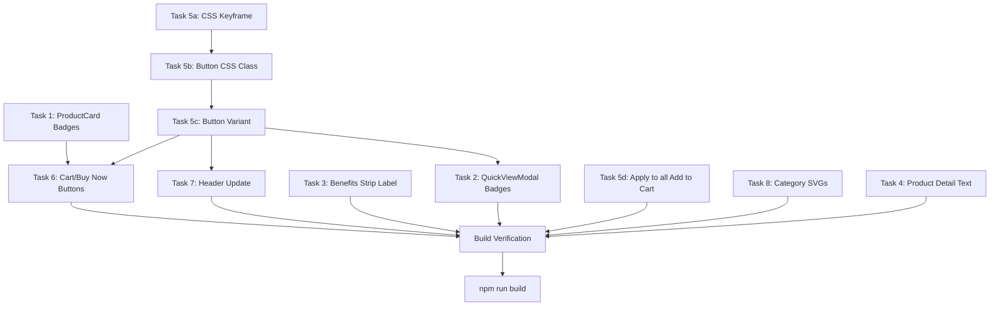

# V2 Updates Plan — Product Grid & UI Enhancements

> **Context**: Following the initial product grid redesign (Desert Luxury theme), the user has requested several refinements including badge label changes, animated gradient buttons, header color updates, cart/buy-now buttons on product cards, and SVG category animations.

---

## Files to Modify

| #   | File                                                                                          | Change Description                                         |
| --- | --------------------------------------------------------------------------------------------- | ---------------------------------------------------------- |
| 1   | [`src/components/products/ProductCard.tsx`](../src/components/products/ProductCard.tsx)       | Badge labels, remove Made in UAE, add Cart/Buy Now buttons |
| 2   | [`src/components/products/QuickViewModal.tsx`](../src/components/products/QuickViewModal.tsx) | Badge labels, remove Made in UAE                           |
| 3   | [`src/app/page.tsx`](../src/app/page.tsx)                                                     | Benefits strip label, category SVG animations              |
| 4   | [`src/app/products/[slug]/page.tsx`](../src/app/products/%5Bslug%5D/page.tsx)                 | "Above ₹299" → "All purchase" text change                  |
| 5   | [`src/app/globals.css`](../src/app/globals.css)                                               | Add animated gradient button CSS, add gradient keyframe    |
| 6   | [`src/components/ui/Button.tsx`](../src/components/ui/Button.tsx)                             | Add `animated` variant for gradient animation              |
| 7   | [`src/components/layout/Header.tsx`](../src/components/layout/Header.tsx)                     | Gold text color + warm gold gradient background            |

---

## Detailed Tasks

### Task 1: Badge Label Changes — ProductCard

**File**: [`src/components/products/ProductCard.tsx`](../src/components/products/ProductCard.tsx)

**Changes**:

1. **Line 92-94**: Change badge label `"DED Licensed"` → `"Original"` (keep using `ded_licensed` variant for gold gradient styling)
2. **Lines 95-97**: Remove the `Made in UAE` badge entirely

**Result** — Top-left badges section becomes:

```tsx
{
  /* ===== Badges — Top-Left ===== */
}
<div className="absolute top-3 left-3 z-10 flex flex-col gap-1.5">
  <Badge variant="ded_licensed" size="sm">
    Original
  </Badge>
</div>;
```

---

### Task 2: Badge Label Changes — QuickViewModal

**File**: [`src/components/products/QuickViewModal.tsx`](../src/components/products/QuickViewModal.tsx)

**Changes**:

1. **Line 203-205**: Change `"DED Licensed"` → `"Original"`
2. **Lines 231-233**: Remove the `Made in UAE` badge from the trust badge strip

---

### Task 3: Benefits Strip — Homepage

**File**: [`src/app/page.tsx`](../src/app/page.tsx)

**Change**:

- **Line 114**: `"Fast Delivery Across UAE"` → `"Fast Delivery"`

---

### Task 4: "Above ₹299" → "All purchase" — Product Detail Page

**File**: [`src/app/products/[slug]/page.tsx`](../src/app/products/%5Bslug%5D/page.tsx)

**Changes**:

1. **Line 299**: `sub: "Above ₹299"` → `sub: "All purchase"`
2. **Line 589**: `"Free delivery above ₹299"` → `"Free delivery on all purchase"`

---

### Task 5: Animated Gradient Button — Global

#### 5a: Add CSS keyframe animation

**File**: [`src/app/globals.css`](../src/app/globals.css)

Add a new keyframe for the gradient shift animation:

```css
@keyframes gradient-shift {
  0% {
    background-position: 0% 50%;
  }
  50% {
    background-position: 100% 50%;
  }
  100% {
    background-position: 0% 50%;
  }
}
```

#### 5b: Add animated button variant CSS

**File**: [`src/app/globals.css`](../src/app/globals.css) — inside `@layer components`

Add a new `.btn-gradient-animated` class:

```css
.btn-gradient-animated {
  @apply inline-flex items-center justify-center gap-2 rounded-full
         font-medium transition-all duration-200
         active:scale-[0.98]
         disabled:opacity-50 disabled:cursor-not-allowed disabled:active:scale-100;
  background: linear-gradient(270deg, #c9a962, #dfc48a, #b8944a, #c9a962);
  background-size: 300% 100%;
  color: #1a1614;
  padding: 0.75rem 1.5rem;
  animation: gradient-shift 4s ease infinite;
}
.btn-gradient-animated:hover {
  box-shadow: 0 4px 24px 0 rgb(201 169 98 / 0.4);
  transform: translateY(-1px);
}
```

#### 5c: Add `animated` variant to Button component

**File**: [`src/components/ui/Button.tsx`](../src/components/ui/Button.tsx)

Add `"animated"` to the `variant` type and `variantMap`:

```tsx
variant?: "primary" | "secondary" | "ghost" | "ghost-light" | "outline" | "animated";
// ...
const variantMap: Record<string, string> = {
  primary: "btn-primary",
  secondary: "btn-secondary",
  ghost: "btn-ghost",
  "ghost-light": "btn-ghost-light",
  outline: "btn-secondary",
  animated: "btn-gradient-animated",
};
```

#### 5d: Apply animated variant to all "Add to Cart" buttons

Update all `btn-primary` usage on "Add to Cart" buttons to use `variant="animated"` instead:

- [`ProductCard.tsx`](../src/components/products/ProductCard.tsx) — new Cart/Buy Now buttons (Task 6)
- [`QuickViewModal.tsx`](../src/components/products/QuickViewModal.tsx) — lines 306, 326: `btn-primary` → `variant="animated"`
- [`products/[slug]/page.tsx`](../src/app/products/%5Bslug%5D/page.tsx) — find Add to Cart button and change variant
- [`CartSidebar.tsx`](../src/components/layout/CartSidebar.tsx) — checkout button
- [`checkout/page.tsx`](../src/app/checkout/page.tsx) — place order button

---

### Task 6: Cart & Buy Now Buttons on Product Card

**File**: [`src/components/products/ProductCard.tsx`](../src/components/products/ProductCard.tsx)

**Location**: In the content section, after the feature badges strip (after line 199), replace or enhance the mobile Quick View button section.

**Design**: Two small buttons side by side with gradient animated background:

- **Cart** — Adds item to cart, shows feedback
- **Buy Now** — Adds to cart + redirects to checkout

```tsx
{
  /* ===== Cart & Buy Now Buttons ===== */
}
<div className="flex gap-2 mt-auto pt-2">
  <button
    onClick={(e) => {
      e.preventDefault();
      addItem(product, 1);
    }}
    className="btn-gradient-animated btn-sm flex-1 text-xs"
  >
    🛒 Cart
  </button>
  <Link
    href={`/checkout?add=${product.slug}`}
    className="btn-gradient-animated btn-sm flex-1 text-xs text-center"
  >
    ⚡ Buy Now
  </Link>
</div>;
```

**Note**: Remove the old mobile Quick View button (lines 201-214) or move it below the Cart/Buy Now buttons. Keep the desktop Quick View overlay (lines 121-147) as-is.

---

### Task 7: Header — Gold Text + Gold Gradient Background

**File**: [`src/components/layout/Header.tsx`](../src/components/layout/Header.tsx)

**Changes**:

1. **Background**: Change from `bg-apple-white/80 backdrop-blur-xl` to a warm gold gradient with blur when scrolled
2. **Text/Nav links**: Change from `text-apple-text-primary` (`#1A1614`) to gold colors
3. **Icons**: Cart icon, menu icon should be gold colored

**Implementation**:

```tsx
// When scrolled - use a warm gold gradient
scrolled
  ? "bg-gradient-to-r from-[#C9A962]/90 to-[#DFC48A]/90 backdrop-blur-xl border-b border-[#C9A962]/30"
  : "bg-transparent",
```

Nav link text color from `text-apple-text-primary` to `text-[#1A1614]` (dark on transparent header for readability) and `text-white` (light on gold gradient when scrolled). Actually, since gold is light, dark text (#1A1614) would be more readable. Let me reconsider.

Better approach — when scrolled (gold gradient bg):

- Text: `text-[#1A1614]` (dark brown on gold — high contrast)
- Icons: `text-[#1A1614]`

When transparent (at top of page on dark hero):

- Text: `text-[#F5F1EB]` (sand/white on dark background)
- Icons: `text-[#F5F1EB]`

Use conditional classes based on `scrolled` state.

---

### Task 8: Category SVG Animations — Homepage

**File**: [`src/app/page.tsx`](../src/app/page.tsx)

**Location**: Lines 215-259 — Categories section grid

**Change**: Replace the `` tags (line 244-248) with inline SVG animations specific to each category.

**Category SVG concepts**:
| Category | SVG Concept | Animation |
|----------|-------------|-----------|
| **Wellness** | Person in relaxed pose / heart with pulse | Heartbeat pulse (scale) |
| **Home & Kitchen** | House / cooking utensil | Gentle bounce |
| **Accessories** | Bag / watch outline | Rotating/shining |
| **Personal Care** | Leaf / droplet | Floating/gentle sway |

**Implementation approach**: Create inline SVG components with CSS animations applied via Tailwind's `animate-*` classes or inline `style` with `@keyframes`. Each SVG should:

- Be contained in a `div` with `aspect-[4/3]` and `bg-[#F5F1EB]`
- Use viewBox for responsive scaling
- Have `currentColor` set to `#C9A962` (gold)
- Use `<motion.path>` or CSS animation for the animation effect

**Example structure** (Wellness — heart with pulse):

```tsx
<div className="aspect-[4/3] bg-[#F5F1EB] flex items-center justify-center overflow-hidden">
  <motion.svg
    width="80"
    height="80"
    viewBox="0 0 24 24"
    fill="none"
    stroke="#C9A962"
    strokeWidth="1.5"
    animate={{ scale: [1, 1.1, 1] }}
    transition={{ duration: 2, repeat: Infinity }}
  >
    <path d="M20.84 4.61a5.5 5.5 0 0 0-7.78 0L12 5.67l-1.06-1.06a5.5 5.5 0 0 0-7.78 7.78l1.06 1.06L12 21.23l7.78-7.78 1.06-1.06a5.5 5.5 0 0 0 0-7.78z" />
  </motion.svg>
</div>
```

---

## Task Dependency Graph



---

## Implementation Order

1. **Task 5a/5b/5c** — CSS keyframe + button class + Button variant (foundational, needed by Tasks 6, 7)
2. **Task 1** — ProductCard badge labels
3. **Task 2** — QuickViewModal badge labels
4. **Task 3** — Benefits strip on homepage
5. **Task 4** — Product detail page text
6. **Task 5d** — Apply animated variant to all Add to Cart buttons site-wide
7. **Task 6** — Cart & Buy Now buttons on ProductCard
8. **Task 7** — Header gold gradient + text
9. **Task 8** — Category SVG animations on homepage
10. **Verify** — `npm run build`

---

## Potential Gotchas

- **Header text contrast**: On gold gradient background, dark text (#1A1614) is more readable than white. On transparent (dark hero section), white/sand text is needed. Use conditional classes based on `scrolled` state.
- **Button animation performance**: The `gradient-shift` animation runs on `background-position` which can cause repaints. Monitor performance. If sluggish, consider using `transform` with a pseudo-element instead.
- **Category SVGs**: Ensure SVG paths are well-formed and render at appropriate sizes. Test on mobile viewports.
- **Build**: All changes must pass `npm run build` with zero errors.
