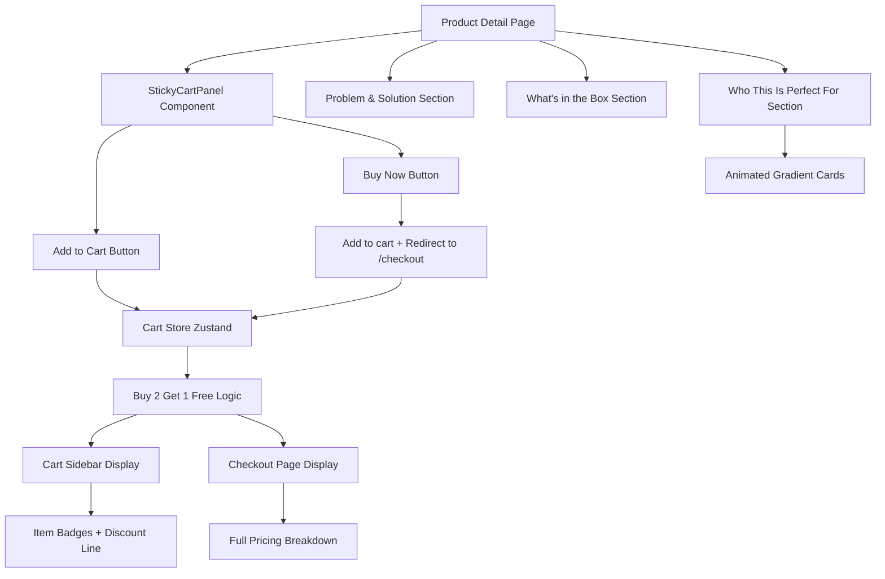

# Product Page & Cart Updates — Implementation Plan

## Overview

This plan covers 5 updates to the product detail page and cart system for all products on ErgoAura Shop.

---

## 1. Sticky "Add to Cart" + "Buy Now" (Right Side)

### Current State

- CTA button is embedded within the product info column, below description/specs.
- On desktop, this means users must scroll past all content to add to cart.
- Only one CTA button (Add to Cart).

### Proposed Solution

**Desktop (≥1024px):** A **sticky sidebar panel** that sits to the right of the main content. Contains:

- Product price (with MRP/discount display)
- Quantity selector
- **"Add to Cart"** button (primary gold animated)
- **"Buy Now"** button (outline/secondary, navigates directly to `/checkout`)
- Trust badges (Free Delivery, Easy Returns, etc.)

The panel uses `position: sticky; top: 120px` (below the header) and appears in a column adjacent to the main product content.

**Mobile (<1024px):** A **sticky bottom bar** (fixed position, full-width) that appears as the user scrolls. Contains:

- Price on the left
- "Add to Cart" + "Buy Now" side by side on the right
- Slides in from bottom when product info scrolls past the hero section
- Has a subtle backdrop blur and shadow

### Files to Create/Modify

| File                                          | Action                                                                 |
| --------------------------------------------- | ---------------------------------------------------------------------- |
| `src/components/products/StickyCartPanel.tsx` | **NEW** — The sticky sidebar (desktop) / bottom bar (mobile) component |
| `src/app/products/[slug]/page.tsx`            | **MODIFY** — Integrate StickyCartPanel, restructure layout for sidebar |

---

## 2. "Problem & Solution" + "What's in the Box" — Redesign

### Current State

- **Problem & Solution:** Uses `bg-red-50` / `bg-green-50` cards with emoji icons. Basic and lacks visual appeal.
- **What's in the Box:** Simple bordered table with `divide-y` rows.

### Proposed Design

**Problem & Solution ("Before & After"):**
Use a **card comparison layout** with a subtle divider in the middle. Design language:

- Left card (Problem/"Without It"): Dark, moody background — `bg-[#1A1614]` with an amber/gold accent border, white text, using a subtle diamond-pattern SVG background or dark gradient
- Right card (Solution/"With It"): Light, airy — `bg-white` with a gold accent (`border-l-4 border-gold`), elevated with `shadow-gold`
- Between them: A centered "VS" badge or arrow indicator

Color palette:

- Problem side: Dark background with amber text (`text-amber-400` for the X icons)
- Solution side: White background with checkmarks in `text-green-600`
- Both cards get `rounded-2xl` and subtle shadows

**What's in the Box:**
Use a **visual grid layout** instead of a table. Each item is a small card/tile with:

- An icon on the left (using the existing icon classes)
- Label and value stacked
- 3 or 4 columns on desktop, 2 on tablet, 1 on mobile
- Soft `bg-apple-bg` background, rounded corners

### Files to Create/Modify

| File                               | Action                                                                  |
| ---------------------------------- | ----------------------------------------------------------------------- |
| `src/app/products/[slug]/page.tsx` | **MODIFY** — Update JSX for problem/solution and whatsInTheBox sections |

---

## 3. "Who This Is Perfect For" — Animated Gradient BG

### Current State

- Plain `Card` components with text.
- No visual differentiation between items.

### Proposed Design

Each box gets a **subtle animated gradient background** that shifts slowly. To ensure **WCAG AA color contrast**:

| Audience Box | Gradient (Tailwind Classes)                    | Text Color                       | Contrast Ratio |
| ------------ | ---------------------------------------------- | -------------------------------- | -------------- |
| Item 1       | `from-gold-muted/40 via-white to-sand-dark/30` | `text-apple-text-primary` (dark) | ≥7:1           |
| Item 2       | `from-sand-dark/50 via-white to-gold-muted/30` | `text-apple-text-primary` (dark) | ≥7:1           |
| Item 3       | `from-white via-gold-muted/30 to-sand-dark/40` | `text-apple-text-primary` (dark) | ≥7:1           |
| Item 4       | `from-sand-dark/30 via-white to-gold-muted/50` | `text-apple-text-primary` (dark) | ≥7:1           |

- All gradients use light/pastel versions — no dark backgrounds — guaranteeing readability.
- Animation: `animate-gradient-shift` (a new keyframe that moves the background-position).
- On hover: scale up slightly (`hover:scale-[1.02]`), shadow deepens.
- The gradient animation is subtle (6s cycle) to avoid distraction.

### Tailwind Config Updates Needed

Add to `tailwind.config.ts`:

```ts
animation: {
  'gradient-shift': 'gradientShift 6s ease-in-out infinite alternate',
},
keyframes: {
  gradientShift: {
    '0%': { backgroundPosition: '0% 50%' },
    '100%': { backgroundPosition: '100% 50%' },
  },
},
```

### Files to Create/Modify

| File                               | Action                                                              |
| ---------------------------------- | ------------------------------------------------------------------- |
| `tailwind.config.ts`               | **MODIFY** — Add gradient-shift animation                           |
| `src/app/products/[slug]/page.tsx` | **MODIFY** — Update perfectFor section with animated gradient cards |

---

## 4. "Buy 2 Get 1 Free" — Cart Badge + Auto Calculation

### Current State

- Cart has no promotion logic.
- Items are added individually with no automatic discounts.

### Proposed Logic

**Auto-calculation rule:**

- When a customer adds **3 identical items** of the **same product** to the cart, the **cheapest item is free**.
- Since all items of the same product have the same price, this means: when quantity ≥ 3, apply a discount of `1 × product.price`.
- The discount is applied per product line, not across different products.

**Implementation:**

1. Add a computed getter in `cartStore` for `buy2get1Free`:
   - For each cart item where `quantity >= 3`, calculate discount = `product.price × Math.floor(quantity / 3)`
   - Return total discount across all eligible items
2. Show a **badge** "🎉 Buy 2 Get 1 Free Active" on each eligible cart item
3. In the cart sidebar footer and checkout order summary, show:
   - Line items
   - Subtotal (sum of all items × price)
   - Buy 2 Get 1 Free discount (line item showing savings)
   - Shipping (Free if subtotal after discount ≥ ₹299)
   - Total

### Files to Create/Modify

| File                                    | Action                                                                                    |
| --------------------------------------- | ----------------------------------------------------------------------------------------- |
| `src/store/cartStore.ts`                | **MODIFY** — Add computed getters: `getBuy2Get1Discount()`, `getSubtotal()`, `getTotal()` |
| `src/lib/types.ts`                      | **MODIFY** — Add promotion-related types if needed                                        |
| `src/components/layout/CartSidebar.tsx` | **MODIFY** — Show discount line, badge on items with ≥3 qty                               |
| `src/app/checkout/page.tsx`             | **MODIFY** — Show full pricing breakdown including B2G1 discount                          |

---

## 5. Order Summary — Full Pricing Display

### Current State

- Checkout shows: Subtotal, Shipping, Total
- No breakdown of discount or "Buy 2 Get 1 Free" savings

### Proposed Display

```
┌─────────────────────────────┐
│    Order Summary            │
│                             │
│  Product A × 3      ₹597    │
│  Product B × 1      ₹199    │
│                             │
│  Subtotal            ₹796    │
│  B2G1 Discount      -₹199   │  ← Only when applicable
│  ─────────────────────────  │
│  Discounted Subtotal ₹597   │
│  Shipping            Free   │  (or ₹49)
│  ─────────────────────────  │
│  You Save            ₹199   │  ← Track total savings
│  Total               ₹597   │
│                             │
│  [Place Order]              │
└─────────────────────────────┘
```

Every line item shows: `Product Name × Qty = Total Price`.
The "You Save" line aggregates: original MRP savings + B2G1 discount.
Shipping is "Free" if the discounted subtotal ≥ ₹299.

### Files to Create/Modify

| File                                    | Action                                                    |
| --------------------------------------- | --------------------------------------------------------- |
| `src/app/checkout/page.tsx`             | **MODIFY** — Full pricing breakdown as shown above        |
| `src/components/layout/CartSidebar.tsx` | **MODIFY** — Update footer summary to show discount lines |

---

## Implementation Order & Dependencies

```
1. Types & Store Updates (Foundation)
   └── Modify lib/types.ts, store/cartStore.ts (B2G1 logic)

2. Sticky Cart Panel Component
   └── Create src/components/products/StickyCartPanel.tsx

3. Product Page Layout Restructure
   └── Modify src/app/products/[slug]/page.tsx
       ├── Integrate sticky panel
       ├── Redesign problem/solution section
       ├── Redesign "What's in the Box"
       └── Add animated gradient to "Who This Is For"

4. Tailwind Config Update
   └── Add gradient-shift animation

5. Cart Sidebar Updates
   └── Modify src/components/layout/CartSidebar.tsx
       ├── B2G1 badges on items
       └── Full pricing breakdown

6. Checkout Page Updates
   └── Modify src/app/checkout/page.tsx
       └── Full pricing breakdown with B2G1, savings, shipping
```

---

## Architecture Diagram



---

## Design System References

- **Colors:** `--color-gold` (#C9A962), `--color-primary` (#1A1614), `--color-sand` (#F5F1EB), `--color-white` (#FFFFFF)
- **Typography:** Inter (sans), Playfair Display (display)
- **Border Radius:** `rounded-2xl` (16px), `rounded-3xl` (24px)
- **Shadows:** `shadow-gold` (gold-tinted shadow), `shadow-md`, `shadow-xl`
- **Transitions:** `transition-all duration-300`
