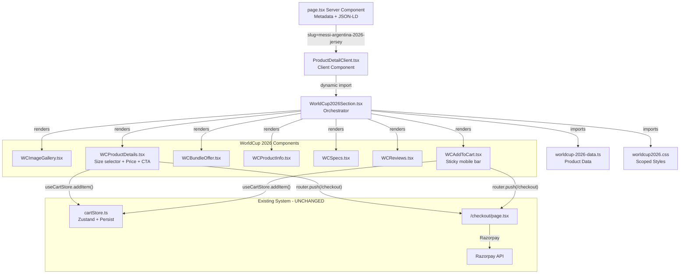

# WorldCup 2026 — Messi Argentina Jersey Product Page Plan

## Overview

Create a new Amazon-style product page for the Messi Argentina 2026 Jersey (and all future "Worldcup 2026" category products). The page follows the existing custom product page pattern used by S23 Ultra and iPhone 15 Pro Max, with **zero modifications to existing code or structure**.

---

## 1. Product Slug & Routing

**Slug:** `messi-argentina-2026-jersey`

This slug will route through [`src/app/products/[slug]/page.tsx`](src/app/products/%5Bslug%5D/page.tsx) and [`src/app/products/[slug]/ProductDetailClient.tsx`](src/app/products/%5Bslug%5D/ProductDetailClient.tsx), following the exact pattern used for S23 Ultra and iPhone.

### Files to modify (add conditions, never remove existing code):

#### a) [`src/lib/products-data.ts`](src/lib/products-data.ts) — Add slug mappings

```typescript
// Add to SLUG_TO_FOLDER:
"messi-argentina-2026-jersey": "Part-2/Messi 10 Jersy Argentina world cup 2026"

// Add to SLUG_TO_IMAGES:
"messi-argentina-2026-jersey": [
  "Home/71DbIUtPvCL._AC_SX569_.jpg",
  "Home/71h9Len6zzL._AC_SX569_.jpg",
  "Home/71iX74mi2kL._AC_SX569_.jpg",
  "Home/71jKpmVS7VL._AC_SY606_.jpg",
  "Home/71lpsKaeG7L._AC_SX569_.jpg",
  "Home/71S5WdLyYpL._AC_SX569_.jpg",
  "Home/911VxI6UNHL._AC_SX569_.jpg",
]
```

#### b) [`src/app/products/[slug]/page.tsx`](src/app/products/%5Bslug%5D/page.tsx) — Add metadata + routing condition

Add a new condition block (after iPhone block, before generic fallback) for `messi-argentina-2026-jersey` that:

- Generates custom metadata/title with OG image
- Renders `<ProductSchema>`, `<BreadcrumbSchema>`, and the new WorldCup component

#### c) [`src/app/products/[slug]/ProductDetailClient.tsx`](src/app/products/%5Bslug%5D/ProductDetailClient.tsx) — Dynamic import

- Add a dynamic import for `WorldCup2026Section` (similar to S23/iPhone pattern)
- Add slug check condition that renders the WorldCup component

---

## 2. New Files to Create

### 2.1 Data Layer — [`src/lib/worldcup-2026-data.ts`](src/lib/worldcup-2026-data.ts)

This file follows the same structure as [`src/lib/s23-ultra-data.ts`](src/lib/s23-ultra-data.ts):

```typescript
export const WC2026_FOLDER = "Part-2/Messi 10 Jersy Argentina world cup 2026";

export const WC2026_PRODUCT_IMAGES: string[] = [
  "Home/71DbIUtPvCL._AC_SX569_.jpg",
  "Home/71h9Len6zzL._AC_SX569_.jpg",
  "Home/71iX74mi2kL._AC_SX569_.jpg",
  "Home/71jKpmVS7VL._AC_SY606_.jpg",
  "Home/71lpsKaeG7L._AC_SX569_.jpg",
  "Home/71S5WdLyYpL._AC_SX569_.jpg",
  "Home/911VxI6UNHL._AC_SX569_.jpg",
];

export const WC2026_PRODUCT: Product = {
  id: "prod-messi-argentina-2026-jersey",
  name: "Messi Argentina 2026 Men's Local Jersey",
  slug: "messi-argentina-2026-jersey",
  description: "Dress like a champion with Messi's exact replica jersey...",
  price: 499,
  original_price: 999,
  discount_percentage: 50,
  category: "Worldcup 2026",
  images: [],
  stock: 100,
  features: [
    "High-quality replica of Messi's Argentina national team jersey",
    "Breathable fabric for maximum comfort during matches",
    "Regular fit with short sleeves — ideal for all seasons",
    "Authentic ADIDAS design with striped pattern",
    "Lightweight — only 222 grams",
  ],
  specifications: {
    Brand: "ADIDAS (Original Replica)",
    "Fit Type": "Regular Fit",
    "Sleeve Type": "Short Sleeve",
    Pattern: "Striped",
    Material: "High-quality breathable fabric",
    Weight: "222 Grams",
    "Model Name": "Made in India-AR-10-2026",
    Manufacturer: "Made in India",
    "Age Range": "Adult",
  },
  is_active: true,
  created_at: "2026-06-01T00:00:00Z",
  updated_at: "2026-06-01T00:00:00Z",
};

// Reviews, FAQs, etc.
```

**Sizes** (parsed from title.txt):

- Available: `S`, `M`, `L`, `XL`, `XXL`
- Stored as a constant array: `export const WC2026_SIZES = ["S", "M", "L", "XL", "XXL"];`

**Bundle Offer:**

- "Buy 3 Get 1 Free" — stored as a constant object with display config

### 2.2 Components — [`src/components/products/worldcup2026/`](src/components/products/worldcup2026/)

```
worldcup2026/
├── WorldCup2026Section.tsx    # Orchestrator (main page wrapper)
├── WCImageGallery.tsx          # Amazon-style image gallery
├── WCProductDetails.tsx        # Title, price, size selector, bundle offer
├── WCBundleOffer.tsx           # Buy 3 Get 1 Free promo banner
├── WCProductInfo.tsx           # About this item / features
├── WCSpecs.tsx                 # Specifications table
├── WCReviews.tsx               # Customer reviews with star ratings
└── WCAddToCart.tsx             # Add to cart / Buy Now panel
```

### 2.3 Styles — [`src/styles/worldcup2026.css`](src/styles/worldcup2026.css)

Scoped under `.wc2026-page` class to prevent theme bleed-through (same pattern as S23).

---

## 3. Amazon-Style Page Layout Design

### Page Flow (top-to-bottom):

```
┌─────────────────────────────────────────────────────┐
│  Breadcrumb: Home > WorldCup 2026 > Messi Jersey    │
├─────────────────────────────────────────────────────┤
│  ┌─────────────────┐  ┌─────────────────────────┐   │
│  │                 │  │  Messi Argentina 2026    │   │
│  │                 │  │  Men's Local Jersey      │   │
│  │   MAIN IMAGE    │  │                          │   │
│  │   (large)       │  │  ★★★★☆  4.8 (128)       │   │
│  │                 │  │                          │   │
│  │                 │  │  ₹499  ₹999  -50% OFF    │   │
│  │                 │  │                          │   │
│  │  [thumb][thumb] │  │  Size:                    │   │
│  │  [thumb][thumb] │  │  [S] [M] [L] [XL] [XXL]  │   │
│  │                 │  │                          │   │
│  │                 │  │  🎁 Buy 3 Get 1 Free!    │   │
│  │                 │  │                          │   │
│  │                 │  │  [Add to Cart] [Buy Now] │   │
│  └─────────────────┘  └─────────────────────────┘   │
├─────────────────────────────────────────────────────┤
│  🎁 Bundle Offer Banner (full-width)                │
├─────────────────────────────────────────────────────┤
│  About This Item                                     │
│  • High-quality replica of Messi's national jersey   │
│  • Breathable fabric for maximum comfort...          │
│  • ...                                               │
├─────────────────────────────────────────────────────┤
│  Product Details (specs table)                       │
├─────────────────────────────────────────────────────┤
│  Customer Reviews (Amazon-style)                     │
│  ★★★★☆  4.8 out of 5                               │
│  [Review cards with sort/filter]                     │
├─────────────────────────────────────────────────────┤
│  Trust Bar + Pricing Summary                         │
│  [Free Delivery] [Easy Returns] [Secure Checkout]    │
└─────────────────────────────────────────────────────┘
```

### Design Principles:

- **Minimal**: Clean white background, no heavy patterns or animations (unlike S23's dark theme)
- **Fast**: Minimal CSS animations, lightweight, no video backgrounds
- **Conversion-focused**: Prominent price display, clear CTA, urgency via stock/bundle offer
- **Amazon-style layout**: Left image gallery + right product info sidebar pattern

---

## 4. Component Details

### [`WorldCup2026Section.tsx`](src/components/products/worldcup2026/WorldCup2026Section.tsx)

- Imports the CSS: `import "@/styles/worldcup2026.css";`
- Wraps everything in `.wc2026-page` div
- Uses data from the data file
- Accepts no props (follows S23 pattern)

### [`WCImageGallery.tsx`](src/components/products/worldcup2026/WCImageGallery.tsx)

- Amazon-style: main large image + horizontal thumbnail strip below
- Click thumbnail to switch main image
- Touch swipe support for mobile
- Uses Next.js `Image` component
- No zoom or fancy overlay (keep it fast)

### [`WCProductDetails.tsx`](src/components/products/worldcup2026/WCProductDetails.tsx)

- Product title (H1)
- Star rating display
- Price block: current price (large/bold) + original (strikethrough) + discount badge
- **Size selector**: Row of pill/button toggles for S/M/L/XL/XXL (track selected state)
- Bundle offer callout chip
- Qty selector (reuse pattern from StickyCartPanel)
- Add to Cart / Buy Now buttons

### [`WCBundleOffer.tsx`](src/components/products/worldcup2026/WCBundleOffer.tsx)

- Full-width banner section highlighting "Buy 3 Get 1 Free"
- Visual savings calculator: "Buy 3, Get 1 Free = Save ₹499!"
- Animated count or static highlight (keep minimal)

### [`WCProductInfo.tsx`](src/components/products/worldcup2026/WCProductInfo.tsx)

- "About This Item" section with bullet points from `product.features`
- Clean list with checkmark icons

### [`WCSpecs.tsx`](src/components/products/worldcup2026/WCSpecs.tsx)

- "Product Details" specs table from `product.specifications`
- Two-column grid: Key | Value

### [`WCReviews.tsx`](src/components/products/worldcup2026/WCReviews.tsx)

- Amazon-style: star distribution bar chart + average rating
- Review cards with name, date, rating, title, text, "Verified Purchase" badge
- Sort by: Most Recent / Top Reviews / Lowest Rated
- Load More button (reuse reviews system from existing [`useProductReviews`](src/hooks/useProductReviews.ts))

### [`WCAddToCart.tsx`](src/components/products/worldcup2026/WCAddToCart.tsx)

- Sticky bottom bar on mobile (appears on scroll)
- Desktop sidebar panel
- Uses `useCartStore` directly (same as S23Pricing pattern)
- Tracks selected size as part of cart interaction

---

## 5. Image Assets

**Source path:** [`images/products/Part-2/Messi 10 Jersy Argentina world cup 2026/Home/`](images/products/Part-2/Messi%2010%20Jersy%20Argentina%20world%20cup%202026/Home/)

**Images (7 files):**
| File | Description |
|------|-------------|
| `71DbIUtPvCL._AC_SX569_.jpg` | Front view |
| `71h9Len6zzL._AC_SX569_.jpg` | Back view |
| `71iX74mi2kL._AC_SX569_.jpg` | Detail view |
| `71jKpmVS7VL._AC_SY606_.jpg` | Model wearing |
| `71lpsKaeG7L._AC_SX569_.jpg` | Close-up |
| `71S5WdLyYpL._AC_SX569_.jpg` | Alternate angle |
| `911VxI6UNHL._AC_SX569_.jpg` | Packaging |

**Action:** Copy the entire folder to `public/images/products/Part-2/Messi 10 Jersy Argentina world cup 2026/` so images are publicly served.

---

## 6. Implementation Steps (Execution Order)

| #   | Task                                | File(s)                                                                                                  | Description                                                                                                                               |
| --- | ----------------------------------- | -------------------------------------------------------------------------------------------------------- | ----------------------------------------------------------------------------------------------------------------------------------------- |
| 1   | **Copy images to public**           | —                                                                                                        | Mirror `images/products/Part-2/Messi 10 Jersy Argentina world cup 2026/` → `public/images/products/Part-2/...` so they are web-accessible |
| 2   | **Create data file**                | [`src/lib/worldcup-2026-data.ts`](src/lib/worldcup-2026-data.ts)                                         | Product data, sizes, reviews, FAQs, folder constants                                                                                      |
| 3   | **Register slug in products-data**  | [`src/lib/products-data.ts`](src/lib/products-data.ts)                                                   | Add slug→folder and slug→images mappings                                                                                                  |
| 4   | **Create CSS file**                 | [`src/styles/worldcup2026.css`](src/styles/worldcup2026.css)                                             | Styles scoped to `.wc2026-page`                                                                                                           |
| 5   | **Create components**               | `src/components/products/worldcup2026/`                                                                  | All 7 components as described above                                                                                                       |
| 6   | **Update ProductDetailClient**      | [`src/app/products/[slug]/ProductDetailClient.tsx`](src/app/products/%5Bslug%5D/ProductDetailClient.tsx) | Add dynamic import + slug condition for WorldCup 2026 products                                                                            |
| 7   | **Update page.tsx**                 | [`src/app/products/[slug]/page.tsx`](src/app/products/%5Bslug%5D/page.tsx)                               | Add metadata generation + render logic for the new slug                                                                                   |
| 8   | **Verify no existing code changed** | All files                                                                                                | Ensure only additions, no modifications to existing product pages, checkout, cart, payment, or core logic                                 |

---

## 7. Design Specification (Amazon-Style)

### Color Palette

- Background: `#FFFFFF` (white)
- Text primary: `#0F1111` (Amazon dark)
- Text secondary: `#565959` (Amazon gray)
- Price: `#B12704` (Amazon red price)
- Accent/CTA: `#FFD814` (Amazon yellow button) / `#FA8900` (Amazon orange button)
- Borders: `#D5D9D9`
- Star rating: `#FEBD69` (Amazon gold)

### Typography

- Product title: 24px, bold, Amazon-style
- Price: 32px, bold, red
- Body: 14px, regular
- Sizes: 13px

### Size Selector

- Pill-shaped buttons (rounded-md)
- Border: 2px solid `#D5D9D9`
- Selected state: border `#0F1111`, background `#F0F2F2`

### Buttons

- **Add to Cart**: Yellow (`#FFD814`), rounded, full-width on mobile
- **Buy Now**: Orange (`#FA8900`), rounded, full-width on mobile

---

## 8. FAQ / Reviews Data (from title.txt)

### Reviews

Will generate 10-15 Amazon-style reviews with Indian names, covering:

- Product quality feedback
- Size/fit comments
- Delivery experience
- Value for money (₹499 for a replica Messi jersey)
- World Cup 2026 excitement

### FAQs (3-5 items)

- Sizing guidance (how does it fit?)
- Is this an official ADIDAS product?
- Care instructions for the jersey
- Return policy for clothing items
- "Buy 3 Get 1 Free" details

---

## 9. Mermaid Diagram: Component Architecture



---

## 10. Key Constraints Checklist

- [ ] **NO modifications** to existing `ProductDetailClient.tsx` logic for S23/iPhone/IPhone or generic products
- [ ] **NO changes** to checkout, payment, cart store, or any core functionality
- [ ] **NO changes** to existing CSS files (`s23-ultra.css`, `iphone-15-pro-max.css`)
- [ ] **NO imports** from or modification of existing product page components
- [ ] All new code is **additive only** — new files and new conditional branches
